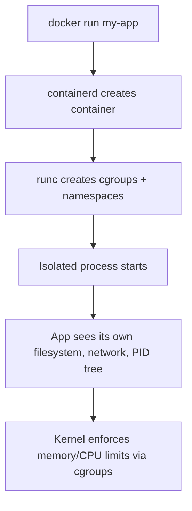
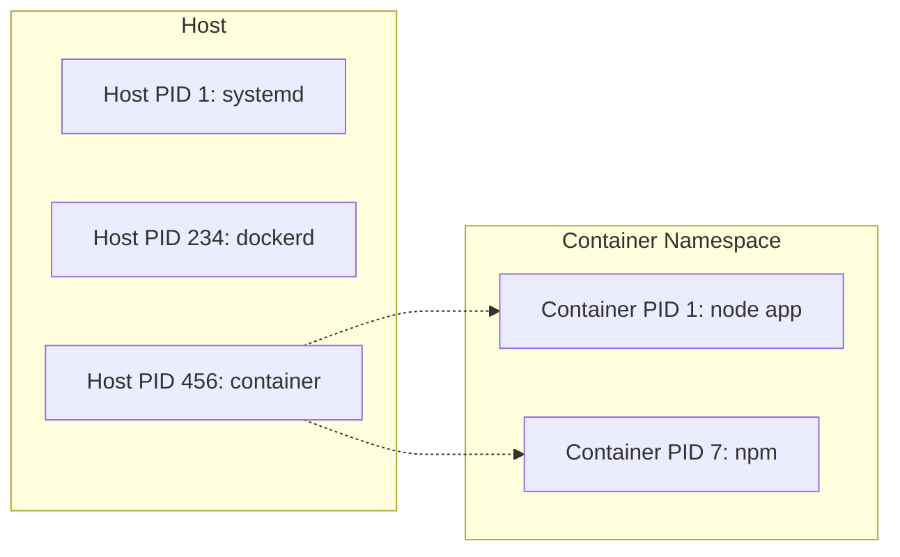
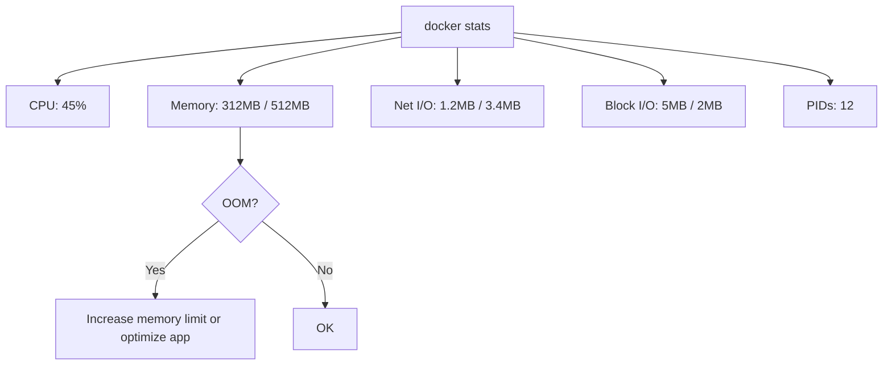

# Container Runtime: cgroups, Namespaces, and OCI

> [!summary] Goal
> Understand what a container actually is: isolated processes with resource limits enforced by the kernel.

## Table of Contents

1. [Why Runtime Knowledge Matters](#why-runtime-knowledge-matters)
2. [Namespaces — Process Isolation](#namespaces-process-isolation)
3. [cgroups — Resource Limits](#cgroups-resource-limits)
4. [OCI Runtime Stack](#oci-runtime-stack)
5. [Setting Resource Limits](#setting-resource-limits)
6. [Monitoring Containers](#monitoring-containers)
7. [Pitfalls](#pitfalls)

---

## Why Runtime Knowledge Matters

A container is not a lightweight VM. It's a **process** isolated by kernel features.



> [!tip] Definition
> **Container**: a process (or group of processes) isolated from the host and other containers via kernel namespaces, with resource limits enforced via cgroups.

---

## Namespaces — Process Isolation

| Namespace | What it isolates | Why it matters |
|-----------|-----------------|----------------|
| **pid** | Process IDs | Container sees only its own processes (PID 1 = your app) |
| **net** | Network stack | Own interfaces, IP, routing, firewall |
| **mnt** | Mount points | Own filesystem tree |
| **uts** | Hostname + domain | Container can have its own hostname |
| **ipc** | IPC resources | Isolated shared memory, semaphores |
| **user** | User/group IDs | Root inside container ≠ root on host |
| **cgroup** | cgroup hierarchy | Resource limits view |



---

## cgroups — Resource Limits

cgroups (control groups) enforce resource limits:

| Resource | Flag | Example |
|----------|------|---------|
| CPU | `--cpus` | `--cpus=1.5` (1.5 cores) |
| Memory | `--memory` | `--memory=512m` |
| Memory+swap | `--memory-swap` | `--memory-swap=1g` |
| CPU pinning | `--cpuset-cpus` | `--cpuset-cpus=0,2` (use only cores 0 and 2) |
| Block IO | `--blkio-weight` | `--blkio-weight=500` |

### cgroup v1 vs v2

| Feature | cgroup v1 | cgroup v2 |
|---------|-----------|-----------|
| Hierarchy | Multiple (one per controller) | Single unified |
| Memory accounting | Separate files | Unified under `memory.current` |
| Default since | — | Most modern distros (Ubuntu 22.04+, Fedora 31+) |
| Docker support | Legacy | Default since Docker 20.10+ |

```bash
# Check which cgroup version your system uses
stat -fc %T /sys/fs/cgroup/
# tmpfs → cgroup v1
# cgroup2fs → cgroup v2
```

---

## OCI Runtime Stack

```mermaid
flowchart LR
    A["docker CLI"] --> B[dockerd]
    B --> C[containerd]
    C --> D[runc (OCI runtime)]
    D --> E[Container process]
    F[CRI-O / Podman] --> C
```

| Layer | Tool | Role |
|-------|------|------|
| **CLI** | `docker` | User-facing commands |
| **Engine** | `dockerd` | API server, image management, build |
| **Container manager** | `containerd` | Lifecycle management (run, stop, exec) |
| **Runtime** | `runc` | OCI-spec container creation (cgroups, namespaces) |
| **Low-level** | `runc` | Actually creates the container process |

### Alternative Runtimes

| Runtime | Description |
|---------|-------------|
| `runc` | Default OCI runtime (used by Docker, containerd) |
| `crun` | C implementation — faster than runc for large-scale |
| `gVisor` | Userspace kernel — stronger isolation (VM-like) |
| `Kata Containers` | Lightweight VM per container — hardware isolation |

---

## Setting Resource Limits

```bash
# CPU
docker run --cpus=2 my-app                    # 2 CPU cores
docker run --cpus=1.5 my-app                  # 1.5 CPU cores
docker run --cpuset-cpus=0,2 my-app            # specific cores

# Memory
docker run --memory=512m my-app               # 512 MB limit
docker run --memory=512m --memory-swap=1g my-app  # 512 MB RAM + 512 MB swap
docker run --memory=512m --memory-swap=512m my-app  # 512 MB total (no swap)

# IO
docker run --blkio-weight=500 my-app          # IO priority (10-1000)
```

### With Compose

```yaml
services:
  api:
    image: my-api
    deploy:
      resources:
        limits:
          cpus: "1.5"
          memory: 512M
        reservations:
          cpus: "0.5"
          memory: 256M
```

---

## Monitoring Containers

```bash
# Live stats
docker stats
docker stats my-app

# Event stream
docker events --filter 'container=my-app'

# Inspect resource usage
docker inspect my-app --format '{{.HostConfig.Memory}}'
docker inspect my-app --format '{{.HostConfig.NanoCpus}}'

# Check OOM status
docker inspect my-app --format '{{.State.OOMKilled}}'
```



---

## Pitfalls

### Container OOM killed

Process is killed by kernel when it exceeds `--memory` limit. Logs show `exit code 137`.

**Fix**: Monitor `docker inspect --format '{{.State.OOMKilled}}' my-app`. Increase memory or fix memory leak.

### Not setting `--memory-swap`

Without `--memory-swap`, containers can use unlimited swap — slowing down the host.

**Fix**: Set `--memory-swap` to the same value as `--memory` to disable swap.

### `--cpus` format

```bash
--cpus=2    # 2 full cores
--cpus=1.5  # 1.5 cores (avoids fractional CPU starvation)
```

---

> [!question]- Interview Questions
>
> **Q: What is the difference between a container and a VM?**
> A: A container shares the host kernel and runs as an isolated process (namespaces + cgroups). A VM runs a full guest OS on virtualized hardware — heavier but stronger isolation.
>
> **Q: What are Linux namespaces?**
> A: Kernel features that isolate processes: pid (process IDs), net (network stack), mnt (filesystem), uts (hostname), ipc (IPC resources), user (UID/GID mapping).
>
> **Q: What is `runc` and how does it relate to Docker?**
> A: `runc` is the OCI-compliant container runtime that actually creates and runs containers. Docker → containerd → runc → container.

---

## Cross-Links

- [[CICD/Docker/02_Core/02_Security_Basics_Users_Capabilities]] for user namespace security
- [[CICD/Docker/01_Foundations/01_Images_Containers_and_Layers]] for container lifecycle

---

## References

- [Docker run reference](https://docs.docker.com/engine/reference/run/)
- [Namespaces in Go](https://man7.org/linux/man-pages/man7/namespaces.7.html)
- [cgroups v2](https://www.kernel.org/doc/html/latest/admin-guide/cgroup-v2.html)
- [Open Container Initiative](https://opencontainers.org/)
