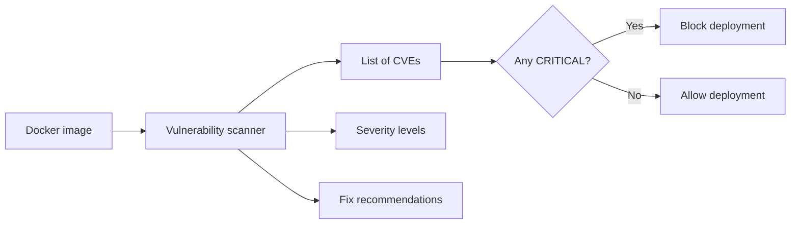
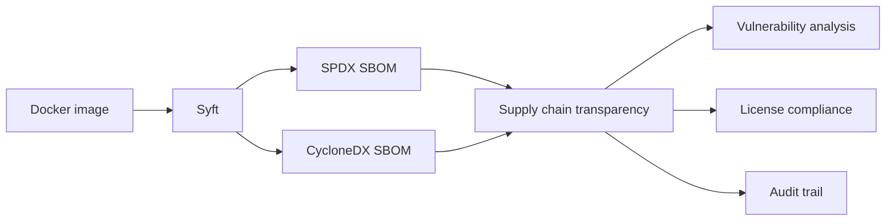
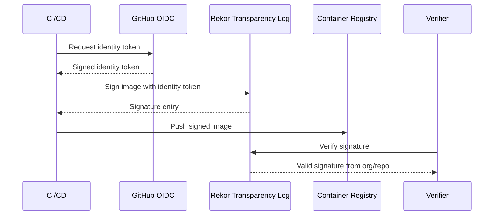

# Docker Security Scanning and SBOM

> [!summary] Goal
> Find vulnerabilities in container images, generate SBOMs for supply chain transparency, and sign images for integrity verification.

## Table of Contents

1. [Why Scanning Matters](#why-scanning-matters)
2. [Scanning with Trivy](#scanning-with-trivy)
3. [Scanning with Docker Scout](#scanning-with-docker-scout)
4. [Generating SBOMs with Syft](#generating-sboms-with-syft)
5. [Signing Images with Cosign](#signing-images-with-cosign)
6. [Scanning Tools Comparison](#scanning-tools-comparison)
7. [CI/CD Integration](#ci-cd-integration)
8. [Pitfalls](#pitfalls)

---

## Why Scanning Matters

Vulnerabilities in base images or dependencies expose your application to known attacks. Regular scanning is essential for supply chain security.



---

## Scanning with Trivy

Trivy is a fast, comprehensive open-source scanner by Aqua Security:

```bash
# Scan a local image
trivy image my-app:latest

# Scan with severity filter
trivy image --severity CRITICAL,HIGH my-app:latest

# Scan a registry image
trivy image ghcr.io/org/my-app:v1.2.3

# Output formats
trivy image --format json my-app:latest > scan.json
trivy image --format table my-app:latest      # default
trivy image --format sarif my-app:latest      # SARIF for GitHub
trivy image --format cyclonedx my-app:latest  # SBOM format

# Ignore unfixed vulnerabilities
trivy image --ignore-unfixed my-app:latest

# Scan for secrets and config issues too
trivy image --scanners vuln,secret,config my-app:latest
```

### Sample output

```
my-app:latest (alpine 3.19.0)
=============================
Total: 3 (CRITICAL: 1, HIGH: 2)

┌──────────┬──────────────┬──────────┬───────────────────┐
│ Library  │ Vuln ID      │ Severity │ Installed Version │
├──────────┼──────────────┼──────────┼───────────────────┤
│ openssl  │ CVE-2024-123 │ CRITICAL │ 3.1.4             │
│ curl     │ CVE-2024-456 │ HIGH     │ 8.5.0             │
└──────────┴──────────────┴──────────┴───────────────────┘
```

---

## Scanning with Docker Scout

Docker Scout integrates with Docker Desktop and CLI:

```bash
# Quick view
docker scout quickview my-app:latest

# Detailed recommendations
docker scout recommendations my-app:latest

# Compare with previous version
docker scout compare my-app:v1.2.3 --to my-app:v1.2.2

# View CVEs
docker scout cves my-app:latest

# Output to SARIF
docker scout cves --format sarif my-app:latest > scout-results.sarif
```

### Docker Scout dashboard

```
• Image: my-app:latest
• Base image: node:20-alpine
• Status: 23 vulnerabilities found (3 critical)
• Recommendations: Update to node:20-alpine@sha256:...
```

---

## Generating SBOMs with Syft

Syft generates Software Bill of Materials (SBOM) from container images:

```bash
# Generate SBOM
syft my-app:latest -o spdx-json > sbom.spdx.json
syft my-app:latest -o cyclonedx-json > sbom.cyclonedx.json
syft my-app:latest -o syft-json > sbom.json     # Syft native format

# Generate SBOM from a Dockerfile
syft dir:. -o spdx-json > sbom.spdx.json
```



---

## Signing Images with Cosign

Cosign signs container images for integrity verification:

```bash
# Generate a key pair
cosign generate-key-pair

# Sign an image
cosign sign --key cosign.key ghcr.io/org/my-app:v1.2.3

# Sign with keyless (OIDC — recommended)
cosign sign ghcr.io/org/my-app:v1.2.3

# Verify
cosign verify --key cosign.pub ghcr.io/org/my-app:v1.2.3

# Verify keyless
cosign verify ghcr.io/org/my-app:v1.2.3

# Attach SBOM to signature
cosign attach sbom --sbom sbom.spdx.json ghcr.io/org/my-app:v1.2.3
cosign sign --attachment sbom ghcr.io/org/my-app:v1.2.3
```

### Keyless signing flow



---

## Scanning Tools Comparison

| Tool | Type | Speed | Integration | Output formats |
|------|------|-------|-------------|---------------|
| **Trivy** | OSS scanner | Fast | GitHub Actions, CLI, CI/CD | Table, JSON, SARIF, CycloneDX |
| **Docker Scout** | Docker-native | Moderate | Docker Desktop, CLI | Dashboard, SARIF |
| **Grype** | OSS scanner (Anchore) | Fast | GitHub Actions, CLI | Table, JSON, SARIF |
| **Snyk** | Commercial | Moderate | CLI, GitHub Apps, IDE | Dashboard, JSON |
| **Clair** | OSS (Red Hat) | Moderate | Quay integration | JSON |

---

## CI/CD Integration

### GitHub Actions with Trivy

```yaml
- name: Scan image
  uses: aquasecurity/trivy-action@master
  with:
    image-ref: my-app:latest
    format: sarif
    output: trivy-results.sarif
    severity: CRITICAL,HIGH

- name: Upload Trivy results
  uses: github/codeql-action/upload-sarif@v3
  with:
    sarif_file: trivy-results.sarif
```

### Generate and upload SBOM in CI

```yaml
- uses: anchore/sbom-action@v0
  with:
    image: my-app:latest
    format: spdx-json
    output-file: sbom.spdx.json

- uses: actions/upload-artifact@v4
  with:
    name: sbom
    path: sbom.spdx.json
```

---

## Pitfalls

### Ignoring base image vulnerabilities

Updating your own code doesn't fix vulnerabilities in the base image's OS packages.

**Fix**: Regularly rebuild images with `docker pull node:20-alpine` to get patched base layers. Pin by digest and update the pinned digest.

### False positives from scanning

Some CVEs are in libraries that aren't actually loaded at runtime.

**Fix**: Use `--ignore-unfixed` to focus on fixable issues. Investigate each CVE in context.

### Not signing images

Without signatures, you can't verify that an image is authentic and hasn't been tampered with.

**Fix**: Use Cosign keyless signing in CI for every push. Verify before deployment.

---

> [!question]- Interview Questions
>
> **Q: What is the difference between Trivy and Docker Scout?**
> A: Trivy is an open-source scanner that can run anywhere. Docker Scout is integrated into Docker Desktop/CLI with a recommendation engine and dashboard.
>
> **Q: What is an SBOM and why is it important?**
> A: A Software Bill of Materials lists all components in an image (packages, libraries, versions). It's essential for vulnerability tracking, license compliance, and supply chain security.
>
> **Q: How does Cosign keyless signing work?**
> A: Cosign uses OIDC to get an identity token from the CI provider (e.g., GitHub Actions). The image is signed with this identity and recorded in a transparency log (Rekor). Verifiers check the signature against the OIDC identity.

---

## Cross-Links

- [[CICD/Docker/02_Core/02_Security_Basics_Users_Capabilities]] for runtime security
- [[CICD/Docker/02_Core/04_Container_Registries_and_Publishing]] for registry authentication
- [[CICD/GitHubActions/01_Foundations/05_Common_Actions_and_the_Marketplace]] for Trivy action
- [[CICD/03_Advanced/01_Supply_Chain_Security_SLSA_Basics]] for SLSA framework

---

## References

- [Trivy](https://github.com/aquasecurity/trivy)
- [Docker Scout](https://docs.docker.com/scout/)
- [Syft](https://github.com/anchore/syft)
- [Cosign](https://github.com/sigstore/cosign)
- [Sigstore](https://www.sigstore.dev/)
