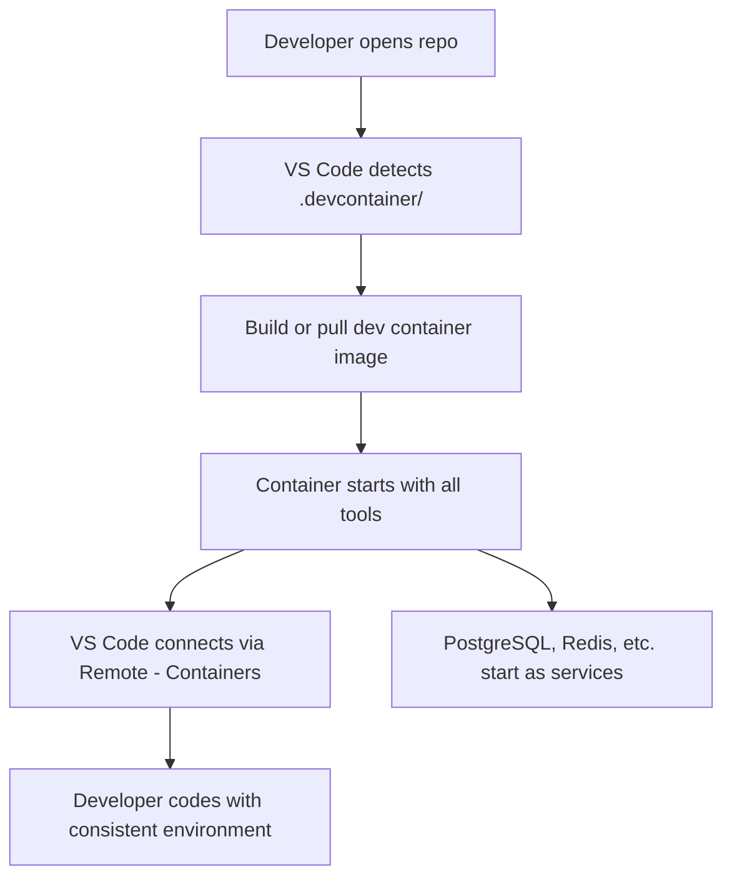
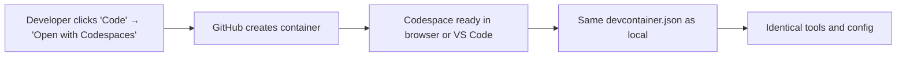

# Dev Containers and Development Environments

> [!summary] Goal
> Use Docker containers as full-featured development environments — consistent tools, languages, and services for every developer on your team.

## Table of Contents

1. [Why Dev Containers Matter](#why-dev-containers-matter)
2. [Dev Container Structure](#dev-container-structure)
3. [devcontainer.json Properties](#devcontainer-json-properties)
4. [Dev Container Features](#dev-container-features)
5. [GitHub Codespaces Integration](#github-codespaces-integration)
6. [Dev Container vs Production Dockerfile](#dev-container-vs-production-dockerfile)
7. [Pitfalls](#pitfalls)

---

## Why Dev Containers Matter

A **dev container** provides a consistent development environment defined as code. Every developer gets the same tools, language versions, and services — regardless of their host OS.



> [!tip] Definition
> **Dev container**: a Docker container configured as a full-featured development environment, accessible via VS Code's Remote - Containers extension or GitHub Codespaces.

---

## Dev Container Structure

```
.devcontainer/
├── devcontainer.json          # Configuration file
├── Dockerfile                 # (Optional) Custom image
├── docker-compose.yml         # (Optional) Multi-service setup
└── .env                       # (Optional) Environment variables
```

---

## devcontainer.json Properties

```json
{
  "name": "Node.js Development",
  "image": "mcr.microsoft.com/devcontainers/javascript-node:20",
  "features": {
    "ghcr.io/devcontainers/features/docker-in-docker:2": {},
    "ghcr.io/devcontainers/features/git:1": {}
  },
  "customizations": {
    "vscode": {
      "extensions": [
        "dbaeumer.vscode-eslint",
        "esbenp.prettier-vscode",
        "github.vscode-github-actions"
      ],
      "settings": {
        "editor.formatOnSave": true,
        "editor.defaultFormatter": "esbenp.prettier-vscode"
      }
    }
  },
  "forwardPorts": [3000, 5432],
  "postCreateCommand": "npm install",
  "remoteUser": "node",
  "containerEnv": {
    "NODE_ENV": "development"
  }
}
```

### Key properties

| Property | Description |
|----------|-------------|
| `image` | Pre-built dev container image |
| `build` | Dockerfile path and build args |
| `features` | Additional tools (Docker-in-Docker, Git, Node, etc.) |
| `extensions` | VS Code extensions to install |
| `settings` | VS Code settings |
| `forwardPorts` | Ports to auto-forward from container |
| `postCreateCommand` | Command to run after container creation |
| `remoteUser` | User inside the container |
| `containerEnv` | Environment variables |
| `mounts` | Additional mount points |
| `workspaceMount` | Custom workspace mount |

---

## Dev Container Features

Features are reusable, self-contained configuration units:

```json
{
  "features": {
    "ghcr.io/devcontainers/features/node:1": {
      "version": "20"
    },
    "ghcr.io/devcontainers/features/docker-in-docker:2": {},
    "ghcr.io/devcontainers/features/terraform:1": {},
    "ghcr.io/devcontainers/features/azure-cli:1": {}
  }
}
```

| Feature | What it adds |
|---------|-------------|
| `node` | Node.js (any version) |
| `python` | Python (any version) |
| `java` | Java JDK (any version) |
| `docker-in-docker` | Docker CLI inside the container |
| `git` | Git + Git LFS |
| `terraform` | Terraform CLI |
| `azure-cli` | Azure CLI |
| `github-cli` | `gh` CLI |

### Multi-service dev container with Compose

```json
{
  "name": "Full Stack Dev",
  "dockerComposeFile": "docker-compose.yml",
  "service": "app",
  "workspaceFolder": "/workspace",
  "shutdownAction": "stopCompose"
}
```

```yaml
# docker-compose.yml
services:
  app:
    build:
      context: .
      dockerfile: Dockerfile
    volumes:
      - .:/workspace:cached
    environment:
      - DATABASE_URL=postgres://postgres:postgres@db:5432/devdb
    depends_on:
      db:
        condition: service_healthy

  db:
    image: postgres:16-alpine
    environment:
      POSTGRES_USER: postgres
      POSTGRES_PASSWORD: postgres
      POSTGRES_DB: devdb
    healthcheck:
      test: pg_isready
      interval: 5s

  redis:
    image: redis:7-alpine
```

---

## GitHub Codespaces Integration

Codespaces uses devcontainer.json to provision cloud-based development environments:

```json
{
  "name": "My Project",
  "image": "mcr.microsoft.com/devcontainers/universal:2",
  "forwardPorts": [3000],
  "portsAttributes": {
    "3000": {
      "label": "Application",
      "onAutoForward": "notify"
    }
  },
  "postCreateCommand": "npm ci",
  "customizations": {
    "codespaces": {
      "openFiles": ["README.md"]
    }
  }
}
```



### Codespaces-specific features

| Feature | Description |
|---------|-------------|
| Prebuilds | Pre-build containers for faster startup |
| Machine types | 2-core, 4-core, 8-core, 16-core options |
| Auto-suspend | Stops after 30 min of inactivity (configurable) |
| Dotfiles | Personalize with your dotfiles repo |

---

## Dev Container vs Production Dockerfile

| Aspect | Dev Container | Production Dockerfile |
|--------|--------------|----------------------|
| Purpose | Development environment | Production artifact |
| Tools | Git, debuggers, linters, formatters | Minimal: only runtime deps |
| Size | 1-2 GB+ (all tools) | 100-500 MB (optimized) |
| Build time | Pre-built or cached | Every CI run |
| Services | PostgreSQL, Redis, Mailhog | External services |
| Source code | Bind-mounted for live editing | Copied into image |
| User | `root` or dev user | Non-root (security) |

---

## Pitfalls

### Large dev container image

Including too many features makes the container large and slow to start.

**Fix**: Only include the features you actually need. Use pre-built base images.

### Bind mount performance

On macOS/Windows, bind mounts can be slow for large codebases.

**Fix**: Use `:cached` mount flag on macOS. For very large projects, clone inside the container instead of bind-mounting.

### Forgetting to rebuild after config changes

Changing `devcontainer.json` properties (especially `features`) requires a full rebuild.

**Fix**: Run "Rebuild Container" in VS Code after making changes.

---

> [!question]- Interview Questions
>
> **Q: What is a dev container?**
> A: A Docker container configured as a development environment, defined by `.devcontainer/devcontainer.json`. It ensures every developer uses the same tools and configuration.
>
> **Q: How do GitHub Codespaces relate to dev containers?**
> A: Codespaces uses the same `devcontainer.json` configuration to provision cloud-based development environments. The same config works locally (VS Code) and in the cloud.
>
> **Q: What are Features in dev containers?**
> A: Reusable, self-contained configuration units that add tools (Node.js, Python, Docker-in-Docker) to a dev container. Features are maintained by the community and Microsoft.

---

## Cross-Links

- [[CICD/Docker/01_Foundations/02_Dockerfile_Essentials]] for Dockerfile reference
- [[CICD/Docker/01_Foundations/04_Docker_Compose_Basics]] for multi-service Compose setup
- [[CICD/Docker/01_Foundations/05_Container_Volumes_and_Storage]] for volume mounts

---

## References

- [Dev Containers Specification](https://containers.dev/)
- [VS Code Remote - Containers](https://code.visualstudio.com/docs/remote/containers)
- [GitHub Codespaces](https://docs.github.com/en/codespaces)
- [Dev Container Features](https://containers.dev/features)
