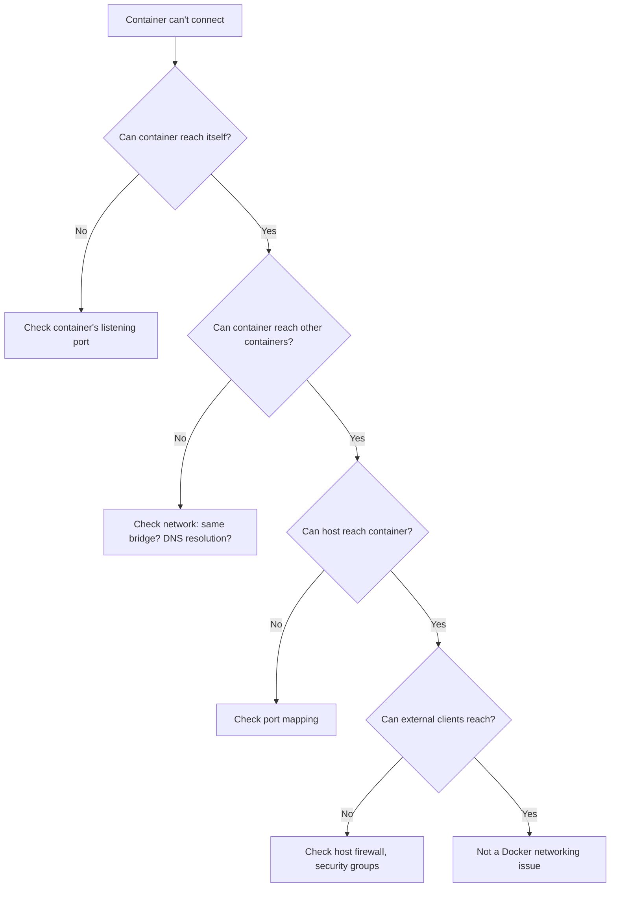

# Playbook: Troubleshoot Container Networking

> [!summary] Goal
> Determine whether networking issues are DNS, bridge config, port mapping, or firewall — with a systematic debugging workflow.

## Table of Contents

1. [Systematic Workflow](#systematic-workflow)
2. [Confirm Container is Listening](#confirm-container-is-listening)
3. [Verify Port Mappings](#verify-port-mappings)
4. [Inspect Networks and DNS](#inspect-networks-and-dns)
5. [Check Host Firewall](#check-host-firewall)
6. [Debugging with netshoot](#debugging-with-netshoot)
7. [Common Scenarios](#common-scenarios)

---

## Systematic Workflow



---

## Confirm Container is Listening

```bash
# Check what the container is actually listening on
docker exec my-app netstat -tlnp 2>/dev/null || \
docker exec my-app ss -tlnp 2>/dev/null || \
docker exec my-app sh -c "lsof -i -P -n" 2>/dev/null

# Curl from inside the container
docker exec my-app curl -v http://localhost:3000/health

# If netstat/curl not available, install in a running container:
docker exec my-app apk add --no-cache curl busybox
```

---

## Verify Port Mappings

```bash
# Check published ports
docker port my-app
# 3000/tcp -> 0.0.0.0:3000
# 3000/tcp -> 127.0.0.1:3000

# Inspect container port config
docker inspect my-app --format '{{json .NetworkSettings.Ports}}'
docker inspect my-app --format '{{.HostConfig.PortBindings}}'

# Test from host
curl -v http://localhost:3000
curl -v http://127.0.0.1:3000

# Check for port conflicts
docker ps --format '{{.Names}}\t{{.Ports}}'
```

---

## Inspect Networks and DNS

```bash
# List container's networks
docker inspect my-app --format '{{json .NetworkSettings.Networks}}'

# Check DNS resolution inside container
docker exec my-app sh -c "getent hosts api" 2>/dev/null || \
docker exec my-app sh -c "nslookup api 127.0.0.11" 2>/dev/null || \
docker exec my-app sh -c "cat /etc/resolv.conf"

# Inspect network details
docker network inspect my-network

# Check if containers are on the same network
docker inspect api --format '{{.NetworkSettings.Networks}}'
docker inspect db --format '{{.NetworkSettings.Networks}}'
```

---

## Check Host Firewall

```bash
# Linux — check iptables rules
iptables -L DOCKER -n
iptables -L FORWARD -n

# Check if port is reachable from another machine
nc -zv host-ip 3000

# macOS — check if port is forwarded by Docker Desktop
# Check Docker Desktop settings for port conflicts
```

---

## Debugging with netshoot

`nicolaka/netshoot` is a container with ALL network debugging tools:

```bash
# Run netshoot alongside your container
docker run -it --network container:my-app nicolaka/netshoot

# Or share the same network
docker run -it --network my-network nicolaka/netshoot

# Inside netshoot, you have:
curl, wget, httpie, dnsutils, tcpdump, netcat, nmap, iftop, iperf, ngrep, dig, nslookup
```

### Common commands inside netshoot

```bash
# DNS resolution
nslookup api
dig api
getent hosts api

# Connectivity test
curl -v http://api:3000/health
nc -zv api 3000

# Traffic capture
tcpdump -i eth0 port 3000

# Route tracing
traceroute api
```

---

## Common Scenarios

| Symptom | Likely cause | Fix |
|---------|-------------|-----|
| `Connection refused` | Service not listening on that port | Check CMD/ENTRYPOINT, check logs |
| `Connection timed out` | Firewall blocking, wrong IP | Check `docker port`, host firewall |
| `Name or service not known` | DNS resolution failure | Check network: same user-defined bridge? |
| `Address already in use` | Port conflict on host | `docker ps` shows another container on same host port |
| Can reach by IP but not name | Default bridge network | Create a user-defined bridge network |
| Works on host but not from browser | Host firewall | Open port in firewall, check cloud security group |
| `curl: (56) Recv failure` | Half-open connection, proxy issues | Check `HTTP_PROXY` env vars in container |

---

## Cross-Links

- [[CICD/Docker/01_Foundations/03_Docker_Networking_Basics]] for network drivers
- [[CICD/Docker/04_Playbooks/06_Containerize_a_Full_Stack_App_with_Compose]] for Compose networking
