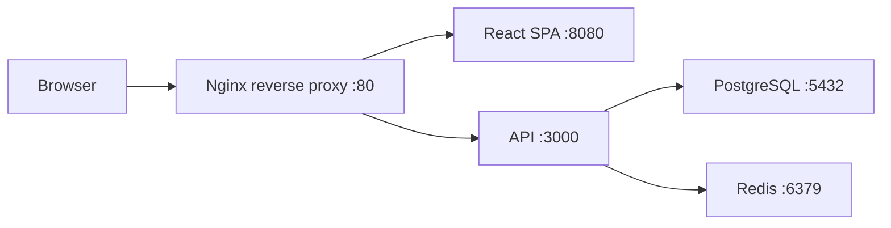

# Playbook: Containerize a Full Stack App with Compose

> [!summary] Goal
> Run a full stack application (React/Angular frontend + Spring Boot/Node API + PostgreSQL) with Docker Compose — including Nginx reverse proxy, development profiles, and database migrations.

## Architecture



## Docker Compose (Production)

```yaml
name: fullstack-prod

services:
  # Nginx reverse proxy
  nginx:
    image: nginx:alpine
    ports:
      - "80:80"
    volumes:
      - ./nginx.conf:/etc/nginx/conf.d/default.conf:ro
    depends_on:
      - frontend
      - api

  # React frontend
  frontend:
    build:
      context: ./frontend
      dockerfile: Dockerfile.prod
    environment:
      - API_URL=http://api:3000
    expose:
      - "8080"

  # Spring Boot API
  api:
    build:
      context: ./api
      dockerfile: Dockerfile.prod
    environment:
      - SPRING_PROFILES_ACTIVE=prod
      - DATABASE_URL=jdbc:postgresql://db:5432/appdb
      - REDIS_HOST=redis
    depends_on:
      db:
        condition: service_healthy
      redis:
        condition: service_started
    expose:
      - "8080"

  # Database
  db:
    image: postgres:16-alpine
    environment:
      POSTGRES_DB: appdb
      POSTGRES_PASSWORD: secret
    volumes:
      - pgdata:/var/lib/postgresql/data
      - ./init-db.sql:/docker-entrypoint-initdb.d/init.sql
    healthcheck:
      test: pg_isready
      interval: 5s
      retries: 5

  # Cache
  redis:
    image: redis:7-alpine
    volumes:
      - redisdata:/data

volumes:
  pgdata:
  redisdata:
```

## Docker Compose (Development with Profiles)

```yaml
name: fullstack-dev

services:
  # Frontend dev server with hot-reload
  frontend:
    build:
      context: ./frontend
      dockerfile: Dockerfile.dev
    ports:
      - "3000:3000"
    volumes:
      - ./frontend/src:/app/src:cached
    environment:
      - REACT_APP_API_URL=http://localhost:8080
    profiles: ["dev"]

  # API dev server with hot-reload
  api:
    build:
      context: ./api
      dockerfile: Dockerfile.dev
    ports:
      - "8080:8080"
    volumes:
      - ./api/src:/app/src:cached
      - ~/.m2:/root/.m2:cached
    environment:
      - SPRING_PROFILES_ACTIVE=dev
      - DATABASE_URL=jdbc:postgresql://db:5432/appdb
      - REDIS_HOST=redis
    depends_on:
      db:
        condition: service_healthy
    profiles: ["dev"]

  # Database
  db:
    image: postgres:16-alpine
    ports:
      - "5432:5432"
    environment:
      POSTGRES_DB: appdb
      POSTGRES_PASSWORD: secret
    volumes:
      - pgdata-dev:/var/lib/postgresql/data
    healthcheck:
      test: pg_isready
      interval: 5s

  # Dev-only tools
  adminer:
    image: adminer
    ports:
      - "8081:8080"
    profiles: ["dev"]

  mailhog:
    image: mailhog/mailhog
    ports:
      - "8025:8025"
    profiles: ["dev"]

volumes:
  pgdata-dev:
```

## Nginx Proxy Configuration

```nginx
server {
    listen 80;
    server_name _;

    # Frontend
    location / {
        proxy_pass http://frontend:8080;
        proxy_set_header Host $host;
        proxy_set_header X-Real-IP $remote_addr;
    }

    # API
    location /api/ {
        rewrite ^/api/(.*) /$1 break;
        proxy_pass http://api:8080;
        proxy_set_header Host $host;
        proxy_set_header X-Real-IP $remote_addr;
    }

    # WebSocket (if needed)
    location /ws/ {
        proxy_pass http://api:8080;
        proxy_http_version 1.1;
        proxy_set_header Upgrade $http_upgrade;
        proxy_set_header Connection "upgrade";
    }
}
```

## Startup Commands

```bash
# Development (with hot-reload)
docker compose --profile dev up -d

# Production
docker compose up -d

# View logs
docker compose logs -f api frontend

# Run database migrations
docker compose exec api ./mvnw flyway:migrate

# Reset everything
docker compose down -v
```

## Database Migration Setup

```sql
-- init-db.sql — runs on first database startup
CREATE EXTENSION IF NOT EXISTS "uuid-ossp";

CREATE TABLE IF NOT EXISTS schema_version (
    version VARCHAR(255) PRIMARY KEY,
    applied_at TIMESTAMP DEFAULT NOW()
);
```

## `.env` File

```bash
# .env — shared across services
COMPOSE_PROJECT_NAME=myapp
POSTGRES_DB=appdb
POSTGRES_PASSWORD=secret
REDIS_PASSWORD=
```

## Best Practices for Full Stack

- **Separate compose files**: one for production, one for development with hot-reload and admin tools
- **Profiles**: dev-only services (adminer, mailhog) assigned to `dev` profile — never started in production
- **Health checks**: every service that has dependencies uses `condition: service_healthy`
- **Volumes**: named volumes for databases, bind mounts for development source code
- **Environment**: `.env` file shared across services for common values
- **Network**: Compose creates a default network — all services resolve each other by service name
- **Data persistence**: database volumes persist across restarts; `down -v` wipes them deliberately
