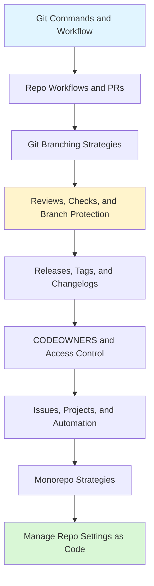

# GitHub

> [!summary] Scope
> Managing code collaboration on GitHub: branching strategies, PR workflows, branch protection, releases, CODEOWNERS, issue/project management, monorepo patterns, and repository settings as code.

## Learning Path

## Topic Map

### Foundations (5 files)

#### [[CICD/GitHub/01_Foundations/00_Git_Commands_and_Workflow]]
- Three-tree Git architecture (working dir, staging, repository)
- Daily commands: status, add, commit, diff, log, blame, show
- Branching: branch, checkout/switch, merge, rebase
- Remote operations: clone, fetch, pull, push, remote
- Undoing changes: restore, reset, revert, amend, stash
- Recovery: reflog, conflict resolution, force-push safety

#### [[CICD/GitHub/01_Foundations/01_Repo_Workflows_and_PRs]]
- Branching strategies: GitHub Flow, Trunk-Based, GitFlow — comparison table
- Merge strategies: merge commit, squash, rebase — with git graph diagrams
- PR lifecycle, templates (markdown + YAML forms), draft PRs, auto-merge

#### [[CICD/GitHub/01_Foundations/02_Reviews_Checks_and_Branch_Protection]]
- All branch protection rules with mermaid flowcharts
- Required PR reviews: approvals, stale dismissal, code owner review
- Status checks, required workflows, merge queue behavior
- Bypass allowances and audit logging

#### [[CICD/GitHub/01_Foundations/03_Releases_Tags_and_Changelogs]]
- Semantic versioning deep dive with precedence flow
- Annotated vs lightweight tags
- Conventional commits for automated changelogs
- Tools: release-drafter, git-cliff, semantic-release
- SBOM signing and attestations

#### [[CICD/GitHub/01_Foundations/04_Git_Branching_Strategies_and_Conventional_Commits]]
- Detailed GitHub Flow, Trunk-Based, GitFlow with gitGraph mermaid
- Strategy selection decision flowchart
- Full conventional commits type reference
- Commitlint + Husky enforcement pipeline
- SemVer from commits, git hooks lifecycle

### Core (2 files)

#### [[CICD/GitHub/02_Core/01_CODEOWNERS_and_Access_Control]]
- CODEOWNERS syntax with matching priority
- Repository permission levels (Read → Admin)
- Classic vs fine-grained PATs comparison
- GitHub Apps vs PATs, secret scanning and push protection

#### [[CICD/GitHub/02_Core/02_Issues_Projects_and_Automation]]
- Issue templates (YAML forms), labels and milestones
- GitHub Projects views and automation
- `gh` CLI reference for issues, PRs, workflows, releases
- Auto-labeling and auto-close with Actions

### Advanced (1 file)

#### [[CICD/GitHub/03_Advanced/01_Monorepo_Strategies_and_Repo_Scaling]]
- Monorepo vs polyrepo decision flowchart
- Turborepo pipeline config and caching
- Nx affected commands and dependency graph
- pnpm workspaces, Changesets versioning workflow
- CI scoping for monorepos, CODEOWNERS per package

### Playbooks (2 files)

#### [[CICD/GitHub/04_Playbooks/01_Handle_Failing_Checks_and_Required_Reviews]]
- Systematic triage workflow with decision tree
- Common failure patterns reference table
- Re-run strategies, resolving review bottlenecks

#### [[CICD/GitHub/04_Playbooks/02_Manage_Repository_Settings_as_Code]]
- Branch protection via API scripts
- Repository settings, labels, auto-creation
- Terraform GitHub provider example

### Projects (1 file)

#### [[CICD/GitHub/05_Projects/01_Setup_a_Repo_Template_for_Teams]]
- `.github/` directory structure with all templates
- CI workflow, CODEOWNERS, branch protection API
- Template repository creation workflow

---

## Cross-Links

- [[CICD/GitHubActions/00_MOC/00_GitHubActions_MOC]] for CI/CD workflows
- [[CICD/Terraform/00_MOC/00_Terraform_MOC]] for GitHub provider
- [[CICD/02_Core/02_Secrets_Management]] for managing tokens and credentials

---

## References

- [GitHub Documentation](https://docs.github.com/)
- [GitHub REST API](https://docs.github.com/en/rest)
- [GitHub CLI Manual](https://cli.github.com/manual/)
- [Terraform GitHub Provider](https://registry.terraform.io/providers/integrations/github/latest/docs)
