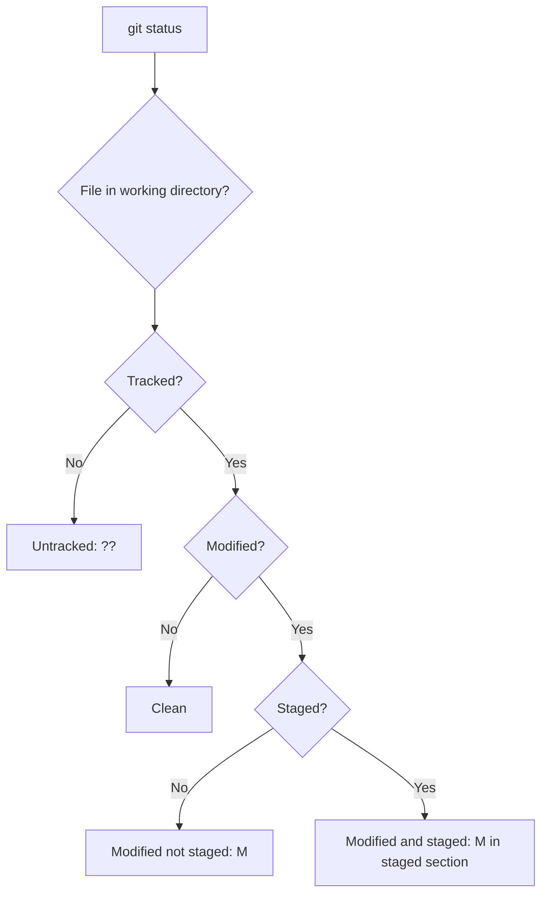
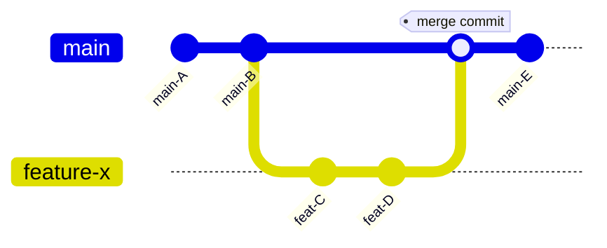
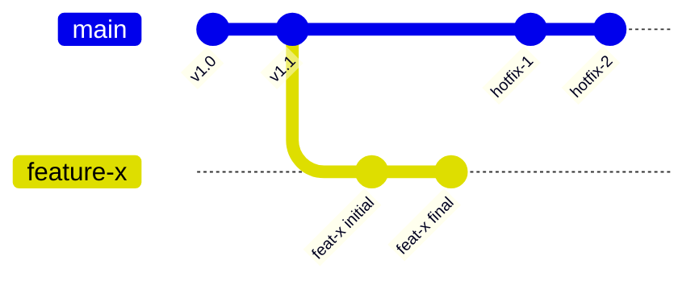
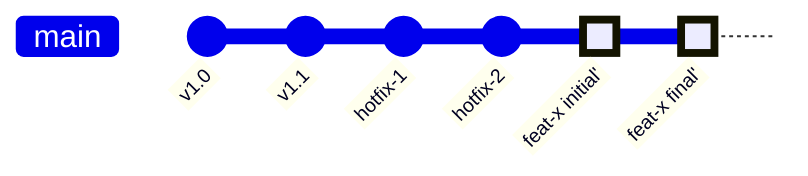
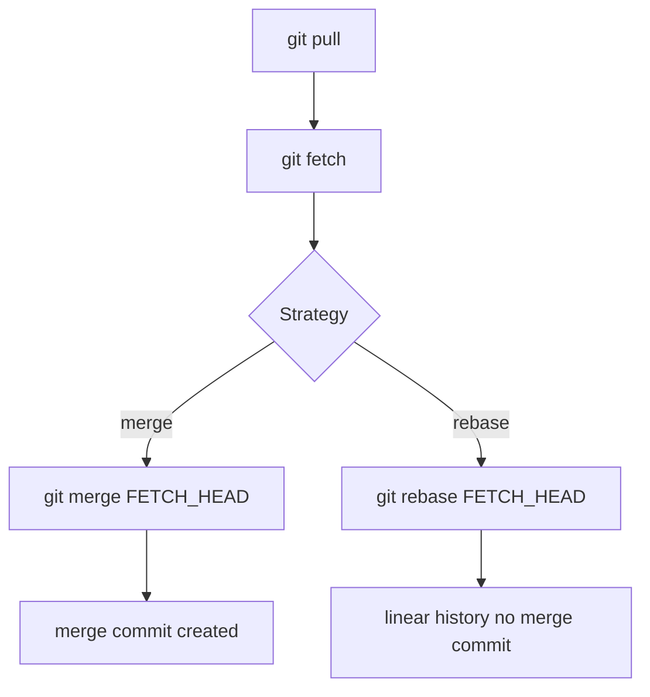
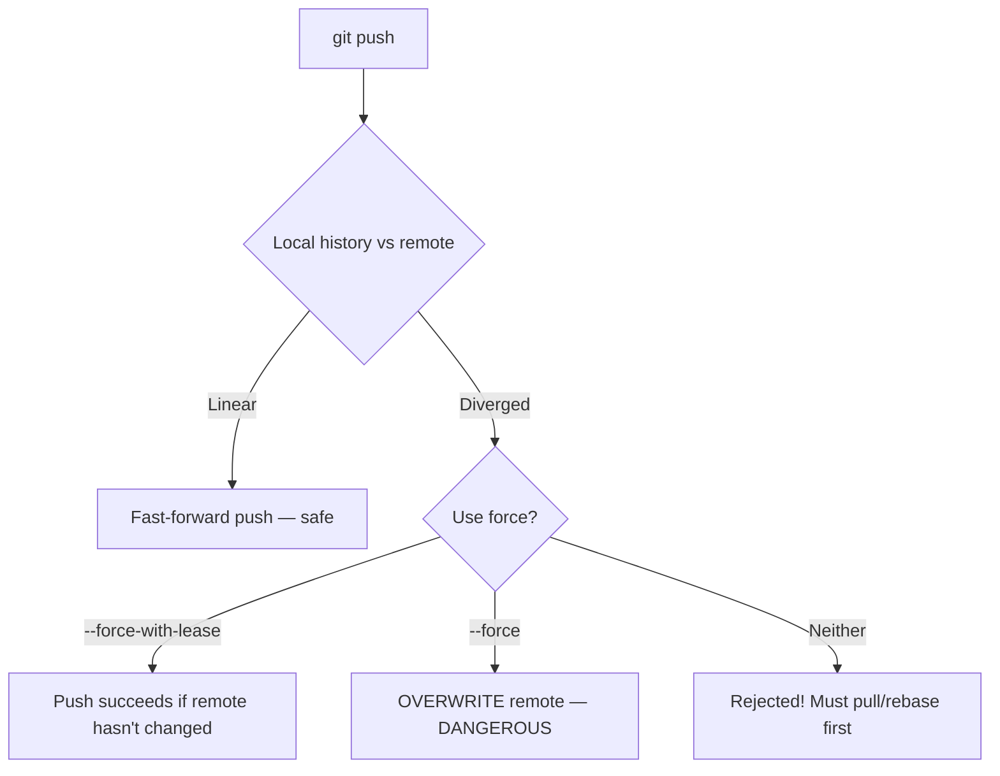
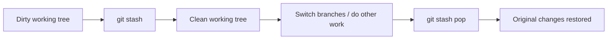

# Git Commands and Workflow

> [!summary] Goal
> Use Git confidently for day-to-day development: understand the three-tree architecture, master essential commands (clone, commit, push, pull, merge, rebase, branch), and recover from common mistakes without panic.

## Table of Contents

1. [The Three Trees of Git](#the-three-trees-of-git)
2. [Getting Started](#getting-started)
3. [Daily Workflow Commands](#daily-workflow-commands)
4. [Branching and Merging](#branching-and-merging)
5. [Remote Operations](#remote-operations)
6. [Undoing Changes](#undoing-changes)
7. [Stashing](#stashing)
8. [Inspecting History](#inspecting-history)
9. [Git Workflows in Practice](#git-workflows-in-practice)
10. [Pitfalls](#pitfalls)

---

## The Three Trees of Git

Git manages files across three areas:

```mermaid
flowchart LR
    A[Working Directory] -->|git add| B[Staging Area (Index)]
    B -->|git commit| C[Local Repository]
    C -->|git push| D[Remote Repository]
    D -->|git fetch| C
    C -->|git checkout HEAD| A
    D -->|git pull| A
```

| Area | Description | Command to write to it |
|------|-------------|----------------------|
| **Working Directory** | The files you see and edit | (your editor) |
| **Staging Area (Index)** | Files staged for next commit | `git add` |
| **Local Repository** | Committed history on your machine | `git commit` |
| **Remote Repository** | Committed history on GitHub/GitLab/etc | `git push` |

---

## Getting Started

### Configure Git

```bash
git config --global user.name "Your Name"
git config --global user.email "your@email.com"
git config --global init.defaultBranch main
git config --global pull.rebase true    # rebase on pull by default
git config --global fetch.prune true    # clean up deleted remote branches
```

### `git init` — create a new, empty Git repository

Initializes a `.git` directory in the current folder, making it a Git repository. You typically run this once at the start of a project before adding files.

```bash
mkdir my-project && cd my-project
git init
```

### `git clone` — copy an existing repository to your local machine

Downloads the entire repository history (or a subset with `--depth`) and sets up remote tracking so you can push/pull.

```bash
git clone https://github.com/user/repo.git
git clone git@github.com:user/repo.git  # SSH (no password prompt)
git clone --depth 1 https://github.com/user/repo.git  # shallow clone (faster, only latest commit)
```

---

## Daily Workflow Commands

### `git status` — what's the current state of the repo?

Shows which files are modified, staged, or untracked. Run this constantly — it's the most used Git command.

```bash
git status                  # full status
git status -s               # short status (M = modified, A = added, ?? = untracked)
```



### `git add` — stage changes for the next commit

Moves changes from the working directory into the staging area (index). Only staged files will be included in the next commit.

```bash
git add file.ts              # stage a specific file
git add src/                 # stage all files in a directory
git add .                    # stage everything in current directory
git add -p                   # stage interactively (hunk by hunk)
git add -A                   # stage all changes (including deletions)
```

```bash
git add file.ts              # stage a specific file
git add src/                 # stage all files in a directory
git add .                    # stage everything in current directory
git add -p                   # stage interactively (hunk by hunk)
git add -A                   # stage all changes (including deletions)
```

### `git commit` — save staged changes as a permanent snapshot

Takes everything in the staging area and stores it as a new commit in the repository history. Each commit has a unique SHA, author, timestamp, and message.

```bash
git commit -m "fix: correct pagination offset"       # single-line message
git commit -m "feat: add user API" -m "Implements GET /users/:id"  # multi-line
git commit -a -m "fix: typo"                         # add tracked files + commit
git commit --amend --no-edit                         # fix up last commit (don't change message)
git commit --amend -m "new message"                  # fix up last commit + change message
```

### `git diff` — show the differences between two states

Compares working directory vs staging area (default), or staging vs last commit (`--staged`), or any two commits.

```bash
git diff                            # unstaged changes (working vs staging)
git diff --staged                   # staged changes (staging vs last commit)
git diff main...HEAD                # changes on current branch vs main
git diff abc123..def456             # between two commits
git diff --name-only                # just file names, not content
```

---

## Branching and Merging

### `git branch` — create, list, rename, and delete branches

A branch is a movable pointer to a commit. Creating a branch lets you work on features in isolation without affecting the main line.

```bash
git branch                    # list local branches (* = current)
git branch -a                 # list all branches (local + remote)
git branch -r                 # list remote branches
git branch feature-x          # create branch from current HEAD
git branch -m old-name new-name   # rename branch
git branch -d feature-x       # delete branch (safe — won't delete unmerged)
git branch -D feature-x       # delete branch (force)
```

### `git checkout` / `git switch` — navigate between branches and commits

Moves `HEAD` (your current position) to a different branch, commit, or file state. `switch` is the newer, safer alternative focused only on branch navigation.

```bash
# Old style (still works everywhere)
git checkout main             # switch to main branch
git checkout -b feature-x     # create + switch to new branch
git checkout abc123           # detached HEAD at commit abc123
git checkout -- file.ts       # discard unstaged changes to file.ts

# New style (Git 2.23+)
git switch main               # switch to main branch
git switch -c feature-x       # create + switch to new branch
git switch -                  # switch to previous branch
```

### `git merge` — combine two branches into one

Brings changes from one branch into another by creating a merge commit (unless fast-forward is possible). Most commonly: merge a feature branch into main after review.

```bash
git switch main
git merge feature-x           # merge feature-x into main
git merge --no-ff feature-x   # force merge commit (even if fast-forward possible)
git merge --abort             # cancel merge if there are conflicts
```



### `git rebase` — rewrite commit history by moving commits to a new base

Instead of creating a merge commit, rebase takes your feature branch commits and replays them one by one on top of another branch. This creates a clean, linear history — but rewrites commit hashes, so never rebase shared/pushed branches.

```bash
git switch feature-x
git rebase main               # replay feature commits on top of main

git rebase --continue         # continue after resolving conflicts
git rebase --skip             # skip this commit
git rebase --abort            # abort the rebase
```

**Before rebase:** feature branch diverged from main. Both have new commits that aren't in each other.



**After rebase:** feature commits `feat-x initial` and `feat-x final` now sit directly on top of `hotfix-2` (the latest main). Their hashes are rewritten (`feat-x initial'` and `feat-x final'`). The history is linear with no fork or merge commit.



---

## Remote Operations

### `git remote` — manage connections to remote repositories

Remotes are shorthand URLs for other copies of the repository (usually on GitHub). `origin` is the default name given to the URL you cloned from.

```bash
git remote -v                        # list remotes (fetch/push URLs)
git remote add origin https://github.com/user/repo.git   # add remote
git remote set-url origin git@github.com:user/repo.git   # change to SSH
```

### `git fetch` — download commits and references from a remote without merging

Fetches new branches, tags, and commits from the remote into your local repository. Unlike `pull`, `fetch` does NOT change your working directory — it only updates your remote-tracking branches (`origin/main`, `origin/feature-x`). Safe to run anytime.

```bash
git fetch                     # fetch all branches from origin
git fetch origin main         # fetch only main branch
git fetch --prune             # fetch + clean up deleted remote branches from local tracking
```

### `git pull` — fetch from a remote AND integrate into the current branch

A shortcut for `git fetch` followed by either `git merge FETCH_HEAD` (default) or `git rebase FETCH_HEAD` (with `--rebase`). Use `--rebase` for a cleaner history without merge commits.

```bash
git pull                      # fetch origin/current-branch + merge
git pull --rebase             # fetch + rebase (cleaner history)
git pull origin main          # fetch and merge origin/main into current branch
```



**Recommendation**: Configure `git config --global pull.rebase true` to rebase on pull by default.

### `git push` — upload local commits to a remote repository

Sends commits from your local branch to the corresponding branch on the remote. If the remote has commits you don't have locally, Git rejects the push — you must pull/rebase first.

```bash
git push                      # push current branch to origin
git push origin main          # push main branch
git push origin feature-x     # push feature branch
git push --set-upstream origin feature-x   # push + set upstream tracking
git push --force              # OVERWRITE remote branch (dangerous!)
git push --force-with-lease   # safer force push (checks remote hasn't changed)
git push origin --delete feature-x   # delete remote branch
```



---

## Undoing Changes

### Discard unstaged changes with `git restore`

Removes changes in your working directory that haven't been staged yet. The file goes back to how it looks in the staging area or the last commit.

```bash
git restore file.ts           # discard unstaged changes (Git 2.23+)
git checkout -- file.ts       # older equivalent
git restore .                 # discard all unstaged changes
```

### Unstage a file with `git restore --staged`

Removes a file from the staging area but keeps your changes in the working directory. The file won't be included in the next commit (unless you add it again).

```bash
git restore --staged file.ts  # unstage (keep changes in working dir)
git reset HEAD file.ts        # older equivalent
```

### Amend the last commit with `git commit --amend`

Modifies the most recent commit instead of creating a new one. You can change the message, add more changes, or both. Only do this for commits that haven't been pushed yet.

```bash
git commit --amend --no-edit  # add staged changes to last commit
git commit --amend -m "new msg"  # change last commit message
```

### Revert a commit with `git revert` (safe — creates a new commit)

Generates a new commit that undoes all the changes from a specified commit. The original commit stays in history — this is the SAFE way to undo something already pushed to a shared branch.

```bash
git revert abc123             # create a NEW commit that undoes abc123
git revert HEAD               # undo the most recent commit
git revert HEAD~3..HEAD       # undo last 3 commits
```

### Reset with `git reset` (rewrites local history only)

Moves the branch pointer backward, optionally discarding or unstaging commits. Only use on commits that haven't been pushed. For shared branches, use `revert` instead.

```bash
git reset --soft HEAD~1       # undo commit, keep changes staged
git reset --mixed HEAD~1      # undo commit + unstage (default)
git reset --hard HEAD~1       # undo commit + DISCARD changes (careful!)
git reset --hard origin/main  # reset local branch to match remote exactly
```

### Which undo command to use

| Situation | Command | Safety |
|-----------|---------|--------|
| Unstaged changes to a file | `git restore file.ts` | Safe — can restore from staging |
| Staged but not committed | `git restore --staged file.ts` | Safe |
| Last commit message wrong | `git commit --amend -m "..."` | Safe (local only) |
| Last commit had wrong file | `git add file && git commit --amend` | Safe (local only) |
| Commit already pushed — undo | `git revert abc123` | Safe — creates new commit |
| Commit already pushed — rewrite | `git push --force-with-lease` | Dangerous — team coordination needed |
| Local commits before push — discard | `git reset --hard HEAD~3` | Safe (local only) |

---

## Stashing

Stashing temporarily saves uncommitted changes (both staged and unstaged) so you can work on something else. Later, you can re-apply them with `pop`.

```bash
git stash                     # save working directory + stage, clean state
git stash push -m "WIP: feature X"   # stash with message
git stash list                # list stashes
git stash pop                 # apply most recent stash + remove it
git stash apply stash@{2}     # apply specific stash, keep it
git stash drop stash@{0}      # drop a stash
git stash clear               # remove all stashes
```



### When to stash

```bash
# Need to switch branches but have uncommitted work:
git stash
git switch main
# ... do something ...
git switch feature-x
git stash pop

# Stash only specific files:
git stash push -m "config changes" -- config/
```

---

## Inspecting History

### `git log` — view the commit history

Displays a chronological list of commits. The most powerful command for understanding what happened in a repository.

```bash
git log                       # full commit log
git log --oneline             # one line per commit
git log --graph               # branch graph
git log --oneline --graph --all --decorate  # best overview
git log --since="2 weeks ago" # commits in last 2 weeks
git log --author="alice"      # commits by alice
git log -p                    # show diffs in log
git log --follow -- file.ts   # history of a file across renames
```

```bash
# My standard go-to:
git log --oneline --graph --all --decorate -20
```

### `git blame` — see who last modified each line of a file

Shows the commit SHA, author, and timestamp for every line. Essential for understanding why a line was written or finding who to ask about a change.

```bash
git blame file.ts                  # each line annotated with commit + author
git blame -L 10,20 file.ts         # only lines 10-20
```

### `git show` — display the details of a single commit

Shows the commit metadata (author, date, message) and the full diff of what changed.

```bash
git show abc123               # show commit diff + metadata
git show HEAD                 # show most recent commit
git show --stat HEAD          # show changed files only, no diff
```

---

## Git Workflows in Practice

### Starting a new feature

```bash
git switch main
git pull --rebase                      # get latest main
git switch -c feature/my-feature       # create feature branch
# ... code, stage, commit ...
git add -A && git commit -m "feat: add my feature"
git push --set-upstream origin feature/my-feature
# Open PR on GitHub → review → merge
```

### Syncing your feature branch

```bash
git switch feature/my-feature
git fetch origin
git rebase origin/main          # replay your commits on latest main
# or:
git merge origin/main           # merge main into your branch
```

### Fixing up after PR review

```bash
# Make the requested changes
git add -A && git commit -m "fix: address review feedback"
git push                           # updates the PR
```

### Hotfix from main

```bash
git switch main
git pull --rebase
git switch -c hotfix/critical-bug
# fix the bug
git add -A && git commit -m "fix: critical bug in payment flow"
git push --set-upstream origin hotfix/critical-bug
# PR → merge → deploy
```

---

## Pitfalls

### Force pushing shared branches

```bash
git push --force               # OVERWRITES remote — others lose their work!
```

**Fix**: Always use `--force-with-lease` which rejects if remote has new commits you haven't seen.

### Committing to the wrong branch

```bash
# You made commits on main instead of a feature branch
git switch -c feature-x        # branch off where you are (commits come along)
git switch main
git reset --hard HEAD~2        # remove those commits from main
```

### `git pull` without rebase creates merge commits

```bash
git pull                       # creates "Merge branch 'main' of ..." commits
```

**Fix**: `git pull --rebase` or set `git config --global pull.rebase true`.

### Detached HEAD

You see: `HEAD detached at abc123`. This happens with `git checkout abc123`.

**Fix**: Create a branch to save your work: `git switch -c temp-branch`, then merge as needed.

### Lost commits after reset

```bash
git reset --hard HEAD~1        # oops — lost that commit!
```

**Fix**: `git reflog` shows everything you did — find the lost commit and `git cherry-pick` or `git reset --hard` to it:

```bash
git reflog                     # shows all HEAD movements
git cherry-pick abc123         # re-apply the lost commit
```

### Merge conflicts

When Git can't auto-merge:

```bash
# Conflict markers appear in files:
# <<<<<<< HEAD
# current branch's change
# =======
# merging branch's change
# >>>>>>> feature-x

# After editing:
git add file.ts                # mark as resolved
git commit                     # complete the merge (no -m, use auto-generated message)
# For rebase:
git rebase --continue
```

---

> [!question]- Interview Questions
>
> **Q: What is the difference between `git fetch` and `git pull`?**
> A: `git fetch` downloads remote changes without modifying your working directory. `git pull` fetches AND then merges (or rebases) the changes into your current branch.
>
> **Q: What is the difference between `git merge` and `git rebase`?**
> A: `merge` creates a merge commit combining two branches, preserving both histories. `rebase` replays commits on top of another branch, creating a linear history. Rebase rewrites commit hashes; merge does not.
>
> **Q: How do you undo a commit that has already been pushed?**
> A: Use `git revert <commit>` — it creates a new commit that undoes the changes. This is safe for shared branches. `git push --force-with-lease` rewrites history but requires team coordination.
>
> **Q: What is `git stash` used for?**
> A: It temporarily saves uncommitted changes so you can switch branches or pull updates. `git stash pop` restores them later.
>
> **Q: What is the difference between `HEAD`, `origin/main`, and `main`?**
> A: `HEAD` is your current position. `main` is your local main branch. `origin/main` is the remote's main branch as of your last `git fetch`. They can all point to different commits.

---

## Cross-Links

- [[CICD/GitHub/01_Foundations/01_Repo_Workflows_and_PRs]] for PR lifecycle with git commands
- [[CICD/GitHub/01_Foundations/04_Git_Branching_Strategies_and_Conventional_Commits]] for branching strategies
- [[CICD/GitHubActions/01_Foundations/01_Workflow_Syntax_and_Triggers]] for CI triggers on git push

---

## References

- [Git Reference](https://git-scm.com/docs)
- [Pro Git Book](https://git-scm.com/book/en/v2)
- [Atlassian Git Tutorials](https://www.atlassian.com/git/tutorials)
- [Oh Shit, Git!?!](https://ohshitgit.com/) — recovery from common mistakes
