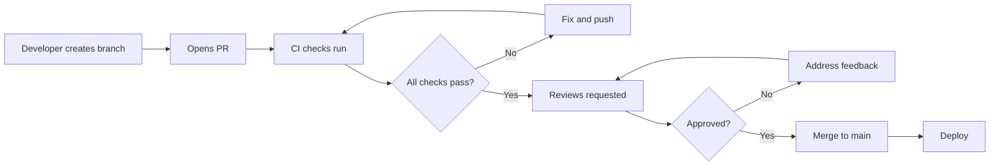
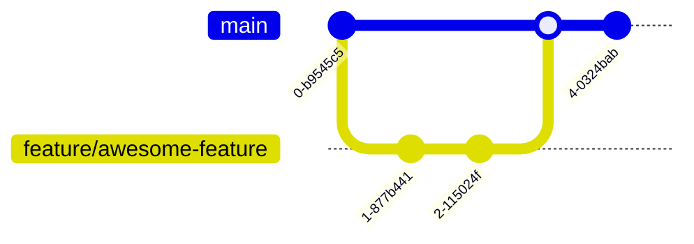
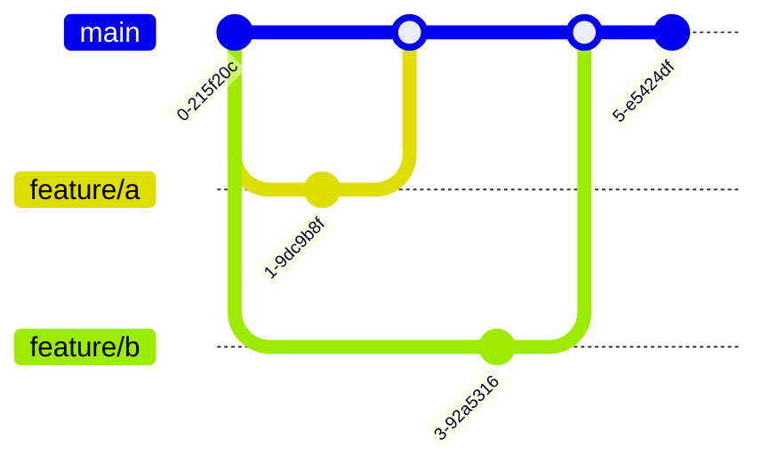
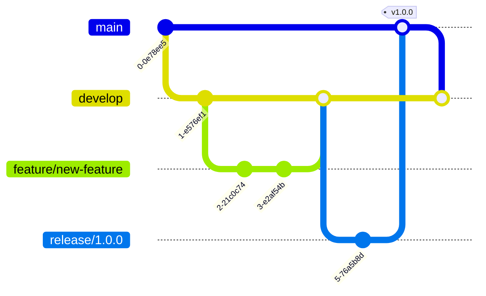
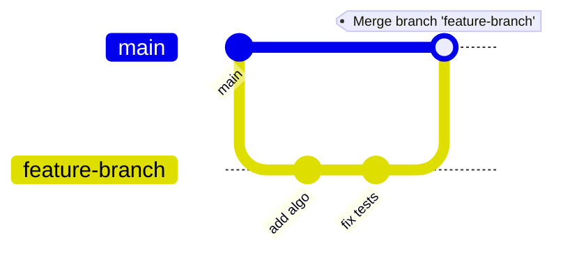
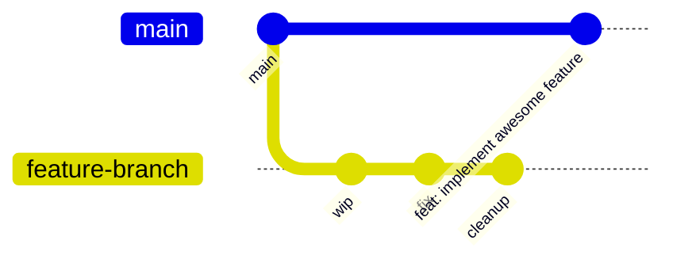
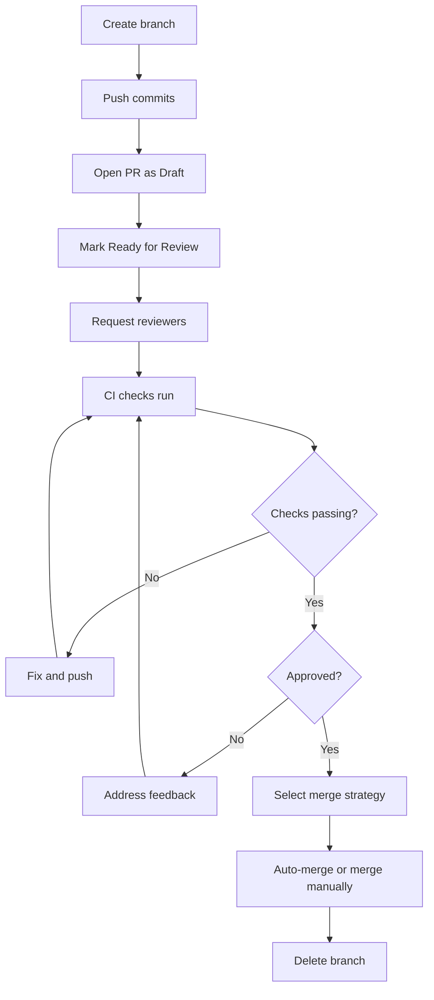
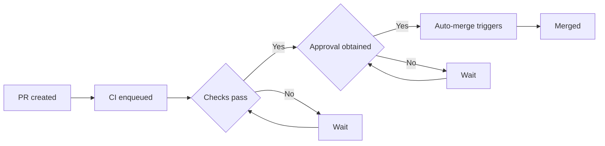

# Repo Workflows and PRs

> [!summary] Goal
> Keep `main` deployable: establish a branching strategy, write effective PRs, choose the right merge strategy, and understand how code flows from developer to production.

## Table of Contents

1. [Why Repo Workflows Matter](#why-repo-workflows-matter)
2. [Branching Strategy Overview](#branching-strategy-overview)
3. [Merge Strategies](#merge-strategies)
4. [Pull Request Lifecycle](#pull-request-lifecycle)
5. [PR Templates and Forms](#pr-templates-and-forms)
6. [Draft PRs and Auto-Merge](#draft-prs-and-auto-merge)
7. [Pitfalls](#pitfalls)

---

## Why Repo Workflows Matter

A **repo workflow** is the process by which code moves from a developer's machine to production. It encompasses branching strategy, PR hygiene, CI checks, and merge mechanics.



> [!tip] Definition
> **Branching strategy**: a convention for how teams create, name, and merge branches to manage code changes consistently.

---

## Branching Strategy Overview

### GitHub Flow

Simple: feature branch → PR → main → deploy immediately.



**When to use:** Continuous deployment, small teams, SaaS products, frequent releases.

### Trunk-Based Development

Short-lived branches (<1 day), feature flags control release, direct to main.



**When to use:** High deploy frequency, mature testing culture, feature flags infrastructure.

### GitFlow

Multiple long-lived branches: `develop`, `release/*`, `hotfix/*`, `feature/*`, `main`.



**When to use:** Scheduled releases, maintaining multiple versions, larger teams, enterprise.

### Choosing a strategy

| Criteria | GitHub Flow | Trunk-Based | GitFlow |
|----------|-------------|-------------|---------|
| Team size | 1-10 | 1-20 | 10-100+ |
| Release cadence | Continuous | Continous | Scheduled |
| Deploy model | Merge → deploy | Deploy from main | Release branches |
| Hotfix process | PR from branch | Feature flag toggle | hotfix/ branch |
| CI complexity | Low | Medium | High |
| Learning curve | Low | Medium | High |

---

## Merge Strategies

### Merge commit (`--no-ff`)

```bash
git checkout main && git merge --no-ff feature-branch
```



**Pros:** Preserves full branch history, shows when a branch was merged.  
**Cons:** Cluttered graph with many merge commits.

### Squash merge

```bash
git checkout main && git merge --squash feature-branch
git commit -m "feat: implement awesome feature (#123)"
```



**Pros:** Clean, linear history. Each merged PR is one commit.  
**Cons:** Loses individual commits and granular history.

### Rebase merge

```bash
git checkout feature-branch && git rebase main
git checkout main && git merge feature-branch
```

**Pros:** Linear history with individual commits preserved.  
**Cons:** Rewrites commit hashes, cannot rebase if branch is shared.

### Comparison

| Aspect | Merge commit | Squash merge | Rebase merge |
|--------|-------------|--------------|--------------|
| History shape | Non-linear | Linear | Linear |
| Commit granularity | All commits | One commit | All commits |
| `git bisect` friendly | Moderate | Good | Good |
| Commit rewriting | No | No | Yes (hashes change) |
| When to use | Feature branches with meaningful commits | Simple features, WIP commits not useful | Solo branches, polished commits |

---

## Pull Request Lifecycle



### PR essentials

- **Small PRs** — single concern, easy to review (<400 lines)
- **Clear title + description** — what and why, not how
- **Linked issue** — `Closes #123` auto-closes on merge
- **Testing notes** — what was tested, edge cases considered
- **Screenshots** for UI changes

---

## PR Templates and Forms

### Markdown template

```markdown
<!-- .github/PULL_REQUEST_TEMPLATE.md -->

## What does this PR do?

<!-- Brief description of changes -->

## Related issue
Closes #<!-- issue number -->

## Changes

- [ ] Feature
- [ ] Bug fix
- [ ] Refactor
- [ ] Documentation

## Testing

- [ ] Unit tests pass
- [ ] Manual testing done

## Screenshots

<!-- If UI changes -->
```

### YAML form template

```yaml
# .github/ISSUE_TEMPLATE/bug.yml
name: Bug Report
description: Report a bug to help us improve
title: "[Bug]: "
labels: ["bug"]
body:
  - type: textarea
    id: description
    attributes:
      label: Description
      description: What happened?
    validations:
      required: true
  - type: input
    id: version
    attributes:
      label: Version
      placeholder: e.g. 1.2.3
    validations:
      required: true
```

### Multiple templates

```
.github/
  PULL_REQUEST_TEMPLATE/
    default.md
    release.md
    hotfix.md
```

---

## Draft PRs and Auto-Merge

### Draft PRs

Open a PR as draft when it's not ready for review:

```bash
gh pr create --draft --title "WIP: implement awesome feature"
```

Draft PRs:
- Don't request reviews automatically
- Still run CI checks
- Can be marked "Ready for review" when complete

### Auto-merge

Let GitHub merge a PR automatically when all requirements are met:

```bash
gh pr merge --auto --squash
```



**When to use:** Dependabot PRs, routine dependency updates, trusted automated changes.

---

## Pitfalls

### Long-lived branches diverge

A branch older than 2-3 days has likely diverged from main.

**Fix**: Set branch lifecycle policy (delete after merge), rebase/merge main frequently.

### Merge strategy inconsistency

Different team members using different strategies creates confusing history.

**Fix**: Choose one strategy and enforce it in repo settings (e.g., "Allow squash merging" only).

### PRs too large to review

PRs over 1000 lines get less thorough reviews.

**Fix**: Enforce small PRs in CODEOWNERS, review individual commits, use stacked PRs.

---

> [!question]- Interview Questions
>
> **Q: What is the difference between GitHub Flow and GitFlow?**
> A: GitHub Flow uses short-lived feature branches merging to main with immediate deploy. GitFlow uses `develop`, `release/*`, and `hotfix/*` branches for scheduled releases and multiple version maintenance.
>
> **Q: When should you use squash merge vs merge commit?**
> A: Squash merge for simple features where WIP commits aren't valuable. Merge commit for complex features with meaningful individual commits that aid bisecting.
>
> **Q: What is a draft PR used for?**
> A: To open a PR before it's ready for review — CI runs, reviewers can see progress, but no review is requested until marked "Ready for review."

---

## Cross-Links

- [[CICD/GitHub/01_Foundations/02_Reviews_Checks_and_Branch_Protection]] for enforcement
- [[CICD/GitHub/01_Foundations/04_Git_Branching_Strategies_and_Conventional_Commits]] for detailed strategy comparison
- [[CICD/GitHub/02_Core/01_CODEOWNERS_and_Access_Control]] for PR ownership
- [[CICD/GitHubActions/01_Foundations/01_Workflow_Syntax_and_Triggers]] for CI checks on PRs

---

## References

- [GitHub Flow](https://docs.github.com/en/get-started/quickstart/github-flow)
- [About Pull Requests](https://docs.github.com/en/pull-requests/collaborating-with-pull-requests/proposing-changes-to-your-work-with-pull-requests/about-pull-requests)
- [About Merge Methods](https://docs.github.com/en/repositories/configuring-branches-and-merges-in-your-repository/configuring-pull-request-merges/about-merge-methods-on-github)
- [Managing Auto-Merge](https://docs.github.com/en/pull-requests/collaborating-with-pull-requests/incorporating-changes-from-a-pull-request/automatically-merging-a-pull-request)
