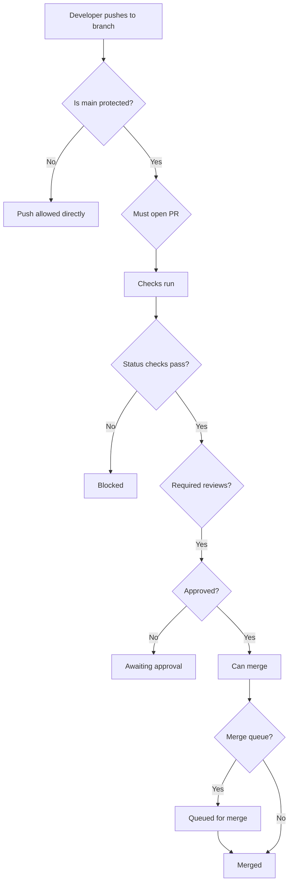
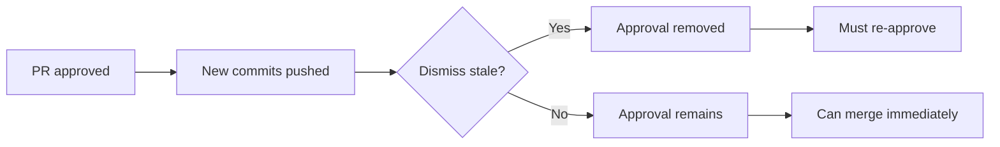
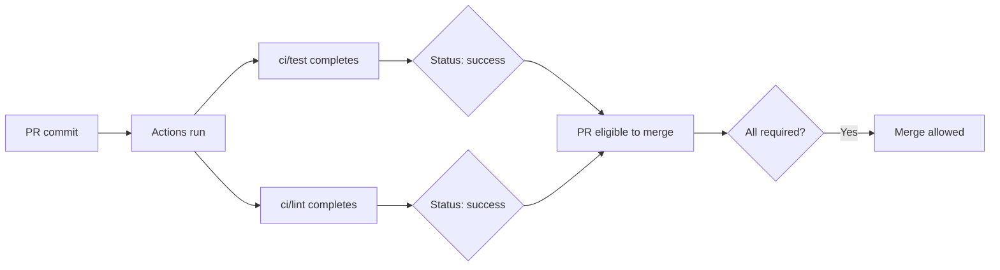
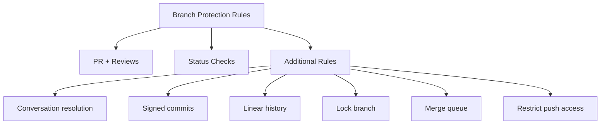
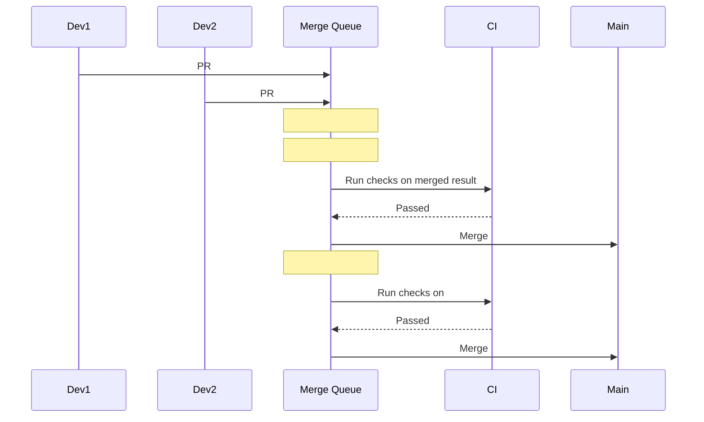

# Reviews, Checks, and Branch Protection

> [!summary] Goal
> Keep `main` safe with enforced reviews, required CI checks, and branch protection rules — while keeping developer velocity high.

## Table of Contents

1. [Why Branch Protection Matters](#why-branch-protection-matters)
2. [Required Pull Request Reviews](#required-pull-request-reviews)
3. [Required Status Checks](#required-status-checks)
4. [CODEOWNERS Enforcement](#codeowners-enforcement)
5. [Additional Protection Rules](#additional-protection-rules)
6. [Merge Queue](#merge-queue)
7. [Bypass Allowances and Auditing](#bypass-allowances-and-auditing)
8. [Best Practices](#best-practices)
9. [Pitfalls](#pitfalls)

---

## Why Branch Protection Matters

Branch protection rules enforce quality gates before changes can land on critical branches. Without them, anyone can push directly to `main`.



> [!tip] Definition
> **Branch protection rule**: a set of conditions that must be satisfied before a Git push or PR merge is accepted on a specific branch pattern (e.g. `main`, `release/*`).

---

## Required Pull Request Reviews

### Require pull request before merging

Prevents direct pushes — every change to `main` must go through a PR.

### Require approvals

| Setting | Behavior |
|---------|----------|
| 1 approval | Most common. One reviewer should approve. |
| 2+ approvals | For critical repos requiring multiple perspectives. |
| Dismiss stale approvals | When new commits are pushed, existing approvals are dismissed. |
| Require approval of most recent reviewable push | Even if approval is from an older commit, it counts — unless this is enabled. |

### Dismiss stale pull request approvals when new commits are pushed



**When to enable**: When you want reviewers to re-check after changes.
**When to disable**: For rapidly iterating WIP PRs where re-review is overhead.

### Require review from Code Owners

If enabled, PRs touching paths owned by CODEOWNERS require approval from those owners — even if enough other approvals exist.

---

## Required Status Checks

### How status checks work

CI workflows and other services report status to the commit. Branch protection requires specific statuses to pass.

```yaml
# In branch protection: "ci / test", "ci / lint", "deploy / preview"
```



| Aspect | Detail |
|--------|--------|
| Naming | Status check names are exactly the job name: `job_name` or `job_id` |
| Required** | You require specific checks by name |
| Flexible** | "Require branches to be up to date" — main must be merged in |
| Required workflows** | Newer feature — require entire workflow files, not just jobs |

### Required workflows (GitHub Enterprise)

You can require specific workflow files to run successfully before merging — enforced at the repository level, not branch rules. Useful for global compliance.

---

## CODEOWNERS Enforcement

```yaml
# .github/CODEOWNERS

# Global owners
* @global-team

# Frontend ownership
*.tsx @frontend-team
*.css @frontend-team

# API ownership
/src/api/ @backend-team

# Docs ownership
/docs/ @docs-team

# CI/CD — build team and security
/.github/ @devops-team @security-team
```

When combined with "Require review from Code Owners," any PR that modifies files in these paths must be approved by the listed owner.

---

## Additional Protection Rules



| Rule | What it does | When to enable |
|------|-------------|----------------|
| **Require conversation resolution** | All PR comments must be marked "Resolved" before merge | Larger teams where discussions can linger |
| **Require signed commits** | Commits must be GPG or SSH signed | Compliance, supply chain security |
| **Require linear history** | Only squash and rebase merges allowed. No merge commits | Clean git history, simple bisect |
| **Lock branch** | Branch is read-only. No new commits. | Archival, migration complete |
| **Restrict who can push** | Only specific users/teams can push (even through PRs) | Sensitive repos, release branches |
| **Allow force pushes** | Who can force push (everyone, specific users, nobody) | Release branches, `develop` reset |
| **Allow deletions** | Allow deleting the branch after merge | Cleanup of feature branches |

---

## Merge Queue

The merge queue groups PRs and tests them together before merging:



### Queue behavior

| Setting | Description |
|---------|-------------|
| `merge_group()` trigger | Workflow trigger for merge queue events |
| Build concurrency | How many PRs are tested in parallel |
| Merge method | Squash, merge, or rebase — independent of PR settings |
| Status checks | Must pass in the merged-with-main context, not just PR's own branch |

**When to use**: Teams with many concurrent PRs to `main`, where PRs frequently conflict or break after merge.

---

## Bypass Allowances and Auditing

### Who can bypass branch protection

- **Repository admins** can bypass by default
- **Specific users/teams** can be allowed to bypass
- **Bypass list** per rule (e.g., admins bypass reviews but not status checks)

### Audit logging

Bypasses are logged in the audit log:

```bash
# View audit log
gh api /orgs/ORG/audit-log --jq '.[] | select(.action=="branch_protection_rule.bypass")'
```

**Best practice**: Minimize bypass permissions. Audit quarterly.

---

## Best Practices

- [ ] Protect `main` and all release branches
- [ ] Require status checks matching your CI workflow jobs
- [ ] Require 1 approval for most repos, 2 for critical ones
- [ ] Enable stale review dismissal on busy repos
- [ ] Enable linear history for clean git graph
- [ ] Enable conversation resolution for busy repos
- [ ] Use CODEOWNERS for sensitive areas (CI config, secrets)
- [ ] Use merge queue for high-traffic repos
- [ ] Protect workflow files: changes to CI can bypass all rules
- [ ] Audit bypass events quarterly

---

## Pitfalls

### Over-protection slows teams

Requiring 3 approvals, signed commits, linear history, AND merge queue on a 3-person startup repo reduces shipping velocity.

**Fix**: Match protection rigor to team size and risk tolerance.

### Stale review dismissal surprises contributors

When enabled, pushing a trivial fix dismisses the approval, requiring re-review for no reason.

**Fix**: Consider disabling stale dismissals, or communicate clearly that reviews are re-requested.

### Status check name mismatch

Check names appear in the PR as `ci/test` but you configured `test` in branch protection.

**Fix**: View exact status check names from the PR's checks tab before configuring protection.

### Merge queue increases merge latency

Each PR waits its turn + CI runs again on the merged result.

**Fix**: Keep queue limits low, parallelize CI, or disable queue for low-traffic periods.

---

> [!question]- Interview Questions
>
> **Q: What is a merge queue and when should you use it?**
> A: A merge queue tests PRs together against the latest main before merging. Use it when many concurrent PRs to main cause frequent conflicts or test failures.
>
> **Q: What is the difference between required status checks and required workflows?**
> A: Status checks require specific job names to pass. Required workflows (GitHub Enterprise) require entire workflow files to run successfully, enforced at the org level.
>
> **Q: What does "dismiss stale pull request approvals" do?**
> A: When new commits are pushed to a PR, existing approvals are automatically dismissed, requiring re-review.

---

## Cross-Links

- [[CICD/GitHub/01_Foundations/01_Repo_Workflows_and_PRs]] for PR flow basics
- [[CICD/GitHub/02_Core/01_CODEOWNERS_and_Access_Control]] for CODEOWNERS syntax
- [[CICD/GitHubActions/01_Foundations/01_Workflow_Syntax_and_Triggers]] for CI workflow triggers
- [[CICD/GitHubActions/01_Foundations/04_Expressions_Contexts_and_Functions]] for status check expressions

---

## References

- [About Branch Protection](https://docs.github.com/en/repositories/configuring-branches-and-merges-in-your-repository/managing-protected-branches/about-protected-branches)
- [Managing a Merge Queue](https://docs.github.com/en/repositories/configuring-branches-and-merges-in-your-repository/managing-merge-queue)
- [About Status Checks](https://docs.github.com/en/pull-requests/collaborating-with-pull-requests/collaborating-on-repositories-with-pull-requests/about-status-checks)
- [CODEOWNERS](https://docs.github.com/en/repositories/managing-your-repositorys-settings-and-features/customizing-your-repository/about-code-owners)
