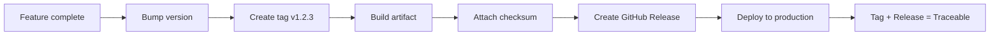
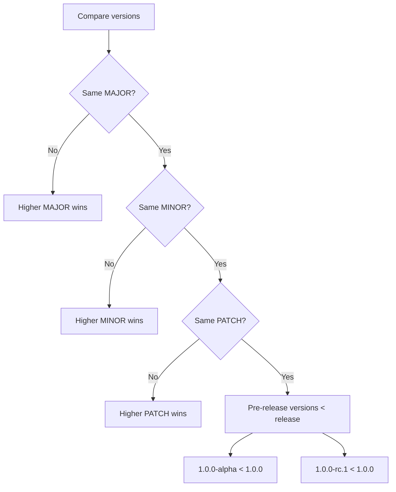
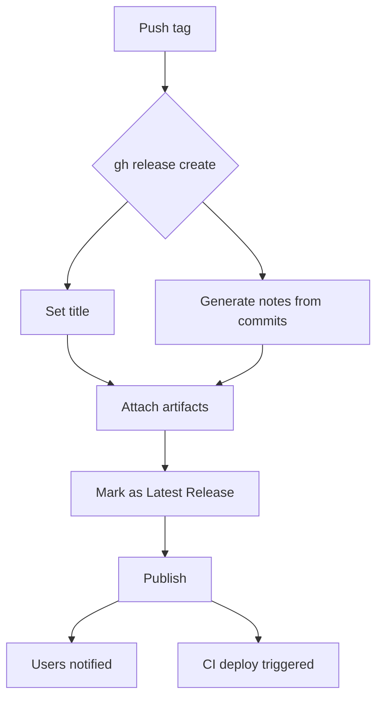
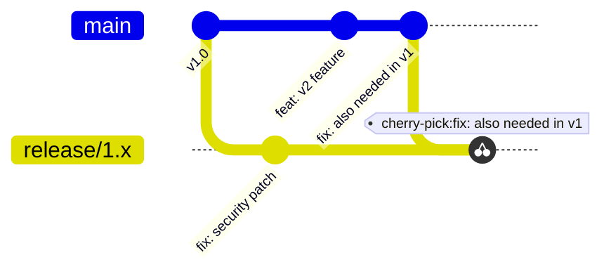

# Releases, Tags, and Changelogs

> [!summary] Goal
> Make releases reproducible and traceable: use SemVer, annotated tags, automated changelogs, and attach security attestations.

## Table of Contents

1. [Why Releases Need Structure](#why-releases-need-structure)
2. [Semantic Versioning Deep Dive](#semantic-versioning-deep-dive)
3. [Tags: Annotated vs Lightweight](#tags-annotated-vs-lightweight)
4. [Creating Releases](#creating-releases)
5. [Conventional Commits + Changelogs](#conventional-commits-changelogs)
6. [Automated Changelog Tools](#automated-changelog-tools)
7. [Release Branches and Backporting](#release-branches-and-backporting)
8. [SBOM and Signing](#sbom-and-signing)
9. [Pitfalls](#pitfalls)

---

## Why Releases Need Structure

A **release** is a specific, immutable snapshot of your software at a point in time. Without structure, releases cannot be traced back to source, debugged in production, or verified for compliance.



---

## Semantic Versioning Deep Dive

### Version format

```
MAJOR.MINOR.PATCH[-PRERELEASE][+BUILD]
  ↑      ↑      ↑       ↑           ↑
Breaking Feature  Fix    Alpha/rc    Build metadata
```

### When to increment

| Increment | Change type | Examples |
|-----------|-------------|----------|
| **MAJOR** | Breaking change | Remove API, change response format, drop parameter |
| **MINOR** | New feature, backward compatible | New endpoint, optional field |
| **PATCH** | Bug fix, backward compatible | Fix crash, correct calculation |
| **PRERELEASE** | `-alpha.1`, `-beta.2`, `-rc.1` | Testing releases, not for production |
| **BUILD** | `+build.123`, `+sha.abc123` | Metadata only — ignored in precedence |

### Precedence rules



### Version ranges (npm/pnpm)

```json
{
  "dependencies": {
    "express": "^4.18.0",    // 4.x.x (>=4.18.0 <5.0.0)
    "lodash": "~4.17.0",     // 4.17.x (>=4.17.0 <4.18.0)
    "react": "18.2.0",       // exact
    "next": ">=14.0.0 <15"   // range
  }
}
```

---

## Tags: Annotated vs Lightweight

### Annotated tags — for releases

```bash
git tag -a v1.2.3 -m "Release v1.2.3: feature X and bugfix Y"
git push origin v1.2.3
```

| Feature | Annotated tag | Lightweight tag |
|---------|--------------|-----------------|
| Creator metadata | Name, email, date | None |
| Message | Yes | No |
| GPG signing | Yes | No |
| Best for | **Releases** | Local markers, WIP |

### Listing and pushing tags

```bash
git tag -l "v1.*"          # list matching tags
git push origin v1.2.3     # push single tag
git push origin --tags     # push all (avoid — use specific tags)
```

---

## Creating Releases

### Via GitHub UI

1. Go to repo → Releases → "Create a new release"
2. Choose tag (or create new)
3. Write release notes
4. Attach assets (binaries, checksums)
5. Publish

### Via CLI (`gh`)

```bash
# Create release
gh release create v1.2.3 \
  --title "v1.2.3" \
  --notes "Release notes here..." \
  --target main

# Attach assets
gh release upload v1.2.3 ./dist/app.tar.gz

# Create from tag (auto-notes from commits)
gh release create v1.2.3 --generate-notes
```



### Via GitHub Actions

```yaml
jobs:
  release:
    runs-on: ubuntu-latest
    permissions:
      contents: write
    steps:
      - uses: actions/checkout@v4
      - run: npm run build
      - run: npm version ${{ github.event.inputs.bump }}
      - uses: ncipollo/release-action@v1
        with:
          artifacts: "dist/*.tar.gz"
          token: ${{ secrets.GITHUB_TOKEN }}
```

---

## Conventional Commits + Changelogs

Conventional commits standardize commit messages so they can automate version bumping and changelog generation.

### Commit format

```
<type>(<scope>): <description>

[optional body]

[optional footer(s)]
```

### Type reference

| Type | Version bump | Release note section |
|------|-------------|---------------------|
| `feat` | MINOR | Features |
| `fix` | PATCH | Bug Fixes |
| `BREAKING CHANGE` | MAJOR | ⚠️ Breaking Changes |
| `build` | No release | — |
| `chore` | No release | — |
| `ci` | No release | — |
| `docs` | No release | Documentation |
| `perf` | PATCH | Performance |
| `refactor` | No release | — |
| `style` | No release | — |
| `test` | No release | Tests |

### Breaking change indicators

```
feat(api): remove deprecated /v1/users endpoint

BREAKING CHANGE: The /v1/users endpoint has been removed.
Use /v2/users instead.
```

```
feat!: remove deprecated /v1/users endpoint
```

### Changelog format (Keep a Changelog)

```markdown
# Changelog

## [1.3.0] - 2026-05-01

### Added
- New dashboard widget
- Export to CSV

### Fixed
- Login timeout for SSO users
- Memory leak in WebSocket handler

### Security
- Updated dependencies to fix CVE-2026-1234

## [1.2.0] - 2026-04-15
...
```

---

## Automated Changelog Tools

### release-drafter/release-drafter

Uses PR labels instead of commits. Ideal for team workflows.

```yaml
# .github/release-drafter.yml
template: |
  ## What Changed

  $CHANGES
categories:
  - title: 🚀 Features
    labels: [feature, enhancement]
  - title: 🐛 Bug Fixes
    labels: [bug]
  - title: ⚠️ Breaking Changes
    labels: [breaking]
```

```yaml
# .github/workflows/release-drafter.yml
name: Release Drafter
on:
  push:
    branches: [main]
jobs:
  draft:
    runs-on: ubuntu-latest
    steps:
      - uses: release-drafter/release-drafter@v6
        env:
          GITHUB_TOKEN: ${{ secrets.GITHUB_TOKEN }}
```

### git-cliff

Uses conventional commits. Generates changelog from git history.

```bash
git cliff --output CHANGELOG.md  # generate from commits
git cliff --bump                  # determine next version
```

```toml
# cliff.toml
[changelog]
header = "# Changelog\n"
body = "\n### {{ group }}\n\n- {{ commit.message }}\n\n\n"
```

### semantic-release

Fully automated: bump → tag → release → publish (npm, GitHub, Docker).

```bash
npx semantic-release
```

---

## Release Branches and Backporting

When maintaining multiple major versions:



```bash
# Backport a fix to a release branch
git checkout release/1.x
git cherry-pick <commit-sha>  # from main
git push origin release/1.x
```

---

## SBOM and Signing

### Attaching SBOM to releases

```yaml
- name: Generate SBOM
  run: syft . -o spdx-json > sbom.spdx.json
- uses: ncipollo/release-action@v1
  with:
    artifacts: "sbom.spdx.json"
```

### Cosign signing

```bash
cosign sign-blob dist/app.tar.gz --bundle dist/app.sig
gh release upload v1.2.3 dist/app.tar.gz dist/app.sig
```

### GitHub attestations

```yaml
- uses: actions/attest-build-provenance@v1
  with:
    subject-path: "dist/app.tar.gz"
```

---

## Pitfalls

### Tagging the wrong commit

```bash
git tag -a v1.0.0 <wrong-sha>  # tagged a buggy commit!
```

**Fix**: Use annotated tags referencing a specific commit SHA. Never delete and recreate tags.

### Mutable `latest` tags

Docker's `latest` tag gets overwritten. You cannot tell which version is running.

**Fix**: Always deploy by exact digest (`sha256:abc123...` or SemVer tag).

### Missing release notes

Release notes are the first thing consumers read. Empty notes create confusion.

**Fix**: Use `--generate-notes` with `gh`, or automate with release-drafter.

---

> [!question]- Interview Questions
>
> **Q: What is the difference between MAJOR, MINOR, and PATCH in SemVer?**
> A: MAJOR for breaking changes, MINOR for backward-compatible features, PATCH for backward-compatible bug fixes. Pre-release versions (`-alpha`) sort below release versions.
>
> **Q: What is the difference between an annotated tag and a lightweight tag?**
> A: Annotated tags store creator metadata (name, email, date), a message, and support GPG signing. Lightweight tags are just a pointer to a commit.
>
> **Q: How do conventional commits enable automated changelogs?**
> A: Types like `feat:`, `fix:`, and `BREAKING CHANGE` map to changelog sections. Tools parse commit history to generate structured release notes and determine the next SemVer bump.

---

## Cross-Links

- [[CICD/GitHub/01_Foundations/04_Git_Branching_Strategies_and_Conventional_Commits]] for conventional commits deep dive
- [[CICD/01_Foundations/02_Build_Artifacts_and_Versioning]] for artifact versioning
- [[CICD/GitHubActions/01_Foundations/01_Workflow_Syntax_and_Triggers]] for release-triggered workflows

---

## References

- [SemVer Specification](https://semver.org/)
- [Conventional Commits](https://www.conventionalcommits.org/)
- [Keep a Changelog](https://keepachangelog.com/)
- [release-drafter](https://github.com/release-drafter/release-drafter)
- [git-cliff](https://git-cliff.org/)
- [semantic-release](https://semantic-release.gitbook.io/)
- [GitHub Releases API](https://docs.github.com/en/rest/releases/releases)
