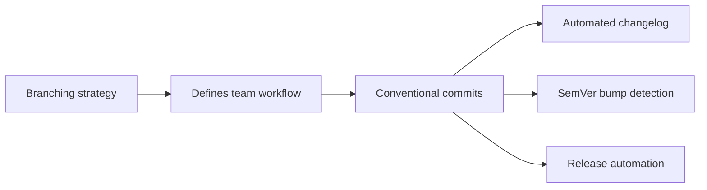
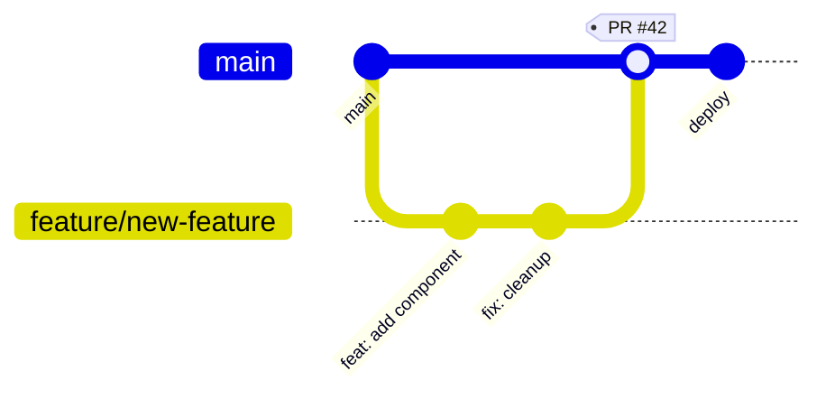
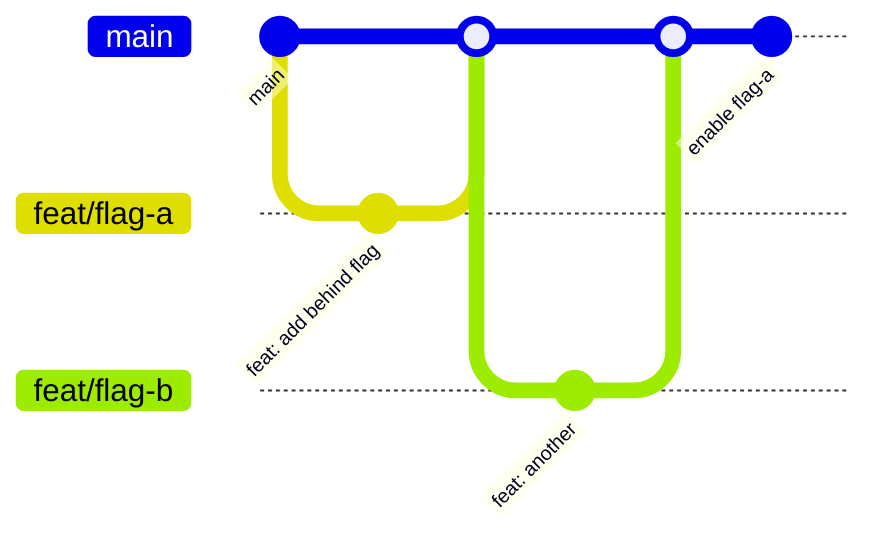
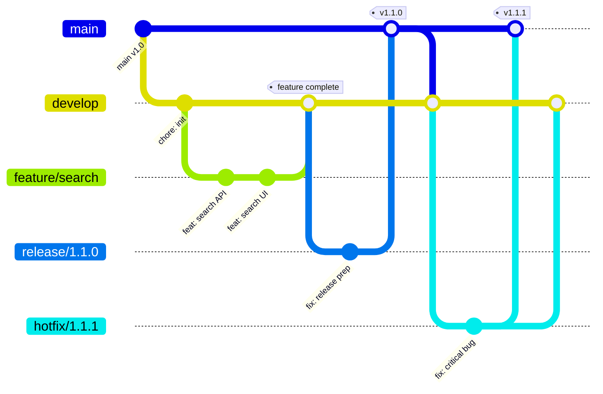
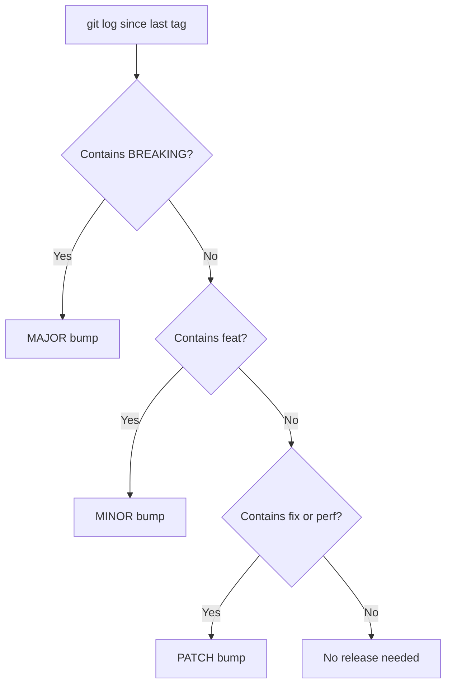

# Git Branching Strategies and Conventional Commits

> [!summary] Goal
> Choose the right branching strategy for your team, write standardized commit messages, and automate versioning and changelog generation from commits.

## Table of Contents

1. [Why Branching and Commits Matter](#why-branching-and-commits-matter)
2. [GitHub Flow](#github-flow)
3. [Trunk-Based Development](#trunk-based-development)
4. [GitFlow](#gitflow)
5. [Choosing the Right Strategy](#choosing-the-right-strategy)
6. [Conventional Commits](#conventional-commits)
7. [Enforcing with Commitlint and Husky](#enforcing-with-commitlint-and-husky)
8. [SemVer from Commits](#semver-from-commits)
9. [Git Hooks with Husky](#git-hooks-with-husky)
10. [Pitfalls](#pitfalls)

---

## Why Branching and Commits Matter

A **branching strategy** defines how teams collaborate on code: when to create branches, how to name them, and when to merge. **Conventional commits** standardize commit messages so they can drive automated versioning and changelogs.



---

## GitHub Flow

Simple: feature branch → PR → main → deploy immediately.



### Rules

1. Anything in `main` is deployable
2. Create descriptive branches off `main`
3. Push to feature branches regularly
4. Open a PR for discussion
5. Merge after review + CI pass
6. Deploy immediately after merge

### When to use

| Criteria | Verdict |
|----------|---------|
| Team size | 1-10 |
| Release cadence | Continuous, multiple times a day |
| Hotfix process | Branch from main, PR, merge |
| Deploy model | Merge → auto-deploy |
| Complexity | Low |

---

## Trunk-Based Development

Short-lived branches (<1 day), feature flags control release, no long-running branches.



### Rules

1. Branch from main, merge to main
2. Branches live <1 day
3. Use feature flags to hide incomplete work
4. No `develop` or `release` branches
5. CI must be fast (<10min)

### When to use

| Criteria | Verdict |
|----------|---------|
| Team size | 1-20 |
| Release cadence | Continuous, multiple times a day |
| Feature flags | Required |
| Testing maturity | High |
| CI speed | Fast (<10min) |

---

## GitFlow

Multiple long-lived branches: `develop` for integration, `release/*` for releases, `hotfix/*` for urgent fixes.



### When to use

| Criteria | Verdict |
|----------|---------|
| Team size | 10-100+ |
| Release cadence | Scheduled (weekly/monthly) |
| Multiple versions | Yes (maintain v1.x while developing v2.x) |
| Complexity | High |
| CI overhead | High (multiple branches trigger CI) |

---

## Choosing the Right Strategy

```mermaid
flowchart TD
    A[What is your deployment model?] --> B{Continuous deploy?}
    B -->|Yes| C{Feature flags available?}
    C -->|Yes| D[Trunk-Based Development]
    C -->|No| E[GitHub Flow]
    B -->|No| F{Scheduled releases?}
    F -->|Yes| G{GitFlow]
    F -->|No| H{Multiple versions maintained?}
    H -->|Yes| G
    H -->|No| E
```

| Factor | GitHub Flow | Trunk-Based | GitFlow |
|--------|-------------|-------------|---------|
| Team size | Small | Any | Medium-Large |
| Release cadence | Continuous | Continuous | Scheduled |
| Feature flags | Optional | Required | Optional |
| Hotfix turnaround | Minutes | Minutes | Hours |
| Merge conflicts | Low | Low | High |
| Learning curve | Low | Medium | High |
| CI cost | Low | Low | High |
| Git history | Clean | Clean | Complex |

---

## Conventional Commits

### Format

```
<type>(<scope>): <description>

[optional body]

[optional footer(s)]
```

### Types reference

| Type | Version bump | Release section | Example |
|------|-------------|-----------------|---------|
| `feat` | MINOR | Features | `feat: add user preferences endpoint` |
| `fix` | PATCH | Bug Fixes | `fix: correct pagination offset` |
| `BREAKING CHANGE` | MAJOR | ⚠️ Breaking | `feat!: drop Node 16 support` |
| `build` | — | — | `build: update esbuild to 0.24` |
| `chore` | — | — | `chore: update .gitignore` |
| `ci` | — | — | `ci: add test sharding` |
| `docs` | — | Documentation | `docs: update API reference` |
| `perf` | PATCH | Performance | `perf: memoize heavy computation` |
| `refactor` | — | — | `refactor: extract auth middleware` |
| `style` | — | — | `style: format with prettier` |
| `test` | — | Tests | `test: add edge cases for parser` |

### Breaking change indicators

```
feat(api)!: remove deprecated /v1/users endpoint

BREAKING CHANGE: The /v1/users endpoint has been removed.
Use /v2/users instead.
```

### Scope

The scope provides context:

```
feat(api): add pagination
fix(web): correct button alignment
feat(api): BREAKING CHANGE: change response format
```

---

## Enforcing with Commitlint and Husky

### Commitlint config

```bash
npm install -D @commitlint/cli @commitlint/config-conventional
```

```js
// commitlint.config.js
module.exports = {
  extends: ['@commitlint/config-conventional'],
  rules: {
    'type-enum': [2, 'always', ['feat', 'fix', 'docs', 'style', 'refactor', 'perf', 'test', 'build', 'ci', 'chore', 'revert']],
    'scope-case': [2, 'always', 'lower-case'],
    'subject-case': [2, 'never', ['upper-case']],
    'body-max-line-length': [1, 'always', 100],
  },
};
```

### Husky setup

```bash
npm install -D husky
npx husky init
```

```bash
# .husky/commit-msg
npx --no -- commitlint --edit $1
```

```bash
# .husky/pre-commit
npx lint-staged
```

```mermaid
flowchart LR
    A[git commit -m "..."] --> B[.husky/commit-msg]
    B --> C[commitlint checks format]
    C --> D{Valid?}
    D -->|Yes| E[Commit accepted]
    D -->|No| F[Commit rejected with error]
    F --> G[Fix message and retry]
```

---

## SemVer from Commits

Tools can determine the next version from commit history:



### With semantic-release

```bash
npx semantic-release
```

```yaml
# .releaserc.yml
branches:
  - main
plugins:
  - "@semantic-release/commit-analyzer"
  - "@semantic-release/release-notes-generator"
  - "@semantic-release/npm"
  - "@semantic-release/github"
```

### With standard-version

```bash
npx standard-version     # bump + tag + changelog
npx standard-version --dry-run  # preview
```

---

## Git Hooks with Husky

Husky manages Git hooks that run scripts at specific lifecycle points.

### Available hooks

| Hook | Trigger | Common use |
|------|---------|------------|
| `pre-commit` | Before commit | `lint-staged`, format, check secrets |
| `prepare-commit-msg` | Before editor opens | Auto-prepend issue number |
| `commit-msg` | After message written | `commitlint` |
| `pre-push` | Before push | Run full test suite, check branches |
| `post-checkout` | After checkout | Install dependencies |
| `post-merge` | After merge | Install new dependencies |

### Example hooks

```bash
# .husky/pre-commit
npx lint-staged
```

```bash
# .husky/pre-push
npm run test:ci
npm run lint
```

```bash
# .husky/post-merge
# reinstall if package.json changed
git diff HEAD@{1} --name-only | grep package.json && npm install
```

---

## Pitfalls

### Long-lived branches diverge

Branches older than 2-3 days differ significantly from main.

**Fix**: Merge or rebase daily. Use branch lifecycle policies (GitHub: auto-delete after merge).

### GitFlow overhead for small teams

The overhead of `develop`, `release/*`, and `hotfix/*` branches can consume 20%+ of team time.

**Fix**: Start with GitHub Flow. Only add GitFlow complexity when maintaining multiple released versions.

### Conventional commits adoption friction

Enforcing commit format retroactively is hard. Developers resist change.

**Fix**: Start with `commitlint` in CI only (non-blocking warning). Add `pre-commit` hook after 2 weeks. Lead by example.

### Hooks bypassed with `--no-verify`

```bash
git commit --no-verify -m "urgent fix"  # skips all hooks
```

**Fix**: Hook bypass is sometimes necessary (production hotfix). Accept infrequent bypasses. Rely on CI as the safety net.

---

> [!question]- Interview Questions
>
> **Q: What is the difference between GitHub Flow and GitFlow?**
> A: GitHub Flow uses short feature branches merging to main with immediate deploy. GitFlow uses `develop`, `release/*`, and `hotfix/*` branches for scheduled releases and multiple version maintenance.
>
> **Q: When would you choose trunk-based development over GitHub Flow?**
> A: When you have feature flags, mature testing, fast CI, and need to deploy multiple times per day. Feature flags decouple deploy from release.
>
> **Q: What is the difference between `feat:` and `fix:` in conventional commits?**
> A: `feat:` increments MINOR version and appears in "Features" changelog section. `fix:` increments PATCH and appears in "Bug Fixes". Both trigger a release.
>
> **Q: What is `commitlint` used for?**
> A: It validates commit messages against a configurable set of rules (type, scope, format) in a pre-commit hook or CI.

---

## Cross-Links

- [[CICD/GitHub/01_Foundations/01_Repo_Workflows_and_PRs]] for PR lifecycle and merge strategies
- [[CICD/GitHub/01_Foundations/03_Releases_Tags_and_Changelogs]] for release automation
- [[CICD/GitHub/02_Core/02_Issues_Projects_and_Automation]] for auto-closing issues
- [[CICD/GitHubActions/01_Foundations/01_Workflow_Syntax_and_Triggers]] for CI on push to branches

---

## References

- [GitHub Flow](https://docs.github.com/en/get-started/quickstart/github-flow)
- [Trunk-Based Development](https://trunkbaseddevelopment.com/)
- [GitFlow (original)](https://nvie.com/posts/a-successful-git-branching-model/)
- [Conventional Commits](https://www.conventionalcommits.org/)
- [Husky](https://typicode.github.io/husky/)
- [commitlint](https://commitlint.js.org/)
- [semantic-release](https://semantic-release.gitbook.io/)
