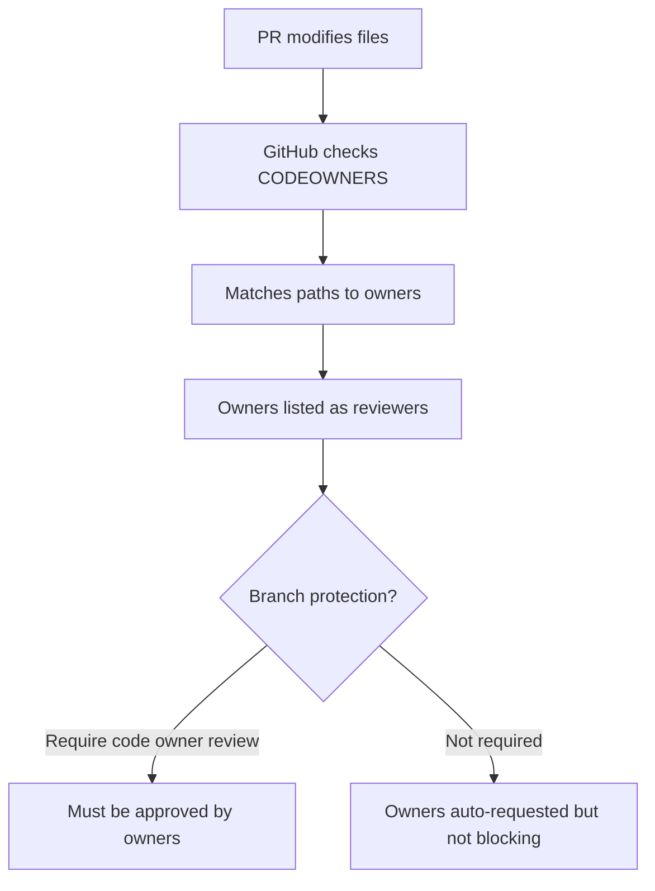
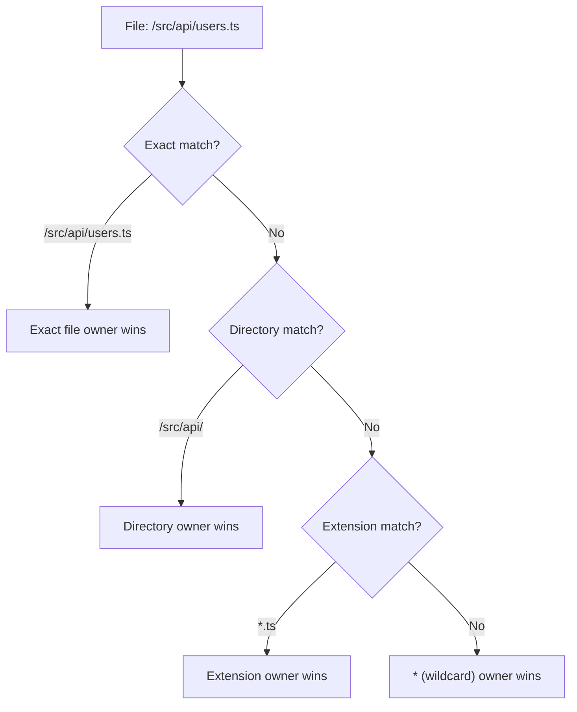
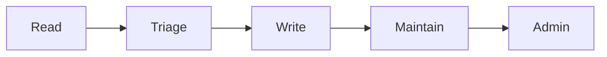

# CODEOWNERS and Access Control

> [!summary] Goal
> Ensure the right people review sensitive changes, control access at the right granularity, and manage credentials securely.

## Table of Contents

1. [Why CODEOWNERS Matters](#why-codeowners-matters)
2. [CODEOWNERS Syntax Deep Dive](#codeowners-syntax-deep-dive)
3. [Repository Permission Levels](#repository-permission-levels)
4. [Personal Access Tokens: Classic vs Fine-Grained](#personal-access-tokens-classic-vs-fine-grained)
5. [GitHub Apps vs PATs](#github-apps-vs-pats)
6. [Secret Scanning and Push Protection](#secret-scanning-and-push-protection)
7. [Pitfalls](#pitfalls)

---

## Why CODEOWNERS Matters

CODEOWNERS defines which individuals or teams are responsible for code in specific paths. Combined with branch protection, it enforces that the right experts review changes to sensitive areas.



---

## CODEOWNERS Syntax Deep Dive

### File location

```
.github/CODEOWNERS
```

### Pattern matching

```yaml
# Simple ownership
* @global-team                       # Every file owned by global-team
*.js @frontend-team                  # All .js files
/docs/ @docs-team                    # Entire docs directory

# Directory ownership — recursive
/app/ @app-team                      # /app, /app/utils, /app/api/*
/src/api/ @backend-team              # /src/api and all subdirectories

# Exact path — no recursion
/src/api/config.ts @security-team    # Only this exact file

# Multiple owners (all are auto-requested)
/.github/workflows/ @devops-team @security-team

# Exception — NOT owned by anyone (optional)
/docs/generated/                     # No owner — doesn't block

# Team syntax
src/internal/ @my-org/internal-team  # Team must be @org/team-name

# User syntax
README.md @username                  # Individual user (avoid — use teams)
```

### Matching priority



| Pattern | Matches | Does not match |
|---------|---------|----------------|
| `*` | Every file | — |
| `*.js` | `app.js`, `utils/index.js` | `app.ts` |
| `/docs/` | `/docs/index.md`, `/docs/api/readme.md` | `/src/docs/` |
| `/docs/*` | `/docs/index.md` | `/docs/api/readme.md` |
| `src/` | `src/index.ts`, `src/app/utils.ts` | `test/src/` |

### Best practices

- Use **teams**, not individual usernames (teams don't leave the org)
- At least `* @default-team` as a fallback
- Keep CODEOWNERS file reviewed via CODEOWNERS (bootstrap)
- Order from most specific to least specific

---

## Repository Permission Levels

| Level | Actions | When to assign |
|-------|---------|----------------|
| **Read** | Pull, clone, view issues | Viewers, CI systems, external contributors |
| **Triage** | Read + manage issues/PRs (labels, assign, close) | Community managers |
| **Write** | Triage + push to non-protected branches, create PRs | Developers |
| **Maintain** | Write + manage repo settings (non-sensitive), push to protected branches with bypass | Tech leads |
| **Admin** | Full access, manage sensitive settings, add collaborators | DevOps, owners |



### Org-level roles

| Role | Scope |
|------|-------|
| **Org member** | Access to repos their teams have |
| **Org moderator** | Manage org-wide moderation |
| **Org billing manager** | Manage billing |
| **Org owner** | Full org access |

---

## Personal Access Tokens: Classic vs Fine-Grained

### Classic PATs

```bash
# Classic PAT — full scope access
GITHUB_TOKEN: ghp_abc123...
```

| Pro | Con |
|-----|-----|
| Simple to create | Broad scopes (`repo`, `admin:org`) |
| Works everywhere | No expiration enforcement (pre-2022) |
| | No per-repo restriction |

### Fine-Grained PATs

```bash
# Fine-grained PAT — scoped to specific repos
GITHUB_TOKEN: github_pat_abc123...
```

| Feature | Fine-Grained | Classic |
|---------|-------------|---------|
| Per-repo scoping | ✅ | ❌ |
| Expiration required | ✅ | ❌ (can be set) |
| Permission granularity | Read/write per resource type | Broad scope strings |
| Org approval required | ✅ | ❌ |
| Rotation enforced | ✅ | ❌ |

### Creating a fine-grained PAT

```
Settings → Developer settings → Personal access tokens → Fine-grained tokens → Generate new token
```

```json
{
  "name": "CI deployment token",
  "expiration": "30 days",
  "repository_access": "Only select repositories → my-service",
  "permissions": {
    "contents": "read",
    "metadata": "read",
    "deployments": "write"
  }
}
```

---

## GitHub Apps vs PATs

| Aspect | GitHub App | Fine-Grained PAT |
|--------|-----------|------------------|
| Identity | App (separate from user) | User |
| Permission model | Installed with granular permissions | User-delegated |
| Rate limits | Higher (5,000/hour) | User's rate limit |
| Token rotation | No fixed rotation — uses installation token (1hr expiry) | Manual |
| Webhooks | Built-in | No |
| Best for | CI/CD, bots, automation | Personal scripts, API access |

```yaml
# GitHub App in Actions workflow
- name: Generate token
  uses: actions/create-github-app-token@v1
  id: app-token
  with:
    app-id: ${{ secrets.APP_ID }}
    private-key: ${{ secrets.APP_PRIVATE_KEY }}
- name: Use token
  run: gh api repos/ --paginate -H "Authorization: Bearer ${{ steps.app-token.outputs.token }}"
```

---

## Secret Scanning and Push Protection

### Secret scanning

GitHub scans repos for known secret patterns (API keys, tokens, passwords):

- **Push protection**: Blocks pushes containing detected secrets
- **Alerting**: Notifies security team when secrets are found
- **Patterns**: 200+ service patterns (AWS, GCP, GitHub, npm, Slack, etc.)

```bash
# Bypass push protection (careful!)
git push -o "secret-scanning-push-protection-bypass=<reason>"
```

### Managing alerts

```bash
gh api /repos/ORG/REPO/secret-scanning/alerts --paginate
```

---

## Pitfalls

### Team not found in CODEOWNERS

```yaml
# ERROR: @backend-team doesn't exist or is misspelled
/src/api/ @backend-tem
```

**Fix**: Verify team spelling and existence. Team must be visible to the repo.

### Permission gaps from migration

Moving from classic PATs to fine-grained PATs breaks scripts that used broad scopes.

**Fix**: Audit token permissions before migration. Use minimal required permissions.

### Overly permissive default token

```yaml
# DANGEROUS: GITHUB_TOKEN has write-all scope
permissions: write-all
```

**Fix**: Set minimal `permissions:` in every workflow.

---

> [!question]- Interview Questions
>
> **Q: What is the purpose of CODEOWNERS?**
> A: It defines which individuals or teams own files in specific paths. Combined with branch protection, it requires their approval on PRs touching those paths.
>
> **Q: What is the difference between a classic PAT and a fine-grained PAT?**
> A: Classic PATs have broad scope strings and no per-repo restriction. Fine-grained PATs are scoped to specific repos with granular resource-level permissions and require expiration.
>
> **Q: What are the five repository permission levels in GitHub?**
> A: Read, Triage, Write, Maintain, and Admin — each with progressively more access.

---

## Cross-Links

- [[CICD/GitHub/01_Foundations/02_Reviews_Checks_and_Branch_Protection]] for CODEOWNERS enforcement
- [[CICD/GitHubActions/02_Core/01_Secrets_Environments_and_OIDC]] for GITHUB_TOKEN permissions
- [[CICD/04_Playbooks/03_Secret_Leak_Response]] for handling leaked secrets

---

## References

- [About CODEOWNERS](https://docs.github.com/en/repositories/managing-your-repositorys-settings-and-features/customizing-your-repository/about-code-owners)
- [Repository Roles](https://docs.github.com/en/organizations/managing-user-access-to-your-organizations-repositories/managing-repository-roles/repository-roles-for-an-organization)
- [Fine-Grained PATs](https://docs.github.com/en/authentication/keeping-your-account-and-data-secure/managing-your-personal-access-tokens)
- [About Secret Scanning](https://docs.github.com/en/code-security/secret-scanning/about-secret-scanning)
