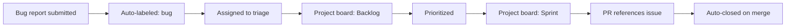
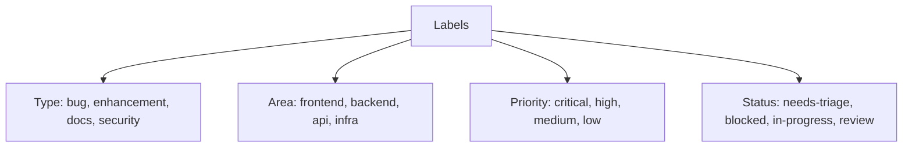

# Issues, Projects, and Automation

> [!summary] Goal
> Use lightweight workflow automation without creating process overhead: standardize issue reporting, organize work with projects, and automate common tasks.

## Table of Contents

1. [Why Issue Management Matters](#why-issue-management-matters)
2. [Issue Templates and Forms](#issue-templates-and-forms)
3. [Labels and Milestones](#labels-and-milestones)
4. [GitHub Projects (Beta)](#github-projects)
5. [GitHub CLI (`gh`)](#github-cli)
6. [Automation with GitHub Actions](#automation-with-github-actions)
7. [Pitfalls](#pitfalls)

---

## Why Issue Management Matters

Issues track bugs, features, and tasks. Projects organize them into workflows. Without structure, issues become noise and work becomes invisible.



---

## Issue Templates and Forms

### Bug report template

```yaml
# .github/ISSUE_TEMPLATE/bug_report.yml
name: Bug Report
description: File a bug report
title: "[Bug]: "
labels: ["bug", "triage"]
body:
  - type: markdown
    attributes:
      value: |
        Thanks for taking the time to fill out this bug report!
  - type: textarea
    id: what-happened
    attributes:
      label: What happened?
      description: A clear description of the bug
    validations:
      required: true
  - type: dropdown
    id: version
    attributes:
      label: Version
      options:
        - 1.0.0
        - 1.1.0
        - 2.0.0
    validations:
      required: true
  - type: textarea
    id: logs
    attributes:
      label: Relevant log output
      render: shell
```

### Feature request

```yaml
name: Feature Request
description: Suggest an idea
title: "[Feature]: "
labels: ["enhancement"]
body:
  - type: textarea
    id: problem
    attributes:
      label: What problem does this solve?
    validations:
      required: true
  - type: textarea
    id: solution
    attributes:
      label: Proposed solution
    validations:
      required: true
```

---

## Labels and Milestones



### Common label conventions

| Label | Description | Color |
|-------|-------------|-------|
| `bug` | Something isn't working | `#d73a4a` |
| `enhancement` | New feature | `#a2eeef` |
| `documentation` | Docs improvements | `#0075ca` |
| `security` | Security issue | `#b60205` |
| `critical` | Immediate attention | `#b60205` |
| `good first issue` | Good for newcomers | `#7057ff` |

### Milestones

Milestones group issues for a specific release:

```bash
gh api repos/:owner/:repo/milestones --field title="v1.2.0" --field description="Feature release" --field due_on="2026-06-01T00:00:00Z"
```

---

## GitHub Projects (Beta)

### Views

| View | Best for |
|------|----------|
| **Table** | Spreadsheet-style work tracking |
| **Board** | Kanban: To Do → In Progress → Done |
| **Roadmap** | Timeline for releases and milestones |

### Automation

```
When: Issue/PR added to project
If: labels contains "critical"
Set: Priority = Critical, Status = In Progress

When: PR merged
If: linked issue
Set: Status = Done
```

---

## GitHub CLI (`gh`)

### Authentication

```bash
gh auth login
gh auth status
```

### Issue commands

```bash
gh issue create --label bug --assign @me
gh issue list --label critical --state open
gh issue view 42 --comments
gh issue close 42
```

### PR commands

```bash
gh pr create --fill --draft
gh pr review 123 --approve --body "LGTM"
gh pr merge 123 --squash --auto
gh pr list --review-requested @me
```

### Workflow commands

```bash
gh run list --limit 10 --branch main
gh run view 12345 --log
gh run watch 12345
gh run rerun 12345
gh workflow run deploy.yml --ref main -f env=staging
```

### Release commands

```bash
gh release create v1.2.3 --generate-notes
gh release upload v1.2.3 ./dist/app.tar.gz
```

---

## Automation with GitHub Actions

### Auto-label on issue creation

```yaml
name: Issue Triage
on:
  issues:
    types: [opened]
jobs:
  triage:
    runs-on: ubuntu-latest
    permissions:
      issues: write
    steps:
      - uses: actions/github-script@v7
        with:
          script: |
            const labels = ['needs-triage'];
            await github.rest.issues.addLabels({
              owner: context.repo.owner,
              repo: context.repo.repo,
              issue_number: context.issue.number,
              labels
            });
```

### Close issues from merged PRs

```yaml
on:
  pull_request:
    types: [closed]
jobs:
  close:
    if: github.event.pull_request.merged == true
    runs-on: ubuntu-latest
    permissions:
      issues: write
    steps:
      - uses: actions/github-script@v7
        with:
          script: |
            const body = context.payload.pull_request.body;
            const match = body?.match(/(?:close|fix|resolve)s?\s+#(\d+)/i);
            if (match) {
              await github.rest.issues.update({
                owner: context.repo.owner,
                repo: context.repo.repo,
                issue_number: parseInt(match[1]),
                state: 'closed'
              });
            }
```

---

## Pitfalls

### Label rot

Unused labels accumulate, conventions drift.

**Fix**: Review labels quarterly. Archive unused. Document in `.github/labels.yml`.

### Manual board maintenance

If status requires manual updates, it falls out of sync.

**Fix**: Use automation rules tied to PR lifecycle. Keep WIP limits visible.

### Notification overload

Too many auto-assignments and auto-comments create noise.

**Fix**: Automate only when human action is required. Use `triage` label to batch notifications.

---

> [!question]- Interview Questions
>
> **Q: How do you auto-close an issue when a PR is merged?**
> A: Include `Closes #123`, `Fixes #123`, or `Resolves #123` in the PR description. GitHub auto-closes on merge.
>
> **Q: What are the three GitHub Project view types?**
> A: Table (spreadsheet), Board (Kanban), and Roadmap (timeline).

---

## Cross-Links

- [[CICD/GitHub/01_Foundations/01_Repo_Workflows_and_PRs]] for PR lifecycle
- [[CICD/GitHubActions/01_Foundations/01_Workflow_Syntax_and_Triggers]] for issue-based triggers

---

## References

- [About Issues](https://docs.github.com/en/issues/tracking-your-work-with-issues/about-issues)
- [About Projects](https://docs.github.com/en/issues/planning-and-tracking-with-projects/learning-about-projects/about-projects)
- [GitHub CLI Manual](https://cli.github.com/manual/)
