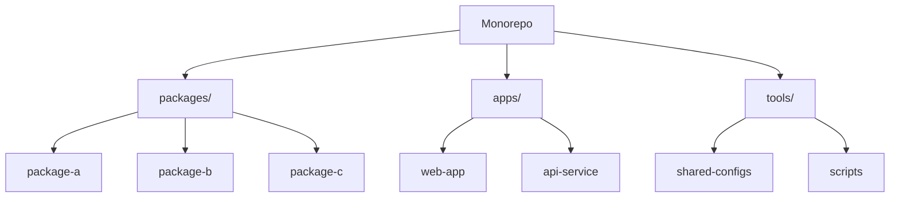
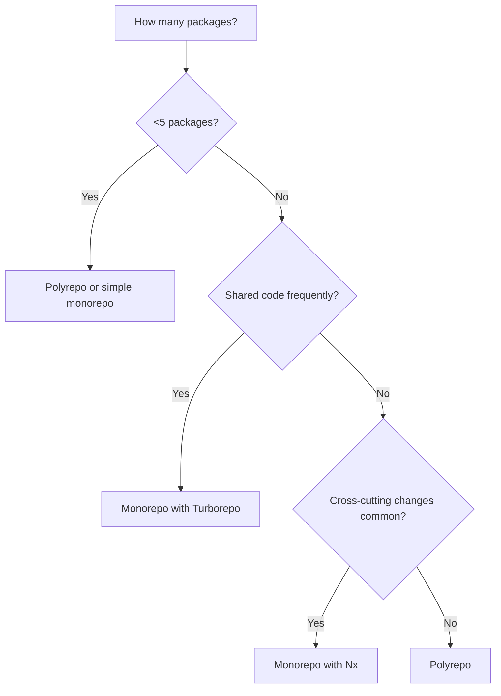
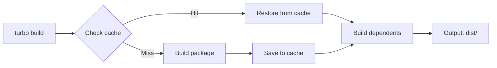
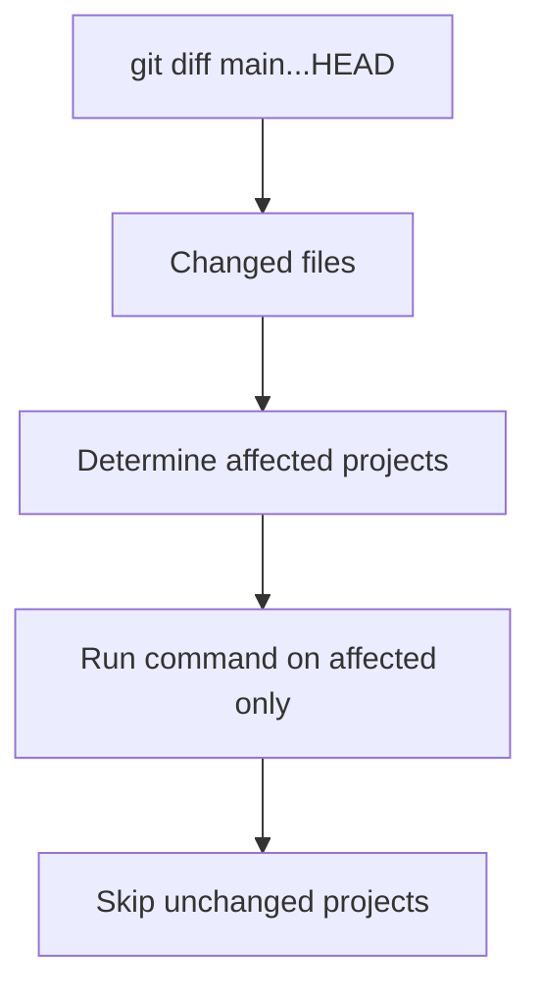
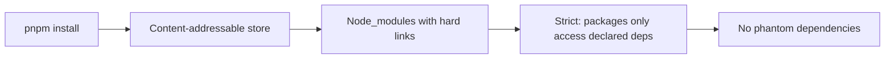
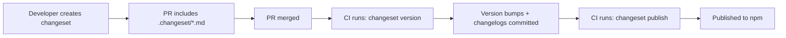

# Monorepo Strategies and Repo Scaling

> [!summary] Goal
> Keep developer velocity high as the codebase grows: choose the right monorepo tools, scope CI to changed packages, and manage versioning across a multi-package repository.

## Table of Contents

1. [Why Monorepo Patterns Matter](#why-monorepo-patterns-matter)
2. [Monorepo vs Polyrepo](#monorepo-vs-polyrepo)
3. [Turborepo](#turborepo)
4. [Nx](#nx)
5. [pnpm Workspaces](#pnpm-workspaces)
6. [Changesets for Versioning](#changesets-for-versioning)
7. [CI Scoping for Monorepos](#ci-scoping-for-monorepos)
8. [Code Ownership per Package](#code-ownership-per-package)
9. [Pitfalls](#pitfalls)

---

## Why Monorepo Patterns Matter

A monorepo (monolithic repository) contains multiple distinct projects in a single repository. Without tooling, CI becomes slow and ownership is unclear.



---

## Monorepo vs Polyrepo

| Aspect | Monorepo | Polyrepo (multi-repo) |
|--------|----------|----------------------|
| Code sharing | Shared packages within repo | Published packages |
| Dependency management | Single lockfile | N lockfiles |
| CI | Scoped to changed packages | Per-repo CI |
| Atomic changes | Cross-package changes in one PR | Multiple PRs across repos |
| Tooling | Turborepo, Nx, Lerna | Standard package managers |
| Access control | CODEOWNERS per path | Per-repo permissions |

### Decision flowchart



---

## Turborepo

Turborepo is a high-performance build system for monorepos. It caches task outputs and parallelizes execution.

### Setup

```bash
npm install -D turbo
```

```json
// turbo.json
{
  "$schema": "https://turbo.build/schema.json",
  "pipeline": {
    "build": {
      "dependsOn": ["^build"],
      "outputs": ["dist/**", ".next/**"],
      "cache": true
    },
    "test": {
      "dependsOn": ["build"],
      "inputs": ["src/**/*.ts", "src/**/*.tsx"]
    },
    "lint": {
      "outputs": []
    },
    "dev": {
      "cache": false,
      "persistent": true
    }
  }
}
```

### Key concepts

| Concept | Description |
|---------|-------------|
| `pipeline` | Defines task dependencies and caching rules |
| `dependsOn` | `^build` = build all dependencies first, then this package |
| `outputs` | Files that are cached (restored on cache hit) |
| `inputs` | Files that determine cache invalidation |
| Remote caching | Share cache across CI and local machines |

### Running tasks

```bash
npx turbo build                       # build all packages
npx turbo test --filter=@myapp/web    # test only web app
npx turbo lint --filter=[main]        # lint packages changed from main
npx turbo build --force               # force rebuild (ignore cache)
```

### `turbo.json` pipeline execution flow



---

## Nx

Nx is a build system with advanced dependency graph analysis and affected-command detection.

### Setup

```bash
npx add -D @nx/workspace
```

```json
// nx.json
{
  "targetDefaults": {
    "build": {
      "dependsOn": ["^build"],
      "inputs": ["production", "^production"]
    },
    "test": {
      "inputs": ["default", "^default"]
    }
  },
  "affected": {
    "defaultBase": "main"
  }
}
```

### Key concepts

| Concept | Description |
|---------|-------------|
| **Affected** | Detects packages changed from base branch |
| **Dependency graph** | `nx graph` — visualizes package relationships |
| **Computation hashing** | Determines cache keys from inputs |
| **Target dependencies** | Declares inter-task dependencies |

### Commands

```bash
nx build my-app                    # build a specific app
nx affected:test                   # test packages affected by current changes
nx graph                           # visualize dependency graph
nx run-many --target=build         # build all
nx affected:lint --parallel=5     # lint affected in parallel
```

### Nx affected detection



---

## pnpm Workspaces

pnpm uses content-addressable storage and strict dependency isolation.

```yaml
# pnpm-workspace.yaml
packages:
  - "apps/*"
  - "packages/*"
```

### Key commands

```bash
pnpm install                         # install all workspace dependencies
pnpm --filter @myapp/web add react   # add dep to specific package
pnpm --filter @myapp/web build       # run script in specific package
pnpm deploy packagedir               # create deployment bundle
```



---

## Changesets for Versioning

Changesets manage versioning and changelog generation across a monorepo.

### Setup

```bash
pnpm add -DW @changesets/cli
pnpm changeset init
```

### Workflow

```bash
# Step 1: Developer creates a changeset
pnpm changeset
# Prompts: which packages? what bump? (major/minor/patch)
# Creates: .changeset/brave-lizards-wobble.md

# Step 2: Version all packages
pnpm changeset version
# Bumps versions, generates/updates changelogs

# Step 3: Publish
pnpm changeset publish
```



### GitHub Action for changesets

```yaml
name: Release
on:
  push:
    branches: [main]
jobs:
  release:
    runs-on: ubuntu-latest
    steps:
      - uses: actions/checkout@v4
      - uses: pnpm/action-setup@v2
      - run: pnpm install
      - uses: changesets/action@v1
        with:
          publish: pnpm changeset publish
        env:
          GITHUB_TOKEN: ${{ secrets.GITHUB_TOKEN }}
          NPM_TOKEN: ${{ secrets.NPM_TOKEN }}
```

---

## CI Scoping for Monorepos

Run CI only on packages affected by the changes.

### With Turborepo

```yaml
jobs:
  ci:
    runs-on: ubuntu-latest
    steps:
      - uses: actions/checkout@v4
        with:
          fetch-depth: 0
      - run: npx turbo test lint --filter=[main]
```

### With Nx

```yaml
jobs:
  ci:
    runs-on: ubuntu-latest
    steps:
      - uses: actions/checkout@v4
        with:
          fetch-depth: 0
      - run: npx nx affected -t lint test --base=main
```

### Without tools — git diff

```yaml
jobs:
  detect-changes:
    runs-on: ubuntu-latest
    outputs:
      packages: ${{ steps.diff.outputs.packages }}
    steps:
      - uses: actions/checkout@v4
        with:
          fetch-depth: 0
      - id: diff
        run: |
          CHANGED=$(git diff --name-only origin/main...HEAD | cut -d/ -f2 | sort -u | jq -R -s -c 'split("\n")[:-1]')
          echo "packages=$CHANGED" >> $GITHUB_OUTPUT
```

---

## Code Ownership per Package

```yaml
# .github/CODEOWNERS
# Root level
* @core-team

# Package ownership
/packages/ui/ @frontend-team
/packages/api/ @backend-team
/packages/shared/ @core-team

# App ownership
/apps/web/ @frontend-team
/apps/api/ @backend-team

# CI/CD shared across all
/.github/ @devops-team
```

---

## Pitfalls

### Circular dependencies

```json
{
  "dependencies": {
    "package-a": "workspace:*",
    "package-b": "workspace:*"
  }
}
```

If package-a depends on package-b and package-b depends on package-a, builds fail.

**Fix**: Use `nx graph` to detect cycles. Extract shared dependency into a base package.

### Slow CI from full rebuilds

Running build/test on all packages for every change wastes time and money.

**Fix**: Use Turborepo/Nx to scope CI to changed packages. Cache node_modules per package.

### Tool migration friction

Moving from Lerna to Nx or from yarn workspaces to pnpm requires changing every developer's workflow.

**Fix**: Phase migration over 2-3 weeks. Keep both tools working during transition.

---

> [!question]- Interview Questions
>
> **Q: What is the difference between Turborepo and Nx?**
> A: Both provide task orchestration and caching for monorepos. Turborepo is simpler with focus on caching. Nx offers advanced dependency graph analysis and `affected` command detection.
>
> **Q: How do Changesets work?**
> A: Developers run `pnpm changeset` to declare version bumps per package. On merge, `changeset version` applies bumps and generates changelogs. `changeset publish` publishes to npm.
>
> **Q: How do you scope CI to changed packages?**
> A: Use Turborepo's `--filter=[main]`, Nx's `nx affected`, or manual `git diff` to detect changed files and run commands only on affected packages.

---

## Cross-Links

- [[CICD/GitHub/02_Core/01_CODEOWNERS_and_Access_Control]] for per-package CODEOWNERS
- [[CICD/GitHubActions/01_Foundations/03_Caching_and_Matrix_Builds]] for CI caching strategies
- [[CICD/GitHubActions/01_Foundations/01_Workflow_Syntax_and_Triggers]] for monorepo CI workflow triggers

---

## References

- [Turborepo](https://turbo.build/repo/docs)
- [Nx](https://nx.dev/getting-started/intro)
- [pnpm Workspaces](https://pnpm.io/workspaces)
- [Changesets](https://github.com/changesets/changesets)
- [Monorepo Patterns (Nx)](https://nx.dev/concepts/decisions/why-monorepos)
