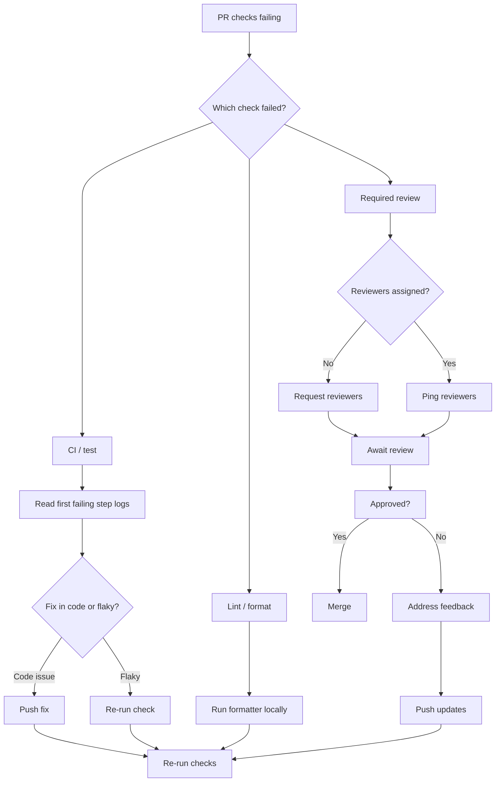

# Playbook: Handle Failing Checks and Required Reviews

> [!summary] Goal
> Unblock merges safely without disabling guardrails — systematically identify root causes of failing checks and resolve review bottlenecks.

## Table of Contents

1. [Systematic Triage Workflow](#systematic-triage-workflow)
2. [Reading Logs and Debugging](#reading-logs-and-debugging)
3. [Common Failure Patterns](#common-failure-patterns)
4. [Re-run Strategies](#re-run-strategies)
5. [Resolving Review Bottlenecks](#resolving-review-bottlenecks)

---

## Systematic Triage Workflow



---

## Reading Logs and Debugging

### Expand step logs

Each workflow step has collapsible log output. The first failing step's logs are expanded by default.

```
Run npm test
  > app@1.0.0 test
  > vitest run

  ❌ should fetch user data
    AssertionError: expected 404 to equal 200
    ❱ src/api.test.ts:42:3
```

### Enable debug logging

Re-run the workflow with debug logging enabled:

```bash
# Re-run with debug
gh run rerun <run-id> --debug

# Or set secret
# Set ACTIONS_STEP_DEBUG=true as a repository secret
```

### Debug logging output

```
##[debug]Evaluating condition for step: 'Run tests'
##[debug]Evaluating: success()
##[debug]Result: true
##[debug]Starting: Run tests
```

---

## Common Failure Patterns

| Pattern | Symptom | Likely cause | Fix |
|---------|---------|-------------|-----|
| Permission denied | `Error: Resource not accessible by integration` | `GITHUB_TOKEN` lacks scope | Add `permissions:` to workflow |
| Cache miss | Cache not found — builds from scratch | Cache key changed | Check lockfile hash, restore-keys |
| OOM | `Process completed with exit code 137` | Runner ran out of memory | Split test files, reduce parallelism |
| Network timeout | `Error: ETIMEDOUT` | External service slow | Add retry, use `continue-on-error` |
| Flaky test | Fails intermittently, no code change | Test order dependency, timing | Add retry, quarantine test |
| Secrets not found | `Error: secret is required but not set` | Secret not created | Create secret in repo/org settings |
| YAML syntax | `Invalid workflow file` | YAML indentation | `yamllint` locally, validate online |
| Dependency install | `npm ERR! 404` | Package version removed | Pin exact versions, use lockfile |

---

## Re-run Strategies

| Method | When to use |
|--------|-------------|
| **Re-run all jobs** | Clean slate, all jobs start fresh |
| **Re-run failed jobs** | Only failed jobs re-run, successful job outputs preserved |
| **Re-run with debug** | Need detailed step logs |
| **Re-run from failed** | Specific job needs retry |

```yaml
# Re-run failed jobs via CLI
gh run rerun <run-id> --failed

# Re-run with debug
gh run rerun <run-id> --debug
```

---

## Resolving Review Bottlenecks

### Reviewers not assigned

```yaml
# Auto-request reviewers in CODEOWNERS
* @default-reviewers

# Or via PR template checklist
- [ ] Frontend review (@frontend-team)
- [ ] Backend review (@backend-team)
```

### Approvals stuck

1. Ping the assigned reviewers in the PR
2. Check if CODEOWNERS blocks (unowned path needs owner)
3. Check if stale approval dismissal requires re-review
4. If urgent and authorized, bypass protection (admin)

### Bypass with caution

```bash
# Admin: force merge (last resort)
gh pr merge <pr-number> --merge --admin
```

> [!warning] Bypassing protections should be rare and audited. Every bypass is logged in the audit log.

---

## Cross-Links

- [[CICD/GitHub/01_Foundations/02_Reviews_Checks_and_Branch_Protection]] for protection rules
- [[CICD/GitHubActions/01_Foundations/02_Jobs_Steps_Actions_and_Artifacts]] for job structure
- [[CICD/GitHubActions/04_Playbooks/01_Troubleshoot_Failing_Workflow]] for Actions-specific debugging
