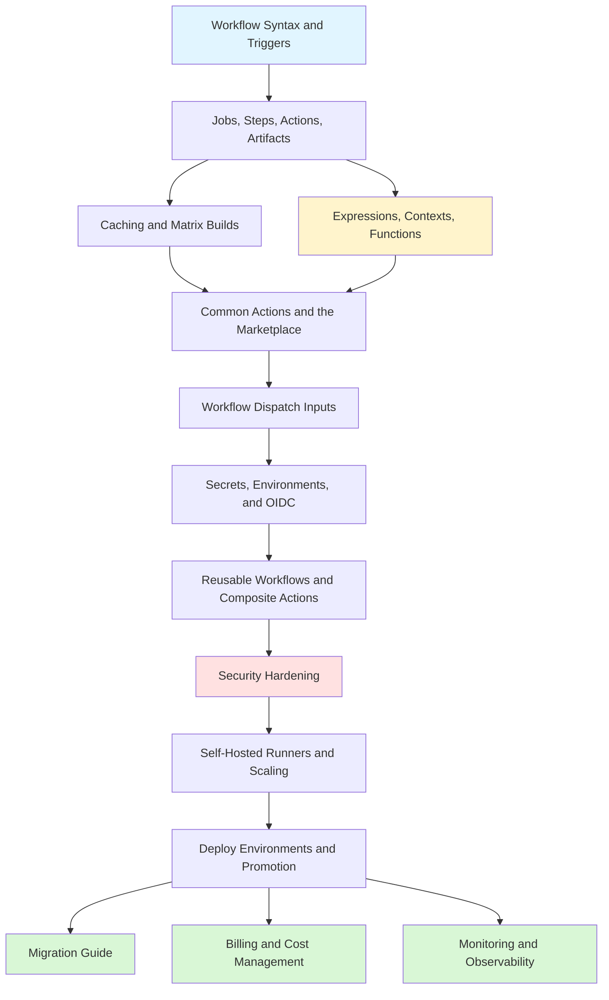

# GitHub Actions

> [!summary] Scope
> Automate CI/CD with GitHub Actions: workflow syntax and triggers, jobs and steps, caching and matrix builds, expressions and contexts, common actions, workflow dispatch inputs, secrets and OIDC, reusable workflows, security hardening, self-hosted runners, deployment strategies, migration, billing, monitoring, and troubleshooting.

## Learning Path

## Topic Map

### Foundations (6 files)

#### [[CICD/GitHubActions/01_Foundations/01_Workflow_Syntax_and_Triggers]]
- All 18+ trigger events with use cases and activity type filtering
- Concurrency groups, permissions scoping, `GITHUB_TOKEN` defaults
- `pull_request` vs `pull_request_target` security comparison
- Environment protection rules

#### [[CICD/GitHubActions/01_Foundations/02_Jobs_Steps_Actions_and_Artifacts]]
- Job dependencies with `needs:`, status functions (`success()`, `failure()`, `always()`)
- Runner specs comparison, conditional execution (`if:`), step options
- Job outputs for cross-job data passing
- Matrix strategies with `include`/`exclude`/`fail-fast`/`max-parallel`
- Artifact upload/download with retention and patterns

#### [[CICD/GitHubActions/01_Foundations/03_Caching_and_Matrix_Builds]]
- `actions/cache` key resolution (exact → prefix → miss)
- Built-in `setup-*` cache vs `actions/cache` comparison
- Per-language cache paths reference table (12+ languages)
- Monorepo caching strategies
- Matrix `include`/`exclude` deep dive with dynamic matrix from JSON

#### [[CICD/GitHubActions/01_Foundations/04_Expressions_Contexts_and_Functions]]
- `${{ }}` syntax and expression evaluation
- Full context reference: `github.*` (20+ properties), `steps.*`, `needs.*`, `env.*`, `vars.*`, `matrix.*`, `runner.*`
- All 12 built-in functions with signatures and examples
- Status check functions truth table, object filters, context availability matrix

#### [[CICD/GitHubActions/01_Foundations/05_Common_Actions_and_the_Marketplace]]
- `actions/checkout` parameters deep dive
- `setup-node`/`setup-python`/`setup-java`/`setup-go` reference
- Docker actions: login, build/push, setup-buildx, QEMU multi-arch, build attestation
- Cloud auth: AWS OIDC, GCP workload identity, Azure federated credentials
- `codeql-action` deep dive, `dependency-review-action`, service containers
- Dependabot config for Actions, notification actions (Slack, GitHub Script)
- Action version pinning best practices (SHA vs major tag)

#### [[CICD/GitHubActions/01_Foundations/06_Workflow_Dispatch_Inputs_and_Manual_Triggers]]
- All input types: `string`, `number`, `boolean`, `choice`, `environment`
- Multi-parameter deploy workflow with full YAML example
- `repository_dispatch` for external triggers
- CLI dispatch: `gh workflow run`

### Core (2 files)

#### [[CICD/GitHubActions/02_Core/01_Secrets_Environments_and_OIDC]]
- Secret types: repo-level, environment-level, org-level with precedence diagram
- `GITHUB_TOKEN` deep dive: permissions scoping, all 15 scope reference, vs PAT vs GitHub App
- OIDC architecture with sequence diagram
- AWS/GCP/Azure OIDC setup with IAM trust policies and workflow examples
- `vars` vs `secrets` comparison table

#### [[CICD/GitHubActions/02_Core/02_Reusable_Workflows_and_Composite_Actions]]
- Reusable workflow inputs (types: string, number, boolean, choice) and secrets passing
- Composite action anatomy with `action.yml` metadata
- Reusable vs composite decision flowchart with 8-row comparison table
- Versioning reusable workflows, testing with `act`

### Advanced (2 files)

#### [[CICD/GitHubActions/03_Advanced/01_SelfHosted_Runners_and_Scaling]]
- Self-hosted vs GitHub-hosted decision flowchart
- GitHub-hosted runner specs table (all OS variants)
- Runner groups, labels, ARC autoscaling on Kubernetes, Terraform EC2
- Ephemeral runners, macOS/Windows setup, network security VPC design
- Runner health monitoring metrics, cleanup automation

#### [[CICD/GitHubActions/03_Advanced/02_Actions_Security_Hardening]]
- Principle of least privilege for tokens, all 15 permission scopes table
- Supply chain attack prevention, SHA pinning, lockfile verification
- Build attestation with `attest-build-provenance` + SLSA levels
- `pull_request_target` security patterns (safe vs dangerous)
- Secret exposure prevention, Dependabot config
- CodeQL + dependency review, security checklist (20+ items)

### Playbooks (5 files)

#### [[CICD/GitHubActions/04_Playbooks/01_Troubleshoot_Failing_Workflow]]
- Systematic triage decision tree with 10 failure patterns
- REST API for debugging, webhook payload analysis
- Runner diagnostics, network debugging inside runners
- `act` local runner, re-run strategies

#### [[CICD/GitHubActions/04_Playbooks/02_Deploy_Environments_and_Promotion_Strategies]]
- CI/CD pipeline phases, environment promotion flow
- Blue/green deploy with traffic switching
- Canary deploy with gradual traffic increase
- Rollback automation, Helm/Kustomize deploy, serverless with Lambda

#### [[CICD/GitHubActions/04_Playbooks/03_Migrating_to_GitHub_Actions]]
- Concept mapping: Jenkins, CircleCI, Travis CI, GitLab CI (20+ row table)
- Full migration workflows with before/after YAML for each tool
- Common migration mistakes and fixes (10 items)

#### [[CICD/GitHubActions/04_Playbooks/04_Actions_Billing_and_Cost_Management]]
- Free tier limits, OS multipliers, artifact/cache storage costs
- Cost estimation formula with worked example
- 5 cost reduction strategies with YAML for each
- Setting spending limits, monitoring usage via API

#### [[CICD/GitHubActions/04_Playbooks/05_Actions_Monitoring_and_Observability]]
- Metrics to track: success rate, p50/p95, queue time, cache hit rate
- Notification decision tree, Slack alerts, GitHub issues
- Status badges, third-party integrations (Datadog, custom metrics)
- Duration anomaly detection, `workflow_run` chained monitoring

### Projects (1 file)

#### [[CICD/GitHubActions/05_Projects/01_Secure_Deploy_to_AWS_with_OIDC]]
- Full end-to-end: Terraform IAM role → trust policy → workflow → ECS deploy
- OIDC token exchange sequence diagram
- Verification: decode JWT, test locally

---

## Recommended Paths

| Path | Files | Target |
|------|-------|--------|
| **Quick Start** | 01, 02, 03, 06 | First pipeline in minutes |
| **Production CI** | 01-10 | Full CI/CD with security, deployment |
| **Advanced Ops** | 08, 09, 11, 12 | Self-hosted, security, monitoring |
| **Migration** | 01, 02, 04, 05, 13 | Moving from Jenkins/CircleCI/Travis/GitLab |
| **Cost Optimization** | 01, 03, 08, 14 | Reduce CI bills |

## Cross-Links

- [[CICD/GitHub/00_MOC/00_GitHub_MOC]] for branching, PRs, releases
- [[CICD/AWS/00_MOC/00_AWS_MOC]] for AWS deployment targets
- [[CICD/Docker/00_MOC/00_Docker_MOC]] for container build knowledge
- [[CICD/03_Advanced/01_Supply_Chain_Security_SLSA_Basics]] for SLSA framework

---

## References

- [GitHub Actions Documentation](https://docs.github.com/en/actions)
- [Workflow Syntax](https://docs.github.com/en/actions/using-workflows/workflow-syntax-for-github-actions)
- [GitHub Actions Contexts](https://docs.github.com/en/actions/learn-github-actions/contexts)
- [GitHub Actions Marketplace](https://github.com/marketplace?type=actions)
- [Security Hardening](https://docs.github.com/en/actions/security-guides/security-hardening-for-github-actions)
- [About Billing](https://docs.github.com/en/billing/managing-billing-for-github-actions/about-billing-for-github-actions)
