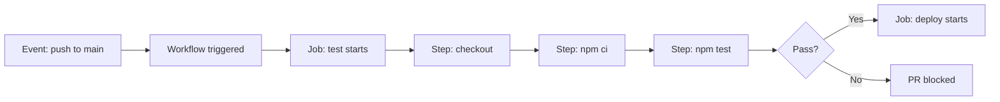
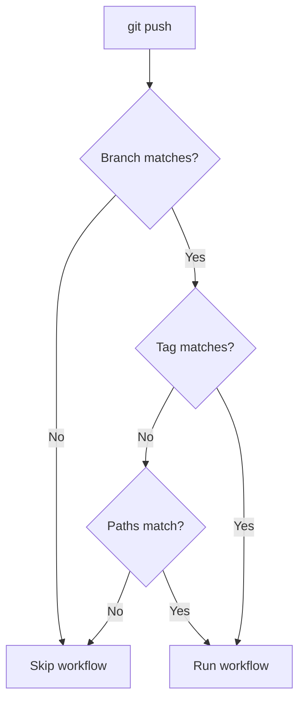
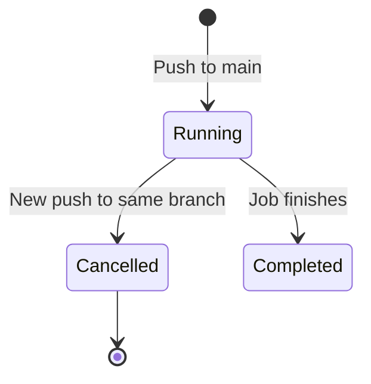
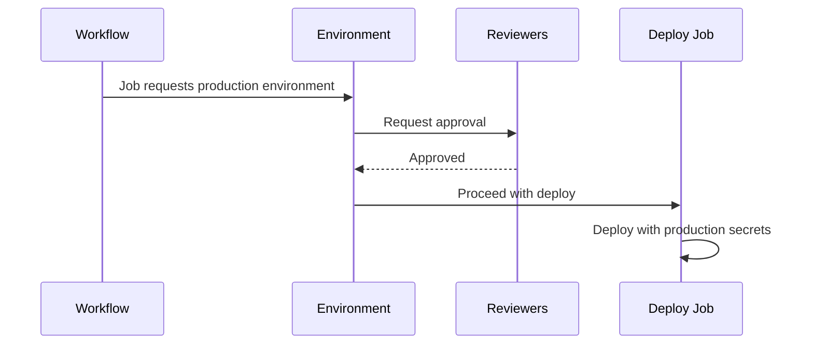

# Workflow Syntax and Triggers

> [!summary] Goal
> Define when workflows run using every GitHub event, filter by branch/path, set permissions correctly, and understand security boundaries between trigger types.

## Table of Contents

1. [Why Workflow Syntax Matters](#why-workflow-syntax-matters)
2. [Core Workflow Structure](#core-workflow-structure)
3. [Trigger Events — Complete Reference](#trigger-events-complete-reference)
4. [Activity Types and Filters](#activity-types-and-filters)
5. [Concurrency Groups](#concurrency-groups)
6. [Permissions and `GITHUB_TOKEN`](#permissions-and-githubtoken)
7. [Environment Protection](#environment-protection)
8. [`pull_request` vs `pull_request_target` Security](#pullrequest-vs-pullrequesttarget-security)
9. [Pitfalls](#pitfalls)

---

## Why Workflow Syntax Matters

A **workflow** is an automated process defined in YAML that runs on GitHub Actions runners. Each workflow is triggered by one or more **events** — for example, a push to `main`, a PR being opened, or a schedule.



---

## Core Workflow Structure

```yaml
# .github/workflows/ci.yml
name: CI
run-name: "CI ${{ github.ref_name }} by ${{ github.actor }}"

on:
  pull_request:
  push:
    branches: [main]

permissions:
  contents: read

jobs:
  test:
    runs-on: ubuntu-latest
    steps:
      - uses: actions/checkout@v4
      - run: npm ci
      - run: npm test
```

| Element | Purpose | Required |
|---------|---------|----------|
| `name` | Display name in Actions UI | No (defaults to path) |
| `run-name` | Description shown per-run | No |
| `on` | Trigger events | **Yes** |
| `permissions` | Default `GITHUB_TOKEN` scopes | No |
| `jobs` | Work units | **Yes** |

---

## Trigger Events — Complete Reference

### Branch and PR events

| Event | When it fires | Common use |
|-------|-------------|------------|
| `push` | Branch or tag created/pushed | CI on every push |
| `pull_request` | PR opened/synchronized/reopened | PR checks |
| `pull_request_target` | PR event in base repo context | PR with secret access |
| `pull_request_review` | PR reviewed | Merge gate |

### Manual and scheduled events

| Event | When it fires | Common use |
|-------|-------------|------------|
| `workflow_dispatch` | Manual trigger via UI or CLI | Manual deploy, ad-hoc tasks |
| `schedule` | Cron schedule | Nightly builds, housekeeping |
| `repository_dispatch` | External API call | Webhook from external system |

### Issue and discussion events

| Event | When it fires | Common use |
|-------|-------------|------------|
| `issues` | Issue created/closed/edited | Auto-label, triage |
| `issue_comment` | Comment on issue or PR | Auto-respond |
| `discussion` | Discussion created/edited | Moderation |

### Release and deployment events

| Event | When it fires | Common use |
|-------|-------------|------------|
| `release` | Release published/edited | Build and publish artifacts |
| `deployment` | Deployment created | CD pipeline trigger |
| `deployment_status` | Deployment state changes | Post-deploy checks |

### Other events

| Event | When it fires | Common use |
|-------|-------------|------------|
| `workflow_run` | Another workflow completes | Chained workflows |
| `registry_package` | Package published | Post-publish hook |
| `page_build` | GitHub Pages builds | Deploy Pages |
| `status` | Commit status changes | Notifications |
| `watch` | Repo starred | Social proof |

---

## Activity Types and Filters

### PR activity types

```yaml
on:
  pull_request:
    types:
      - opened
      - synchronize    # new commits pushed
      - reopened
      - closed
      - ready_for_review   # draft → ready
      - converted_to_draft
      - auto_merge_enabled
```

### Branch and path filters

```yaml
on:
  push:
    branches:
      - main
      - "release/*"       # glob pattern
      - "!release/old-*"  # exclude
    tags:
      - "v*"              # only version tags
    paths:
      - "src/**"          # only src changes
      - "!src/test/**"    # exclude test files
      - "*.md"             # only markdown
```



### Scheduling

```yaml
on:
  schedule:
    - cron: "0 6 * * 1"     # 6 AM UTC every Monday
    - cron: "0 0 * * *"      # midnight daily
```

---

## Concurrency Groups

Concurrency ensures only one workflow run per group happens at a time:

```yaml
concurrency:
  group: ${{ github.workflow }}-${{ github.ref }}
  cancel-in-progress: true
```



| Pattern | Effect |
|---------|--------|
| `github.ref` | Per-branch concurrency |
| `github.event_name` | Per-event concurrency |
| `github.workflow` | Per-workflow concurrency |
| `github.ref_name` | Branch/tag name only |

```yaml
# Per-environment deployment concurrency
concurrency:
  group: deploy-${{ github.ref_name }}
  cancel-in-progress: false   # don't cancel in-flight deploys
```

---

## Permissions and `GITHUB_TOKEN`

Every workflow run gets a `GITHUB_TOKEN` with scoped permissions.

### Default permissions

```yaml
# Minimal: read contents, write issues/pull requests
permissions:
  contents: read
  issues: write
  pull-requests: write
```

### All permission scopes

| Scope | `read` | `write` | Use |
|-------|--------|---------|-----|
| `actions` | List/workflow artifacts | Manage | Manage Actions |
| `checks` | View check runs | Create | Status checks |
| `contents` | Clone repo | Push | **CI fundamental** |
| `deployments` | View | Create | CD pipelines |
| `id-token` | — | Request OIDC JWT | OIDC auth |
| `issues` | View | Create/edit | Issue automation |
| `packages` | Download | Publish | Container registry |
| `pull-requests` | View | Create/edit | PR automation |
| `security-events` | View | Upload | CodeQL |
| `statuses` | View | Create | Commit statuses |

```yaml
# Production deploy — narrowest possible
permissions:
  contents: read
  id-token: write   # for OIDC
  deployments: write
```

---

## Environment Protection

```yaml
jobs:
  deploy:
    runs-on: ubuntu-latest
    environment:
      name: production
      url: https://app.example.com
```

Environments provide:
- **Required reviewers** (1-5 people who must approve)
- **Wait timer** (delay before deploy)
- **Deployment branch policy** (only specific branches)
- **Environment secrets** (scoped, not available in other jobs)



---

## `pull_request` vs `pull_request_target` Security

| Aspect | `pull_request` | `pull_request_target` |
|--------|---------------|----------------------|
| **Checkout ref** | Merge commit of PR head | Base branch (default) |
| **GITHUB_TOKEN context** | PR head repo | Base repo |
| **Secrets accessible** | No | **Yes** |
| **Run untrusted code** | Safe (sandboxed) | **Dangerous** |
| **Use case** | Running tests | Labeling, commenting |

### Safe `pull_request_target` pattern

```yaml
# SAFE: Checkout the base branch, not the PR
on: pull_request_target
jobs:
  label:
    runs-on: ubuntu-latest
    permissions:
      pull-requests: write
    steps:
      - uses: actions/labeler@v5  # runs base branch code
```

```yaml
# DANGEROUS: Never checkout and run PR code with secrets
on: pull_request_target
jobs:
  unsafe:
    runs-on: ubuntu-latest
    steps:
      - uses: actions/checkout@v4  # ❌ CHECKOUTS PR HEAD WITH SECRETS!
      - run: npm ci && npm test    # ❌ RUNS PR'S CODE WITH SECRETS!
```

---

## Pitfalls

### Event not triggering from branch filter

```yaml
on:
  push:
    branches: [main, develop]
# Push to `feature/xyz` won't trigger
```

**Fix**: Check branch filter logic. Use `branches-ignore` for exclusion.

### `schedule` events delayed

Scheduled workflows run on a best-effort basis and may be delayed by minutes.

**Fix**: Don't rely on exact timing. Use `workflow_dispatch` for time-sensitive tasks.

### `pull_request_target` security hole

Running untrusted PR code with access to base repo secrets is the most common GitHub Actions vulnerability.

**Fix**: Only use `pull_request_target` when you do NOT checkout PR code, or checkout with `ref: ${{ github.event.pull_request.head.sha }}` only after careful review.

### Concurrency blocking unrelated deploys

```yaml
concurrency: deploy  # ALL deploys share this group — blocks unrelated branches
```

**Fix**: Scope concurrency to branch: `group: deploy-${{ github.ref_name }}`.

---

> [!question]- Interview Questions
>
> **Q: What is the difference between `pull_request` and `pull_request_target`?**
> A: `pull_request` runs in the context of the PR head branch with no secret access. `pull_request_target` runs in the context of the base repo with secret access. Use `pull_request_target` only for label/comment actions, never for checking out and running PR code.
>
> **Q: How does `concurrency` work?**
> A: `concurrency.group` creates a named group. Only one run per group proceeds at a time. `cancel-in-progress: true` cancels the previous run in the same group.
>
> **Q: What is the `GITHUB_TOKEN`?**
> A: A temporary token generated per workflow run with configurable permissions. Used to authenticate GitHub API calls within the workflow.
>
> **Q: What are environment protection rules?**
> A: Rules tied to an `environment:` that require approvals, enforce wait timers, restrict deployment branches, and scope secrets.

---

## Cross-Links

- [[CICD/GitHubActions/01_Foundations/04_Expressions_Contexts_and_Functions]] for `github.*` context and `${{ }}` syntax
- [[CICD/GitHubActions/02_Core/01_Secrets_Environments_and_OIDC]] for environment secrets
- [[CICD/GitHubActions/01_Foundations/02_Jobs_Steps_Actions_and_Artifacts]] for jobs and steps

---

## References

- [GitHub Actions Workflow Syntax](https://docs.github.com/en/actions/using-workflows/workflow-syntax-for-github-actions)
- [Events that Trigger Workflows](https://docs.github.com/en/actions/using-workflows/events-that-trigger-workflows)
- [Permissions for GITHUB_TOKEN](https://docs.github.com/en/actions/security-guides/automatic-token-authentication)
- [Security hardening for GitHub Actions](https://docs.github.com/en/actions/security-guides/security-hardening-for-github-actions)
