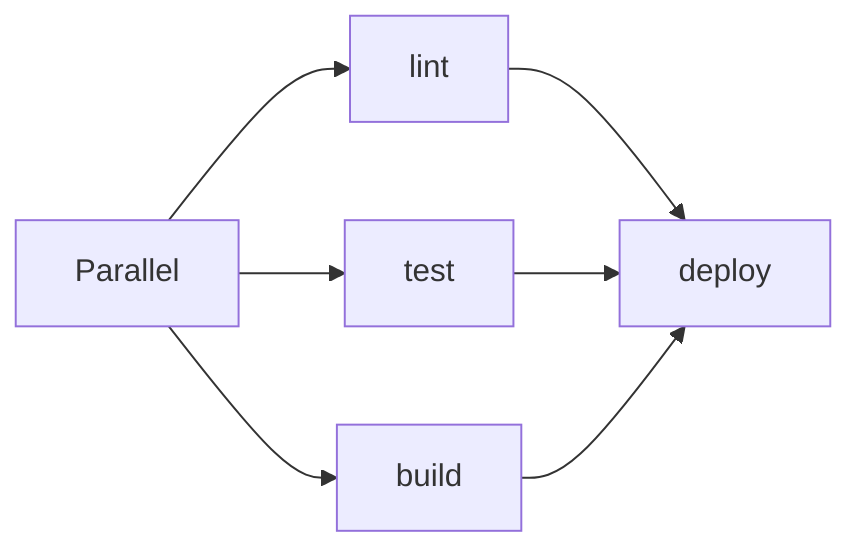
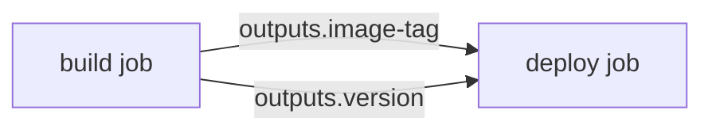
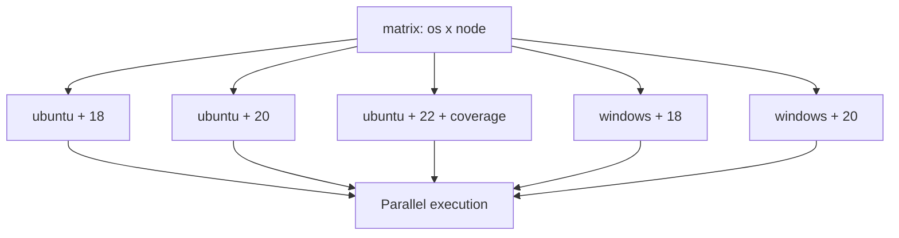
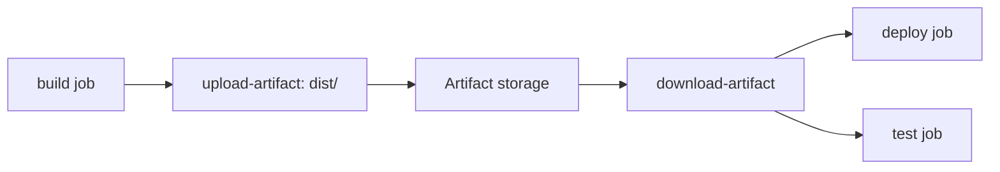

# Jobs, Steps, Actions, and Artifacts

> [!summary] Goal
> Structure workflows with job dependencies, conditional execution, matrix strategies, and artifact passing — so builds are reproducible and efficient.

## Table of Contents

1. [Jobs Overview](#jobs-overview)
2. [`needs` — Job Dependencies](#needs-job-dependencies)
3. [Running on Runners](#running-on-runners)
4. [Conditional Execution](#conditional-execution)
5. [Steps Deep Dive](#steps-deep-dive)
6. [Job Outputs](#job-outputs)
7. [Matrix Strategies Deep Dive](#matrix-strategies-deep-dive)
8. [Artifacts Deep Dive](#artifacts-deep-dive)
9. [Environment URLs](#environment-urls)
10. [Pitfalls](#pitfalls)

---

## Jobs Overview

Jobs are the top-level units of work in a workflow. They run in **parallel by default** and can be sequenced with `needs:`.

```yaml
jobs:
  lint:
    runs-on: ubuntu-latest
    steps:
      - run: echo "Linting..."

  test:
    runs-on: ubuntu-latest
    steps:
      - run: echo "Testing..."

  deploy:
    needs: [lint, test]
    runs-on: ubuntu-latest
    steps:
      - run: echo "Deploying..."
```



---

## `needs` — Job Dependencies

```yaml
jobs:
  build:
    runs-on: ubuntu-latest
    outputs:
      version: ${{ steps.set-version.outputs.version }}
    steps:
      - id: set-version
        run: echo "version=1.2.3" >> $GITHUB_OUTPUT

  test:
    needs: build
    runs-on: ubuntu-latest
    steps:
      - run: echo "Testing build ${{ needs.build.outputs.version }}"

  deploy:
    needs: [build, test]
    if: success()
    runs-on: ubuntu-latest
    steps:
      - run: echo "Deploying..."
```

### Status functions for `needs`

| Function | When it passes |
|----------|---------------|
| `success()` | All preceding jobs succeeded (default) |
| `failure()` | Any preceding job failed |
| `always()` | Always runs regardless of status |
| `cancelled()` | The workflow was cancelled |

```yaml
# Cleanup even on failure
cleanup:
  if: always()
  needs: [build, test, deploy]
  runs-on: ubuntu-latest
  steps:
    - run: echo "Cleaning up..."
```

---

## Running on Runners

### GitHub-hosted runner specs

| Runner | vCPU | RAM | Storage | Included software |
|--------|------|-----|---------|-------------------|
| `ubuntu-latest` (24.04) | 4 | 16 GB | 150 GB | Docker, Node, Python, Java, Go, .NET, Ruby |
| `ubuntu-22.04` | 4 | 16 GB | 150 GB | (older) |
| `windows-latest` (2022) | 4 | 16 GB | 150 GB | .NET, MSBuild, PowerShell |
| `macos-latest` (14) | 4 | 14 GB | 75 GB | Xcode, Homebrew |

### Custom runner selection

```yaml
jobs:
  test:
    runs-on:
      - self-hosted
      - linux
      - gpu
```

---

## Conditional Execution

```yaml
steps:
  - name: Run on push only
    if: github.event_name == 'push'
    run: echo "Pushed!"

  - name: Run if previous step failed
    if: failure()
    run: echo "Previous step failed!"

  - name: Run if specific step succeeded
    if: steps.check.outcome == 'success'
    run: echo "Check passed!"
```

### Conditional syntax reference

```yaml
# Truthiness
if: true                    # always runs
if: false                   # never runs
if: ${{ github.ref_name == 'main' }}

# Status functions
if: success()               # all previous succeeded
if: failure() && github.ref_name == 'main'
if: !cancelled()

# Step outputs
if: steps.build.outputs.status == 'ok'
```

---

## Steps Deep Dive

```yaml
steps:
  # Shell command
  - name: Run tests
    run: npm test
    shell: bash
    working-directory: ./app
    env:
      NODE_ENV: test
    continue-on-error: true
    timeout-minutes: 10

  # Use an action
  - name: Checkout code
    uses: actions/checkout@v4
    with:
      fetch-depth: 0
      ref: ${{ github.head_ref }}

  # Inline script
  - name: Multi-line script
    run: |
      echo "Line 1"
      echo "Line 2"
```

| Step option | Purpose |
|-------------|---------|
| `continue-on-error: true` | Job continues even if this step fails |
| `timeout-minutes` | Maximum time before step is killed |
| `working-directory` | Directory to run the step in |
| `shell` | Shell for `run:` commands (`bash`, `pwsh`, `python`) |
| `env` | Environment variables for this step only |

---

## Job Outputs

Pass values from one job to another:

```yaml
jobs:
  build:
    runs-on: ubuntu-latest
    outputs:
      image-tag: ${{ steps.tag.outputs.tag }}
      version: ${{ steps.version.outputs.v }}
    steps:
      - id: tag
        run: echo "tag=$(git rev-parse --short HEAD)" >> $GITHUB_OUTPUT
      - id: version
        run: echo "v=$(node -p "require('./package.json').version")" >> $GITHUB_OUTPUT

  deploy:
    needs: build
    runs-on: ubuntu-latest
    steps:
      - run: |
          echo "Deploying ${{ needs.build.outputs.image-tag }}"
          echo "Version ${{ needs.build.outputs.version }}"
```



---

## Matrix Strategies Deep Dive

```yaml
jobs:
  test:
    strategy:
      matrix:
        os: [ubuntu-latest, windows-latest]
        node: [18, 20, 22]
        include:
          - os: ubuntu-latest
            node: 22
            coverage: true    # extra field for this combination
        exclude:
          - os: windows-latest
            node: 22          # skip this combination
      fail-fast: true
      max-parallel: 4
    runs-on: ${{ matrix.os }}
    steps:
      - uses: actions/setup-node@v4
        with:
          node-version: ${{ matrix.node }}
      - run: npm ci && npm test
      - if: matrix.coverage
        run: npm run coverage
```

### Matrix expansion

```yaml
# These combinations:
# os: ubuntu-latest, node: 18
# os: ubuntu-latest, node: 20
# os: ubuntu-latest, node: 22 (+ coverage)
# os: windows-latest, node: 18
# os: windows-latest, node: 20
```



### Dynamic matrix from job output

```yaml
jobs:
  discover:
    runs-on: ubuntu-latest
    outputs:
      matrix: ${{ steps.set-matrix.outputs.matrix }}
    steps:
      - id: set-matrix
        run: |
          echo 'matrix={"node":[18,20,22],"os":["ubuntu-latest"]}' >> $GITHUB_OUTPUT

  build:
    needs: discover
    strategy:
      matrix: ${{ fromJSON(needs.discover.outputs.matrix) }}
    runs-on: ${{ matrix.os }}
    steps:
      - uses: actions/setup-node@v4
        with:
          node-version: ${{ matrix.node }}
      - run: npm ci && npm run build
```

---

## Artifacts Deep Dive

### Uploading

```yaml
- uses: actions/upload-artifact@v4
  with:
    name: build-output
    path: dist/
    if-no-files-found: warn
    retention-days: 90
    overwrite: true
```

| Option | Description |
|--------|-------------|
| `name` | Identifier for the artifact |
| `path` | File or directory to upload (can use glob) |
| `if-no-files-found` | `warn` (default), `error`, `ignore` |
| `retention-days` | Days to keep (max depends on plan) |
| `overwrite` | Replace artifact with same name |

### Downloading

```yaml
- uses: actions/download-artifact@v4
  with:
    name: build-output
    path: ./dist
```

### Multiple patterns

```yaml
# Upload multiple directories
- uses: actions/upload-artifact@v4
  with:
    name: outputs
    path: |
      dist/
      coverage/
      !dist/**/*.map       # exclude sourcemaps
```



---

## Environment URLs

```yaml
deploy:
  runs-on: ubuntu-latest
  environment:
    name: production
    url: https://app.example.com
  steps:
    - run: echo "Deployed!"
```

The `url` is displayed in the Actions UI and in deployment statuses.

---

## Pitfalls

### `continue-on-error` masking failures

When enabled, the step shows as neutral (yellow) — easy to miss during review.

**Fix**: Only use `continue-on-error` for non-critical steps (code analysis, notifications).

### Job output size limits

Job outputs are limited to 64KB total. Large outputs cause silent truncation.

**Fix**: Use artifacts for large data. Keep job outputs small.

### Matrix combinatorial explosion

```yaml
matrix:
  os: [ubuntu, windows, macos]           # 3
  node: [16, 18, 20, 22]                 # 4
  dep: [npm, pnpm, yarn]                 # 3
# Total: 3 × 4 × 3 = 36 jobs!
```

**Fix**: Use `max-parallel` and `exclude` to control. Consider whether all combinations are necessary.

### Artifact storage costs

Artifacts consume Actions storage quota (free: 500MB for public, 2GB for private repos).

**Fix**: Set `retention-days` on artifacts. Clean up unused artifacts.

---

> [!question]- Interview Questions
>
> **Q: How do jobs relate to each other in a workflow?**
> A: Jobs run in parallel by default. `needs:` creates dependencies. `success()`, `failure()`, and `always()` control conditional execution based on preceding job status.
>
> **Q: How do you pass values between jobs?**
> A: Use job outputs: `outputs:` in the source job defines named outputs. `needs.<job>.outputs.<name>` in the dependent job reads them.
>
> **Q: What is a matrix build?**
> A: A strategy that runs the same job with different parameter combinations (OS, language version, etc.). Use `include`/`exclude` to customize specific entries.

---

## Cross-Links

- [[CICD/GitHubActions/01_Foundations/01_Workflow_Syntax_and_Triggers]] for workflow structure
- [[CICD/GitHubActions/01_Foundations/03_Caching_and_Matrix_Builds]] for caching strategies
- [[CICD/GitHubActions/01_Foundations/05_Common_Actions_and_the_Marketplace]] for action references

---

## References

- [GitHub Actions Workflow Syntax](https://docs.github.com/en/actions/using-workflows/workflow-syntax-for-github-actions)
- [Using Artifacts](https://docs.github.com/en/actions/using-workflows/storing-workflow-data-as-artifacts)
- [Using Conditions](https://docs.github.com/en/actions/using-workflows/workflow-syntax-for-github-actions#jobsjob_idif)
