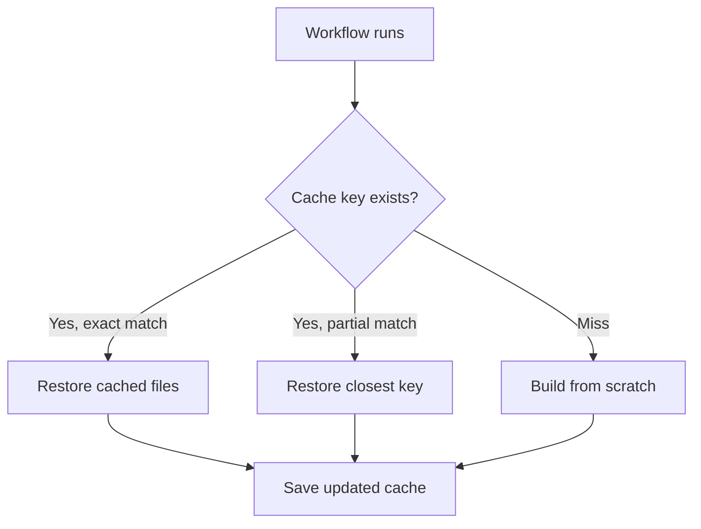
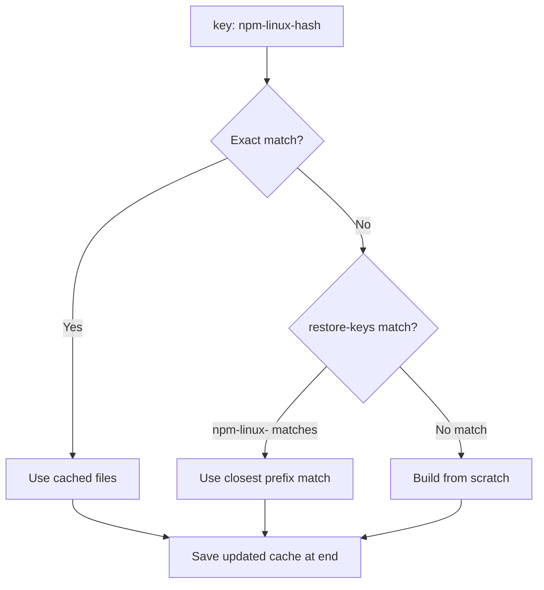

# Caching and Matrix Builds

> [!summary] Goal
> Speed up CI with smart caching and test across environments without duplicating workflow code.

## Table of Contents

1. [Caching Philosophy](#caching-philosophy)
2. [`actions/cache` Deep Dive](#actions-cache-deep-dive)
3. [Built-in `setup-*` Cache](#built-in-setup-cache)
4. [Per-Language Cache Paths Reference](#per-language-cache-paths-reference)
5. [Caching for Monorepos](#caching-for-monorepos)
6. [Matrix `include` and `exclude` Deep Dive](#matrix-include-and-exclude-deep-dive)
7. [Pitfalls](#pitfalls)

---

## Caching Philosophy

Caching is a **best-effort speedup** — a cache miss should never break your build. Artifacts are for explicit dependencies; cache is for convenience.



### Cache vs Artifacts

| Aspect | Cache | Artifacts |
|--------|-------|-----------|
| Purpose | Speed up dependency install | Pass build outputs between jobs |
| Guarantee | Best-effort (may be missing) | Reliable |
| Retention | 7 days (unless accessed) | Configurable (1-90+ days) |
| Use for | `node_modules`, `~/.m2`, `~/.cache` | Build output, test reports |

---

## `actions/cache` Deep Dive

### Cache keys

```yaml
- uses: actions/cache@v4
  with:
    path: ~/.npm
    key: npm-${{ runner.os }}-${{ hashFiles('package-lock.json') }}
    restore-keys: |
      npm-${{ runner.os }}-
```

### Key resolution



### Multiple path caching

```yaml
- uses: actions/cache@v4
  with:
    path: |
      ~/.npm
      node_modules
      .next/cache
    key: build-${{ runner.os }}-${{ hashFiles('**/package-lock.json') }}
```

### `lookup-only` for validation

```yaml
- uses: actions/cache@v4
  with:
    path: ~/.npm
    key: npm-${{ hashFiles('package-lock.json') }}
    lookup-only: true    # only check, don't restore
```

---

## Built-in `setup-*` Cache

Many `setup-*` actions have built-in cache:

```yaml
- uses: actions/setup-node@v4
  with:
    node-version: 20
    cache: npm            # automatically caches ~/.npm
```

### Per-language setup cache

```yaml
# Node.js
- uses: actions/setup-node@v4
  with:
    node-version: 20
    cache: npm          # or: yarn, pnpm

# Python
- uses: actions/setup-python@v5
  with:
    python-version: "3.12"
    cache: pip

# Java
- uses: actions/setup-java@v4
  with:
    distribution: temurin
    java-version: 21
    cache: maven        # or: gradle

# Go
- uses: actions/setup-go@v5
  with:
    go-version: "1.22"
    cache: true
```

### `setup-*` cache vs `actions/cache`

| Aspect | `setup-*` cache | `actions/cache` |
|--------|----------------|-----------------|
| Setup | Single line | Multiple lines |
| Cache key | Auto-generated | You control |
| restore-keys | Built-in | You configure |
| Supports multi-path | No | Yes |
| Configuration | Minimal | Full control |

---

## Per-Language Cache Paths Reference

| Language | Path to cache | Setup action cache |
|----------|--------------|-------------------|
| **Node.js (npm)** | `~/.npm` | `cache: npm` |
| **Node.js (yarn)** | `~/.cache/yarn` | `cache: yarn` |
| **Node.js (pnpm)** | `~/.local/share/pnpm` | `cache: pnpm` |
| **Python (pip)** | `~/.cache/pip` | `cache: pip` |
| **Java (Maven)** | `~/.m2/repository` | `cache: maven` |
| **Java (Gradle)** | `~/.gradle/caches` | `cache: gradle` |
| **Go** | `~/.cache/go` | `cache: true` |
| **Rust** | `~/.cargo/registry` `~/.cargo/git` `target` | Manual |
| **Ruby (bundler)** | `vendor/bundle` | `cache: bundler` |
| **.NET** | `~/.nuget/packages` | Manual |
| **Next.js** | `.next/cache` | Manual |
| **Terraform** | `~/.terraform.d/plugin-cache` | Manual |

### Manual cache for Rust

```yaml
- uses: actions/cache@v4
  with:
    path: |
      ~/.cargo/registry
      ~/.cargo/git
      target
    key: cargo-${{ runner.os }}-${{ hashFiles('**/Cargo.lock') }}
```

---

## Caching for Monorepos

```yaml
# Cache per package in a pnpm workspace
- uses: actions/cache@v4
  with:
    path: |
      node_modules
      apps/*/node_modules
      packages/*/node_modules
    key: pnpm-${{ runner.os }}-${{ hashFiles('pnpm-lock.yaml') }}
```

### Monorepo turbo cache

```yaml
- uses: actions/cache@v4
  with:
    path: |
      node_modules
      .turbo
    key: turbo-${{ runner.os }}-${{ hashFiles('pnpm-lock.yaml') }}
  restore-keys: |
    turbo-${{ runner.os }}-
```

---

## Matrix `include` and `exclude` Deep Dive

### `include` — add specific entries

```yaml
strategy:
  matrix:
    os: [ubuntu-latest, windows-latest]
    node: [18, 20]
    include:
      # Additional entry not in the Cartesian product
      - os: ubuntu-latest
        node: 22
        experimental: true
      # Add a field to an existing entry
      - os: ubuntu-latest
        node: 20
        coverage: true
```

### `exclude` — remove specific entries

```yaml
strategy:
  matrix:
    os: [ubuntu-latest, windows-latest]
    node: [18, 20, 22]
    exclude:
      - os: windows-latest
        node: 22        # Skip this combination
      - os: windows-latest
        node: 18
```

### `fail-fast` behavior

| Setting | Effect |
|---------|--------|
| `fail-fast: true` (default) | Any failure cancels remaining jobs |
| `fail-fast: false` | All jobs complete regardless of failures |

```yaml
strategy:
  matrix:
    node: [18, 20, 22]
  fail-fast: false  # Continue even if one fails
```

---

## Pitfalls

### Cache miss costing more than rebuild

Worst case: cache save + cache miss = slower than no caching.

**Fix**: Use `lookup-only` to validate cache before full restore. Set `restore-keys` to fall back gracefully.

### Cache poisoning

If a malicious dependency version is cached, it persists even after the lockfile changes.

**Fix**: Pin dependency versions in lockfile. Use `npm ci` (not `npm install`) which respects lockfile exactly.

### Oversized caches

Caches over 10GB may be evicted or slow to restore.

**Fix**: Cache only dependency directories, not build outputs. Set specific paths.

### `node_modules` caching tradeoffs

```yaml
# DO NOT cache node_modules unless:
# - You have no postinstall scripts
# - Platform-specific binaries work across runners
```

**Fix**: Cache `~/.npm` instead. Let `npm ci` resolve `node_modules` from the lockfile.

---

> [!question]- Interview Questions
>
> **Q: What is the difference between `actions/cache` and `setup-*` built-in cache?**
> A: `actions/cache` gives you full control over key, restore-keys, and multiple paths. `setup-*` cache is a single-line convenience that auto-generates keys.
>
> **Q: How does cache key resolution work?**
> A: First, exact key match. Then `restore-keys` prefix matches (closest match wins). If no match, build from scratch. At the end, a new cache is saved with the exact key.
>
> **Q: When would you use `matrix.include`?**
> A: To add entries beyond the Cartesian product — for example, adding an experimental configuration or adding extra fields to specific combinations.

---

## Cross-Links

- [[CICD/GitHubActions/01_Foundations/02_Jobs_Steps_Actions_and_Artifacts]] for matrix in jobs
- [[CICD/GitHubActions/01_Foundations/05_Common_Actions_and_the_Marketplace]] for `cache` action details
- [[CICD/GitHub/03_Advanced/01_Monorepo_Strategies_and_Repo_Scaling]] for monorepo caching

---

## References

- [Caching Dependencies](https://docs.github.com/en/actions/using-workflows/caching-dependencies-to-speed-up-workflows)
- [actions/cache](https://github.com/actions/cache)
- [Using Matrix Strategies](https://docs.github.com/en/actions/using-jobs/using-a-matrix-for-your-jobs)
