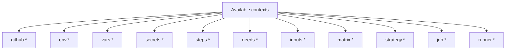

# Expressions, Contexts, and Functions

> [!summary] Goal
> Write dynamic workflows using `${{ }}` expressions, access runtime contexts (`github`, `env`, `steps`, `needs`), and use built-in functions for conditional logic and data transformation.

## Table of Contents

1. [Why Expressions Matter](#why-expressions-matter)
2. [Expression Syntax](#expression-syntax)
3. [Contexts Overview](#contexts-overview)
4. [`github` Context Deep Dive](#github-context-deep-dive)
5. [`steps`, `needs`, `jobs` Contexts](#steps-needs-jobs-contexts)
6. [`env` and `vars` Contexts](#env-and-vars-contexts)
7. [`matrix` and `runner` Contexts](#matrix-and-runner-contexts)
8. [Functions — Complete Reference](#functions-complete-reference)
9. [Status Check Functions](#status-check-functions)
10. [Object and Array Filters](#object-and-array-filters)
11. [Pitfalls](#pitfalls)

---

## Why Expressions Matter

Expressions evaluate dynamic values in workflow YAML using `${{ }}` syntax. Without them, workflows are static — the same code runs the same way every time.

```yaml
# Static — always the same
run: echo "Hello"

# Dynamic — changes based on context
run: echo "Hello, ${{ github.actor }}!"
```

---

## Expression Syntax

### Where expressions work

| Location | Example |
|----------|---------|
| `if:` conditions | `if: ${{ github.ref_name == 'main' }}` |
| `with:` inputs | `with: { node-version: ${{ matrix.node }} }` |
| `run:` commands | `run: echo "Branch: ${{ github.ref_name }}"` |
| `name:` | `name: Build ${{ github.sha }}` |
| `env:` | `env: { SHA: ${{ github.sha }} }` |

### Escaping

```yaml
# Literal ${{ }}
run: echo "Literal: \${{ }}"
# Output: Literal: ${{ }}
```

### Where expressions do NOT work

- `steps[*].id` — must be static
- `jobs.*.name` — must be static in some contexts

---

## Contexts Overview



### Context availability

| Context | `if:` | `run:` | `with:` | `env:` |
|---------|-------|--------|---------|--------|
| `github.*` | ✅ | ✅ | ✅ | ✅ |
| `env.*` | ✅ | ✅ | ✅ | ✅ |
| `vars.*` | ✅ | ✅ | ✅ | ✅ |
| `secrets.*` | ❌ | ✅ | ✅ | ✅ |
| `steps.*` | ✅ | ✅ | ✅ | ❌ |
| `needs.*` | ✅ | ✅ | ✅ | ❌ |
| `matrix.*` | ✅ | ✅ | ✅ | ✅ |
| `runner.*` | ✅ | ✅ | ✅ | ✅ |
| `inputs.*` | ✅ | ✅ | ✅ | ✅ |

---

## `github` Context Deep Dive

### Commonly used properties

| Property | Example value | Use |
|----------|--------------|-----|
| `github.sha` | `abc123def456` | Full commit SHA |
| `github.ref` | `refs/heads/main` | Full Git ref |
| `github.ref_name` | `main` | Branch or tag name |
| `github.ref_type` | `branch` or `tag` | Type of ref |
| `github.event_name` | `pull_request` | Trigger event |
| `github.actor` | `octocat` | Person who triggered |
| `github.workflow` | `CI` | Workflow name |
| `github.repository` | `org/repo` | Full repo name |
| `github.repository_owner` | `org` | Org name |
| `github.run_id` | `1234567890` | Unique run ID |
| `github.run_number` | `42` | Run number (per repo) |
| `github.run_attempt` | `1` | Retry attempt |
| `github.job` | `test` | Current job ID |
| `github.action` | `run-tests` | Current step ID |
| `github.token` | `ghs_...` | GITHUB_TOKEN |
| `github.head_ref` | `feature-branch` | PR head branch |
| `github.base_ref` | `main` | PR base branch |

### `github.event` — access full event payload

```yaml
- name: Get PR title
  run: echo "PR title: ${{ github.event.pull_request.title }}"

- name: Get issue label
  run: echo "Label: ${{ github.event.label.name }}"
```

---

## `steps`, `needs`, `jobs` Contexts

### `steps` — current job's step outputs

```yaml
steps:
  - id: build
    run: echo "status=success" >> $GITHUB_OUTPUT

  - name: Check build
    if: steps.build.outputs.status == 'success'
    run: echo "Build succeeded"

  - name: Check outcome
    if: steps.build.outcome == 'success'
    run: echo "Step outcome: success"
```

### `needs` — depending job's outputs

```yaml
jobs:
  build:
    outputs:
      version: ${{ steps.set-version.outputs.version }}
    steps:
      - id: set-version
        run: echo "version=1.2.3" >> $GITHUB_OUTPUT

  deploy:
    needs: build
    steps:
      - run: echo "Deploying ${{ needs.build.outputs.version }}"
```

---

## `env` and `vars` Contexts

### `env` — environment variables

```yaml
env:
  NODE_ENV: test

steps:
  - run: echo "Environment: ${{ env.NODE_ENV }}"
```

### `vars` — configuration variables (GitHub settings)

Configuration variables are set in repo/org settings (Settings → Secrets and variables → Variables).

```yaml
# In repo variables: DEPLOY_REGION = us-east-1
steps:
  - run: echo "Deploying to ${{ vars.DEPLOY_REGION }}"
```

### Variable resolution priority

```mermaid
flowchart TD
    A[${{ vars.MY_VAR }}] --> B{Environment-level?}
    B -->|Yes| C[Environment var wins]
    B -->|No| D{Repository-level?}
    D -->|Yes| E[Repo var wins]
    D -->|No| F{Organization-level?}
    F -->|Yes| G[Org var wins]
    F -->|No| H[Not found]
```

### `env` vs `vars vs secrets`

| Context | Masked in logs | Use for |
|---------|---------------|---------|
| `env.*` | No | Runtime env vars |
| `vars.*` | No | Non-sensitive config |
| `secrets.*` | Yes | Sensitive values (keys, tokens, passwords) |

---

## `matrix` and `runner` Contexts

### `matrix`

```yaml
strategy:
  matrix:
    node: [18, 20]
    os: [ubuntu-latest, windows-latest]

steps:
  - run: echo "Node ${{ matrix.node }}, OS ${{ matrix.os }}"
```

### `runner`

| Property | Example | Use |
|----------|---------|-----|
| `runner.os` | `Linux`, `Windows`, `macOS` | OS-aware logic |
| `runner.arch` | `X64`, `ARM64` | Architecture-aware caching |
| `runner.name` | `GitHub Actions 42` | Runner hostname |
| `runner.temp` | `/home/runner/work/_temp` | Temp directory |
| `runner.tool_cache` | `/opt/hostedtoolcache` | Tool cache directory |

```yaml
- run: echo "Running on ${{ runner.os }} (${{ runner.arch }})"
```

---

## Functions — Complete Reference

### `contains(search, item)`

Returns `true` if `search` contains `item`:

```yaml
if: ${{ contains(github.event.pull_request.labels.*.name, 'bug') }}
```

### `startsWith(search, prefix)` / `endsWith(search, suffix)`

```yaml
if: ${{ startsWith(github.ref, 'refs/tags/v') }}
if: ${{ endsWith(github.ref_name, '-rc') }}
```

### `format(string, ...replacements)`

```yaml
- run: echo "${{ format('Hello {0}, your PR is {1}', github.actor, github.event.pull_request.title) }}"
```

### `join(array, separator)` / `toJSON(value)`

```yaml
- run: echo "Labels: ${{ join(github.event.pull_request.labels.*.name, ', ') }}"
- run: echo "Event: ${{ toJSON(github.event) }}"
```

### `fromJSON(string)` — parse JSON

```yaml
- run: echo "Parsed: ${{ fromJSON('{\"key\": \"value\"}').key }}"
```

### `hashFiles(path)` — file hash for cache keys

```yaml
- uses: actions/cache@v4
  with:
    path: ~/.npm
    key: npm-${{ hashFiles('package-lock.json') }}
```

### Function reference table

| Function | Signature | Returns | Example |
|----------|-----------|---------|---------|
| `contains` | `contains(s, i)` | `true`/`false` | `contains('hello', 'el')` |
| `startsWith` | `startsWith(s, p)` | `true`/`false` | `startsWith('v1.2', 'v')` |
| `endsWith` | `endsWith(s, sfx)` | `true`/`false` | `endsWith('file.ts', '.ts')` |
| `format` | `format(s, r0, r1...)` | `string` | `format('Hi {0}', name)` |
| `join` | `join(arr, sep)` | `string` | `join(['a','b'], ',')` |
| `toJSON` | `toJSON(val)` | `string` | `toJSON(obj)` |
| `fromJSON` | `fromJSON(str)` | `any` | `fromJSON('{"k":"v"}')` |
| `hashFiles` | `hashFiles(path)` | `string` | `hashFiles('**/lock')` |
| `success` | `success()` | `bool` | `if: success()` |
| `failure` | `failure()` | `bool` | `if: failure()` |
| `always` | `always()` | `bool` | `if: always()` |
| `cancelled` | `cancelled()` | `bool` | `if: cancelled()` |

---

## Status Check Functions

| Function | Returns `true` when |
|----------|---------------------|
| `success()` | All previous steps succeeded (default) |
| `failure()` | Any previous step failed |
| `always()` | Always — regardless of previous steps |
| `cancelled()` | The workflow was cancelled |

```yaml
# Run cleanup regardless of outcome
- name: Cleanup
  if: ${{ always() }}
  run: rm -rf temp/

# Only deploy on success
- name: Deploy
  if: ${{ success() }}
  run: ./deploy.sh

# Send alert on failure
- name: Alert
  if: ${{ failure() }}
  run: ./alert.sh

# Skip if cancelled
- name: Report
  if: ${{ !cancelled() }}
  run: echo "Not cancelled"
```

---

## Object and Array Filters

Access array elements and object properties from the event payload:

```yaml
- name: First label
  run: echo "${{ github.event.pull_request.labels.*.name[0] }}"

- name: All label names
  run: echo "${{ join(github.event.pull_request.labels.*.name, ', ') }}"

- name: Check if specific label exists
  if: ${{ contains(github.event.pull_request.labels.*.name, 'bug') }}
  run: echo "Has bug label"
```

---

## Pitfalls

### `${{ }}` in `run:` commands

```yaml
# This echoes the LITERAL ${{ }} string, not the value
run: echo "${{ github.actor }}"

# In a run step, context S are NOT inside ${{ }}:
run: echo "${{ github.actor }}"     # Yes, this works
echo "Hello, ${{ github.actor }}"   # Yes
```

**Actually both work** — `${{ }}` is evaluated before the step runs, so the value is substituted.

### Secrets not accessible in `if:` conditions

```yaml
if: ${{ secrets.MY_SECRET != '' }}  # ERROR: secrets not available in if
```

**Fix**: Use `vars` for non-sensitive config, or check via a step:

```yaml
steps:
  - id: check
    run: echo "has-secret=${{ secrets.MY_SECRET != '' }}" >> $GITHUB_OUTPUT
```

### Context undefined errors

```yaml
steps:
  - run: echo "${{ steps.unknown.outputs.value }}"
```

If `steps.unknown` doesn't exist, the expression evaluates to an empty string — no error. But `fromJSON('invalid')` throws.

### Truthiness

| Value | Evaluates as |
|-------|-------------|
| `true`, `yes`, `TRUE` | `true` |
| `false`, `no`, empty string, `0`, `null` | `false` |
| Any non-empty string | `true` |

```yaml
# These are equivalent:
if: true
if: "true"
```

### `hashFiles` with glob patterns

```yaml
key: npm-${{ hashFiles('**/package-lock.json') }}
# The ** glob walks all directories
```

---

> [!question]- Interview Questions
>
> **Q: What is the `${{ }}` expression syntax?**
> A: It evaluates the expression inside the braces and substitutes the result. Contexts like `github.*`, `env.*`, `steps.*` are available inside expressions.
>
> **Q: What is the difference between `env` and `vars`?**
> A: `env` contains workflow-level environment variables. `vars` contains configuration variables set at repo/org level via the UI. Both are visible in logs; secrets are masked.
>
> **Q: What does `hashFiles() ` function do?**
> A: It computes a SHA-256 hash of matching files. Used in cache keys to invalidate cache when dependencies change.
>
> **Q: When would you use `fromJSON()` in a workflow?**
> A: To parse dynamic matrix definitions from a job output, or to access object properties from JSON event payloads.

---

## Cross-Links

- [[CICD/GitHubActions/01_Foundations/01_Workflow_Syntax_and_Triggers]] for expression use in triggers
- [[CICD/GitHubActions/01_Foundations/02_Jobs_Steps_Actions_and_Artifacts]] for `if:` conditions
- [[CICD/GitHubActions/02_Core/01_Secrets_Environments_and_OIDC]] for secrets context

---

## References

- [GitHub Actions Expressions](https://docs.github.com/en/actions/learn-github-actions/expressions)
- [Contexts](https://docs.github.com/en/actions/learn-github-actions/contexts)
- [Functions Reference](https://docs.github.com/en/actions/learn-github-actions/expressions#functions)
- [GitHub Context](https://docs.github.com/en/actions/learn-github-actions/contexts#github-context)
