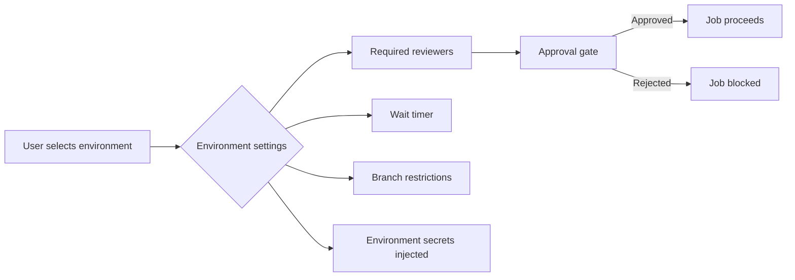

# Workflow Dispatch Inputs and Manual Triggers

> [!summary] Goal
> Design parameterized manual workflows with rich input types — `choice`, `boolean`, `environment`, multi-line text — and use them for deploy-to-env, ad-hoc tasks, and debugging.

## Table of Contents

1. [Why Manual Triggers Matter](#why-manual-triggers-matter)
2. [Input Types Reference](#input-types-reference)
3. [Choice Input (Dropdown)](#choice-input)
4. [Environment Input](#environment-input)
5. [Boolean Input (Toggle)](#boolean-input)
6. [Multi-Parameter Deploy Example](#multi-parameter-deploy-example)
7. [Repository Dispatch](#repository-dispatch)
8. [Workflow Dispatch from CLI](#workflow-dispatch-from-cli)
9. [Pitfalls](#pitfalls)

---

## Why Manual Triggers Matter

`workflow_dispatch` lets you run a workflow on demand with custom parameters. Without it, workflows are fully automated — you cannot control which version to deploy, or skip tests, or target a specific environment.

```mermaid
flowchart TD
    A[workflow_dispatch triggered] --> B[User provides inputs via UI or CLI]
    B --> C[Inputs available as ${{ inputs.* }}]
    C --> D[Job runs with selected parameters]
    D --> E[Targets chosen environment]
    D --> F[Uses chosen version]
```

> [!tip] Definition
> **`workflow_dispatch`**: an event that allows running a workflow manually from the GitHub UI, CLI, or API, passing custom inputs defined in the workflow YAML.

---

## Input Types Reference

```yaml
on:
  workflow_dispatch:
    inputs:
      environment:
        description: "Deployment target"
        required: true
        type: environment
      version:
        description: "Version to deploy"
        required: true
        default: "v1.2.3"
        type: string
      skip-tests:
        description: "Skip integration tests"
        default: false
        type: boolean
      log-level:
        description: "Logging level"
        required: true
        default: info
        type: choice
        options:
          - debug
          - info
          - warn
          - error
```

| Type | UI Widget | Validation | Use case |
|------|-----------|------------|----------|
| `string` | Text input | Required, default | Version, name, URL |
| `number` | Number input | Required, default | Port, count, timeout |
| `boolean` | Checkbox | Default true/false | Skip tests, dry-run |
| `choice` | Dropdown | Options list required | Environment, log level |
| `environment` | Environment dropdown | Selects env + gated secrets | Deploy target |

---

## Choice Input (Dropdown)

Dropdowns let users select from predefined options — no typos, no invalid values.

```yaml
on:
  workflow_dispatch:
    inputs:
      log-level:
        description: "Logging level"
        required: true
        default: info
        type: choice
        options:
          - debug
          - info
          - warn
          - error

jobs:
  run:
    runs-on: ubuntu-latest
    steps:
      - run: echo "Log level: ${{ inputs.log-level }}"
```

---

## Environment Input

The `environment` type dynamically creates a dropdown of available environments:

```yaml
on:
  workflow_dispatch:
    inputs:
      environment:
        description: "Deployment target"
        required: true
        type: environment

jobs:
  deploy:
    runs-on: ubuntu-latest
    environment: ${{ inputs.environment }}
    steps:
      - run: echo "Deploying to ${{ inputs.environment }}"
```



**Why use `type: environment` over `type: choice`?** Environment type automatically:
- Lists all environments configured in the repo
- Injects environment-specific secrets
- Enforces environment protection rules (approvals, wait timer, branch policy)

---

## Boolean Input (Toggle)

```yaml
on:
  workflow_dispatch:
    inputs:
      dry-run:
        description: "Dry run (skip real deploy)"
        required: true
        default: true
        type: boolean

jobs:
  deploy:
    runs-on: ubuntu-latest
    steps:
      - if: inputs.dry-run
        run: echo "DRY RUN — would deploy ${{ inputs.version }}"

      - if: ${{ !inputs.dry-run }}
        run: ./deploy.sh ${{ inputs.version }}
```

---

## Multi-Parameter Deploy Example

```yaml
name: Deploy
on:
  workflow_dispatch:
    inputs:
      environment:
        description: "Deployment environment"
        type: environment
        required: true
      version:
        description: "Version to deploy (tag or SHA)"
        required: true
        type: string
      dry-run:
        description: "Validate without deploying"
        type: boolean
        default: false
      notify:
        description: "Send Slack notification"
        type: boolean
        default: true

run-name: "Deploy ${{ inputs.version }} to ${{ inputs.environment }} ${{ inputs.dry-run && '(dry run)' || '' }}"

jobs:
  validate:
    runs-on: ubuntu-latest
    steps:
      - uses: actions/checkout@v4
        with:
          ref: ${{ inputs.version }}
      - run: |
          echo "Validating ${{ inputs.version }} for ${{ inputs.environment }}"
          npm ci && npm run build

  deploy:
    needs: validate
    if: ${{ !inputs.dry-run }}
    runs-on: ubuntu-latest
    environment: ${{ inputs.environment }}
    steps:
      - run: ./deploy.sh ${{ inputs.version }}

  notify:
    needs: [deploy]
    if: ${{ inputs.notify && !inputs.dry-run }}
    runs-on: ubuntu-latest
    steps:
      - uses: slackapi/slack-github-action@v1
        with:
          payload: |
            { "text": "Deployed ${{ inputs.version }} to ${{ inputs.environment }}" }
```

```mermaid
flowchart TD
    A[User clicks "Run workflow"] --> B{Select environment}
    B --> C[production]
    B --> D[staging]
    B --> E[development]
    A --> F{Enter version tag}
    A --> G{Toggle dry-run}
    A --> H{Toggle notify}
    A --> I[Run workflow]
    I --> J[validate job]
    J --> K{dry-run?}
    K -->|Yes| L[Stop]
    K -->|No| M[deploy job]
    M --> N[environment protection]
    N --> O{Approved?}
    O -->|Yes| P[Deploy]
    O -->|No| Q[Blocked]
    P --> R{notify?}
    R -->|Yes| S[Send Slack]
    R -->|No| T[Done]
```

---

## Repository Dispatch

`repository_dispatch` triggers workflows from external systems (webhooks, CLI, CI from another tool):

```yaml
on:
  repository_dispatch:
    types: [deploy-staging, deploy-production]

jobs:
  deploy:
    if: github.event.action == 'deploy-production'
    runs-on: ubuntu-latest
    steps:
      - run: |
          echo "Deploying ${{ github.event.client_payload.version }}"
          ./deploy.sh ${{ github.event.client_payload.version }}
```

### Trigger from external system

```bash
curl -X POST https://api.github.com/repos/owner/repo/dispatches \
  -H "Authorization: Bearer <token>" \
  -H "Content-Type: application/json" \
  -d '{"event_type": "deploy-production", "client_payload": {"version": "v1.2.3"}}'
```

---

## Workflow Dispatch from CLI

```bash
# Basic
gh workflow run deploy.yml -f env=prod -f version=v1.2.3

# With boolean (use true/false as strings)
gh workflow run deploy.yml -f dry-run=true

# With environment type
gh workflow run deploy.yml -f environment=production

# With ref (branch or tag)
gh workflow run deploy.yml --ref v1.2.3 -f environment=production

# Watch the run
gh run watch
```

### From API

```bash
curl -X POST https://api.github.com/repos/owner/repo/actions/workflows/deploy.yml/dispatches \
  -H "Authorization: Bearer <token>" \
  -H "Content-Type: application/json" \
  -d '{"ref": "main", "inputs": {"environment": "production", "version": "v1.2.3"}}'
```

---

## Pitfalls

### Input size limits

Total workflow dispatch input payload is limited to **10 KB**. Large JSON blobs won't fit.

**Fix**: Use a commit SHA or tag as input, not the entire payload. Reference data from the repository.

### Boolean truthiness in `if:`

```yaml
# This evaluates as STRING, not boolean:
if: inputs.dry-run == true

# This works correctly:
if: ${{ inputs.dry-run }}
```

**Fix**: Use `${{ }}` expression syntax for boolean comparison, or just `if: inputs.dry-run`.

### Choice options not reflected in UI

The `options` list for `type: choice` must be fully defined at YAML authoring time — it cannot be dynamic.

### Missing environment in list

If an environment is not listed in the dropdown, it either doesn't exist or the user doesn't have access.

**Fix**: Create the environment in repo Settings → Environments. Verify user has `write` access.

---

> [!question]- Interview Questions
>
> **Q: What input types are available for `workflow_dispatch`?**
> A: `string`, `number`, `boolean`, `choice` (dropdown), and `environment`. Each has different UI widgets and validation.
>
> **Q: What is the difference between `type: environment` and `type: choice` for deployment targets?**
> A: `environment` dynamically lists configured environments, injects environment-specific secrets, and enforces protection rules. `choice` is a static dropdown with no automatic environment integration.
>
> **Q: How do you trigger a workflow from an external system?**
> A: Use `repository_dispatch` event with a `curl` POST to `/repos/:owner/:repo/dispatches`. Pass parameters via `client_payload`.

---

## Cross-Links

- [[CICD/GitHubActions/01_Foundations/01_Workflow_Syntax_and_Triggers]] for event reference
- [[CICD/GitHubActions/02_Core/01_Secrets_Environments_and_OIDC]] for environment protection
- [[CICD/GitHubActions/01_Foundations/04_Expressions_Contexts_and_Functions]] for `inputs.*` context

---

## References

- [Workflow Dispatch](https://docs.github.com/en/actions/using-workflows/events-that-trigger-workflows#workflow_dispatch)
- [Repository Dispatch](https://docs.github.com/en/actions/using-workflows/events-that-trigger-workflows#repository_dispatch)
- [Workflow Dispatch Inputs](https://docs.github.com/en/actions/using-workflows/workflow-syntax-for-github-actions#on-workflow_dispatch-inputs)
