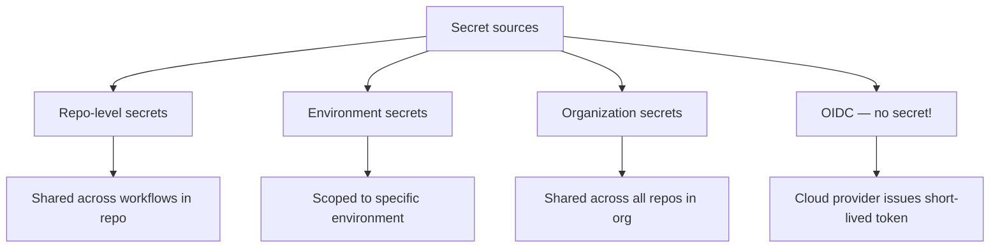
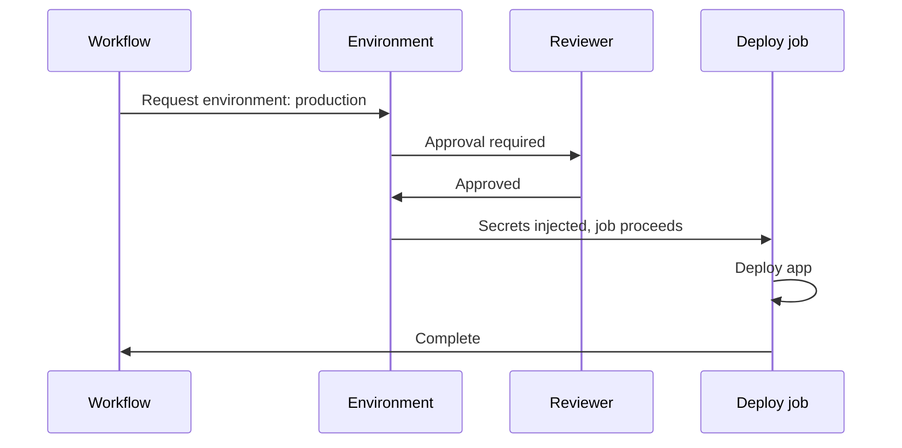
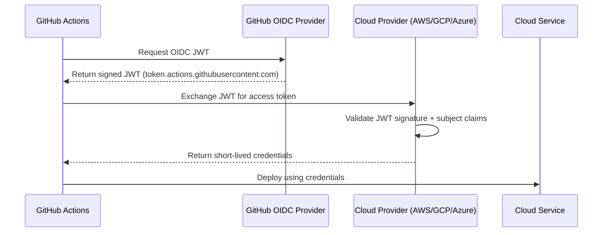

# Secrets, Environments, and OIDC

> [!summary] Goal
> Keep secrets scoped to where they're needed, prefer OIDC for cloud provider auth, use environments for deploy gating, and understand `GITHUB_TOKEN` permissions.

## Table of Contents

1. [Why Secrets Need Structure](#why-secrets-need-structure)
2. [Secret Types and Precedence](#secret-types-and-precedence)
3. [`GITHUB_TOKEN` Deep Dive](#githubtoken-deep-dive)
4. [Environment Protection Rules](#environment-protection-rules)
5. [OIDC Architecture](#oidc-architecture)
6. [AWS OIDC Setup](#aws-oidc-setup)
7. [GCP OIDC Setup](#gcp-oidc-setup)
8. [Azure OIDC Setup](#azure-oidc-setup)
9. [`vars` vs `secrets`](#vars-vs-secrets)
10. [Pitfalls](#pitfalls)

---

## Why Secrets Need Structure

Without structured secret management, tokens get checked into code, rotated manually, and exposed in logs.



---

## Secret Types and Precedence

### Organization secrets

Go to org Settings → Secrets and variables → Actions.

```bash
gh secret set MY_SECRET --org my-org --visibility all
```

### Repository secrets

Go to repo Settings → Secrets and variables → Actions.

```bash
gh secret set MY_SECRET --repo org/repo
```

### Environment secrets

Scoped to a specific environment and only available in jobs that target that environment.

```yaml
environment: production
```

### Precedence

```mermaid
flowchart TD
    A[${{ secrets.MY_VAR }}] --> B{Environment-level?}
    B -->|Yes| C[Environment secret wins]
    B -->|No| D{Repository-level?}
    D -->|Yes| E[Repo secret wins]
    D -->|No| F{Organization-level?}
    F -->|Yes| G[Org secret wins]
    F -->|No| H[Empty string]
```

---

## `GITHUB_TOKEN` Deep Dive

Every workflow run gets a `GITHUB_TOKEN` that authenticates API calls.

### Default token behavior

| Property | Value |
|----------|-------|
| Expiration | End of workflow run |
| Scope | Repository contents that run the workflow |
| Permissions | `write-all` — unless overridden |

### Scoping with `permissions:`

```yaml
permissions:
  contents: read
  pull-requests: write
  id-token: write
```

### Using `GITHUB_TOKEN` for API calls

```yaml
- name: Comment on PR
  env:
    GH_TOKEN: ${{ github.token }}
  run: |
    gh pr comment ${{ github.event.pull_request.number }} \
      --body "CI checks passed!"
```

### `GITHUB_TOKEN` vs PAT vs GitHub App

| Aspect | `GITHUB_TOKEN` | PAT | GitHub App |
|--------|---------------|-----|-----------|
| Scope | Current repo | User-level | App-level |
| Permissions | Per-workflow | Broad scopes | Per-installation |
| Expiration | End of run | Configurable | Token refreshes |
| Cross-repo access | No | Yes | Yes |
| Rating limit | Same as repo | User rate | Higher rate |

---

## Environment Protection Rules

```yaml
jobs:
  deploy:
    runs-on: ubuntu-latest
    environment:
      name: production
      url: https://app.example.com
```

| Rule | Description |
|------|-------------|
| Required reviewers | 1-5 people who must approve before deploy |
| Wait timer | Delay in minutes before deploy starts |
| Deployment branches | Which branches can deploy to this environment |
| Environment secrets | Secrets only available in this environment |



---

## OIDC Architecture

OIDC (OpenID Connect) lets workflows request short-lived credentials from cloud providers — no static secrets.



### Benefits

- No long-lived keys stored as secrets
- Automatic token rotation (minutes)
- Audit trail (each token is unique)
- Scoped by repo, branch, environment

---

## AWS OIDC Setup

### IAM role trust policy

```json
{
  "Version": "2012-10-17",
  "Statement": [
    {
      "Effect": "Allow",
      "Principal": {
        "Federated": "arn:aws:iam::123456:oidc-provider/token.actions.githubusercontent.com"
      },
      "Action": "sts:AssumeRoleWithWebIdentity",
      "Condition": {
        "StringEquals": {
          "token.actions.githubusercontent.com:aud": "sts.amazonaws.com",
          "token.actions.githubusercontent.com:sub": "repo:org/my-repo:environment:production"
        }
      }
    }
  ]
}
```

### Workflow

```yaml
permissions:
  id-token: write
  contents: read

jobs:
  deploy:
    runs-on: ubuntu-latest
    steps:
      - uses: aws-actions/configure-aws-credentials@v4
        with:
          role-to-assume: arn:aws:iam::123456:role/github-actions
          aws-region: us-east-1
      - run: aws s3 ls
```

---

## GCP OIDC Setup

### Workload identity pool + provider

```bash
gcloud iam workload-identity-pools create github-pool \
  --location=global

gcloud iam workload-identity-pools providers create-oidc github-provider \
  --location=global \
  --workload-identity-pool=github-pool \
  --issuer-uri=https://token.actions.githubusercontent.com \
  --attribute-mapping="google.subject=assertion.sub,attribute.repository=assertion.repository"
```

### Service account binding

```bash
gcloud iam service-accounts add-iam-policy-binding my-sa@project.iam.gserviceaccount.com \
  --role=roles/iam.workloadIdentityUser \
  --member="principalSet://iam.googleapis.com/projects/123/locations/global/workloadIdentityPools/github-pool/attribute.repository/org/repo"
```

### Workflow

```yaml
- uses: google-github-actions/auth@v2
  with:
    workload_identity_provider: projects/123/locations/global/workloadIdentityPools/github-pool/providers/github-provider
    service_account: my-sa@project.iam.gserviceaccount.com
- run: gcloud storage ls
```

---

## Azure OIDC Setup

### App registration + federated credential

```bash
az ad app federated-credential create \
  --id <app-id> \
  --parameters '{
    "name": "github-actions",
    "issuer": "https://token.actions.githubusercontent.com",
    "subject": "repo:org/repo:environment:production",
    "audiences": ["api://AzureADTokenExchange"]
  }'
```

### Workflow

```yaml
- uses: azure/login@v2
  with:
    client-id: ${{ secrets.AZURE_CLIENT_ID }}
    tenant-id: ${{ secrets.AZURE_TENANT_ID }}
    subscription-id: ${{ secrets.AZURE_SUBSCRIPTION_ID }}
- run: az vm list
```

---

## `vars` vs `secrets`

| Aspect | `vars` (variables) | `secrets` |
|--------|-------------------|-----------|
| Masked in logs | No | Yes |
| Use for | Config, regions, URLs | API keys, tokens, passwords |
| Edit updates runs | Immediately | Immediately |
| Precedence | Env → Repo → Org | Same |
| Permission to read | Anyone with push | Same |

```yaml
steps:
  - run: echo "Region: ${{ vars.AWS_REGION }}"
  - run: echo "Key (masked): ${{ secrets.AWS_SECRET_KEY }}"
```

---

## Pitfalls

### Secrets exposed in logs

```yaml
# BAD — secret output in logs
- run: echo "The password is ${{ secrets.PASSWORD }}"

# Slightly better — still not great
- run: |
    echo "Using password..."
    ./deploy.sh --password ${{ secrets.PASSWORD }}
```

**Fix**: Pass secrets via environment variables — GitHub masks `${{ secrets.* }}` in logs automatically. Never `echo` secrets.

### OIDC subject claim mismatch

If the workflow `environment:` doesn't match the IAM trust policy's subject claim, OIDC fails.

**Fix**: Ensure the environment name matches exactly. For `repo:org/repo:environment:production`, the job must have `environment: production`.

### Environment protection rules not matching

```yaml
# This job accesses 'production' environment
jobs:
  deploy:
    environment: production
```

If the environment's "Deployment branches" setting only allows `main`, a push to `staging` won't trigger.

### `GITHUB_TOKEN` too permissive

```yaml
permissions: write-all  # DANGEROUS — every scope has write access
```

**Fix**: Set minimal permissions per scope.

---

> [!question]- Interview Questions
>
> **Q: What is OIDC and why is it preferred over static secrets?**
> A: OIDC allows GitHub Actions to request short-lived credentials from a cloud provider. It eliminates long-lived static keys, provides automatic rotation, and enables per-workflow audit trails.
>
> **Q: What is the difference between `vars` and `secrets`?**
> A: `vars` are non-sensitive configuration values visible in logs. `secrets` are sensitive and masked in logs. Both have the same precedence hierarchy (environment → repo → org).
>
> **Q: What are environment protection rules?**
> A: Required reviewers, wait timers, and branch restrictions that gate deployments to specific environments.

---

## Cross-Links

- [[CICD/GitHubActions/01_Foundations/04_Expressions_Contexts_and_Functions]] for secrets in expressions
- [[CICD/GitHubActions/01_Foundations/01_Workflow_Syntax_and_Triggers]] for environment protection in workflow
- [[CICD/02_Core/02_Secrets_Management]] for general secrets management practices

---

## References

- [GitHub Actions Secrets](https://docs.github.com/en/actions/security-guides/using-secrets-in-github-actions)
- [About OIDC](https://docs.github.com/en/actions/deployment/security-hardening-your-deployments/about-security-hardening-with-openid-connect)
- [AWS OIDC Configuration](https://docs.github.com/en/actions/deployment/security-hardening-your-deployments/configuring-openid-connect-in-amazon-web-services)
- [GCP OIDC Configuration](https://docs.github.com/en/actions/deployment/security-hardening-your-deployments/configuring-openid-connect-in-google-cloud-platform)
- [Azure OIDC Configuration](https://docs.github.com/en/actions/deployment/security-hardening-your-deployments/configuring-openid-connect-in-microsoft-azure)
