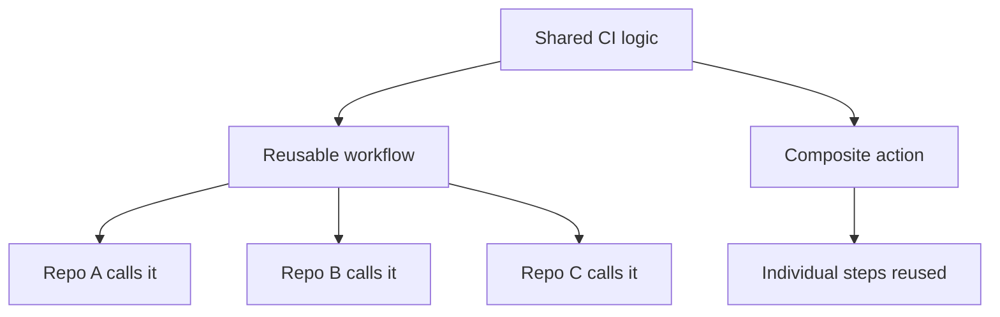
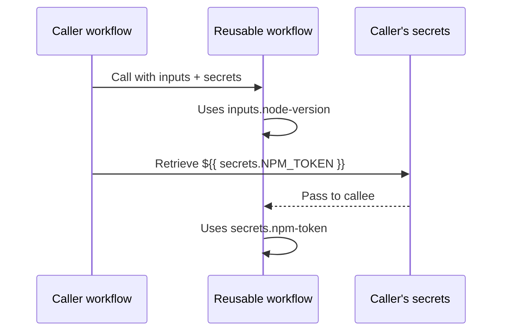
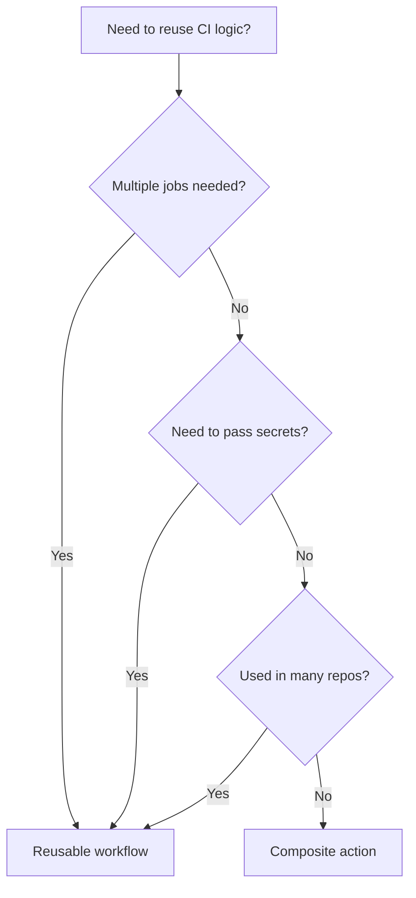

# Reusable Workflows and Composite Actions

> [!summary] Goal
> Reduce CI/CD duplication by extracting common logic into reusable workflows and composite actions — while keeping security boundaries clear.

## Table of Contents

1. [Why Reusable Components Matter](#why-reusable-components-matter)
2. [Reusable Workflow Inputs and Secrets](#reusable-workflow-inputs-and-secrets)
3. [Calling Reusable Workflows](#calling-reusable-workflows)
4. [Composite Actions Anatomy](#composite-actions-anatomy)
5. [Reusable vs Composite — When to Use Each](#reusable-vs-composite-when-to-use-each)
6. [Versioning Reusable Workflows](#versioning-reusable-workflows)
7. [Testing Reusable Workflows](#testing-reusable-workflows)
8. [Pitfalls](#pitfalls)

---

## Why Reusable Components Matter

Without reusability, every repo copies the same CI YAML — different branches drift, and updates require touching 50 repos.



---

## Reusable Workflow Inputs and Secrets

### Defining a reusable workflow

```yaml
# .github/workflows/reusable-ci.yml
name: Reusable CI
on:
  workflow_call:
    inputs:
      node-version:
        description: "Node.js version"
        required: true
        type: string
      run-lint:
        default: true
        type: boolean
    secrets:
      npm-token:
        description: "npm registry token"
        required: false

jobs:
  ci:
    runs-on: ubuntu-latest
    steps:
      - uses: actions/checkout@v4
      - uses: actions/setup-node@v4
        with:
          node-version: ${{ inputs.node-version }}
          cache: npm
          registry-url: https://npm.pkg.github.com
      - run: npm ci
      - if: inputs.run-lint
        run: npm run lint
      - run: npm test
```

### Input types

| Type | Valid values | Example |
|------|-------------|---------|
| `string` | Any string | `"20"` |
| `number` | Numeric string | `"20"` |
| `boolean` | `true`/`false` | `true` |
| `choice` | From defined options | `["npm", "yarn", "pnpm"]` |

---

## Calling Reusable Workflows

### From the same repository

```yaml
jobs:
  ci:
    uses: ./.github/workflows/reusable-ci.yml
    with:
      node-version: "20"
    secrets: inherit
```

### From another repository

```yaml
jobs:
  ci:
    uses: org/shared-workflows/.github/workflows/ci.yml@v1
    with:
      node-version: "20"
    secrets:
      npm-token: ${{ secrets.NPM_TOKEN }}
```

### Passing secrets selectively

```yaml
# Only pass specific secrets (safer)
    secrets:
      npm-token: ${{ secrets.NPM_TOKEN }}
      # Other secrets from the caller are NOT passed

# Or inherit ALL secrets (convenient, less safe)
    secrets: inherit
```



---

## Composite Actions Anatomy

A composite action packages multiple `run` steps into a reusable action.

### Directory structure

```
.github/actions/my-action/
└── action.yml
```

### action.yml

```yaml
# .github/actions/my-action/action.yml
name: "My Custom Action"
description: "Sets up tooling and runs checks"
author: "Team"

inputs:
  tool-version:
    description: "Tool version"
    required: true
    default: "latest"

outputs:
  status:
    description: "Execution status"
    value: ${{ steps.check.outputs.result }}

runs:
  using: "composite"
  steps:
    - id: setup
      run: echo "Setting up version ${{ inputs.tool-version }}"
      shell: bash

    - id: check
      run: |
        echo "Tool ready!"
        echo "result=success" >> $GITHUB_OUTPUT
      shell: bash
```

### Using the composite action

```yaml
steps:
  - uses: ./.github/actions/my-action
    with:
      tool-version: "1.2.3"
```

---

## Reusable vs Composite — When to Use Each

| Aspect | Reusable workflow | Composite action |
|--------|------------------|-----------------|
| Scope | Multiple jobs | Single job's steps |
| Caller location | Same repo or external | Same repo (usually) |
| Secrets support | ✅ Yes | ❌ No |
| Matrix support | ✅ Yes (call in matrix) | ✅ Yes (use in job) |
| Outputs | Job outputs → depends on | Step outputs → current job |
| Debugging | Per-job logs | Per-step logs |
| Conditional runs | Per-job `if:` | Per-step `if:` |
| Strategy | Own job with `needs:` | Steps in existing job |



---

## Versioning Reusable Workflows

| Method | Example | Stability |
|--------|---------|-----------|
| Git tag | `@v1`, `@v1.2` | Good |
| Branch | `@main` | Poor (breaking changes) |
| Commit SHA | `@e4f7c9a` | Best (immutable) |

```yaml
# Recommended: major version tag
uses: org/shared-workflows/.github/workflows/ci.yml@v1

# For critical workflows: SHA pin
uses: org/shared-workflows/.github/workflows/deploy.yml@e4f7c9a
```

---

## Testing Reusable Workflows

### Using `act` for local testing

```bash
# Run a reusable workflow locally
act workflow_call -e event.json
```

### GitHub's own testing approach

1. Create a test workflow that calls the reusable workflow
2. Run it on a PR
3. Verify outputs match expectations

```yaml
# .github/workflows/test-reusable.yml
on: pull_request
jobs:
  test:
    uses: ./.github/workflows/reusable-ci.yml
    with:
      node-version: "20"
```

---

## Pitfalls

### Composite actions cannot use `uses:` with marketplace actions

```yaml
# ERROR in composite action:
runs:
  using: "composite"
  steps:
    - uses: actions/checkout@v4  # NOT ALLOWED in composite!
```

**Fix**: Use `run:` with shell commands, or use `docker://` actions.

### Reusable workflow secrets scope

Secrets available in the caller are NOT automatically passed to the callee — they must be explicitly passed.

```yaml
jobs:
  ci:
    uses: ./.github/workflows/reusable.yml
    secrets:
      npm-token: ${{ secrets.NPM_TOKEN }}  # Must pass explicitly
```

### Matrix inside reusable workflows

Matrix is defined in the caller, not the callee:

```yaml
jobs:
  ci:
    strategy:
      matrix:
        node: [18, 20, 22]
    uses: ./.github/workflows/reusable-ci.yml
    with:
      node-version: ${{ matrix.node }}
```

---

> [!question]- Interview Questions
>
> **Q: What is the difference between a reusable workflow and a composite action?**
> A: A reusable workflow is a complete workflow file called from another workflow — it runs as a separate job. A composite action packages multiple steps into a single action that runs within an existing job.
>
> **Q: How do you pass secrets to a reusable workflow?**
> A: Explicitly: `secrets: { key: ${{ secrets.KEY }} }`. Or inherit all: `secrets: inherit`.
>
> **Q: Can a composite action use other marketplace actions?**
> A: No. Composite actions can only use `run:` steps with shell commands, or Docker-based actions via `docker://`.

---

## Cross-Links

- [[CICD/GitHubActions/01_Foundations/05_Common_Actions_and_the_Marketplace]] for action versioning
- [[CICD/GitHubActions/01_Foundations/02_Jobs_Steps_Actions_and_Artifacts]] for job structure
- [[CICD/GitHubActions/01_Foundations/04_Expressions_Contexts_and_Functions]] for inputs in expressions

---

## References

- [Reusable Workflows](https://docs.github.com/en/actions/using-workflows/reusing-workflows)
- [Composite Actions](https://docs.github.com/en/actions/creating-actions/about-custom-actions)
- [Metadata Syntax for Actions](https://docs.github.com/en/actions/creating-actions/metadata-syntax-for-github-actions)
- [Sharing Actions and Workflows](https://docs.github.com/en/actions/creating-actions/sharing-actions-and-workflows-with-your-organization)
