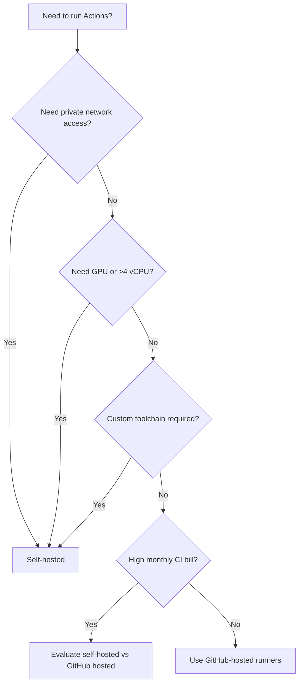
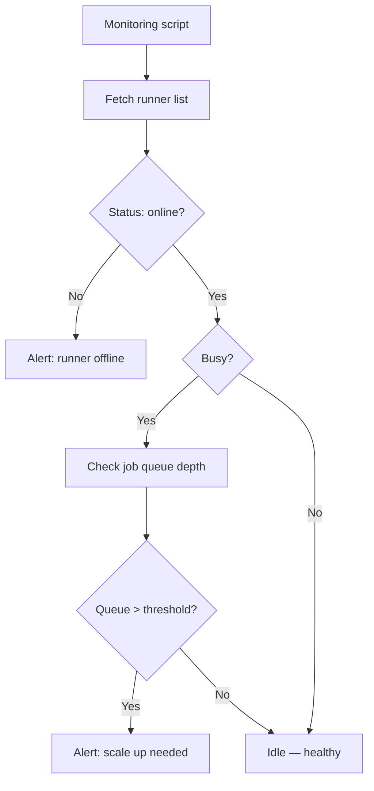
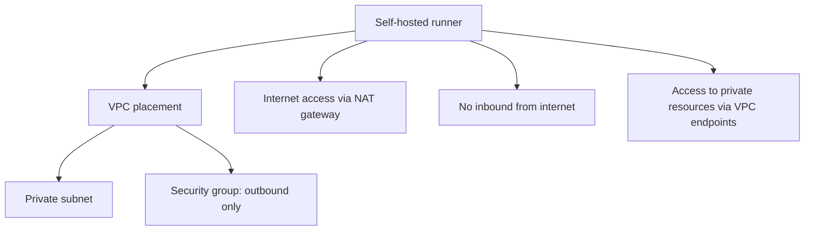

# Self-Hosted Runners and Scaling

> [!summary] Goal
> Use self-hosted runners safely for workloads needing private network access, GPUs, or custom toolchains — with autoscaling, labels, and ephemeral runner patterns.

## Table of Contents

1. [When to Use Self-Hosted](#when-to-use-self-hosted)
2. [GitHub-Hosted Runner Specs](#github-hosted-runner-specs)
3. [Setting Up Self-Hosted Runners](#setting-up-self-hosted-runners)
4. [Runner Groups and Labels](#runner-groups-and-labels)
5. [Autoscaling with ARC](#autoscaling-with-arc)
6. [Autoscaling with Terraform](#autoscaling-with-terraform)
7. [Security for Self-Hosted Runners](#security-for-self-hosted-runners)
8. [Runner Health Monitoring](#runner-health-monitoring)
9. [macOS Self-Hosted Setup](#macos-self-hosted-setup)
10. [Windows Self-Hosted Setup](#windows-self-hosted-setup)
11. [Runner Network Security](#runner-network-security)
12. [Runner Cleanup and GC](#runner-cleanup-and-gc)
13. [Pitfalls](#pitfalls)

---

## When to Use Self-Hosted



---

## GitHub-Hosted Runner Specs

| Runner | vCPU | RAM | Storage | OS |
|--------|------|-----|---------|-----|
| `ubuntu-latest` (24.04) | 4 | 16 GB | 150 GB | Linux |
| `ubuntu-22.04` | 4 | 16 GB | 150 GB | Linux |
| `ubuntu-20.04` | 4 | 16 GB | 150 GB | Linux |
| `windows-latest` (2022) | 4 | 16 GB | 150 GB | Windows |
| `windows-2019` | 4 | 16 GB | 150 GB | Windows |
| `macos-latest` (14) | 4 | 14 GB | 75 GB | macOS |
| `macos-13` | 4 | 14 GB | 75 GB | macOS |

**Included software**: Docker, Node.js, Python, Java, Go, .NET, Ruby, Git, curl, jq, and 200+ tools pre-installed.

---

## Setting Up Self-Hosted Runners

### Registration token

```bash
# Repo-level runner
gh api repos/:owner/:repo/actions/runners/registration-token

# Org-level runner
gh api orgs/:org/actions/runners/registration-token
```

### Install and configure

```bash
# Download and configure
mkdir actions-runner && cd actions-runner
curl -o actions-runner-linux-x64.tar.gz -L \
  https://github.com/actions/runner/releases/latest/download/actions-runner-linux-x64.tar.gz
tar xzf actions-runner-linux-x64.tar.gz

./config.sh --url https://github.com/org/repo \
  --token <REGISTRATION_TOKEN> \
  --labels custom-linux,gpu \
  --name my-runner-1

# Install as service
sudo ./svc.sh install
sudo ./svc.sh start
```

### Verification

```bash
sudo ./svc.sh status
./run.sh --help
```

---

## Runner Groups and Labels

### Runner groups

Groups control which repos in an org can use which runners.

```
Organization → Settings → Actions → Runner groups
├── Default (all repos)
├── Production (selected repos)
└── GPU (selected repos — expensive runners)
```

### Labels

Labels route specific jobs to specific runners:

```yaml
jobs:
  gpu-training:
    runs-on:
      - self-hosted
      - gpu
    steps:
      - run: nvidia-smi
```

```yaml
jobs:
  arm-build:
    runs-on:
      - self-hosted
      - linux
      - arm64
    steps:
      - run: uname -m  # aarch64
```

---

## Autoscaling with ARC

The `actions-runner-controller` (ARC) runs self-hosted runners on Kubernetes.

```bash
helm install arc \
  --namespace actions-runner-system \
  oci://ghcr.io/actions/actions-runner-controller-charts/gha-runner-scale-set
```

### RunnerDeployment

```yaml
apiVersion: actions.github.com/v1alpha1
kind: RunnerDeployment
metadata:
  name: example-runner
spec:
  replicas: 2
  template:
    spec:
      repository: org/repo
      labels:
        - k8s-runner
```

### HorizontalRunnerAutoscaler

```yaml
apiVersion: actions.github.com/v1alpha1
kind: HorizontalRunnerAutoscaler
metadata:
  name: example-autoscaler
spec:
  scaleTargetRef:
    name: example-runner
  minReplicas: 1
  maxReplicas: 10
  metrics:
    - type: TotalNumberOfQueuedAndInProgressWorkflowRuns
      repositoryNames:
        - my-repo
```

```mermaid
flowchart LR
    A[Queued workflow] --> B[ARC detects demand]
    B --> C[HorizontalRunnerAutoscaler scales up]
    C --> D[New runner pod created]
    D --> E[Runner picks up job]
    E --> F[Job completes]
    F --> G[Scale down (idle timeout)]
```

---

## Autoscaling with Terraform

The `terraform-aws-github-runner` module creates EC2 runners that scale on demand:

```hcl
module "runners" {
  source  = "phillips-software/ami-github-runner/aws"
  version = "6.0.0"

  aws_region  = "us-east-1"
  vpc_id      = module.vpc.vpc_id
  subnet_ids  = module.vpc.private_subnets

  runner_os              = "linux"
  instance_types         = ["c6id.large", "m6id.large"]
  max_instance_count     = 20
  min_instance_count     = 1
  scale_down_delay_sec   = 300
  runner_extra_labels    = ["ec2-runner"]
}
```

---

## Security for Self-Hosted Runners

| Risk | Mitigation |
|------|------------|
| Secret exposure between jobs | **Ephemeral runners** — one job per runner, destroy after use |
| Long-running machines drift | Automated rebuild from golden AMI/image |
| Network access abuse | Strong network ACLs, no open egress |
| Poisoned tool caches | No shared state between runners |
| Runner registration token theft | Short-lived tokens, rotate frequently |

### Ephemeral runner setup

```bash
./config.sh --url <url> --token <token> --ephemeral
# Runner registers → takes exactly one job → unregisters → destroys
```

---

## Pitfalls

### Runner drift

Self-hosted runners that aren't re-provisioned regularly accumulate configuration drift — different software versions, leftover artifacts, stale caches.

**Fix**: Use ephemeral runners (ARC, Terraform) or rebuild the runner image nightly.

### Secret exposure on shared machines

If a self-hosted runner processes multiple jobs on the same machine, secrets from one job may leak to the next.

**Fix**: Always use ephemeral runners for anything sensitive.

### Autoscaling not keeping up

During a burst of CI activity (post-merge, release day), autoscaling may be too slow.

**Fix**: Set `minReplicas` higher than 1. Tune `scaleUp` and `scaleDown` delays. Use `max-parallel` in workflow matrix.

### High maintenance overhead

Self-hosted runners require: OS patching, tool updates, network monitoring, capacity planning.

**Fix**: Before adopting self-hosted, calculate total cost of ownership including maintenance labor.

---

## Runner Health Monitoring

Track runner availability, job queue depth, and cleanup status.

```bash
# List all runners and their status
gh api /orgs/:org/actions/runners --paginate --jq '.runners[] | {name: .name, status: .status, busy: .busy, labels: [.labels[].name]}'

# Check runner health via heartbeat
gh api /repos/:owner/:repo/actions/runners/health
```



### Metrics to monitor

| Metric | Warning | Critical | Action |
|--------|---------|----------|--------|
| Runner offline | >1 min | >5 min | Restart runner service |
| Queue depth | >5 queued | >20 queued | Scale up runners |
| Disk usage | >80% | >95% | Run cleanup, increase disk |
| Idle ratio | <10% | <5% | Scale down runners |

---

## macOS Self-Hosted Setup

```bash
# Download and configure macOS runner
curl -o actions-runner-osx-x64.tar.gz -L \
  https://github.com/actions/runner/releases/latest/download/actions-runner-osx-x64.tar.gz
tar xzf actions-runner-osx-x64.tar.gz

./config.sh --url https://github.com/org/repo \
  --token <TOKEN> \
  --labels macos,m1

# Install as service
./svc.sh install
./svc.sh start
```

### Keychain management for macOS runners

```bash
# Set up temporary keychain for code signing
security create-keychain -p temp actions-build.keychain
security default-keychain -s actions-build.keychain
security unlock-keychain -p temp actions-build.keychain
```

---

## Windows Self-Hosted Setup

```powershell
# Download and configure Windows runner (PowerShell)
Invoke-WebRequest -Uri https://github.com/actions/runner/releases/latest/download/actions-runner-win-x64.zip -OutFile actions-runner-win-x64.zip
Expand-Archive -Path actions-runner-win-x64.zip -DestinationPath .

.\config.cmd --url https://github.com/org/repo --token <TOKEN> --labels windows

# Install as service
.\svc.cmd install
.\svc.cmd start
```

### Firewall rules

```powershell
# Allow runner outbound traffic only
New-NetFirewallRule -DisplayName "Actions Runner Egress" -Direction Outbound -Action Allow
New-NetFirewallRule -DisplayName "Actions Runner Ingress" -Direction Inbound -Action Block
```

---

## Runner Network Security



### Security group configuration

| Direction | Protocol | Port | Destination | Purpose |
|-----------|----------|------|-------------|---------|
| Outbound | HTTPS | 443 | `api.github.com` | Workflow API |
| Outbound | HTTPS | 443 | `github.com` | Git clone |
| Outbound | HTTPS | 443 | `*.actions.githubusercontent.com` | Action downloads |
| Outbound | HTTPS | 443 | `objects.githubusercontent.com` | Artifact/cache storage |
| Outbound | MySQL | 3306 | Internal RDS | Database migrations |
| Inbound | — | — | — | Block all inbound |

---

## Runner Cleanup and GC

```bash
#!/bin/bash
# cleanup-runner.sh — run on a schedule via cron
set -e

# Docker cleanup
docker system prune -af --volumes

# Log rotation
find /opt/actions-runner/_diag -name "*.log" -mtime +7 -delete

# Temp directory cleanup
rm -rf /tmp/actions-*

# Disk space check
DISK_USAGE=$(df / | awk 'NR==2 {print $5}' | sed 's/%//')
if [ $DISK_USAGE -gt 85 ]; then
  echo "WARNING: Disk usage at ${DISK_USAGE}%"
fi
```

---

> [!question]- Interview Questions
>
> **Q: When would you use self-hosted runners over GitHub-hosted?**
> A: When you need private network access, GPU computing, large RAM, custom toolchains, or to reduce CI costs at scale.
>
> **Q: How does ARC autoscale runners?**
> A: ARC runs on Kubernetes and uses a HorizontalRunnerAutoscaler that monitors queued workflow runs. When demand spikes, it creates new runner pods. After idle timeout, it scales down.
>
> **Q: What are ephemeral runners and why use them?**
> A: Ephemeral runners register for exactly one job, then self-destroy. They prevent secret leaking between jobs and eliminate configuration drift.

---

## Cross-Links

- [[CICD/GitHubActions/01_Foundations/02_Jobs_Steps_Actions_and_Artifacts]] for runner selection
- [[CICD/Kubernetes/00_MOC/00_Kubernetes_MOC]] for ARC on K8s
- [[CICD/AWS/00_MOC/00_AWS_MOC]] for Terraform runner setup

---

## References

- [About Self-Hosted Runners](https://docs.github.com/en/actions/hosting-your-own-runners/managing-self-hosted-runners/about-self-hosted-runners)
- [actions-runner-controller (ARC)](https://github.com/actions/actions-runner-controller)
- [Terraform AWS Runner](https://github.com/phillips-software/terraform-aws-github-runner)
- [GitHub-Hosted Runner Specs](https://docs.github.com/en/actions/using-github-hosted-runners/about-github-hosted-runners)
