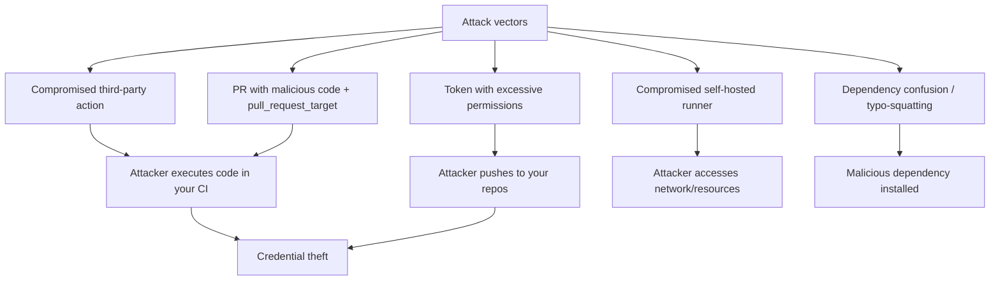
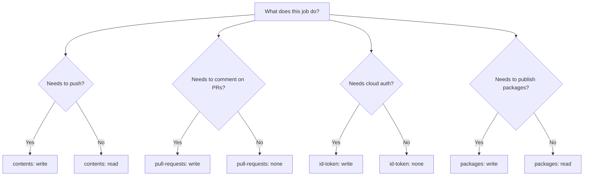
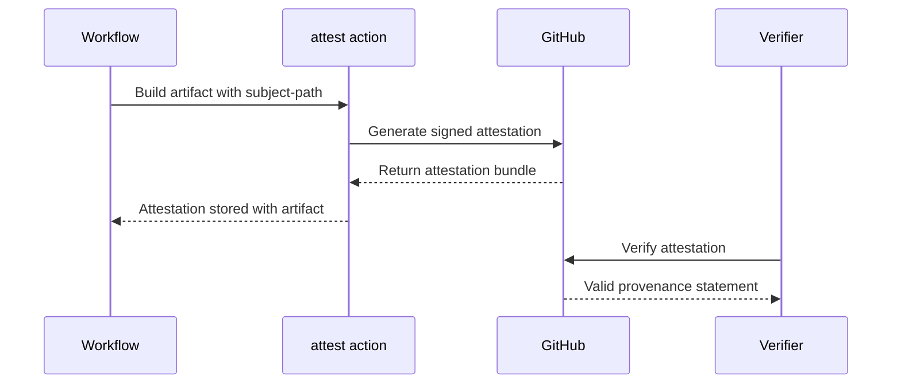
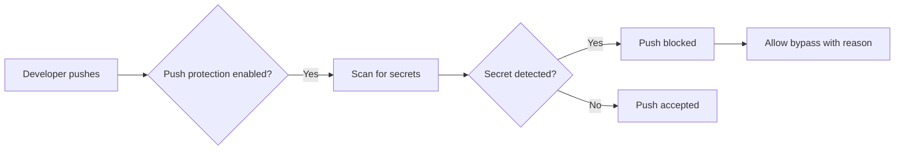

# Actions Security Hardening

> [!summary] Goal
> Harden GitHub Actions workflows — minimize token permissions, prevent supply chain attacks, secure self-hosted runners, and audit access at every layer.

## Table of Contents

1. [Why Security Matters](#why-security-matters)
2. [Principle of Least Privilege for Tokens](#principle-of-least-privilege-for-tokens)
3. [Preventing Supply Chain Attacks](#preventing-supply-chain-attacks)
4. [Build Attestation with `attest-build-provenance`](#build-attestation-with-attest-build-provenance)
5. [Securing `pull_request_target`](#securing-pullrequesttarget)
6. [Secret Exposure Prevention](#secret-exposure-prevention)
7. [Dependabot Configuration for Actions](#dependabot-configuration-for-actions)
8. [CodeQL and Dependency Review](#codeql-and-dependency-review)
9. [Security Checklist](#security-checklist)
10. [Pitfalls](#pitfalls)

---

## Why Security Matters

Actions run your code on GitHub's infrastructure — or yours. A compromised workflow can lead to credential theft, supply chain attacks, or full account takeover.



> [!tip] Definition
> **Supply chain attack**: an attack that compromises your software through its dependencies — either upstream libraries or the CI/CD pipeline itself.

---

## Principle of Least Privilege for Tokens

### Minimal `permissions:` scoping

```yaml
# DANGEROUS: every scope gets write access
permissions: write-all

# RECOMMENDED: explicit minimal scopes
permissions:
  contents: read
  pull-requests: write
  id-token: write   # only if using OIDC
```

### Token permission decision tree



### All 15 permission scopes

| Scope | `read` | `write` | Use when |
|-------|--------|---------|----------|
| `actions` | List runs | Cancel/manage runs | Workflow management |
| `checks` | View runs | Create check runs | Custom status checks |
| `contents` | Clone repo ** | Push, create releases, manage tags | CI fundamental |
| `deployments` | View | Create/update | CD pipelines |
| `discussions` | Read | Create/edit | Community interaction |
| `id-token` | — | Request OIDC JWT | Cloud provider auth |
| `issues` | Read | Create/label/close | Issue automation |
| `members` | Read org members | Manage | Org management |
| `metadata` | Read metadata | — | Default always `read` |
| `packages` | Download | Publish | Container registry |
| `pages` | Read | Build/deploy | GitHub Pages |
| `pull-requests` | View | Create/merge/label | PR automation |
| `repository-hooks` | View | Manage webhooks | Webhook management |
| `security-events` | View | Upload SARIF | CodeQL results |
| `statuses` | View | Create commit statuses | Commit status |

---

## Preventing Supply Chain Attacks

### Pin action versions by SHA

```yaml
# INSECURE: mutable branch reference
- uses: actions/checkout@main

# BETTER: major version tag (updates within major)
- uses: actions/checkout@v4

# BEST: full SHA pin (immutable)
- uses: actions/checkout@e4f7c9a
```

```mermaid
flowchart LR
    A[Action reference] --> B{Pinned how?}
    B -->|@main| C[Mutable — changes anytime]
    B -->|@v4| D[Major tag — updates within v4]
    B -->|@v4.2| E[Minor tag — updates within v4.2]
    B -->|SHA| F[Immutable — never changes]
    C --> G[Risk: breaking change without notice]
    D --> H[Moderate: review Dependabot PRs]
    F --> I[Safe: no surprise changes]
```

### Lockfile verification

```yaml
# Ensure lockfile matches package.json
- run: npm ci           # fails if lockfile is out of date
# VS:
- run: npm install      # may silently add unverified deps
```

### `hashFiles()` for dependency integrity

```yaml
# Cache key depends on lockfile — if it changes, cache is invalidated
key: npm-${{ hashFiles('package-lock.json') }}
```

---

## Build Attestation with `attest-build-provenance`

`actions/attest-build-provenance` generates verifiable signatures for build outputs:

```yaml
- uses: actions/attest-build-provenance@v1
  with:
    subject-path: |
      dist/app.tar.gz
      dist/app.sha256
```

### What attestation provides

```
Attestation includes:
- Repository and workflow that built it
- Git commit SHA
- Builder identity (GitHub Actions)
- Build instructions used
```



### Verification

```bash
# Verify an artifact's attestation
gh attestation verify dist/app.tar.gz \
  --repo owner/repo
```

### SLSA compliance

| SLSA Level | Requirement | Actions support |
|------------|-------------|-----------------|
| SLSA 1 | Provenance exists | `attest-build-provenance` |
| SLSA 2 | Signed provenance | Built-in signing |
| SLSA 3 | Hardened builder | GitHub Actions hosted runner |
| SLSA 4 | Hermetic builds | Requires additional config |

---

## Securing `pull_request_target`

`pull_request_target` runs in the base repo context with secret access. **This is the most common Actions security vulnerability.**

### Safe pattern: labeling only

```yaml
# SAFE: only labels — no checkout, no code execution
name: Label PR
on:
  pull_request_target:
    types: [opened]

jobs:
  label:
    runs-on: ubuntu-latest
    permissions:
      pull-requests: write
    steps:
      - uses: actions/labeler@v5   # runs at SHA from BASE branch
```

### Dangerous pattern: checkout + run PR code

```yaml
# DANGEROUS: never do this
on: pull_request_target
jobs:
  build:
    runs-on: ubuntu-latest
    steps:
      - uses: actions/checkout@v4        # checks out PR HEAD with secrets!
      - run: npm ci && npm test          # runs PR's code with SECRETS accessible!
```

### Safe `pull_request_target` pattern for tests

If you must run tests with environment access:

```yaml
# SAFER: checkout base, merge PR, run merged result
on: pull_request_target
jobs:
  test:
    runs-on: ubuntu-latest
    steps:
      - uses: actions/checkout@v4
        with:
          ref: refs/pull/${{ github.event.number }}/merge
      - run: npm ci && npm test
```

---

## Secret Exposure Prevention

### Never echo secrets

```yaml
# BAD — secret output in logs
- run: echo "The password is ${{ secrets.PASSWORD }}"

# GOOD — pass via env (GitHub masks secrets in logs)
- run: ./deploy.sh
  env:
    PASSWORD: ${{ secrets.PASSWORD }}
```

### Using `::add-mask::`

Mask a value that isn't automatically detected:

```yaml
- name: Mask API key
  run: |
    API_KEY=$(curl ...)
    echo "::add-mask::$API_KEY"
```

### Secret scanning + push protection



---

## Dependabot Configuration for Actions

```yaml
# .github/dependabot.yml
version: 2
updates:
  - package-ecosystem: "github-actions"
    directory: "/"
    schedule:
      interval: weekly
      day: monday
      time: "09:00"
      timezone: America/New_York
    open-pull-requests-limit: 10
    reviewers:
      - "my-team"
    labels:
      - "dependencies"
      - "github-actions"
    commit-message:
      prefix: "chore"
      include: "scope"
    allow:
      - dependency-type: "all"
    ignore:
      - dependency-name: "actions/checkout"
        versions: ["<=3"]
```

---

## CodeQL and Dependency Review

### CodeQL deep dive

```yaml
- uses: github/codeql-action/init@v3
  with:
    languages: javascript,typescript,python,java
    queries: security-and-quality
    config-file: .github/codeql/codeql-config.yml
    source-root: src

- uses: github/codeql-action/autobuild@v3
  # Auto-detects build system

- uses: github/codeql-action/analyze@v3
  with:
    category: "/language:javascript-typescript"
    output: sarif-results
    upload: true
```

### Custom CodeQL configuration

```yaml
# .github/codeql/codeql-config.yml
name: "My CodeQL config"
queries:
  - uses: security-and-quality
paths-ignore:
  - node_modules
  - dist
  - "**/*.test.js"
```

### Dependency review action

```yaml
- uses: actions/dependency-review-action@v4
  with:
    fail-on-severity: high
    deny-licenses: GPL-3.0, AGPL-3.0
```

---

## Security Checklist

- [ ] Every workflow has explicit `permissions:` (never `write-all`)
- [ ] `contents: read` is the default; `write` only when needed
- [ ] Third-party actions pinned by SHA or major version tag
- [ ] Dependabot configured for `github-actions` ecosystem
- [ ] CodeQL analysis enabled on `push` to `main`
- [ ] `pull_request_target` workflows are reviewed for unsafe checkout patterns
- [ ] OIDC used instead of static cloud keys
- [ ] Secrets are never echoed in `run:` steps
- [ ] Self-hosted runners are ephemeral (one job per runner)
- [ ] Build attestation enabled for deployable artifacts
- [ ] License/dependency review runs on PRs
- [ ] No hardcoded secrets in workflow files
- [ ] `GITHUB_TOKEN` permissions are per-job, not global

---

## Pitfalls

### Overly permissive token

```yaml
permissions: write-all  # gives every scope write access
```

**Fix**: Always set explicit `permissions:` per workflow or per job.

### Not pinning third-party actions

Using `@main` or a mutable branch means the action can change without notice.

**Fix**: Pin to a SHA or major version tag. Use Dependabot to receive update PRs.

### `GITHUB_TOKEN` in forked PRs

By default, forked PRs don't have access to `GITHUB_TOKEN` with write permissions.

**Fix**: Use `pull_request_target` for labeling/commenting, or use a PAT.

### Self-hosted runner secrets leak

If a self-hosted runner isn't ephemeral, secrets from one job can leak to the next.

**Fix**: Always use ephemeral runners (`--ephemeral` flag). Never share runners between environments.

---

> [!question]- Interview Questions
>
> **Q: What is the most dangerous pattern with `pull_request_target`?**
> A: Checking out the PR head and running its code, because the workflow has access to base repo secrets. The PR author can steal those secrets.
>
> **Q: How do you pin action versions securely?**
> A: Use full SHA for third-party actions (`uses: org/action@e4f7c9a`), major version tags for trusted first-party (`uses: actions/checkout@v4`). Never use `@main`.
>
> **Q: What is build attestation?**
> A: A signed statement from GitHub Actions that proves where, when, and how an artifact was built. Enables downstream verification with `gh attestation verify`.
>
> **Q: What are the recommended Dependabot settings for Actions?**
> A: Enable `github-actions` ecosystem in `.github/dependabot.yml` with weekly schedule. Pin action major versions. Add team reviewers for update PRs.

---

## Cross-Links

- [[CICD/GitHubActions/02_Core/01_Secrets_Environments_and_OIDC]] for OIDC and token permissions
- [[CICD/GitHubActions/01_Foundations/01_Workflow_Syntax_and_Triggers]] for `pull_request_target` security
- [[CICD/GitHubActions/03_Advanced/01_SelfHosted_Runners_and_Scaling]] for runner security
- [[CICD/03_Advanced/01_Supply_Chain_Security_SLSA_Basics]] for SLSA framework

---

## References

- [Security Hardening for GitHub Actions](https://docs.github.com/en/actions/security-guides/security-hardening-for-github-actions)
- [Using OpenID Connect](https://docs.github.com/en/actions/deployment/security-hardening-your-deployments/about-security-hardening-with-openid-connect)
- [Supply Chain Security](https://docs.github.com/en/actions/security-guides/security-hardening-for-github-actions#using-secrets)
- [Dependabot configuration](https://docs.github.com/en/code-security/dependabot/dependabot-version-updates/configuration-options-for-the-dependabot.yml-file)
- [CodeQL Action](https://github.com/github/codeql-action)
- [Build Attestation](https://github.com/actions/attest-build-provenance)
