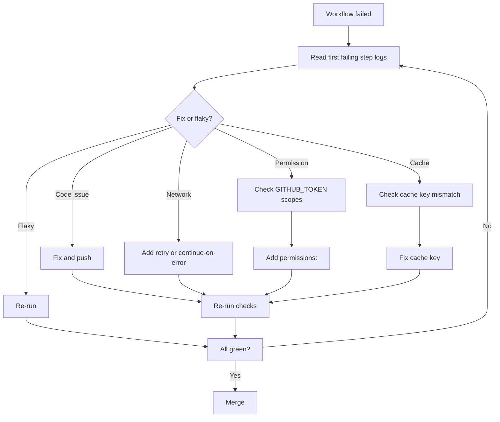
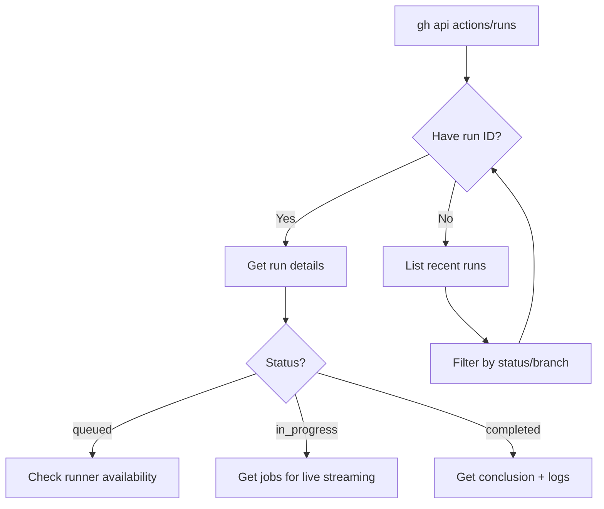

# Playbook: Troubleshoot a Failing Workflow

> [!summary] Goal
> Systematically identify the root cause of workflow failures — whether code, runner, permissions, or flaky dependencies.

## Table of Contents

1. [Systematic Triage Workflow](#systematic-triage-workflow)
2. [Reading Logs](#reading-logs)
3. [Common Failure Patterns](#common-failure-patterns)
4. [Re-run Strategies](#re-run-strategies)
5. [Actions REST API for Debugging](#actions-rest-api-for-debugging)
6. [Webhook Payload Analysis](#webhook-payload-analysis)
7. [Runner Diagnostics](#runner-diagnostics)
8. [Network Debugging](#network-debugging)
9. [Using `act` Locally](#using-act-locally)
10. [Pitfalls](#pitfalls)

---

## Systematic Triage Workflow



---

## Reading Logs

### Expand groups

Step outputs can be collapsed with `::group::` and `::endgroup::`:

```yaml
- name: Install dependencies
  run: |
    echo "::group::npm install"
    npm ci
    echo "::endgroup::"
```

### Enable debug logging

```yaml
# Re-run with debug
gh run rerun <run-id> --debug

# Or set secret ACTIONS_STEP_DEBUG: true
```

### Debug logs show:

```
##[debug]Evaluating: success()
##[debug]Result: true
##[debug]Starting: Run tests
```

---

## Common Failure Patterns

| Pattern | Log symptom | Root cause | Fix |
|---------|------------|------------|-----|
| **Permission denied** | `Resource not accessible by integration` | `GITHUB_TOKEN` lacks scope | Add `permissions:` to workflow |
| **Cache miss** | Cache not found, building from scratch | Cache key changed or evicted | Check lockfile hash, set `restore-keys` |
| **OOM** | `exit code 137` | Runner ran out of memory | Reduce parallelism, split test files |
| **Network timeout** | `ETIMEDOUT`, `ECONNRESET` | External service unavailable | Add retry: `continue-on-error: true` |
| **Flaky test** | Intermittent failure, same code | Test order dep, timing, race | Quarantine test, increase timeout |
| **Secret not found** | `secret is required but not set` | Secret not created | Create secret at repo/org/environment level |
| **YAML syntax** | `Invalid workflow file` | Bad YAML formatting | Validate locally: `yamllint` |
| **Dependency install** | `npm ERR! 404`, `pip install error` | Package version removed | Pin exact versions, use lockfile |
| **Matrix explosion** | 36 jobs running, runner queue | `matrix` combinations too large | Reduce matrix, use `max-parallel` |
| **`sudo: not found`** | `sudo: command not found` | Running as root container | Remove `sudo` from `run:` steps |

---

## Re-run Strategies

| Re-run type | When to use | Command |
|-------------|-------------|---------|
| **Re-run all jobs** | Clean slate needed | `gh run rerun <run-id>` |
| **Re-run failed jobs** | Flaky failure, others succeeded | `gh run rerun <run-id> --failed` |
| **Re-run with debug** | Need verbose logs | `gh run rerun <run-id> --debug` |
| **Re-run single job** | Specific job failed | UI: click job → "Re-run job" |
| **Retry from failed step** | Step had transient failure | UI: failed step → "Retry" |

---

## Actions REST API for Debugging

```bash
# Get all runs for a workflow
gh api /repos/:owner/:repo/actions/workflows/ci.yml/runs --paginate

# Get specific run details (duration, status, conclusion)
gh api /repos/:owner/:repo/actions/runs/<run-id> --jq '{status, conclusion, run_started_at, updated_at}'

# List jobs in a run with status
gh api /repos/:owner/:repo/actions/runs/<run-id>/jobs --jq '.jobs[] | {name, status, conclusion, started_at}'

# Download logs for offline analysis
gh api /repos/:owner/:repo/actions/runs/<run-id>/logs > logs.zip

# List artifacts
gh api /repos/:owner/:repo/actions/runs/<run-id>/artifacts

# Cancel stuck runs
gh api /repos/:owner/:repo/actions/runs/<run-id>/cancel -X POST
```



---

## Webhook Payload Analysis

The full event payload is available via `github.event` context:

```yaml
- name: Debug event payload
  run: |
    echo '${{ toJSON(github.event) }}' > event.json
    cat event.json | jq '.action, .pull_request.title, .pull_request.head.ref' 2>/dev/null || true
```

### Common webhook fields to inspect

```yaml
# For pull_request events
github.event.action              # opened, synchronize, closed
github.event.pull_request.title  # PR title
github.event.pull_request.head.ref  # head branch name
github.event.pull_request.base.ref  # base branch name
github.event.pull_request.labels   # label objects

# For push events
github.event.commits            # array of commit objects
github.event.head_commit.message # commit message
github.event.ref                # refs/heads/branch-name

# For issue events
github.event.issue.title
github.event.issue.labels
```

---

## Runner Diagnostics

Check the runner environment at the start of a job:

```yaml
- name: Runner diagnostics
  run: |
    echo "=== Runner Info ==="
    echo "OS: ${{ runner.os }}"
    echo "Arch: ${{ runner.arch }}"
    echo "Name: ${{ runner.name }}"
    echo "Temp: ${{ runner.temp }}"
    echo "Tool cache: ${{ runner.tool_cache }}"
    echo ""
    echo "=== Disk Space ==="
    df -h /
    echo ""
    echo "=== Available Memory ==="
    free -h || vm_stat
    echo ""
    echo "=== Tools ==="
    node --version 2>/dev/null || echo "No Node"
    python3 --version 2>/dev/null || echo "No Python3"
    java -version 2>&1 | head -1 || echo "No Java"
    go version 2>/dev/null || echo "No Go"
    docker --version 2>/dev/null || echo "No Docker"
```

### Common runner issues

| Symptom | Check | Fix |
|---------|-------|-----|
| Disk full | `df -h` | Clean temp, prune Docker, remove old artifacts |
| OOM | `free -h` or `vm_stat` | Reduce parallelism, add swap |
| Missing tool | `which <tool>` | Add setup step: `actions/setup-*` |
| Permission denied | `ls -la` | Check file ownership, use `sudo` carefully |

---

## Network Debugging

```yaml
- name: Network diagnostics
  run: |
    echo "=== DNS Resolution ==="
    nslookup api.github.com
    echo ""
    echo "=== Connectivity ==="
    curl -s -o /dev/null -w "%{http_code}" https://api.github.com
    echo ""
    echo "=== Latency ==="
    ping -c 3 github.com 2>/dev/null || echo "ping not available"
    echo ""
    echo "=== Outbound IP ==="
    curl -s https://api.ipify.org
```

### Debugging connectivity to external services

```yaml
- name: Check external service
  run: |
    # Check if a required service is reachable
    curl -v --max-time 5 https://my-service.example.com/health
    # Check port connectivity
    nc -zv my-db.example.com 5432 || echo "Port 5432 not reachable"
```

---

## Using `act` Locally

`act` runs GitHub Actions workflows locally, useful for testing before pushing.

```bash
# Install
brew install act

# Run all jobs
act

# Run specific job
act -j test

# Run with specific event
act pull_request

# Use self-hosted runner image
act --container-architecture linux/amd64 --pull=false
```

```yaml
# .actrc (config file)
-P ubuntu-latest=ghcr.io/catthehacker/ubuntu:act-latest
--reuse
```

---

## Cross-Links

- [[CICD/GitHubActions/01_Foundations/01_Workflow_Syntax_and_Triggers]] for event debugging
- [[CICD/GitHubActions/02_Core/01_Secrets_Environments_and_OIDC]] for permission debugging
- [[CICD/GitHub/04_Playbooks/01_Handle_Failing_Checks_and_Required_Reviews]] for review/check failures
