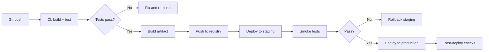
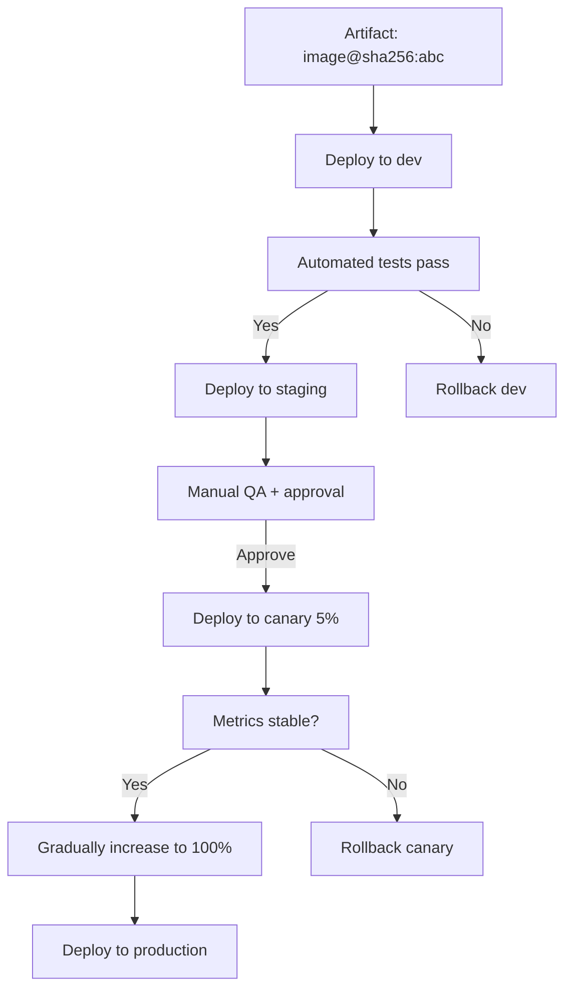
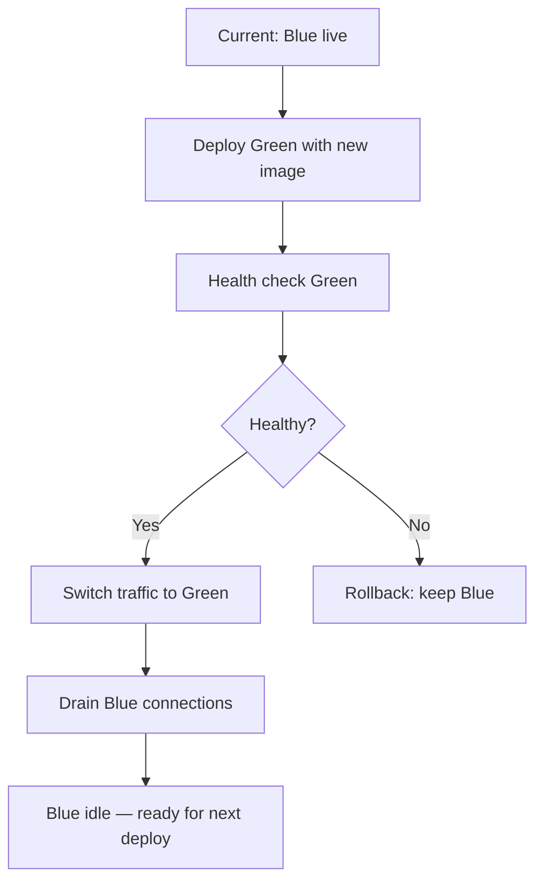
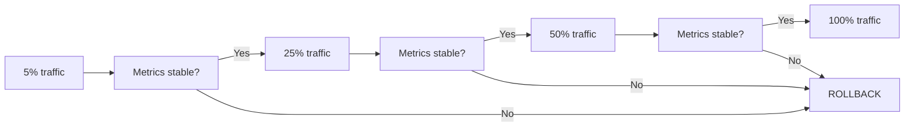

# Playbook: Deploy Environments and Promotion Strategies

> [!summary] Goal
> Design a deployment pipeline that promotes artifacts through environments with safety gates — from build through staging, canary, and production.

## Table of Contents

1. [CI/CD Deploy Pipeline](#ci-cd-deploy-pipeline)
2. [Environment Promotion Strategy](#environment-promotion-strategy)
3. [Docker Build and Push in Actions](#docker-build-and-push-in-actions)
4. [ECS Deploy](#ecs-deploy)
5. [GitHub Pages Deploy](#github-pages-deploy)
6. [Pitfalls](#pitfalls)

---

## CI/CD Deploy Pipeline



### Pipeline phases

| Phase | Action | Environment |
|-------|--------|-------------|
| Build | `docker/build-push-action` | CI |
| Test | Unit tests, lint, integration | CI |
| Push | Image to ECR/GHCR/Docker Hub | Registry |
| Deploy staging | `aws-actions/amazon-ecs-deploy-task-definition` | Staging |
| Smoke test | `curl` health endpoint, check metrics | Staging |
| Deploy production | Same action, production environment | Production |
| Post-deploy | Check error rate, latency, uptime | Production |

---

## Environment Promotion Strategy



### GitHub Actions environments

```yaml
jobs:
  deploy-dev:
    environment: development
    steps:
      - run: echo "Deploy to dev"

  deploy-staging:
    needs: deploy-dev
    environment: staging
    steps:
      - run: echo "Deploy to staging"

  deploy-prod:
    needs: deploy-staging
    environment:
      name: production
      url: https://app.example.com
    steps:
      - run: echo "Deploy to production"
```

---

## Docker Build and Push in Actions

```yaml
jobs:
  build-and-push:
    runs-on: ubuntu-latest
    permissions:
      contents: read
      packages: write
      id-token: write
    steps:
      - uses: actions/checkout@v4

      - uses: docker/setup-buildx-action@v3

      - uses: docker/login-action@v3
        with:
          registry: ${{ vars.REGISTRY }}
          username: ${{ vars.REGISTRY_USER }}
          password: ${{ secrets.REGISTRY_TOKEN }}

      - uses: docker/build-push-action@v5
        id: build
        with:
          context: .
          push: true
          tags: |
            ${{ vars.REGISTRY }}/${{ github.repository }}:latest
            ${{ vars.REGISTRY }}/${{ github.repository }}:${{ github.sha }}
          cache-from: type=gha
          cache-to: type=gha,mode=max
          sbom: true
          provenance: true

      - name: Image digest
        run: echo "Digest ${{ steps.build.outputs.digest }}"
```

---

## ECS Deploy

```yaml
jobs:
  deploy-ecs:
    runs-on: ubuntu-latest
    needs: build-and-push
    environment: production
    steps:
      - uses: aws-actions/configure-aws-credentials@v4
        with:
          role-to-assume: arn:aws:iam::123456:role/deploy-role
          aws-region: us-east-1

      - uses: aws-actions/amazon-ecs-render-task-definition@v1
        id: render
        with:
          task-definition: task-definition.json
          container-name: my-app
          image: ${{ vars.REGISTRY }}/my-app:${{ github.sha }}

      - uses: aws-actions/amazon-ecs-deploy-task-definition@v2
        with:
          task-definition: ${{ steps.render.outputs.task-definition }}
          service: my-app-service
          cluster: my-cluster
          wait-for-service-stability: true
```

---

## GitHub Pages Deploy

```yaml
name: Deploy to GitHub Pages
on:
  push:
    branches: [main]

permissions:
  contents: read
  pages: write
  id-token: write

jobs:
  deploy:
    runs-on: ubuntu-latest
    environment:
      name: github-pages
      url: ${{ steps.deployment.outputs.page_url }}
    steps:
      - uses: actions/checkout@v4
      - run: npm ci && npm run build
      - uses: actions/configure-pages@v4
      - uses: actions/upload-pages-artifact@v3
        with:
          path: ./dist
      - id: deployment
        uses: actions/deploy-pages@v4
```

---

## Pitfalls

### Image tag collision

Using the same tag (e.g., `latest`) for different commits makes rollback ambiguous.

**Fix**: Tag images with the commit SHA (`${{ github.sha }}`). Use `latest` only as a convenience alias.

### Deploy failure with no rollback

When a deploy fails half-way, the service may be in an inconsistent state.

**Fix**: Use `wait-for-service-stability` (ECS), blue/green deployments, or automate rollback on failure.

### Environment promotion gaps

Skipping environments (deploying directly from dev to prod) bypasses validation.

**Fix**: Use `needs:` and `environment:` to enforce pipeline order.

---

## Blue/Green Deploy Workflow

```yaml
jobs:
  deploy-bluegreen:
    runs-on: ubuntu-latest
    environment: production
    steps:
      - uses: aws-actions/configure-aws-credentials@v4
        with:
          role-to-assume: arn:aws:iam::123456:role/deploy-role
          aws-region: us-east-1

      # Deploy to green target group
      - uses: aws-actions/amazon-ecs-render-task-definition@v1
        id: render-green
        with:
          task-definition: task-definition.json
          container-name: my-app
          image: ${{ vars.REGISTRY }}/my-app:${{ github.sha }}

      - uses: aws-actions/amazon-ecs-deploy-task-definition@v2
        with:
          task-definition: ${{ steps.render-green.outputs.task-definition }}
          service: my-app-service
          cluster: my-cluster

      # Health check the new version
      - name: Health check green
        run: |
          for i in $(seq 1 30); do
            curl -sf https://green.app.example.com/health && break
            sleep 5
          done

      # Switch traffic from blue to green
      - run: |
          aws elbv2 modify-listener --listener-arn ${{ vars.LISTENER_ARN }} \
            --default-actions Type=forward,TargetGroupArn=${{ vars.GREEN_TG_ARN }}

      # Drain blue
      - run: |
          aws elbv2 deregister-targets --target-group-arn ${{ vars.BLUE_TG_ARN }}
```



---

## Canary Deploy Workflow

```yaml
jobs:
  canary:
    runs-on: ubuntu-latest
    environment: production
    steps:
      - uses: aws-actions/configure-aws-credentials@v4
        with:
          role-to-assume: arn:aws:iam::123456:role/deploy-role
          aws-region: us-east-1

      # Deploy canary (5% traffic)
      - run: |
          aws eks update-service --canary-percent 5 --image ${{ vars.REGISTRY }}/my-app:${{ github.sha }}

      # Monitor error rate for 5 minutes
      - run: |
          for i in $(seq 1 30); do
            ERROR_RATE=$(aws cloudwatch get-metric-statistics --metric-name Errors --period 10)
            if [ "$ERROR_RATE" -gt "1" ]; then
              echo "Error rate spike! Rolling back..."
              exit 1
            fi
            sleep 10
          done

      # Gradual increase
      - run: aws eks update-service --canary-percent 25
      - run: sleep 120
      - run: aws eks update-service --canary-percent 50
      - run: sleep 120
      - run: aws eks update-service --canary-percent 100
```



---

## Rollback Automation

```yaml
jobs:
  deploy:
    runs-on: ubuntu-latest
    steps:
      - id: deploy
        run: ./deploy.sh ${{ github.sha }}

  rollback:
    needs: deploy
    if: failure()
    runs-on: ubuntu-latest
    steps:
      - uses: aws-actions/configure-aws-credentials@v4
        with:
          role-to-assume: arn:aws:iam::123456:role/deploy-role
          aws-region: us-east-1
      - run: ./rollback.sh ${{ github.sha }}
      - run: |
          echo "Rollback complete. Previous version restored."
```

---

## Helm/Kustomize Deploy

```yaml
jobs:
  helm-deploy:
    runs-on: ubuntu-latest
    steps:
      - uses: actions/checkout@v4
      - uses: azure/setup-helm@v4
        with:
          version: "3.15.0"
      - run: |
          helm upgrade --install my-app ./charts/my-app \
            --namespace production \
            --set image.tag=${{ github.sha }} \
            --wait --timeout 5m
```

---

## Serverless Deploy (AWS Lambda)

```yaml
jobs:
  serverless-deploy:
    runs-on: ubuntu-latest
    steps:
      - uses: actions/checkout@v4
      - uses: aws-actions/configure-aws-credentials@v4
        with:
          role-to-assume: arn:aws:iam::123456:role/deploy-role
          aws-region: us-east-1
      - run: |
          aws lambda update-function-code \
            --function-name my-function \
            --zip-file fileb://function.zip
```

---

> [!question]- Interview Questions
>
> **Q: What is the difference between CI and CD in a pipeline?**
> A: CI (Continuous Integration) builds and tests code on every push. CD (Continuous Deployment) takes the verified artifact and deploys it to production automatically.
>
> **Q: How do you promote an artifact through environments?**
> A: Build once (`docker/build-push-action`), tag with the commit SHA. Reference the same image in each environment. Promote by changing which image tag the service runs.

---

## Cross-Links

- [[CICD/GitHubActions/01_Foundations/05_Common_Actions_and_the_Marketplace]] for Docker/cloud auth actions
- [[CICD/GitHubActions/02_Core/01_Secrets_Environments_and_OIDC]] for environment protection
- [[CICD/02_Core/01_Deployment_Strategies]] for strategy comparison (blue/green, canary, rolling)
