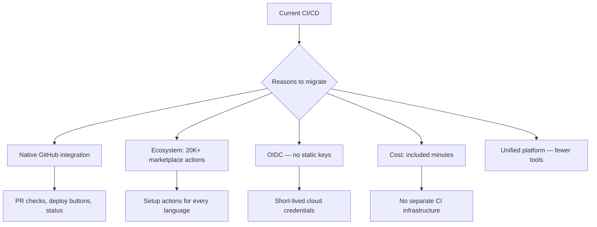
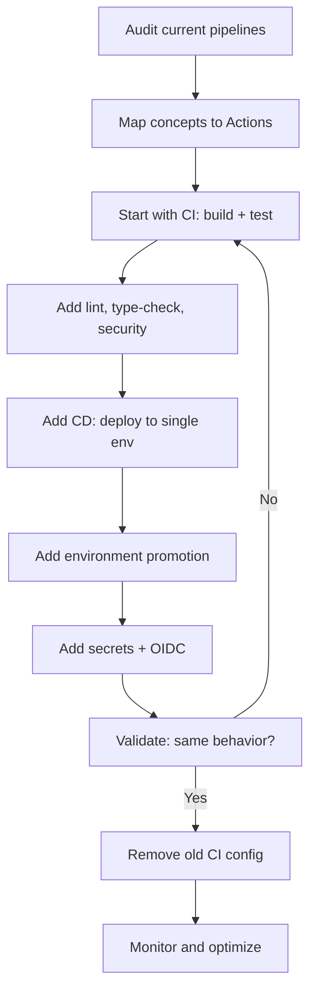

# Playbook: Migrating to GitHub Actions

> [!summary] Goal
> Migrate existing CI/CD pipelines from Jenkins, CircleCI, Travis CI, or GitLab CI to GitHub Actions — mapping concepts, converting YAML, and avoiding common migration mistakes.

## Table of Contents

1. [Why Migrate](#why-migrate)
2. [Concept Mapping Across Tools](#concept-mapping-across-tools)
3. [Migration Workflow](#migration-workflow)
4. [Jenkins to GitHub Actions](#jenkins-to-github-actions)
5. [CircleCI to GitHub Actions](#circleci-to-github-actions)
6. [Travis CI to GitHub Actions](#travis-ci-to-github-actions)
7. [GitLab CI to GitHub Actions](#gitlab-ci-to-github-actions)
8. [Common Migration Mistakes](#common-migration-mistakes)
9. [Pitfalls](#pitfalls)

---

## Why Migrate



---

## Concept Mapping Across Tools

| GitHub Actions | Jenkins | CircleCI | Travis CI | GitLab CI |
|---------------|---------|----------|-----------|-----------|
| **workflow** | Pipeline | Pipeline | `.travis.yml` | `.gitlab-ci.yml` |
| **job** | Stage/Job | Job | Job | Job |
| **step** | Step | Step | Script | Script |
| **`runs-on`** | Agent/Label | Executor | `dist`/`os` | `image`/`tags` |
| **`needs:`** | `dependsOn` | `requires` | `stage:` order | `needs:` |
| **`actions/checkout`** | SCM checkout | `checkout` | `git clone` (built-in) | `GIT_STRATEGY` |
| **`uses:`** | Shared Library | Orb | `before_install` plugin | `include` template |
| **`strategy.matrix`** | Matrix/Parallel | Matrix | `matrix` | `parallel:matrix` |
| **`actions/cache`** | Cache plugin | `save_cache`/`restore_cache` | `cache:` | `cache:` |
| **`secrets`** | Credentials | Environment variables | Encrypted vars | CI/CD variables |
| **`env`** | `environmentVariables` | `environment` | `env:` | `variables` |
| **`artifacts`** | Archive artifacts | `store_artifacts` | `deploy:` provider | `artifacts:` |
| **`needs:` + `if:`** | `when` condition | `when` | `if:` | `rules:` |
| **`on: schedule`** | Cron trigger | Triggers | `cron:` | `schedule` |
| **`environment`** | CD plugin | Context | — | Environment |

---

## Migration Workflow



### Step 1: Audit

```
Current CI:
- Build: npm ci, npm run build → 2 min
- Lint: eslint → 1 min  
- Test: vitest → 3 min
- Deploy: scp to server → 30 sec
- Frequency: every push to main
```

### Step 2: Map to Actions

```
- Build → job with actions/setup-node + run npm build
- Lint → job parallel to build
- Test → job depends on build (needs build)
- Deploy → job depends on test, uses environment: production
- Trigger → on: push branches: [main]
```

---

## Jenkins to GitHub Actions

### Jenkinsfile Pipeline

```groovy
pipeline {
    agent { label 'linux' }
    stages {
        stage('Build') {
            steps {
                sh 'npm ci && npm run build'
            }
        }
        stage('Test') {
            steps {
                sh 'npm test'
            }
        }
        stage('Deploy') {
            when { branch 'main' }
            steps {
                sh './deploy.sh'
            }
        }
    }
    post {
        always { cleanWs() }
    }
}
```

### Equivalent GitHub Actions

```yaml
name: CI/CD
on:
  push:
    branches: [main]
  pull_request:

jobs:
  build:
    runs-on: ubuntu-latest
    steps:
      - uses: actions/checkout@v4
      - uses: actions/setup-node@v4
        with:
          node-version: 20
          cache: npm
      - run: npm ci && npm run build

  test:
    needs: build
    runs-on: ubuntu-latest
    steps:
      - uses: actions/checkout@v4
      - uses: actions/setup-node@v4
        with:
          node-version: 20
          cache: npm
      - run: npm ci && npm test

  deploy:
    if: github.ref_name == 'main'
    needs: [build, test]
    runs-on: ubuntu-latest
    environment: production
    steps:
      - uses: actions/checkout@v4
      - run: ./deploy.sh
```

### Key mapping

| Jenkins | GitHub Actions | Notes |
|---------|---------------|-------|
| `agent` | `runs-on` | Same concept |
| `stage` | Job | Each stage becomes a separate job |
| `steps` | `steps` | Identical concept |
| `post { always }` | `if: always()` | Cleanup steps |
| Jenkins credentials | `secrets.X` | GitHub Secrets |
| Shared library | Reusable workflow/composite | Same reusability |

---

## CircleCI to GitHub Actions

### CircleCI Config

```yaml
version: 2.1
orbs:
  node: circleci/node@5.1.0
jobs:
  build:
    executor: node/default
    steps:
      - checkout
      - node/install-packages
      - run: npm run build
  test:
    executor: node/default
    steps:
      - checkout
      - node/install-packages
      - run: npm test
workflows:
  ci:
    jobs:
      - build
      - test:
          requires: [build]
```

### Equivalent GitHub Actions

```yaml
name: CI
on: [push, pull_request]

jobs:
  build:
    runs-on: ubuntu-latest
    steps:
      - uses: actions/checkout@v4
      - uses: actions/setup-node@v4
        with:
          node-version: 20
          cache: npm
      - run: npm ci && npm run build

  test:
    needs: build
    runs-on: ubuntu-latest
    steps:
      - uses: actions/checkout@v4
      - uses: actions/setup-node@v4
        with:
          node-version: 20
          cache: npm
      - run: npm ci && npm test
```

### Key mapping

| CircleCI | GitHub Actions | Notes |
|----------|---------------|-------|
| Executor | `runs-on` | `node/default` → `ubuntu-latest` |
| Orb | Reusable workflow / action | `circleci/node` → `actions/setup-node` |
| `requires` | `needs:` | Same dependency concept |
| `save_cache`/`restore_cache` | `actions/cache` | Same caching logic |
| Contexts | Environments | Environment-level secrets + protection |
| Workspaces | Artifacts | `persist_to_workspace` → `upload-artifact` |

---

## Travis CI to GitHub Actions

### `.travis.yml`

```yaml
language: node_js
node_js:
  - 18
  - 20
  - 22
cache: npm
script:
  - npm run lint
  - npm test
```

### Equivalent GitHub Actions

```yaml
name: CI
on: [push, pull_request]

jobs:
  ci:
    strategy:
      matrix:
        node: [18, 20, 22]
    runs-on: ubuntu-latest
    steps:
      - uses: actions/checkout@v4
      - uses: actions/setup-node@v4
        with:
          node-version: ${{ matrix.node }}
          cache: npm
      - run: npm ci
      - run: npm run lint
      - run: npm test
```

### Key mapping

| Travis CI | GitHub Actions | Notes |
|-----------|---------------|-------|
| `language:` | `setup-*` actions | Explicit setup per language |
| `node_js: [18, 20]` | `strategy.matrix.node` | Same multi-version testing |
| `cache: npm` | `actions/setup-node cache: npm` | Simpler in Actions |
| `script:` | Steps in job | Ordered steps |
| `deploy:` provider | `environment:` + deploy actions | More explicit in Actions |
| `addons:` | `services:` | Service containers |

---

## GitLab CI to GitHub Actions

### `.gitlab-ci.yml`

```yaml
image: node:20

stages:
  - build
  - test
  - deploy

build:
  stage: build
  script:
    - npm ci
    - npm run build
  artifacts:
    paths:
      - dist/

test:
  stage: test
  script:
    - npm ci
    - npm test

deploy:
  stage: deploy
  script:
    - ./deploy.sh
  only:
    - main
  environment: production
```

### Equivalent GitHub Actions

```yaml
name: CI/CD
on:
  push:
    branches: [main]
  pull_request:

jobs:
  build:
    runs-on: ubuntu-latest
    steps:
      - uses: actions/checkout@v4
      - uses: actions/setup-node@v4
        with:
          node-version: 20
          cache: npm
      - run: npm ci && npm run build
      - uses: actions/upload-artifact@v4
        with:
          name: dist
          path: dist/

  test:
    needs: build
    runs-on: ubuntu-latest
    steps:
      - uses: actions/checkout@v4
      - uses: actions/setup-node@v4
        with:
          node-version: 20
          cache: npm
      - run: npm ci && npm test

  deploy:
    if: github.ref_name == 'main'
    needs: [build, test]
    runs-on: ubuntu-latest
    environment: production
    steps:
      - uses: actions/download-artifact@v4
        with:
          name: dist
      - run: ./deploy.sh
```

### Key mapping

| GitLab CI | GitHub Actions | Notes |
|-----------|---------------|-------|
| `image:` | `container:` in job | Service containers |
| `stages:` | `needs:` between jobs | Stage order → dependency graph |
| `artifacts:` | `actions/upload-artifact` | Same concept |
| `only: main` | `if: github.ref_name == 'main'` | Conditional execution |
| `environment:` | `environment:` | Same deployment environment |
| `rules:` | `if:` | Conditional logic |
| `include:` | Reusable workflow / composite | Template reuse |

---

## Common Migration Mistakes

| Mistake | Problem | Fix |
|---------|---------|-----|
| **Event trigger mismatch** | CI doesn't run on expected events | Map `only:`/`branches:`/`trigger:` exactly to `on:` |
| **Matrix format difference** | Only one version runs | Use `strategy.matrix` exactly matching old config |
| **Missing `fetch-depth`** | Git history limited to 1 commit | Set `fetch-depth: 0` for full history (needed for monorepo tools) |
| **Secret scoping different** | Secrets not available in PRs | Use `pull_request_target` carefully or pass via env |
| **Concurrency behavior** | Parallel runs conflict | Add `concurrency.group:` matching old behavior |
| **Cache key mismatch** | Cache miss every time | Match `key:` exactly to the old cache keys |
| **Artifact retention** | Artifacts expire too fast | Set `retention-days:` matching old policy |
| **Runner environment diff** | Different tools pre-installed | Check GitHub runner software list; use `setup-*` actions |
| **Environment promotion missing** | No gating between dev/prod | Add `environment:` with protection rules |
| **Rollback plan absent** | Old CI had rollback, new one doesn't | Add `if: failure()` rollback steps |

---

## Pitfalls

### Different variable syntax

```bash
# Jenkins: env.MY_VAR
# CircleCI: $MY_VAR
# GitLab: $MY_VAR
# GitHub Actions: ${{ env.MY_VAR }}
```

### Orbs vs actions

CircleCI orbs bundle multiple jobs. In Actions, you typically compose existing actions rather than using pre-built job bundles.

### Shared library complexity

Jenkins shared libraries are Groovy. GitHub Actions composite actions are YAML — simpler but less programmable.

---

> [!question]- Interview Questions
>
> **Q: What is the key difference between Jenkins stages and GitHub Actions jobs?**
> A: Jenkins stages run sequentially within a single agent. GitHub Actions jobs run in parallel by default and can run on different runners. Map each Jenkins stage to a separate job with `needs:`.
>
> **Q: How do you migrate CircleCI orbs to GitHub Actions?**
> A: Orbs bundle multiple jobs/config snippets. In Actions, use the underlying actions directly (e.g., `actions/setup-node` instead of `circleci/node` orb) and compose them in your workflow.

---

## Cross-Links

- [[CICD/GitHubActions/01_Foundations/01_Workflow_Syntax_and_Triggers]] for event triggers
- [[CICD/GitHubActions/02_Core/02_Reusable_Workflows_and_Composite_Actions]] for shared library patterns
- [[CICD/GitHubActions/01_Foundations/05_Common_Actions_and_the_Marketplace]] for setup actions
