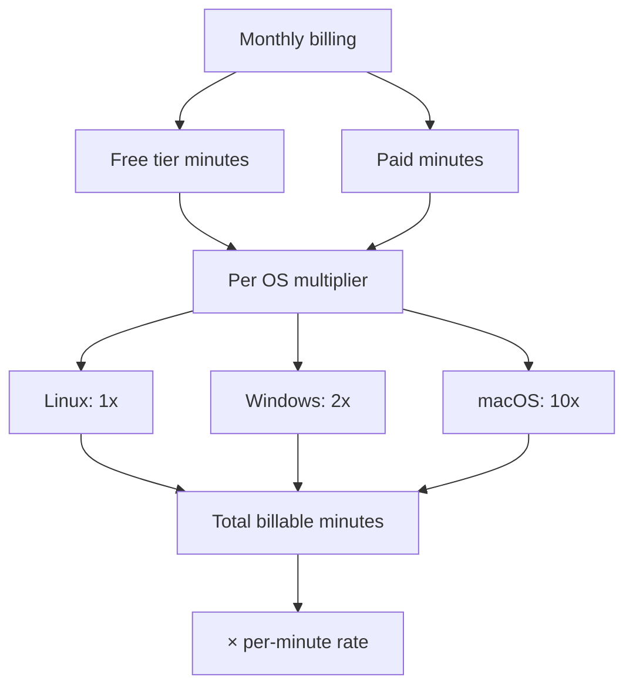
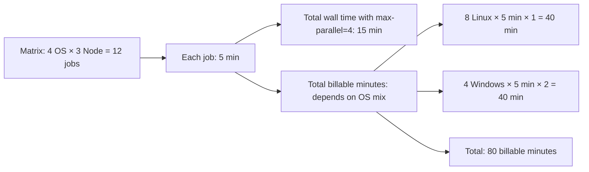
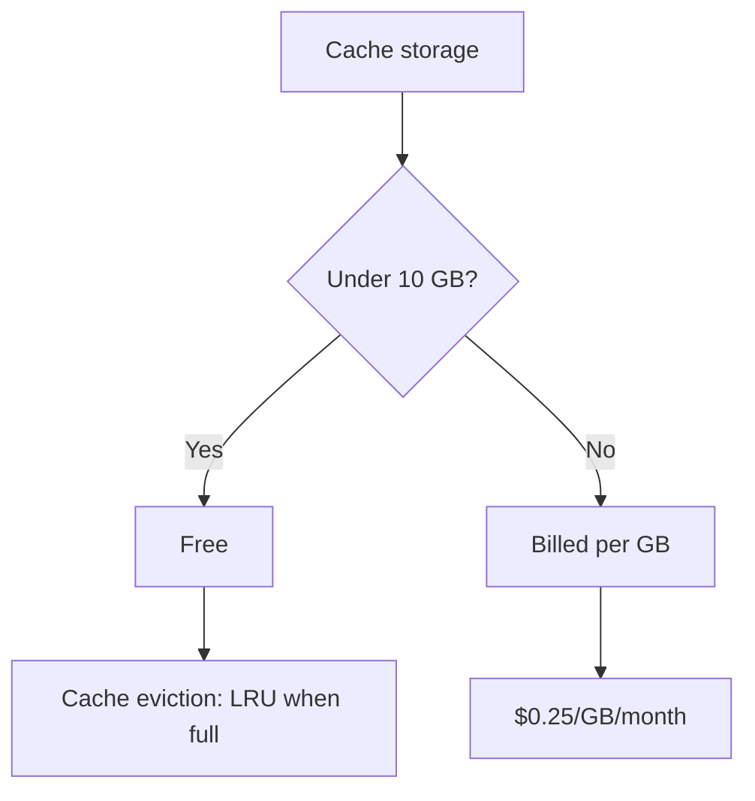
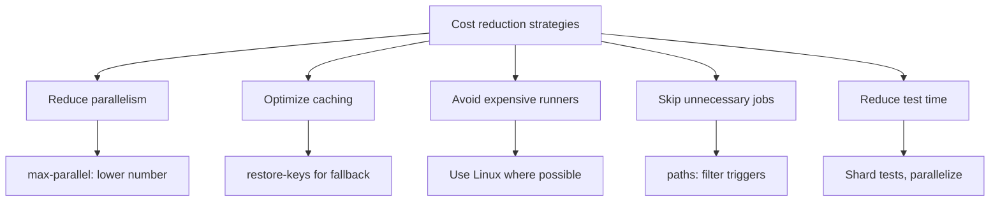

# Playbook: Actions Billing and Cost Management

> [!summary] Goal
> Understand GitHub Actions billing, estimate costs accurately, optimize parallel jobs and storage, and set spending limits to avoid surprises.

## Table of Contents

1. [How Billing Works](#how-billing-works)
2. [What Consumes Minutes](#what-consumes-minutes)
3. [Storage Costs](#storage-costs)
4. [Estimating CI Costs](#estimating-ci-costs)
5. [Reducing CI Costs](#reducing-ci-costs)
6. [Setting Spending Limits](#setting-spending-limits)
7. [Monitoring Usage](#monitoring-usage)
8. [Pitfalls](#pitfalls)

---

## How Billing Works

GitHub Actions billing is based on **minutes of execution time** and **storage usage**, with different multipliers for different operating systems.



### Free tier (per month)

| Plan | Minutes | Storage | Concurrent jobs |
|------|---------|---------|-----------------|
| **Public repos** | Unlimited | Unlimited | Unlimited |
| **Free (private)** | 2,000 min | 500 MB | 20 |
| **Team** | 3,000 min | 2 GB | 60 |
| **Enterprise** | 50,000 min | 50 GB | 180 |

> [!tip] Definition
> **Billable minutes**: the wall-clock time of each job multiplied by the OS multiplier. If a job runs for 5 minutes on a macOS runner, it consumes 5 × 10 = 50 billable minutes.

---

## What Consumes Minutes

### Job execution time

```
Billable minutes = (job duration in minutes) × (OS multiplier)
```

| Runner | Multiplier | 10-min job → billable |
|--------|-----------|----------------------|
| `ubuntu-latest` | ×1 | 10 minutes |
| `windows-latest` | ×2 | 20 minutes |
| `macos-latest` | ×10 | 100 minutes |

### Parallelism impact



### What does NOT consume minutes

- Workflow storage
- Artifact storage (separate billing)
- Cache storage (up to 10 GB, then billed)
- Minutes between queued and running state

---

## Storage Costs

### Artifact storage

| Plan | Included | Overage rate (per GB/month) |
|------|----------|---------------------------|
| Free | 500 MB | $0.25/GB |
| Team | 2 GB | $0.25/GB |
| Enterprise | 50 GB | $0.25/GB |

### Reducing storage costs

```yaml
# Set short retention on artifacts that aren't needed long-term
- uses: actions/upload-artifact@v4
  with:
    name: build-output
    retention-days: 7    # delete after a week
```

### Cache storage

The first 10 GB of cache storage is free. After that, it's billed at the same rate as artifacts.



---

## Estimating CI Costs

### Formula

```
Monthly billable minutes =
  sum over all jobs of (avg_job_minutes × jobs_per_day × 30 × os_multiplier)

Monthly artifact cost =
  total_artifact_storage_GB × $0.25
```

### Example calculation

| Job | Runners | Duration | Jobs/day | OS multiplier | Monthly min |
|-----|---------|----------|----------|---------------|-------------|
| Build+test | Linux | 8 min | 100 | ×1 | 24,000 |
| Lint | Linux | 3 min | 100 | ×1 | 9,000 |
| Deploy | Linux | 5 min | 10 | ×1 | 1,500 |
| E2E tests | Windows | 15 min | 20 | ×2 | 18,000 |
| **Total** | | | | | **52,500 min** |

On a Teams plan (3,000 free minutes): 52,500 - 3,000 = **49,500 overage minutes**

### Cost optimization targets

| Metric | Healthy | Warning | Critical |
|--------|---------|---------|----------|
| CI time per PR | <10 min | 10-20 min | >20 min |
| Cache hit rate | >80% | 50-80% | <50% |
| Free tier usage | <80% | 80-100% | >100% (paying) |
| Artifact storage | <80% free tier | 80-100% | > free tier |

---

## Reducing CI Costs



### Strategy 1: Limit parallelism

```yaml
strategy:
  matrix:
    node: [18, 20, 22]
  max-parallel: 2   # only 2 concurrent at a time
```

### Strategy 2: Optimize caching

```yaml
- uses: actions/cache@v4
  with:
    path: ~/.npm
    key: npm-${{ runner.os }}-${{ hashFiles('package-lock.json') }}
    restore-keys: |
      npm-${{ runner.os }}-    # fallback to any previous cache
```

### Strategy 3: Filter by paths

```yaml
on:
  push:
    paths:
      - "src/**"
      - "tests/**"
      - "package.json"
    paths-ignore:
      - "docs/**"
      - "*.md"
```

### Strategy 4: Conditional job skipping

```yaml
# Only run expensive integration tests when relevant files change
jobs:
  detect:
    runs-on: ubuntu-latest
    outputs:
      run-integration: ${{ steps.check.outputs.run }}
    steps:
      - id: check
        run: |
          git diff --name-only HEAD^ HEAD | grep -q "^tests/integration/" && \
          echo "run=true" >> $GITHUB_OUTPUT || \
          echo "run=false" >> $GITHUB_OUTPUT

  integration:
    needs: detect
    if: needs.detect.outputs.run-integration == 'true'
    runs-on: ubuntu-latest
    steps:
      - run: npm run test:integration
```

### Strategy 5: Use `workflow_dispatch` for expensive jobs

Run expensive jobs (E2E, performance tests) only on demand:

```yaml
on:
  workflow_dispatch:
    inputs:
      run-e2e:
        description: "Run E2E tests"
        type: boolean
        default: false

jobs:
  e2e:
    if: inputs.run-e2e
    runs-on: ubuntu-latest
    steps:
      - run: npm run test:e2e
```

---

## Setting Spending Limits

### Via GitHub UI

```
Settings → Billing and plans → Monthly spending limit
```

### Via API

```bash
# Set a spending limit of $50/month
gh api /orgs/:org/settings/billing/actions --method PATCH \
  --field included_minutes=3000 \
  --field included_storage_gb=2
```

---

## Monitoring Usage

### CLI

```bash
# Current month usage
gh api /orgs/:org/settings/billing/actions

# Usage breakdown by day
gh api /repos/:owner/:repo/actions/runs --paginate | jq '.workflow_runs | length'
```

### Setting up alerts

Use the `workflow_run` event to trigger a notification when a workflow exceeds expected duration:

```yaml
name: Usage Alert
on:
  workflow_run:
    workflows: ["CI"]
    types: [completed]

jobs:
  check:
    runs-on: ubuntu-latest
    steps:
      - run: |
          DURATION=$(gh api repos/${{ github.repository }}/actions/runs/${{ github.event.workflow_run.id }} --jq '.run_duration_ms')
          if [ $DURATION -gt 600000 ]; then
            echo "Workflow took longer than 10 minutes!"
          fi
```

---

## Pitfalls

### Matrix explosion costs

A matrix with `3 OS × 4 Node × 2 package-manager = 24 jobs` can double your monthly bill.

**Fix**: Be intentional about which combinations are necessary. Use `exclude:` to drop unimportant ones. Use `max-parallel`.

### Cache miss rebuilding from scratch

If cache keys don't match, every job rebuilds dependencies — wasting both time and (for macOS/Windows) expensive minutes.

**Fix**: Always set `restore-keys` as fallback. Test cache key generation before deploying.

### Long-running jobs on macOS

A single 30-minute macOS job at 10× multiplier consumes 300 billable minutes.

**Fix**: Move macOS-only tasks to Linux where possible. Use self-hosted macOS runners for heavy jobs.

### Orphan artifacts accumulating

Artifacts from every run accumulate and consume storage budget.

**Fix**: Set `retention-days: 7` on artifacts that aren't needed long-term. Delete old artifacts periodically.

---

> [!question]- Interview Questions
>
> **Q: How are GitHub Actions minutes billed?**
> A: Job wall-clock time × OS multiplier (Linux=1, Windows=2, macOS=10). Public repos are free. Private repos have free tier minutes based on plan.
>
> **Q: What is the most effective way to reduce Actions costs?**
> A: Reduce macOS runner usage (10× multiplier), optimize caching (reduce rebuilds), limit matrix parallelism, and skip jobs when irrelevant files change.
>
> **Q: How do you monitor Actions spending?**
> A: Use `gh api /orgs/:org/settings/billing/actions` for org-level, or use workflow_run triggers to alert on long-running workflows.

---

## Cross-Links

- [[CICD/GitHubActions/01_Foundations/03_Caching_and_Matrix_Builds]] for cache optimization
- [[CICD/GitHubActions/01_Foundations/02_Jobs_Steps_Actions_and_Artifacts]] for matrix strategies
- [[CICD/GitHubActions/03_Advanced/01_SelfHosted_Runners_and_Scaling]] for self-hosted cost savings

---

## References

- [About Billing for Actions](https://docs.github.com/en/billing/managing-billing-for-github-actions/about-billing-for-github-actions)
- [Usage Limits](https://docs.github.com/en/actions/learn-github-actions/usage-limits-billing-and-administration)
- [Viewing Actions Usage](https://docs.github.com/en/billing/managing-billing-for-github-actions/viewing-your-github-actions-usage)
