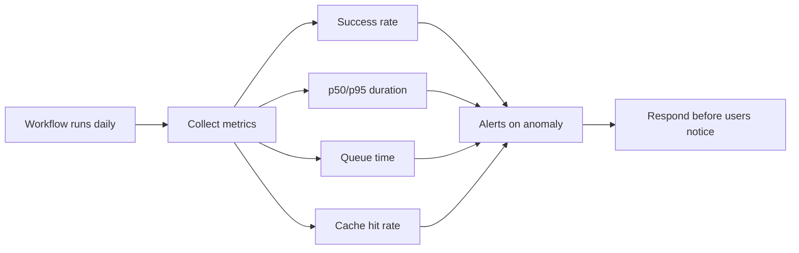
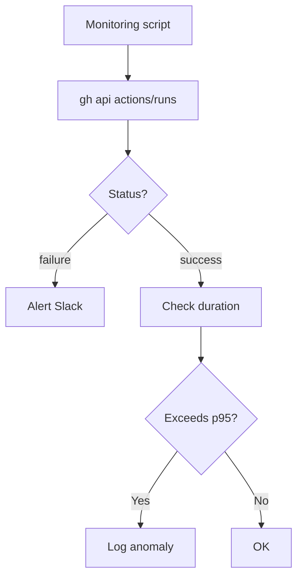
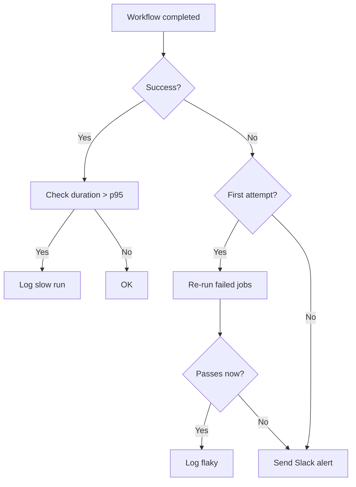
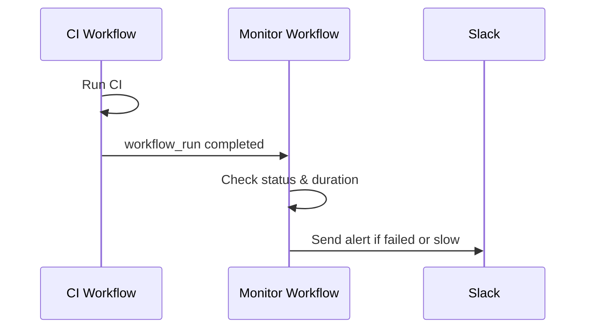

# Playbook: Actions Monitoring and Observability

> [!summary] Goal
> Monitor workflow runs, set up alerts for failures and duration anomalies, track key metrics, and build dashboards for Actions performance across your organization.

## Table of Contents

1. [Why Monitoring Matters](#why-monitoring-matters)
2. [Workflow Run APIs](#workflow-run-apis)
3. [Metrics to Track](#metrics-to-track)
4. [Notifications for Failures](#notifications-for-failures)
5. [Status Badges](#status-badges)
6. [Third-Party Observability Integrations](#third-party-observability-integrations)
7. [Duration Anomaly Detection](#duration-anomaly-detection)
8. [`workflow_run` Chained Monitoring](#workflowrun-chained-monitoring)
9. [Pitfalls](#pitfalls)

---

## Why Monitoring Matters

Without observability into your CI/CD, slow workflows go unnoticed, flaky tests go unaddressed, and cost explosions are discovered only on the bill.



---

## Workflow Run APIs

### List recent runs

```bash
gh run list --limit 20 --branch main
gh run list --workflow CI --status failure
```

### View run details

```bash
gh run view <run-id> --log
gh run view <run-id> --log-failed
```

### REST API for programmatic access

```bash
gh api /repos/:owner/:repo/actions/workflows/ci.yml/runs --paginate
gh api /repos/:owner/:repo/actions/runs/<run-id>
gh api /repos/:owner/:repo/actions/runs/<run-id>/logs > logs.zip
gh api /repos/:owner/:repo/actions/runs/<run-id>/jobs
```



---

## Metrics to Track

| Metric | What it indicates | Healthy threshold | Warning |
|--------|-------------------|-------------------|---------|
| **Success rate** | Pipeline reliability | >95% | <90% |
| **p50 duration** | Typical CI time | <10 min | >15 min |
| **p95 duration** | Slowest normal runs | <20 min | >30 min |
| **Queue time** | Runner contention | <30 sec | >2 min |
| **Cache hit rate** | Cache effectiveness | >80% | <50% |
| **Runner utilization** | Self-hosted efficiency | 40-70% | >90% |
| **Flaky test rate** | Test reliability | <1% | >5% |

### Collecting metrics via a scheduled workflow

```yaml
name: CI Metrics
on:
  schedule:
    - cron: "0 6 * * 1"
jobs:
  metrics:
    runs-on: ubuntu-latest
    steps:
      - run: |
          gh api /repos/${{ github.repository }}/actions/runs \
            --jq '.workflow_runs[] | select(.created_at > (now - 7*24*3600))' \
            > runs.json
          TOTAL=$(jq length runs.json)
          FAILED=$(jq '[.[] | select(.conclusion=="failure")] | length' runs.json)
          echo "Success rate: $(( (TOTAL - FAILED) * 100 / TOTAL ))%"
```

---

## Notifications for Failures

### Slack notification

```yaml
- name: Notify Slack on failure
  if: failure()
  uses: slackapi/slack-github-action@v1
  with:
    payload: |
      {
        "text": "❌ Workflow *${{ github.workflow }}* failed on ${{ github.repository }}",
        "blocks": [
          { "type": "section", "text": { "type": "mrkdwn", "text": "*Workflow:* ${{ github.workflow }}\n*Repo:* ${{ github.repository }}\n*Branch:* ${{ github.ref_name }}\n*Run:* <${{ github.server_url }}/${{ github.repository }}/actions/runs/${{ github.run_id }}|View run>" } }
        ]
      }
  env:
    SLACK_WEBHOOK_URL: ${{ secrets.SLACK_WEBHOOK_URL }}
```

### GitHub issue on failure

```yaml
- name: Create issue on repeated failures
  if: failure() && github.run_attempt > 1
  uses: actions/github-script@v7
  with:
    script: |
      github.rest.issues.create({
        owner: context.repo.owner,
        repo: context.repo.repo,
        title: `Flaky CI: ${context.workflow} failed on run attempt ${context.run_attempt}`,
        body: `Workflow failed: ${context.server_url}/${context.repo.owner}/${context.repo.repo}/actions/runs/${context.run_id}`
      })
```

### Notification decision tree



---

## Status Badges

```markdown


```

---

## Third-Party Observability

### Datadog

Install agent on self-hosted runners: `DD_API_KEY=<key> bash -c "$(curl -L https://s3.amazonaws.com/dd-agent/scripts/install_script.sh)"`

### Custom metrics push

```yaml
- if: always()
  run: |
    curl -X POST ${{ vars.METRICS_ENDPOINT }} \
      -H "Content-Type: application/json" \
      -d '{"workflow": "${{ github.workflow }}", "status": "${{ job.status }}", "duration": ${{ job.duration }}}'
```

---

## Duration Anomaly Detection

```yaml
name: Duration Alert
on:
  workflow_run:
    workflows: ["CI"]
    types: [completed]

jobs:
  check:
    runs-on: ubuntu-latest
    steps:
      - run: |
          DURATION_MS=$(gh api repos/${{ github.repository }}/actions/runs/${{ github.event.workflow_run.id }} --jq '.updated_at - .run_started_at')
          if [ $DURATION_MS -gt 600000 ]; then
            echo "Workflow took longer than 10 minutes!"
          fi
```

---

## `workflow_run` Chained Monitoring



```yaml
name: Monitor
on:
  workflow_run:
    workflows: ["CI", "Deploy"]
    types: [completed]

jobs:
  alert:
    runs-on: ubuntu-latest
    if: ${{ github.event.workflow_run.conclusion == 'failure' }}
    steps:
      - run: |
          echo "Workflow ${{ github.event.workflow_run.name }} failed!"
```

---

## Pitfalls

### Notification spam

Multiple failures trigger multiple notifications.

**Fix**: Use `run_attempt` to notify only after retries. Batch in a monitoring workflow.

### Metric lag

Actions API has 2-5 min delay.

**Fix**: Buffer by 5 minutes before alerting.

### Workflow naming confusion

Duplicate workflow names break dashboards.

**Fix**: Unique `name:` per workflow.

---

> [!question]- Interview Questions
>
> **Q: How do you fetch Actions metrics programmatically?**
> A: Use `gh api /repos/:owner/:repo/actions/runs` or the `workflow_run` event.
>
> **Q: How do you detect flaky workflows?**
> A: Track `run_attempt` — if success after retry, it's flaky. Alert on threshold.

---

## Cross-Links

- [[CICD/GitHubActions/04_Playbooks/01_Troubleshoot_Failing_Workflow]] for debugging
- [[CICD/GitHubActions/04_Playbooks/04_Actions_Billing_and_Cost_Management]] for cost correlation
- [[CICD/GitHubActions/01_Foundations/01_Workflow_Syntax_and_Triggers]] for `workflow_run` trigger

---

## References

- [GitHub Actions REST API](https://docs.github.com/en/rest/actions)
- [Monitoring Workflows](https://docs.github.com/en/actions/monitoring-and-troubleshooting-workflows)
- [Slack GitHub Action](https://github.com/slackapi/slack-github-action)
