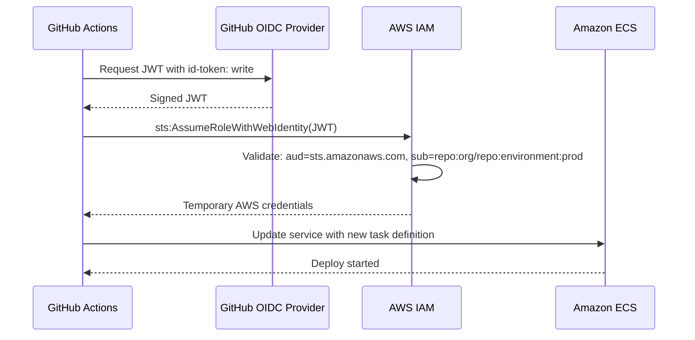

# Project: Secure Deploy to AWS with OIDC (GitHub Actions)

> [!summary] Goal
> Deploy a containerized app to Amazon ECS using GitHub OIDC — no long-lived AWS keys, automatic token rotation, and scoped access per environment.

## Table of Contents

1. [Architecture Overview](#architecture-overview)
2. [Terraform IAM Setup](#terraform-iam-setup)
3. [Workflow Definition](#workflow-definition)
4. [Verification](#verification)

---

## Architecture Overview



---

## Terraform IAM Setup

```hcl
# main.tf
provider "aws" {
  region = "us-east-1"
}

# Create OIDC provider
resource "aws_iam_openid_connect_provider" "github" {
  url             = "https://token.actions.githubusercontent.com"
  client_id_list  = ["sts.amazonaws.com"]
  thumbprint_list = ["6938fd4d98bab03faadb97b34396831e3780aea1"]
}

# IAM role for GitHub Actions
resource "aws_iam_role" "github_actions" {
  name               = "github-actions-ecs-deploy"
  assume_role_policy = data.aws_iam_policy_document.github_actions.json
}

data "aws_iam_policy_document" "github_actions" {
  statement {
    effect  = "Allow"
    actions = ["sts:AssumeRoleWithWebIdentity"]
    principals {
      type        = "Federated"
      identifiers = [aws_iam_openid_connect_provider.github.arn]
    }
    condition {
      test     = "StringEquals"
      variable = "token.actions.githubusercontent.com:aud"
      values   = ["sts.amazonaws.com"]
    }
    condition {
      test     = "StringEquals"
      variable = "token.actions.githubusercontent.com:sub"
      values   = ["repo:my-org/my-repo:environment:production"]
    }
  }
}

# Attach ECS deployment permissions
resource "aws_iam_role_policy_attachment" "ecs_deploy" {
  role       = aws_iam_role.github_actions.name
  policy_arn = "arn:aws:iam::aws:policy/AmazonECS_FullAccess"
}

# Output
output "deploy_role_arn" {
  value = aws_iam_role.github_actions.arn
}
```

---

## Workflow Definition

```yaml
name: Deploy to ECS
on:
  push:
    branches: [main]

permissions:
  id-token: write
  contents: read

jobs:
  deploy:
    runs-on: ubuntu-latest
    environment: production

    steps:
      - uses: actions/checkout@v4

      - uses: aws-actions/configure-aws-credentials@v4
        with:
          role-to-assume: arn:aws:iam::123456789012:role/github-actions-ecs-deploy
          aws-region: us-east-1

      - uses: docker/login-action@v3
        with:
          registry: ${{ vars.AWS_ACCOUNT }}.dkr.ecr.us-east-1.amazonaws.com

      - uses: docker/build-push-action@v5
        with:
          push: true
          tags: ${{ vars.AWS_ACCOUNT }}.dkr.ecr.us-east-1.amazonaws.com/my-app:${{ github.sha }}

      - uses: aws-actions/amazon-ecs-render-task-definition@v1
        id: render
        with:
          task-definition: task-definition.json
          container-name: my-app
          image: ${{ vars.AWS_ACCOUNT }}.dkr.ecr.us-east-1.amazonaws.com/my-app:${{ github.sha }}

      - uses: aws-actions/amazon-ecs-deploy-task-definition@v2
        with:
          task-definition: ${{ steps.render.outputs.task-definition }}
          service: my-app-service
          cluster: my-cluster
```

---

## Verification

### Test OIDC locally

```bash
# Verify the role can be assumed
aws sts assume-role-with-web-identity \
  --role-arn arn:aws:iam::123456789012:role/github-actions-ecs-deploy \
  --role-session-name test-session \
  --web-identity-token "$(act id-token)"
```

### Check subject claim matching

```bash
# Decode JWT to verify claims
jq -R 'split(".") | .[0], .[1] | @base64d | fromjson' <<< "$TOKEN"
```

Expected:
```json
{
  "sub": "repo:my-org/my-repo:environment:production",
  "aud": "sts.amazonaws.com"
}
```

---

## Cross-Links

- [[CICD/GitHubActions/02_Core/01_Secrets_Environments_and_OIDC]] for OIDC reference
- [[CICD/AWS/01_Foundations/01_IAM_Basics_for_Engineers]] for IAM basics
- [[CICD/AWS/02_Core/01_ECS_Deployments_BlueGreen_and_Rolling]] for ECS deployment strategies
