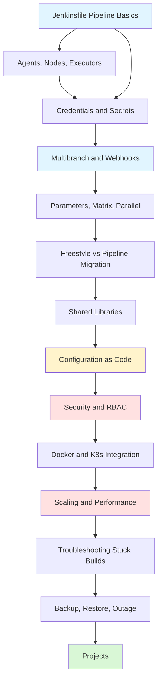

# Jenkins

> [!summary] Scope
> Jenkins CI/CD from beginner to pro: Declarative and Scripted Pipelines, agents (static/Docker/K8s), credentials and Vault, shared libraries, parameters/matrix/parallel, multibranch and webhooks, JCasC, RBAC, Docker/K8s integration, scaling, backup/recovery, and troubleshooting.

## Learning Path

## Topic Map

### Foundations (4 files)

#### [[CICD/Jenkins/01_Foundations/01_Jenkinsfile_Pipeline_Basics]]
- Declarative vs Scripted Pipeline with 12-row comparison table and decision flowchart
- All directives: `agent`, `stages`, `post`, `environment`, `parameters`, `triggers`, `when`, `input`, `tools`, `options`
- Full production Jenkinsfile: parallel stages, Docker, credentials, archive, notifications
- Pitfalls: `sh` quoting, sandbox limitations, `currentBuild.result` order

#### [[CICD/Jenkins/01_Foundations/02_Agents_Nodes_and_Executors]]
- Controller-agent architecture diagram, agent types (any, none, label, docker, dockerfile, kubernetes)
- Docker agent with `inside()` and `dockerfile`, K8s PodTemplate with multiple sidecars
- Label strategy conventions, executor tuning
- Agent type comparison table (7 rows: static, Docker, K8s)

#### [[CICD/Jenkins/01_Foundations/03_Credentials_and_Secrets]]
- All 6 credential types with `withCredentials` binding examples
- `credentials()` in environment, `usernamePassword`, `sshUserPrivateKey`, `string`, `file`, `certificate`
- HashiCorp Vault integration with sequence diagram
- Best practices and pitfalls (secrets in logs, credentials as params, baking into images)

#### [[CICD/Jenkins/01_Foundations/04_Multibranch_and_Webhooks]]
- Multibranch Pipeline setup (UI and JCasC), branch discovery strategies, PR strategies
- Webhook integration: GitHub, GitLab, Bitbucket, Generic Webhook Plugin
- Pipeline `triggers` directive: `cron`, `pollSCM`, `upstream`
- Multibranch vs single pipeline comparison (10 rows)

### Core (4 files)

#### [[CICD/Jenkins/02_Core/01_Shared_Libraries_Basics]]
- Directory structure: `vars/`, `src/`, `resources/` with examples for each
- `@Library` annotation, `library()` step, global vs implicit loading
- Writing `vars/` global steps (3 patterns), `src/` classes with `Serializable`
- Testing with JenkinsPipelineUnit framework, versioning strategy

#### [[CICD/Jenkins/02_Core/02_Parameters_Matrix_and_Parallelism]]
- All 8 parameter types with `parameters {}` syntax and UI behavior
- `matrix` directive: axes, exclude, stages — with Cartesian product expansion diagram
- `parallel` with `failFast`, `stash`/`unstash` lifecycle, `lock`, `milestone`, `timeout`
- Pitfalls: matrix explosion, stash size limits, executor starvation

#### [[CICD/Jenkins/02_Core/04_Freestyle_vs_Pipeline_and_Migration]]
- Freestyle vs Pipeline comparison (14 rows), migration process flowchart
- Builder-to-step mapping table (12+ common actions)
- Before/after example with full YAML comparison
- Pitfalls: missing post-build steps, credential location, shell behavior differences

### Advanced (4 files)

#### [[CICD/Jenkins/03_Advanced/01_Scaling_Jenkins_Masters_and_Agents]]
- HA architecture: controller, external PostgreSQL, persistent volume
- JVM tuning: heap, G1GC, system properties for performance
- Agent provisioning strategies: static, Docker, K8s, Cloud — comparison table
- Prometheus metrics, Jenkins CLI diagnostics, Groovy console scripts
- Key metrics and alert thresholds reference

#### [[CICD/Jenkins/03_Advanced/02_Configuration_as_Code_JCasC]]
- `jenkins.yaml` structure: system, security, credentials, jobs, tools
- Bootstrap via `CASC_JENKINS_CONFIG` environment variable
- Credentials as environment variable references, JCasC vs UI comparison (8 rows)
- Pitfalls: YAML validation, plugin ordering, credential ID collisions

#### [[CICD/Jenkins/03_Advanced/03_Security_RBAC]]
- Security model: authentication, authorization, access control, audit
- Matrix-based security: all 15 permissions reference with JCasC example
- Role Strategy: global roles, project roles, slave roles
- Folder-based security, Pipeline sandbox restrictions
- Matrix vs Role Strategy vs Folder comparison (8 rows)

#### [[CICD/Jenkins/03_Advanced/04_Docker_Kubernetes_Integration_with_Pipeline]]
- Docker Pipeline plugin: `build()`, `image().inside()`, `withRegistry()`
- Docker agent and `dockerfile` agent with lifecycle sequence diagram
- K8s PodTemplate: Declarative and Scripted, multiple sidecars
- `withKubeConfig`, `kubectl` and `helm` deploy, Kaniko for secure builds
- Full CI/CD pipeline: test → Docker build → push → K8s deploy → smoke test

### Playbooks (3 files)

#### [[CICD/Jenkins/04_Playbooks/01_Troubleshoot_Stuck_Builds]]
- Systematic diagnosis decision tree, 10 common stuck scenarios table
- Jenkins CLI commands for queue/executor/lock inspection
- Groovy console scripts for stuck builds, thread dump analysis

#### [[CICD/Jenkins/04_Playbooks/02_Plugin_Management_and_Blue_Ocean]]
- Plugin install/update via CLI, safe upgrade strategy, recovery from failures
- Blue Ocean: pipeline editor, activity view, run details, log viewer, branch explorer
- Key Blue Ocean URL patterns

#### [[CICD/Jenkins/04_Playbooks/03_Backup_Restore_and_Outage_Recovery]]
- Backup strategy: what to back up (jobs, plugins, secrets, credentials.xml, JCasC)
- Full restore and single-job restore, corrupt config recovery
- Outage scenarios: config corruption, credential corruption, disk full
- Rebuild from scratch using JCasC, recovery order diagram

### Projects (3 files)

#### [[CICD/Jenkins/05_Projects/01_Migrate_Freestyle_to_Pipeline]]
- Document existing Freestyle job → create Jenkinsfile → test → archive old job
- Step-by-step with concrete before/after migration checklist

#### [[CICD/Jenkins/05_Projects/02_Build_a_Shared_Library_from_Scratch]]
- Scaffold repository → create `vars/` step → create `src/` class → configure in Jenkins → consume from Pipeline

#### [[CICD/Jenkins/05_Projects/03_Deploy_a_Microservice_to_Kubernetes]]
- Full pipeline: Multibranch → K8s pod agent → test → Docker build/push → Helm deploy → smoke test → auto-rollback on failure
- Requires: K8s cluster, Docker registry, Helm chart, Jenkins plugins

---

## Recommended Paths

| Path | Files | Target |
|------|-------|--------|
| **Quick Start** | F01, F02, F04 | First pipeline in 30 minutes |
| **Pipeline Author** | F01-F04, C01, C02 | Production pipelines |
| **Jenkins Admin** | C03, A01, A02, A03 | Manage and secure Jenkins |
| **Advanced Deploy** | A04, P01, P03, PR03 | Docker + K8s deployments |

## Cross-Links

- [[CICD/GitHubActions/00_MOC/00_GitHubActions_MOC]] for CI/CD alternatives
- [[CICD/Docker/00_MOC/00_Docker_MOC]] for container build knowledge
- [[CICD/Kubernetes/00_MOC/00_Kubernetes_MOC]] for K8s deployment targets
- [[CICD/Terraform/00_MOC/00_Terraform_MOC]] for infrastructure provisioning

---

## References

- [Jenkins Documentation](https://www.jenkins.io/doc/)
- [Pipeline Syntax](https://www.jenkins.io/doc/book/pipeline/syntax/)
- [Pipeline Steps Reference](https://www.jenkins.io/doc/pipeline/steps/)
- [JCasC Plugin](https://plugins.jenkins.io/configuration-as-code/)
- [Jenkins Security](https://www.jenkins.io/doc/book/security/)
- [Jenkins CLI](https://www.jenkins.io/doc/book/managing/cli/)
