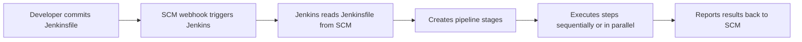

# Jenkinsfile and Pipeline Basics

> [!summary] Goal
> Model CI/CD as code in a `Jenkinsfile` — understand Declarative vs Scripted syntax, write production pipelines with stages, post-actions, and conditional logic.

## Table of Contents

1. [Why Pipeline as Code](#why-pipeline-as-code)
2. [Declarative Pipeline](#declarative-pipeline)
3. [Scripted Pipeline](#scripted-pipeline)
4. [Declarative vs Scripted](#declarative-vs-scripted)
5. [Pipeline Directives Reference](#pipeline-directives-reference)
6. [Full Production Jenkinsfile](#full-production-jenkinsfile)
7. [Pitfalls](#pitfalls)

---

## Why Pipeline as Code

A `Jenkinsfile` defines the entire delivery pipeline as code. It lives in SCM alongside the application — reviewed, versioned, and tested.



> [!tip] Definition
> **Jenkinsfile**: a Groovy-based file checked into version control that defines a Jenkins Pipeline. It uses either **Declarative** (simpler, structured) or **Scripted** (flexible, Groovy-native) syntax.

---

## Declarative Pipeline

Declarative pipelines are structured, opinionated, and easy to read:

```groovy
pipeline {
    agent any
    options {
        timestamps()
        buildDiscarder(logRotator(numToKeepStr: '10'))
        timeout(time: 30, unit: 'MINUTES')
    }
    triggers {
        cron('H 2 * * 1-5')
        pollSCM('H/15 * * * *')
    }
    parameters {
        string(name: 'BRANCH', defaultValue: 'main', description: 'Branch to build')
        booleanParam(name: 'RUN_TESTS', defaultValue: true, description: 'Run tests')
    }
    environment {
        APP_NAME = 'my-service'
        BUILD_NUMBER = "${BUILD_NUMBER}"
    }
    stages {
        stage('Checkout') {
            steps { checkout scm }
        }
        stage('Build') {
            when {
                expression { return params.RUN_TESTS }
            }
            steps {
                sh 'npm ci && npm run build'
            }
        }
        stage('Test') {
            steps {
                sh 'npm test'
                junit 'reports/**/*.xml'
            }
        }
        stage('Deploy') {
            when {
                branch 'main'
            }
            input {
                message 'Deploy to production?'
                ok 'Deploy'
            }
            steps {
                sh './deploy.sh'
            }
        }
    }
    post {
        always { cleanWs() }
        failure { slackSend(color: '#FF0000', message: "Build failed: ${env.BUILD_URL}") }
        success { slackSend(color: '#00FF00', message: "Build succeeded: ${env.BUILD_URL}") }
    }
}
```

---

## Scripted Pipeline

Scripted pipelines are Groovy-based — more flexible but also more complex:

```groovy
node('linux') {
    try {
        stage('Checkout') {
            checkout scm
        }
        stage('Build') {
            sh 'npm ci && npm run build'
        }
        stage('Test') {
            try {
                sh 'npm test'
            } catch (Exception e) {
                currentBuild.result = 'UNSTABLE'
                echo "Tests failed: ${e.message}"
            }
        }
        stage('Deploy') {
            if (env.BRANCH_NAME == 'main') {
                input message: 'Deploy to production?', ok: 'Deploy'
                sh './deploy.sh'
            }
        }
    } catch (Exception e) {
        currentBuild.result = 'FAILURE'
        error "Pipeline failed: ${e.message}"
    } finally {
        cleanWs()
    }
}
```

---

## Declarative vs Scripted

```mermaid
flowchart TD
    A[Starting a new pipeline?] --> B{Team preference}
    B -->|Structured, simple| C[Declarative]
    B -->|Maximum flexibility| D[Scripted]
    C --> E{Need complex logic?}
    E -->|Yes| F[Use script {} blocks in Declarative]
    E -->|No| G[Pure Declarative is fine]
    D --> H{Need restart from stage?}
    H -->|Yes| I[Declarative supports this natively]
    H -->|No| J[Scripted works]
```

| Aspect | Declarative | Scripted |
|--------|-------------|---------|
| **Syntax** | Structured DSL (`pipeline { }`) | Native Groovy (`node { }`) |
| **`when` directive** | ✅ Built-in | ❌ Use `if` blocks |
| **`input` / approval** | ✅ Built-in | ❌ Use `input` step |
| **`matrix`** | ✅ Built-in | ❌ Use nested loops |
| **`parallel`** | ✅ `parallel { stage {} stage {} }` | ✅ `parallel stage1, stage2` |
| **`post` conditions** | ✅ Built-in (`always`, `failure`, `success`, etc.) | ❌ Use `try/catch/finally` |
| **Pipeline restart from stage** | ✅ Supported (CloudBees) | ❌ Not supported |
| **`environment`** | ✅ Structured | ❌ Use `withEnv` or `env.X = Y` |
| **Error handling** | `post` blocks | `try/catch/finally` |
| **Complex Groovy** | Limited (use `script {}` block) | ✅ Full Groovy power |
| **Learning curve** | Low | Medium |
| **When to use** | Most pipelines | Complex custom logic, integration with non-SCM tools |

---

## Pipeline Directives Reference

| Directive | Purpose | Available in |
|-----------|---------|-------------|
| `agent` | Where the pipeline runs | Declarative + Scripted via `node` |
| `stages` | Groups stages | Declarative |
| `stage` | A phase of the pipeline | Both |
| `steps` | Commands within a stage | Declarative |
| `post` | Actions after stages | Declarative (Scripted: `finally`) |
| `environment` | Environment variables | Both (`withEnv` for Scripted) |
| `options` | Pipeline options (timeout, timestamps, buildDiscarder) | Declarative |
| `parameters` | Build parameters | Declarative |
| `triggers` | Triggers (cron, pollSCM, upstream) | Declarative |
| `when` | Conditional execution | Declarative (Scripted: `if`) |
| `input` | User approval gate | Declarative |
| `tools` | Tool auto-installation | Declarative |
| `parallel` | Parallel stage execution | Both |
| `matrix` | Multi-dimensional execution | Declarative |

---

## Full Production Jenkinsfile

```groovy
pipeline {
    agent {
        label 'docker'   // Runs on a Docker-capable agent
    }
    options {
        timestamps()
        buildDiscarder(logRotator(numToKeepStr: '20', artifactNumToKeepStr: '5'))
        timeout(time: 60, unit: 'MINUTES')
        disableConcurrentBuilds()
    }
    parameters {
        choice(name: 'ENV', choices: ['dev', 'staging', 'prod'], description: 'Deploy environment')
        string(name: 'VERSION', defaultValue: '', description: 'Release version')
    }
    environment {
        DOCKER_IMAGE = 'my-registry.com/my-app'
        DOCKER_TAG = "${BUILD_NUMBER}-${GIT_COMMIT[0..7]}"
        REGISTRY_CRED = credentials('docker-registry')
    }
    stages {
        stage('Checkout') {
            steps { checkout scm }
        }
        stage('Lint') {
            steps {
                sh 'npm run lint'
            }
        }
        stage('Build & Test') {
            parallel {
                stage('Unit Tests') {
                    steps {
                        sh 'npm test -- --coverage'
                        junit 'reports/junit/**/*.xml'
                    }
                }
                stage('Build') {
                    steps {
                        sh 'npm run build'
                    }
                }
            }
        }
        stage('Docker Build') {
            steps {
                sh """
                    docker build -t ${DOCKER_IMAGE}:${DOCKER_TAG} .
                    docker tag ${DOCKER_IMAGE}:${DOCKER_TAG} ${DOCKER_IMAGE}:latest
                """
            }
        }
        stage('Push') {
            when { branch 'main' }
            steps {
                withDockerRegistry([credentialsId: 'docker-registry', url: 'https://my-registry.com']) {
                    sh "docker push ${DOCKER_IMAGE}:${DOCKER_TAG}"
                    sh "docker push ${DOCKER_IMAGE}:latest"
                }
            }
        }
        stage('Deploy') {
            when {
                branch 'main'
                expression { params.ENV == 'prod' }
            }
            input {
                message "Deploy ${DOCKER_TAG} to ${params.ENV}?"
                ok 'Deploy'
            }
            steps {
                sh "./deploy.sh ${params.ENV} ${DOCKER_TAG}"
            }
        }
    }
    post {
        always {
            archiveArtifacts artifacts: 'dist/**/*.zip', fingerprint: true
            junit 'reports/**/*.xml'
        }
        failure {
            emailext(
                to: 'team@example.com',
                subject: "FAILED: ${env.JOB_NAME} #${env.BUILD_NUMBER}",
                body: "Check build ${env.BUILD_URL}"
            )
        }
        changed {
            // Runs only when build status changes from previous run
            echo "Build status changed to: ${currentBuild.currentResult}"
        }
    }
}
```

---

## Pitfalls

### `sh` quoting issues

```groovy
// BAD — Groovy string substitution breaks shell quoting
sh "echo '${env.VAR}'"    // If VAR contains ', it breaks

// GOOD
sh "echo '${env.VAR}'".replaceAll(/'/, "'\\''")  // Or use triple-quoted strings
```

### `checkout scm` without credentials

If the SCM requires authentication but no credentials are configured, checkout fails silently.

**Fix**: Ensure `checkout scm` has access — use `git` step with explicit credentials: `git credentialsId: 'github-token', url: 'https://github.com/org/repo.git'`.

### `currentBuild.result` assignment order

Setting `currentBuild.result = 'FAILURE'` followed by `currentBuild.result = 'SUCCESS'` — last one wins.

**Fix**: Only set `currentBuild.result` at the end, or use the pattern of accumulating the worst result.

### Script Security sandbox

SCM-triggered pipelines run in a sandbox with restricted Groovy methods. Use `@NonCPS` for non-serializable code.

**Fix**: Trust the Jenkinsfile in Jenkins configuration, or keep complex logic in shared libraries (which can be loaded outside sandbox).

---

> [!question]- Interview Questions
>
> **Q: What is the difference between Declarative and Scripted Pipeline?**
> A: Declarative has a structured `pipeline { }` block with built-in `when`, `input`, `matrix`, `post`, and `options`. Scripted uses native Groovy with `node { }`, offering full flexibility but requiring manual error handling via `try/catch/finally`.
>
> **Q: What is the `post` directive and what conditions does it support?**
> A: `post` defines actions after stages run. Conditions: `always`, `changed`, `fixed`, `regression`, `aborted`, `failure`, `success`, `unstable`, and `cleanup`.
>
> **Q: How do you run stages in parallel in Declarative Pipeline?**
> A: Use `parallel { stage('A') { ... } stage('B') { ... } }` inside the `stages` block. Optionally set `parallel { failFast true() }` to stop all on first failure.

---

## Cross-Links

- [[CICD/Jenkins/01_Foundations/02_Agents_Nodes_and_Executors]] for agent configuration
- [[CICD/Jenkins/01_Foundations/03_Credentials_and_Secrets]] for credentials in pipelines
- [[CICD/Jenkins/02_Core/02_Parameters_Matrix_and_Parallelism]] for matrix and parallel patterns
- [[CICD/Jenkins/01_Foundations/04_Multibranch_and_Webhooks]] for multibranch pipeline

---

## References

- [Jenkins Pipeline Syntax](https://www.jenkins.io/doc/book/pipeline/syntax/)
- [Declarative Pipeline](https://www.jenkins.io/doc/book/pipeline/syntax/#declarative-pipeline)
- [Scripted Pipeline](https://www.jenkins.io/doc/book/pipeline/syntax/#scripted-pipeline)
- [Pipeline Steps Reference](https://www.jenkins.io/doc/pipeline/steps/)
