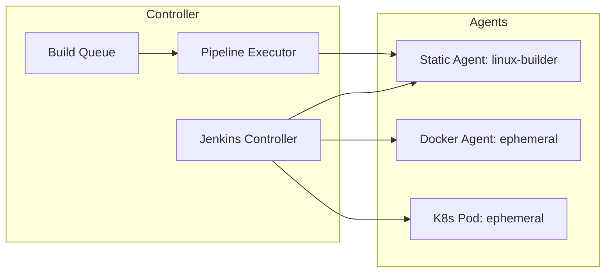
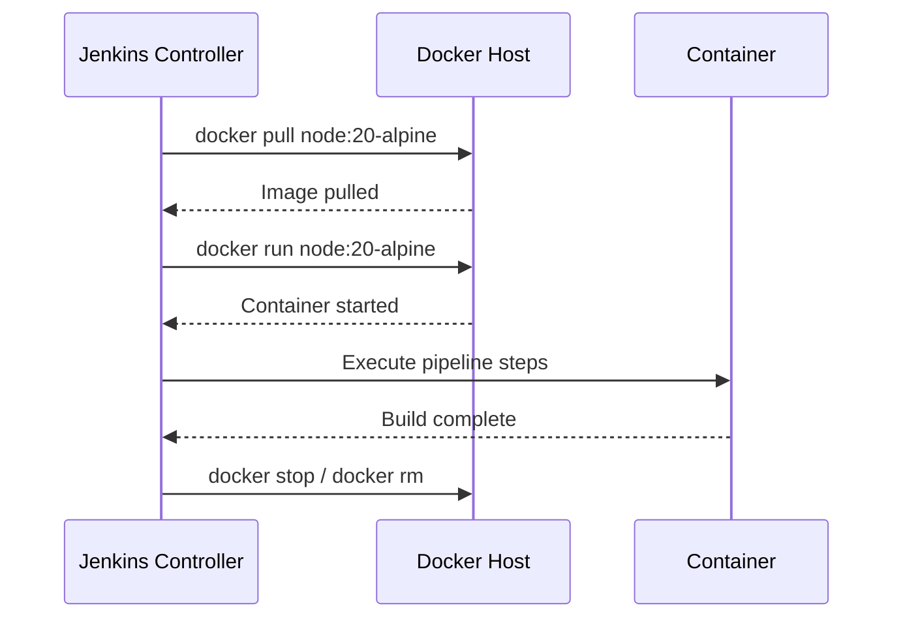
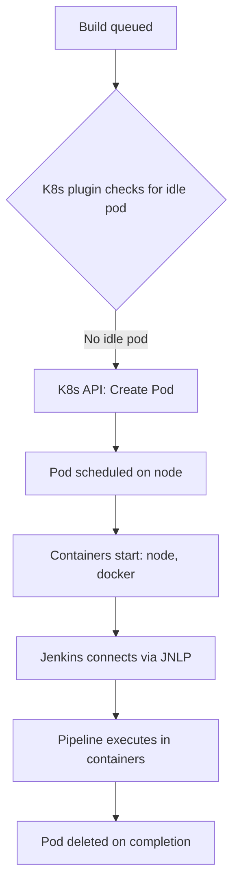

# Agents, Nodes, and Executors

> [!summary] Goal
> Understand where Jenkins jobs run, how to use different agent types (Docker, Kubernetes, label-based), and how to control concurrency.

## Table of Contents

1. [Controller-Agent Architecture](#controller-agent-architecture)
2. [Agent Types](#agent-types)
3. [Docker Agent](#docker-agent)
4. [Kubernetes Agent (PodTemplate)](#kubernetes-agent)
5. [Labels and Labeling Strategy](#labels-and-labeling-strategy)
6. [Executors and Concurrency](#executors-and-concurrency)
7. [Agent Comparison](#agent-comparison)
8. [Pitfalls](#pitfalls)

---

## Controller-Agent Architecture

Jenkins uses a controller-agent (formerly master-agent) architecture:



> [!tip] Definition
> **Controller**: the central Jenkins server that manages jobs, the UI, and the build queue. **Agent**: a machine (VM, container, or pod) that executes pipeline steps. **Executor**: a slot on an agent that can run one build at a time.

---

## Agent Types

```groovy
// agent any — runs on any available agent
pipeline { agent any; ... }

// agent none — no default agent; each stage specifies its own
pipeline {
    agent none
    stages {
        stage('Build') {
            agent { label 'linux' }
            steps { ... }
        }
    }
}

// agent with label — runs on an agent with matching label
pipeline { agent { label 'docker && linux' }; ... }

// agent with custom workspace
pipeline { agent { label 'linux'; customWorkspace '/var/build/${JOB_NAME}' }; ... }
```

---

## Docker Agent

```groovy
// Run pipeline inside a Docker container
pipeline {
    agent {
        docker {
            image 'node:20-alpine'
            args '-v $HOME/.npm:/root/.npm --memory=2g'
            label 'docker'
        }
    }
    stages {
        stage('Test') {
            steps {
                sh 'node --version'
                sh 'npm ci && npm test'
            }
        }
    }
}

// Custom Dockerfile agent
pipeline {
    agent {
        dockerfile {
            filename 'Dockerfile.ci'
            dir 'ci'
            label 'docker'
            args '--memory=4g'
        }
    }
    // ...
}
```



---

## Kubernetes Agent (PodTemplate)

```groovy
// Define a pod template inline
pipeline {
    agent {
        kubernetes {
            label 'k8s-pod'
            yaml """
apiVersion: v1
kind: Pod
spec:
  containers:
  - name: node
    image: node:20-alpine
    command: ['cat']
    tty: true
  - name: docker
    image: docker:20.10
    command: ['cat']
    tty: true
    volumeMounts:
    - name: docker-socket
      mountPath: /var/run/docker.sock
  volumes:
  - name: docker-socket
    hostPath:
      path: /var/run/docker.sock
"""
        }
    }
    stages {
        stage('Build') {
            steps {
                container('node') {
                    sh 'npm ci && npm run build'
                }
            }
        }
        stage('Docker Build') {
            steps {
                container('docker') {
                    sh 'docker build -t my-app .'
                }
            }
        }
    }
}
```



---

## Labels and Labeling Strategy

Labels route workloads to the right agents:

```groovy
pipeline { agent { label 'linux && docker' }; ... }
pipeline { agent { label 'gpu || high-mem' }; ... }   // OR condition
pipeline { agent { label 'arm64 && !build' }; ... }    // NOT condition
```

### Label strategy conventions

| Label | Used for |
|-------|----------|
| `linux`, `windows` | OS-level routing |
| `docker` | Docker engine available |
| `gpu` | NVIDIA GPU available |
| `high-mem` | >16GB RAM |
| `arm64` | ARM architecture |
| `build`, `test`, `deploy` | Workload type |

---

## Executors and Concurrency

```groovy
pipeline {
    options {
        disableConcurrentBuilds()      // Only one build at a time
        throttle(['my-throttle-category'])  // Limit via throttle plugin
    }
}
```

| Executor count | Typical use case |
|---------------|------------------|
| Small agent (2 CPU) | 2-3 executors |
| Large agent (8 CPU) | 6-9 executors |
| Docker agent | 1 executor per container |
| K8s pod | 1 executor per pod |

---

## Agent Comparison

| Aspect | Static Agent | Docker Agent | K8s Pod Agent |
|--------|-------------|-------------|---------------|
| Provisioning | Manual registration | Pull on demand | API-based creation |
| Startup time | Instant (already running) | 5-30 seconds | 10-60 seconds |
| Environment isolation | ❌ Shared filesystem | ✅ Clean container | ✅ Clean pod |
| Tool persistence | ✅ Persistent | ❌ Ephemeral | ❌ Ephemeral |
| Cost model | Idle when not used | Pay per build | Pay per build |
| Maintenance | High (update tools) | Low (use images) | Low (use images) |
| Best for | Legacy, long-running builds | New CI pipelines | Dynamic cloud workloads |

---

## Pitfalls

### Too many executors on a node

Setting 10 executors on a 4-core server creates resource contention — builds compete for CPU, memory, and I/O.

**Fix**: Set executor count to CPU cores + 1. Monitor resource usage.

### Docker agent with no Docker label

```groovy
agent { docker { image 'node:20' } }  // Without label 'docker', it may run on non-Docker agent
```

**Fix**: Always add `label 'docker'` if the agent needs Docker.

### Kubernetes pod resource limits

Without setting resource requests/limits, K8s agent pods can consume all node resources.

**Fix**: Add `resources` to the pod YAML: `resources: { requests: { cpu: '1', memory: '1Gi' }, limits: { cpu: '2', memory: '2Gi' } }`.

---

> [!question]- Interview Questions
>
> **Q: What is the difference between a Jenkins controller and an agent?**
> A: The controller manages jobs, the UI, and the build queue. Agents execute pipeline steps. Agents can be static VMs, Docker containers, or Kubernetes pods.
>
> **Q: How do you run a pipeline inside a Docker container?**
> A: Use `agent { docker { image 'node:20' } }` in Declarative Pipeline. Jenkins pulls the image and runs all steps inside the container.
>
> **Q: What are Jenkins labels used for?**
> A: Labels route pipelines to specific agents based on capabilities: OS (`linux`), hardware (`gpu`), or tooling (`docker`). Expressions support AND (`&&`), OR (`||`), and NOT (`!`).

---

## Cross-Links

- [[CICD/Jenkins/01_Foundations/01_Jenkinsfile_Pipeline_Basics]] for pipeline syntax
- [[CICD/Jenkins/03_Advanced/04_Docker_Kubernetes_Integration_with_Pipeline]] for Kubernetes agent deep dive
- [[CICD/Jenkins/03_Advanced/01_Scaling_Jenkins_Masters_and_Agents]] for scaling and performance

---

## References

- [Jenkins Agents](https://www.jenkins.io/doc/book/using/using-agents/)
- [Docker Pipeline Plugin](https://www.jenkins.io/doc/book/pipeline/docker/)
- [Kubernetes Plugin](https://plugins.jenkins.io/kubernetes/)
- [Setting Agent Labels](https://www.jenkins.io/doc/book/using/using-agents/#labeling-and-node-restrictions)
