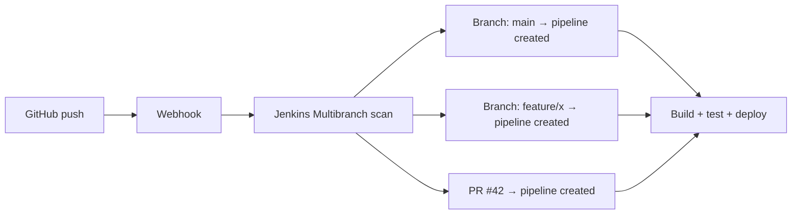
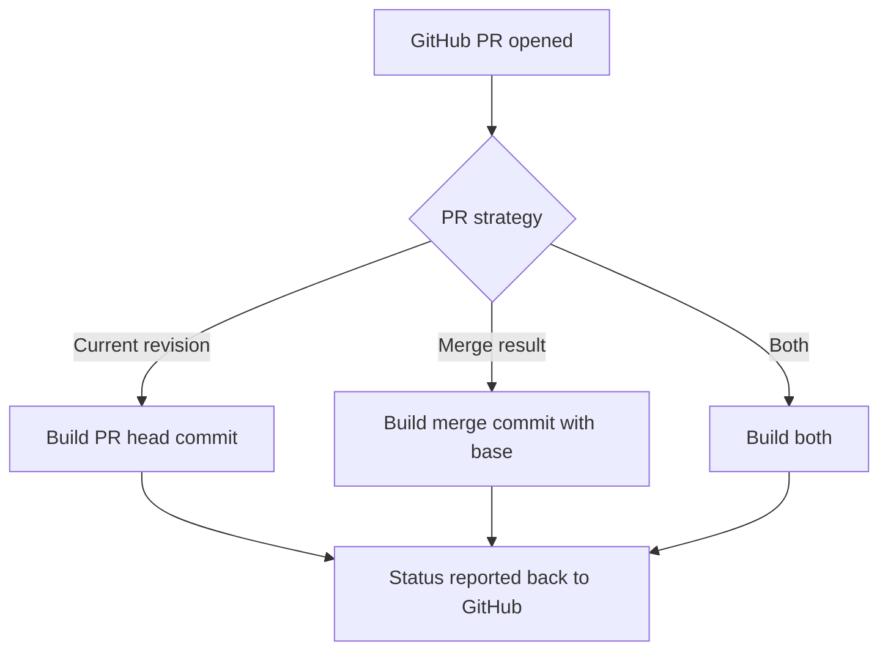
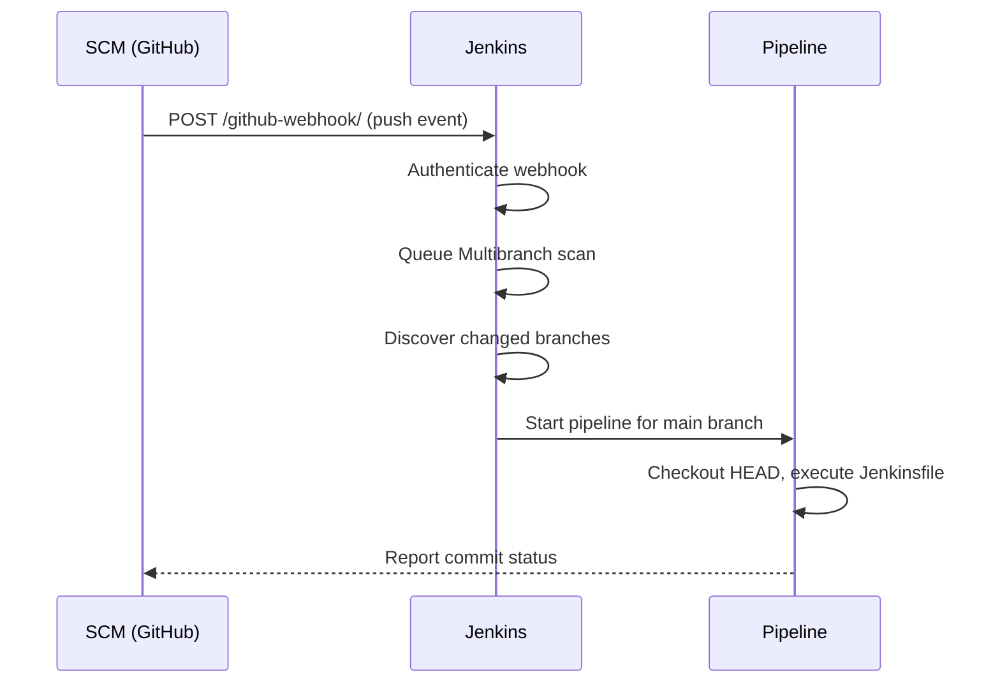

# Multibranch Pipeline and Webhooks

> [!summary] Goal
> Automatically create pipelines per branch with Multibranch Pipeline, trigger builds via webhooks from GitHub/GitLab/Bitbucket, and configure cron/pollSCM triggers.

## Table of Contents

1. [Why Multibranch Matters](#why-multibranch-matters)
2. [Setting Up Multibranch Pipeline](#setting-up-multibranch-pipeline)
3. [Branch Discovery and PR Strategies](#branch-discovery-and-pr-strategies)
4. [Webhook Triggers](#webhook-triggers)
5. [Pipeline Triggers Directive](#pipeline-triggers-directive)
6. [Multibranch vs Single Pipeline](#multibranch-vs-single-pipeline)
7. [Pitfalls](#pitfalls)

---

## Why Multibranch Matters

Multibranch Pipeline automatically creates a Jenkins pipeline for every branch in your repository. Pull requests get built before merge — no manual job creation.



> [!tip] Definition
> **Multibranch Pipeline**: a Jenkins job type that scans a Git repository, discovers branches and PRs, and creates a pipeline per branch based on the `Jenkinsfile` in each branch.

---

## Setting Up Multibranch Pipeline

### Via Jenkins UI

```
New Item → Multibranch Pipeline → Name → OK
Branch Sources → Add source → GitHub/GitLab/Bitbucket/Git
Repository HTTPS URL: https://github.com/org/repo.git
Credentials: (optional, for private repos)
Discover branches → Filter by name (optional)
Discover pull requests → Merged/Current/Both
Build Configuration → Mode: by Jenkinsfile → Script Path: Jenkinsfile
Scan Repository Triggers → Periodically if not otherwise run → Interval: 1 minute
```

### Via JCasC YAML

```yaml
jenkins:
  jobs:
    - script: >
        multibranchPipelineJob('my-app') {
          branchSources {
            branchSource {
              source {
                github {
                  id = 'my-app-source'
                  credentialsId = 'github-token'
                  repoOwner = 'my-org'
                  repository = 'my-app'
                  repositoryUrl = 'https://github.com/my-org/my-app.git'
                  configuredByUrl(true)
                }
              }
              strategy {
                allBranchesSame {
                  markDeletedPRs(true)
                }
              }
            }
          }
          orphanedItemStrategy {
            discardOldItems {
              numToKeep(20)
            }
          }
          triggers {
            periodic(1)
          }
        }
```

---

## Branch Discovery and PR Strategies

### Branch discovery

| Strategy | Effect |
|----------|--------|
| **All branches** | Pipeline created for every branch |
| **Only branches with PRs** | Pipeline only for branches that have open PRs |
| **By name filter** | `main release/*` — only matching branches |
| **By name regex** | `^(main\|release/\d+\.\d+)$` |

### Pull request discovery

| Strategy | Effect |
|----------|--------|
| **Merged** | Triggers on PR merge (not ideal — main branch trigger is better) |
| **Current revision** | Builds the PR head commit (most common) |
| **Both** | Builds both the PR head and the merge result |



---

## Webhook Triggers

### GitHub Webhook

```groovy
// Jenkinsfile doesn't need special triggers — webhook auto-triggers the scan
// Setup: GitHub → repo → Settings → Webhooks → Add webhook
// Payload URL: https://jenkins.example.com/github-webhook/
// Content type: application/json
// Secret: (optional, shared secret)
```

### GitLab Webhook

```
// Jenkins → GitLab Plugin configuration → Enable
// GitLab → project → Settings → Webhooks
// URL: https://jenkins.example.com/project/<my-app>
// Secret token: (match with Jenkins project)
// Trigger: Merge request events, Push events
```

### Bitbucket Webhook

```
// Bitbucket → repo → Settings → Webhooks → Add webhook
// URL: https://jenkins.example.com/bitbucket-webhook/
// Triggers: Repository push, Pull request created/updated/merged
```

### Generic Webhook Plugin

```groovy
// For non-SCM systems or custom payloads
pipeline {
    triggers {
        GenericTrigger(
            genericVariables: [
                [key: 'BRANCH', value: '$.ref'],
                [key: 'ACTION', value: '$.action']
            ],
            token: env.JOB_NAME,
            causeString: 'Triggered by webhook',
            printContributedVariables: true,
            regexpFilterText: '$BRANCH',
            regexpFilterExpression: '^refs/heads/main'
        )
    }
}
```



---

## Pipeline Triggers Directive

```groovy
pipeline {
    triggers {
        // Cron schedule (H = hash-based, spreads load)
        cron('H 2 * * 1-5')

        // Poll SCM periodically
        pollSCM('H/5 * * * *')

        // Triggered by upstream job completion
        upstream(
            upstreamProjects: 'my-app-build, my-app-test',
            threshold: hudson.model.Result.SUCCESS
        )

        // Generic webhook (requires Generic Webhook Plugin)
        GenericTrigger(
            genericVariables: [[key: 'BRANCH', value: '$.ref']],
            token: 'my-secret-token',
            causeString: 'Triggered by $BRANCH'
        )
    }
}
```

---

## Multibranch vs Single Pipeline

| Aspect | Multibranch Pipeline | Single Pipeline |
|--------|---------------------|-----------------|
| **Per-branch auto-discovery** | ✅ Automatic | ❌ Manual per branch |
| **PR builds** | ✅ Built-in | ❌ Manual setup |
| **SCM webhook support** | ✅ Native | ✅ Native |
| **Job count** | One per branch | N jobs (manual) |
| **Jenkinsfile location** | Per branch | Per branch (or global) |
| **Folders** | Each branch in its own subfolder | Single job |
| **Branch indexing** | Periodic scan + webhook | N/A |
| **Orphan cleanup** | ✅ Automatic based on strategy | ❌ Manual |
| **When to use** | **Any project with multiple branches** | Single-branch projects, legacy |

---

## Pitfalls

### Webhook not triggering

Jenkins webhook URL is wrong, firewall blocks it, or the webhook secret doesn't match.

**Fix**: Check Jenkins system log for webhook errors. Verify the webhook URL and secret. Ensure firewall allows inbound from SCM.

### Scan interval too long

With `periodic(1)`, branch indexing runs once per minute. New branches can take up to 60s to appear.

**Fix**: Use webhooks for near-instant triggers. Reduce scan interval to `0.5` minutes if needed.

### Orphaned branch pipelines

When a branch is deleted in Git, its pipeline stays unless orphan deletion is configured.

**Fix**: Set `orphanedItemStrategy` to delete pipelines whose branches no longer exist.

---

> [!question]- Interview Questions
>
> **Q: What is a Multibranch Pipeline?**
> A: A Jenkins job type that scans a Git repository and automatically creates a pipeline per branch based on the `Jenkinsfile` in each branch.
>
> **Q: How does Jenkins know to build a PR?**
> A: The Multibranch Pipeline configuration specifies a PR discovery strategy. GitHub/GitLab webhooks notify Jenkins of new PRs, and Jenkins builds them.
>
> **Q: What is the difference between `cron` and `pollSCM` triggers?**
> A: `cron` triggers builds at scheduled times regardless of SCM changes. `pollSCM` periodically checks the SCM for changes and only triggers if there are new commits.

---

## Cross-Links

- [[CICD/Jenkins/01_Foundations/01_Jenkinsfile_Pipeline_Basics]] for Jenkinsfile syntax
- [[CICD/Jenkins/03_Advanced/02_Configuration_as_Code_JCasC]] for Multibranch via JCasC
- [[CICD/Jenkins/03_Advanced/04_Docker_Kubernetes_Integration_with_Pipeline]] for K8s deployment

---

## References

- [Multibranch Pipeline](https://www.jenkins.io/doc/book/pipeline/multibranch/)
- [Jenkins GitHub Integration](https://www.jenkins.io/doc/book/using/github-integration/)
- [Generic Webhook Trigger Plugin](https://plugins.jenkins.io/generic-webhook-trigger/)
- [Pipeline Triggers](https://www.jenkins.io/doc/book/pipeline/syntax/#triggers)
