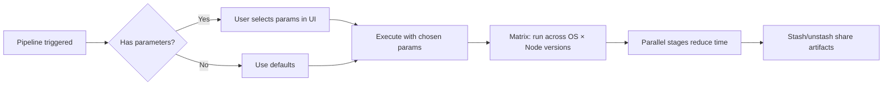
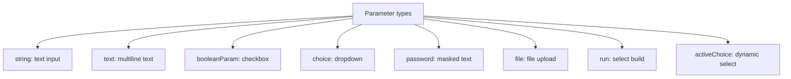
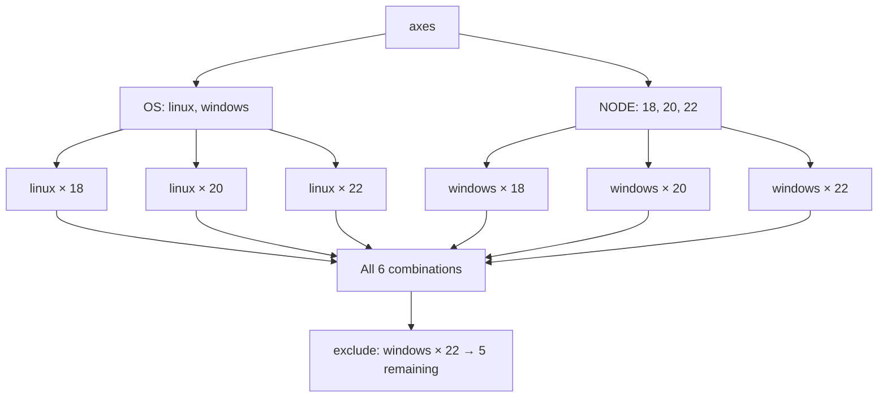

# Parameters, Matrix, and Parallelism

> [!summary] Goal
> Make pipelines flexible with build parameters, fast with parallel stages, and multi-dimensional with matrix builds — without overloading executors.

## Table of Contents

1. [Why Parameters and Parallelism Matter](#why-parameters-and-parallelism-matter)
2. [Build Parameters](#build-parameters)
3. [`matrix` Directive](#matrix-directive)
4. [`parallel` Directive](#parallel-directive)
5. [Stash and Unstash](#stash-and-unstash)
6. [Advanced Options](#advanced-options)
7. [Pitfalls](#pitfalls)

---

## Why Parameters and Parallelism Matter

Parameters make pipelines configurable per-trigger. Matrix runs the same stage across multiple configurations. Parallel reduces total build time.



---

## Build Parameters

```groovy
pipeline {
    parameters {
        string(name: 'BRANCH', defaultValue: 'main', description: 'Branch to build')
        text(name: 'CHANGELOG', defaultValue: '', description: 'Release notes')
        booleanParam(name: 'RUN_TESTS', defaultValue: true, description: 'Run tests')
        choice(name: 'ENV', choices: ['dev', 'staging', 'prod'], description: 'Deploy environment')
        password(name: 'API_KEY', defaultValue: '', description: 'API key')
        file(name: 'CONFIG_FILE', description: 'Configuration file to upload')
        run(name: 'UPSTREAM_BUILD', description: 'Upstream build that triggered this')
        activeChoice(name: 'BRANCHES', choiceType: 'PT_SINGLE_SELECT', filterable: true,
            groovyScript: 'return ["main", "develop"]')
    }
    stages {
        stage('Deploy') {
            when { expression { params.ENV == 'prod' } }
            steps {
                echo "Deploying branch ${params.BRANCH} to ${params.ENV}"
            }
        }
    }
}
```



---

## `matrix` Directive

Runs the same stage with multiple axis combinations:

```groovy
pipeline {
    agent none
    stages {
        stage('Test Across Configurations') {
            matrix {
                axes {
                    axis {
                        name 'OS'
                        values 'linux', 'windows'
                    }
                    axis {
                        name 'NODE'
                        values '18', '20', '22'
                    }
                }
                axes {
                    axis {
                        name 'BROWSER'
                        values 'chrome', 'firefox'
                    }
                }
                // Remove specific combinations
                exclude {
                    axis {
                        name 'OS'
                        values 'windows'
                    }
                    axis {
                        name 'BROWSER'
                        values 'firefox'
                    }
                }
                // Add extra fields to specific combinations
                exclude {
                    axis {
                        name 'NODE'
                        values '18'
                    }
                    axis {
                        name 'OS'
                        values 'windows'
                    }
                }
                stages {
                    stage('Test') {
                        agent { label matrix.OS }
                        steps {
                            sh "echo 'Testing Node ${matrix.NODE} on ${matrix.OS} with ${matrix.BROWSER}'"
                            sh "npm ci && npm test"
                        }
                    }
                }
            }
        }
    }
}
```



---

## `parallel` Directive

```groovy
pipeline {
    agent any
    stages {
        stage('Parallel Stages') {
            parallel {
                stage('Lint') {
                    steps {
                        sh 'npm run lint'
                    }
                }
                stage('Unit Tests') {
                    steps {
                        sh 'npm test -- --coverage'
                    }
                }
                stage('Integration Tests') {
                    agent { label 'high-mem' }
                    steps {
                        sh 'npm run test:integration'
                    }
                }
                // Fail fast — stop all if any fails
                failFast true
            }
        }
    }
}

// Scripted Pipeline parallel
node {
    parallel(
        lint: {
            stage('Lint') { sh 'npm run lint' }
        },
        test: {
            stage('Test') { sh 'npm test' }
        },
        failFast: true
    )
}
```

---

## Stash and Unstash

Share files between stages or parallel branches:

```groovy
pipeline {
    agent any
    stages {
        stage('Build') {
            steps {
                sh 'npm ci && npm run build'
                stash name: 'build-output', includes: 'dist/**', excludes: '**/*.map'
                stash name: 'node-modules', includes: 'node_modules/'
            }
        }
        stage('Test') {
            steps {
                unstash 'build-output'
                unstash 'node-modules'
                sh 'npm test'
            }
        }
        stage('Deploy') {
            steps {
                unstash 'build-output'
                sh './deploy.sh'
            }
        }
    }
}
```

| Stash option | Description | Default |
|-------------|-------------|---------|
| `name` | Unique stash name (required) | — |
| `includes` | Glob pattern of files to stash | `**/*` |
| `excludes` | Glob pattern to exclude | `''` |
| `allowEmpty` | Allow stash with no matching files | `false` |
| `useDefaultExcludes` | Use default excludes like `.git/` | `true` |

---

## Advanced Options

```groovy
pipeline {
    options {
        // Concurrency
        disableConcurrentBuilds()
        disableResume()                    // Don't resume after restart

        // Build ordering
        buildDiscarder(logRotator(
            numToKeepStr: '20',            // Keep last 20 builds
            artifactNumToKeepStr: '5',      // Keep artifacts for last 5
            daysToKeepStr: '14'            // Keep builds for 14 days
        ))

        // Execution control
        timeout(time: 1, unit: 'HOURS')
        rateLimitBuilds(amount: 5, unit: 'HOUR')  // Max 5 builds per hour
        throttle(['my-throttle'])                   // Throttle plugin
        parallelsAlwaysFailFast()
    }
}
```

### `lock` and `milestone`

```groovy
stage('Deploy') {
    steps {
        // Only one deploy at a time across ALL branches
        lock('production-deploy') {
            sh './deploy.sh'
        }
    }
}
```

---

## Pitfalls

### Matrix axis explosion

`3 OS × 4 Node × 3 Browser = 36 jobs`. This ties up all executors and takes excessive time.

**Fix**: Use `exclude` to drop unnecessary combinations. Set `maxParallel` in the matrix, or use `agent none` with per-stage agents to spread the load.

### Stash too large

`stash` compresses files in memory. Large stashes (>100MB) cause `OutOfMemoryError`.

**Fix**: Stash only necessary files. Use `includes` pattern to limit scope. For large artifacts, use `archiveArtifacts` and `copyArtifacts`.

### Parallel executor starvation

If you have 2 executors on the controller and run 6 parallel stages, 4 will queue waiting for executors — increasing total time.

**Fix**: Use more agents. Set `maxParallel` in parallel blocks. Match parallelism to available executor capacity.

### `booleanParam` truthiness

```groovy
// BAD: params.RUN_TESTS is a string "true"/"false", not boolean
when { expression { params.RUN_TESTS == true } }

// GOOD
when { expression { params.RUN_TESTS == 'true' } }
```

---

> [!question]- Interview Questions
>
> **Q: What parameter types are available in Declarative Pipeline?**
> A: `string`, `text`, `booleanParam`, `choice`, `password`, `file`, `run`, and `activeChoice` (via Active Choices Plugin).
>
> **Q: How does the `matrix` directive work?**
> A: It defines axes (e.g., OS, Node version) as lists. Jenkins runs the stage for every combination (Cartesian product). `exclude` removes specific combinations.
>
> **Q: What is `stash`/`unstash` used for?**
> A: Sharing files between stages or parallel branches. `stash` saves files, `unstash` restores them in another context. Useful for passing build outputs between parallel stages.

---

## Cross-Links

- [[CICD/Jenkins/01_Foundations/01_Jenkinsfile_Pipeline_Basics]] for pipeline syntax
- [[CICD/Jenkins/01_Foundations/02_Agents_Nodes_and_Executors]] for executor capacity planning
- [[CICD/Jenkins/02_Core/01_Shared_Libraries_Basics]] for reusable parallel patterns

---

## References

- [Pipeline Parameters](https://www.jenkins.io/doc/book/pipeline/syntax/#parameters)
- [Matrix Directive](https://www.jenkins.io/doc/book/pipeline/syntax/#declarative-matrix)
- [Parallel Execution](https://www.jenkins.io/doc/book/pipeline/pipeline-best-practices/#parallelism)
- [Stash](https://www.jenkins.io/doc/pipeline/steps/workflow-durable-task-step/#stash-stash-some-files-to-be-used-later-in-the-build)
