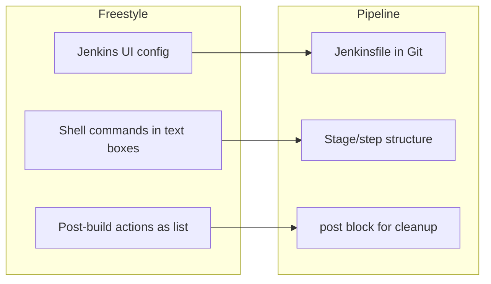
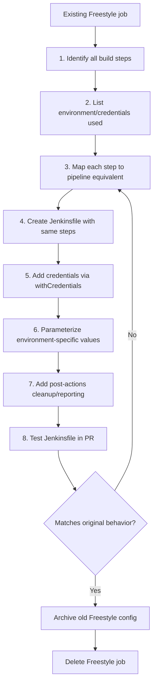

# Freestyle vs Pipeline and Migration

> [!summary] Goal
> Understand the differences between traditional Freestyle jobs and modern Pipelines, and migrate step-by-step.

## Table of Contents

1. [Why Migrate to Pipeline](#why-migrate-to-pipeline)
2. [Freestyle vs Pipeline Comparison](#freestyle-vs-pipeline-comparison)
3. [Migration Process](#migration-process)
4. [Builder-to-Step Mapping](#builder-to-step-mapping)
5. [Before and After Example](#before-and-after-example)
6. [Pitfalls](#pitfalls)

---

## Why Migrate to Pipeline

Freestyle jobs are configured in the Jenkins UI — not version-controlled, not reviewable, not reproducible. Pipeline-as-code fixes all of that.



---

## Freestyle vs Pipeline Comparison

| Aspect | Freestyle | Pipeline |
|--------|----------|----------|
| **Configuration** | UI forms | `Jenkinsfile` in SCM |
| **Version controlled** | ❌ No | ✅ Yes |
| **Reviewable via PR** | ❌ No | ✅ Yes |
| **Stages** | ❌ Linear execution | ✅ Named stages |
| **Parallel execution** | ❌ Multiple jobs | ✅ `parallel` directive |
| **Conditional logic** | ❌ Limited plugins | ✅ `when` / `if` |
| **Error handling** | ❌ Post-build actions | ✅ `post` / `try/catch` |
| **Manual approval** | ❌ Plugin needed | ✅ `input` step |
| **Parameters** | ✅ "This build is parameterized" | ✅ `parameters` directive |
| **SCM integration** | ✅ Good | ✅ Better |
| **Reusable steps** | ❌ Copy-paste | ✅ Shared libraries |
| **Pipeline visualization** | ❌ List view | ✅ Blue Ocean |
| **Restart from stage** | ❌ Full rebuild | ✅ Stage restart |
| **Learning curve** | Low | Medium |

---

## Migration Process



### Step-by-step

1. **Open the Freestyle job** → `Configure` → read every build step
2. **Identify**: SCM checkout config, build steps (shell, Maven, Gradle, etc.), post-build actions (archive, test reports, notifications), credentials used
3. **Map each action** to its Pipeline equivalent using the mapping table below
4. **Create `Jenkinsfile`** with `stages` matching the original steps
5. **Add `post` blocks** for cleanup, archiving, and notifications
6. **Remove the old Freestyle job** after the Pipeline is verified

---

## Builder-to-Step Mapping

| Freestyle action | Pipeline equivalent |
|-----------------|-------------------|
| Source Code Management → Git | `checkout scm` or `git url: '...', credentialsId: '...'` |
| Build → Execute shell | `sh 'command'` |
| Build → Invoke Maven | `sh 'mvn clean install'` |
| Build → Invoke Gradle | `sh './gradlew build'` |
| Post-build → Archive artifacts | `archiveArtifacts artifacts: 'dist/**'` |
| Post-build → Publish JUnit results | `junit 'reports/**/*.xml'` |
| Post-build → Email notification | `emailext` step |
| Post-build → Archive the artifacts | `archiveArtifacts` |
| Build Environment → Set environment vars | `environment { VAR = 'value' }` or `withEnv(['VAR=value']) { ... }` |
| Build Environment → Inject passwords | `withCredentials([string(credentialsId: 'id', variable: 'VAR')]) { ... }` |
| Build Triggers → Poll SCM | `triggers { pollSCM('H/5 * * * *') }` |
| Build Triggers → Build periodically | `triggers { cron('H 2 * * 1-5') }` |
| Parameters → String/Boolean/Choice | `parameters { string(...) booleanParam(...) choice(...) }` |

---

## Before and After Example

### Before: Freestyle job

```
Job Name: my-app-build
Source Code Management: Git
  Repository: https://github.com/org/my-app.git
  Branch: */main
Build Triggers: Poll SCM (H/5 * * * *)
Environment: MY_VAR=production
Build:
  1. Execute shell: npm ci
  2. Execute shell: npm run build
  3. Execute shell: npm test
  4. Execute shell: ./deploy.sh
Post-build Actions:
  1. Archive artifacts: dist/**/*.zip
  2. Publish JUnit test results: reports/**/*.xml
  3. Email notification: team@example.com
```

### After: Jenkinsfile Pipeline

```groovy
pipeline {
    agent any
    triggers { pollSCM('H/5 * * * *') }
    environment {
        MY_VAR = 'production'
    }
    stages {
        stage('Install') {
            steps { sh 'npm ci' }
        }
        stage('Build') {
            steps { sh 'npm run build' }
        }
        stage('Test') {
            steps {
                sh 'npm test'
                junit 'reports/**/*.xml'
            }
        }
        stage('Deploy') {
            when { branch 'main' }
            steps { sh './deploy.sh' }
        }
    }
    post {
        success { archiveArtifacts artifacts: 'dist/**/*.zip' }
        always { emailext(to: 'team@example.com', subject: "${env.JOB_NAME} - ${currentBuild.currentResult}", body: "Build ${env.BUILD_URL}") }
    }
}
```

---

## Pitfalls

### Not migrating credentials

Freestyle jobs may reference credentials by name that don't exist in the credential store.

**Fix**: Verify credentials exist before migrating. Use the credentials ID (not description) in `withCredentials`.

### Missing post-build actions

Migration can miss a post-build step that was critical (like archiving test reports).

**Fix**: List every post-build action from the UI before starting migration. Compare outputs between old and new.

### Different shell behavior

Freestyle jobs run `sh` in a login shell. Pipeline's `sh` step does not.

**Fix**: Add `#!/bin/bash -l` at the top of `sh` scripts that depend on profile-loaded environment variables.

---

> [!question]- Interview Questions
>
> **Q: What are the main advantages of Pipeline over Freestyle?**
> A: Pipeline is version-controlled (Jenkinsfile in SCM), has named stages, parallel execution, `when`/`input`/`post` directives, stage restart, shared libraries, and Blue Ocean visualization.
>
> **Q: How do you migrate a Freestyle execute-shell step to Pipeline?**
> A: Wrap the shell command in `sh '...'` inside a `stage` block. Migrate environment variables to `environment { }` and credentials to `withCredentials { }`.

---

## Cross-Links

- [[CICD/Jenkins/01_Foundations/01_Jenkinsfile_Pipeline_Basics]] for pipeline syntax
- [[CICD/Jenkins/01_Foundations/03_Credentials_and_Secrets]] for credential handling
- [[CICD/Jenkins/05_Projects/01_Migrate_Freestyle_to_Pipeline]] for hands-on migration project

---

## References

- [Jenkins Pipeline Migration](https://www.jenkins.io/doc/book/pipeline/migration/)
- [Pipeline Steps Reference](https://www.jenkins.io/doc/pipeline/steps/)
