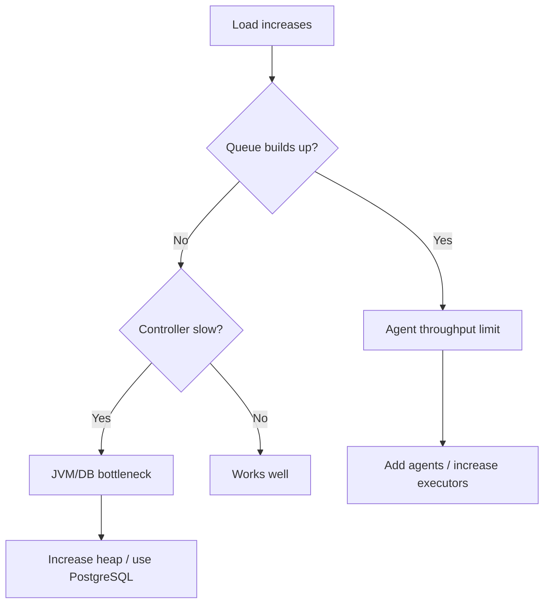
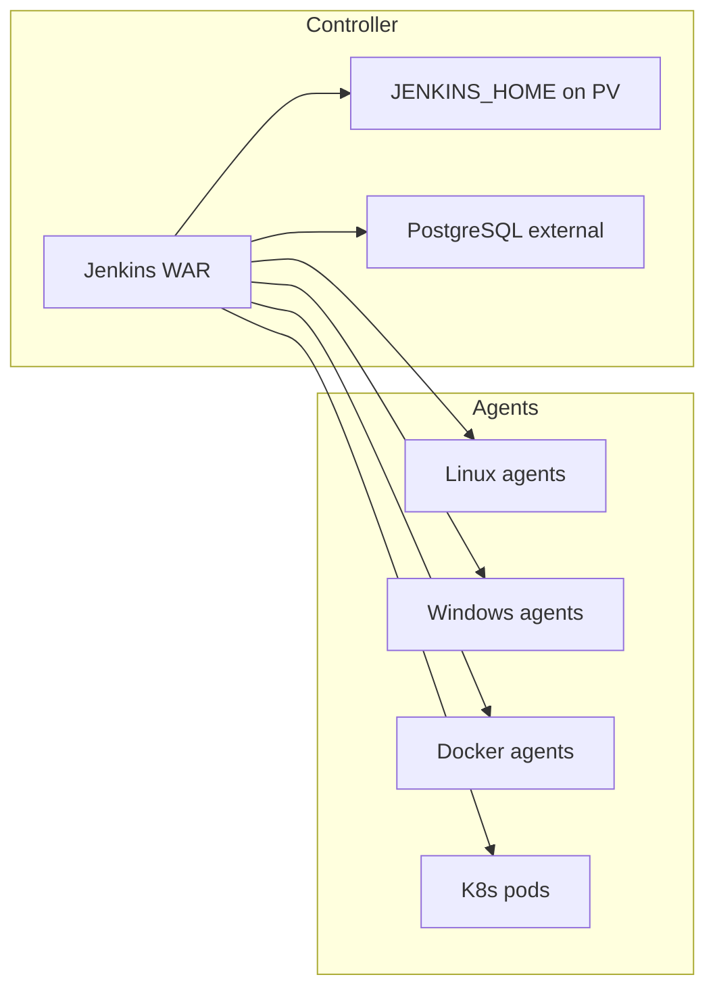
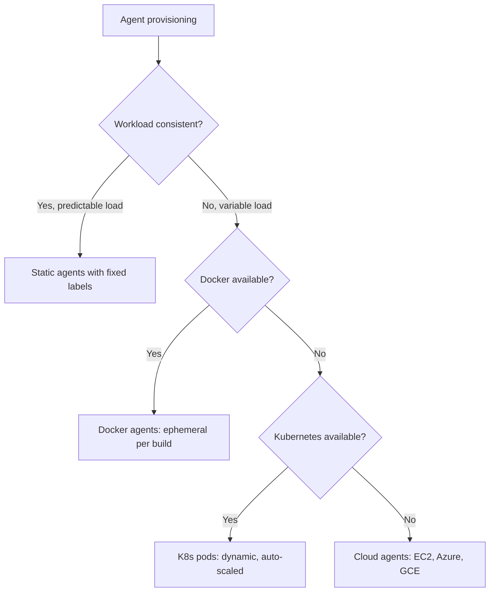

# Scaling Jenkins: Masters, Agents, and Performance

> [!summary] Goal
> Keep Jenkins reliable under load — configure controller HA, tune JVM, provision dynamic agents, and monitor performance.

## Table of Contents

1. [Why Scaling Matters](#why-scaling-matters)
2. [Controller Architecture and HA](#controller-architecture-and-ha)
3. [JVM Tuning for Jenkins](#jvm-tuning-for-jenkins)
4. [Agent Provisioning Strategies](#agent-provisioning-strategies)
5. [Monitoring Jenkins](#monitoring-jenkins)
6. [Jenkins CLI](#jenkins-cli)
7. [Agent Comparison](#agent-comparison)
8. [Pitfalls](#pitfalls)

---

## Why Scaling Matters

As teams grow, Jenkins faces more concurrent builds, longer queues, and resource contention. Proper scaling ensures reliable operation.



---

## Controller Architecture and HA

### Production controller setup

```
Jenkins Home: /var/lib/jenkins (on persistent volume)
Database: PostgreSQL (external)
Heap: -Xms4g -Xmx8g
Agent port: -Djenkins.model.Jenkins.slaveAgentPort=50000
HTTP port: 8080
```



### High availability approaches

| Approach | How | Pros | Cons |
|----------|-----|------|------|
| **Active/Passive** | Secondary controller takes over on failure | Simple | Failover time, manual |
| **Active/Active with shared JENKINS_HOME** | Multiple controllers read same NFS | No downtime | File locking issues |
| **CloudBees CI** | Commercial HA with active/active | Full HA, zero downtime | Cost |
| **Kubernetes (operator)** | Jenkins controller as K8s deployment | Auto-restart, PVC | Not true HA (recovery, not failover) |

---

## JVM Tuning for Jenkins

```bash
# JENKINS_JAVA_OPTIONS environment variables
# Linux: /etc/default/jenkins or systemd override

JENKINS_JAVA_OPTIONS="
  -Xms4g -Xmx8g                          # Heap: 4-8 GB per 100 agent connections
  -XX:+UseG1GC                            # G1GC for predictable pause times
  -XX:MaxGCPauseMillis=200
  -XX:+UseStringDeduplication             # Jenkins has many duplicate strings
  -Djenkins.model.Jenkins.slaveAgentPort=50000  # Agent connection port
  -Djenkins.model.Jenkins.slaveAgentPortEnforce=true
  -Dhudson.model.LoadStatistics.clock=1000      # Load stats refresh
  -Djenkins.install.runSetupWizard=false        # Skip setup wizard
  -Djenkins.model.Jenkins.logStartupTime=true
  -Dorg.apache.commons.jelly.tags.fmt.timeZone=America/New_York
"
```

```bash
# Systemd override (Ubuntu/Debian)
sudo mkdir -p /etc/systemd/system/jenkins.service.d
cat <<EOF | sudo tee /etc/systemd/system/jenkins.service.d/override.conf
[Service]
Environment="JENKINS_JAVA_OPTIONS=-Xms4g -Xmx8g -XX:+UseG1GC"
EOF
sudo systemctl daemon-reload && sudo systemctl restart jenkins
```

---

## Agent Provisioning Strategies



| Strategy | Setup complexity | Cost efficiency | Startup time |
|----------|-----------------|-----------------|-------------|
| **Static agents** (always-on VMs) | Low | Low (idle cost) | Instant |
| **Docker agents** (per-build containers) | Medium | High | 5-30s |
| **Kubernetes pods** (dynamic) | Medium | High | 10-60s |
| **Cloud agents** (EC2 fleet) | High | Medium | 60-120s |

---

## Monitoring Jenkins

### Prometheus plugin

```bash
# Install: Prometheus Metrics Plugin
# Endpoint: https://jenkins.example.com/prometheus/
```

```groovy
// Jenkins Groovy console — check metrics availability
def metrics = Jenkins.instance.getExtensionList('org.jenkinsci.plugins.prometheus.service.PrometheusService')
println "Prometheus available: ${metrics.size() > 0}"
```

### Key metrics to monitor

| Metric | What it indicates | Alert threshold |
|--------|-------------------|----------------|
| `jenkins_queue_size` | Build queue length | >10 for >5 min |
| `jenkins_executor_count` | Available executors | <2 for >10 min |
| `jenkins_node_build_count` | Builds per node | Unexpected drop = node dead |
| `jenkins_node_online` | Node connectivity | `false` = node disconnected |
| `jvm_memory_heap_used` | JVM memory pressure | >80% for >10 min |
| `jenkins_queue_waiting_duration` | How long builds wait | >60 sec |

### Jenkins CLI diagnostic commands

```bash
# List executors
java -jar jenkins-cli.jar -s https://jenkins.example.com/ \
  groovy = << 'EOF'
Jenkins.instance.nodes.each { node ->
    println "${node.displayName}: ${node.numExecutors} executors"
    node.computer.executors.each { ex ->
        println "  Executor: ${ex.idle ? 'idle' : 'busy'}"
    }
}
EOF

# Check queue
java -jar jenkins-cli.jar -s https://jenkins.example.com/ list-queue

// Groovy console — check waiting builds
println Jenkins.instance.queue.items.collect { "${it.name} (waiting: ${it.inQueueFor / 1000}s)" }.join('\n')
```

---

## Agent Comparison

| Aspect | Static Agent | Docker Agent | K8s Pod Agent | Cloud Agent |
|--------|-------------|-------------|---------------|-------------|
| **Setup** | Manual SSH registration | Docker plugin config | Kubernetes plugin config | Cloud plugin config |
| **Cost** | Idle cost | Per-build only | Per-build only | Per-build |
| **Startup** | Instant | 5-30 seconds | 10-60 seconds | 60-120 seconds |
| **Isolation** | Shared workspace | Fresh container | Fresh pod | Fresh VM |
| **Tool persistence** | Persistent | Ephemeral | Ephemeral | Ephemeral |
| **Maintenance** | High | Low | Low | Medium |
| **Best for** | Legacy, long builds | Standard CI | Dynamic workloads | Infrequent large builds |

---

## Pitfalls

### JENKINS_HOME on insufficient storage

Builds, logs, and artifacts accumulate in `/var/lib/jenkins`. Without cleanup, the disk fills up.

**Fix**: Set `buildDiscarder` on all jobs. Use `logRotator`. Monitor disk usage. Move artifacts to external storage.

### Too many executors on controller

Running builds on the controller (built-in node) competes for JVM heap and CPU with the Jenkins UI.

**Fix**: Set `# of executors` on built-in node to `0`. Use agents for all builds.

### No database for large instances

Jenkins uses a file-based database by default. With 500+ jobs, file operations become slow.

**Fix**: Switch to PostgreSQL: Manage Jenkins → Configure System → JDBC URL → `jdbc:postgresql://host/jenkins`.

---

> [!question]- Interview Questions
>
> **Q: How do you tune Jenkins JVM for production?**
> A: Set `-Xms4g -Xmx8g`, use G1GC, configure agent port 50000, and set `LoadStatistics.clock=1000` for active load monitoring.
>
> **Q: What are the agent provisioning strategies?**
> A: Static (always-on), Docker (per-build containers), Kubernetes (dynamic pods), and Cloud (EC2/VM fleets). Each trades off startup time vs cost efficiency.
>
> **Q: How do you monitor Jenkins build queues?**
> A: Use the Prometheus Metrics Plugin to monitor `jenkins_queue_size`. Set alerts when the queue exceeds 10 for more than 5 minutes.

---

## Cross-Links

- [[CICD/Jenkins/01_Foundations/02_Agents_Nodes_and_Executors]] for agent basics
- [[CICD/Jenkins/03_Advanced/04_Docker_Kubernetes_Integration_with_Pipeline]] for K8s agent setup
- [[CICD/Jenkins/03_Advanced/02_Configuration_as_Code_JCasC]] for automated Jenkins config

---

## References

- [Jenkins Performance](https://www.jenkins.io/doc/book/architecting-for-performance/)
- [Jenkins JVM Tuning](https://www.jenkins.io/doc/book/managing/system-properties/)
- [Prometheus Plugin](https://plugins.jenkins.io/prometheus/)
- [Monitoring Jenkins](https://www.jenkins.io/doc/book/operations/monitoring/)
