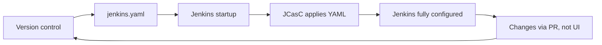

# Configuration as Code (JCasC)

> [!summary] Goal
> Define Jenkins system configuration in YAML — version-controlled, repeatable, and auditable. Manage plugins, credentials, security, and jobs without clicking through the UI.

## Table of Contents

1. [Why JCasC Matters](#why-jcasc-matters)
2. [Installation and Bootstrap](#installation-and-bootstrap)
3. [`jenkins.yaml` Structure](#jenkins-yaml-structure)
4. [Common Configuration Blocks](#common-configuration-blocks)
5. [Credentials in JCasC](#credentials-in-jcasc)
6. [JCasC vs UI Configuration](#jcasc-vs-ui-configuration)
7. [Pitfalls](#pitfalls)

---

## Why JCasC Matters

Without JCasC, every Jenkins instance is configured manually via the UI — unrepeatable, untestable, and unrecoverable.



> [!tip] Definition
> **JCasC (Configuration as Code)**: a Jenkins plugin that reads a YAML file at startup and applies it as the system configuration — plugins, security, credentials, jobs, and all global settings. No UI clicks needed.

---

## Installation and Bootstrap

```bash
# Install via Plugin Manager
# Plugin: Configuration as Code
# Restart Jenkins

# Set the YAML file path
# Environment variable (recommended):
export CASC_JENKINS_CONFIG=/var/lib/jenkins/casc.yaml

# Or via system property:
-Dcasc.jenkins.config=/var/lib/jenkins/casc.yaml

# Test the configuration (no apply):
java -jar jenkins-cli.jar -s https://jenkins.example.com/ \
  groovy = < 'println new jenkins.bnf.CasC().checkConfig()'
```

```yaml
# /var/lib/jenkins/casc.yaml
jenkins:
  systemMessage: "Jenkins configured by JCasC\n"
  numExecutors: 0              # Don't run builds on controller
  scmCheckoutRetryCount: 3
  mode: NORMAL                 # EXCLUSIVE = only tied jobs
  slaveAgentPort: 50000
  labelString: "controller linux"
  quietPeriod: 5
```

---

## `jenkins.yaml` Structure

```yaml
# Top-level structure
jenkins:
  systemMessage: "..."
  numExecutors: 0
  # ... system settings

security:
  globalJobDispatching: true
  # ... security realm, authorization

credentials:
  system:
    domainCredentials:
      # ... credential definitions

jobs:
  - script: >
      pipelineJob('my-pipeline') {
        definition {
          cpsScm {
            scm {
              git {
                remote('https://github.com/org/repo.git')
                branch('main')
                scriptPath('Jenkinsfile')
              }
            }
          }
        }
      }

unclassified:
  buildDiscarders:
    configuredBuildDiscarders:
      - "jobBuildDiscarder"
  location:
    url: "https://jenkins.example.com"
    adminAddress: "admin@example.com"

tool:
  jdk:
    installations:
      - name: "jdk21"
        properties:
          - installSource:
              installers:
                - adoptium.net:
                    id: "jdk-21.0.2+13"
```

---

## Common Configuration Blocks

### Plugins

```yaml
jenkins:
  pluginManager:
    sites:
      - id: "default"
        url: "https://updates.jenkins.io/update-center.json"
    doCheckUpdateSite: true
```

### Security

```yaml
security:
  globalJobDispatching: true
  authentication:
    delegatesToSecure: true
  authorizationStrategy:
    loggedInUsersCanDoAnything:
      allowAnonymousRead: false
  remotingSecurity:
    enabled: true
  queueItemAuthenticator:
    authenticators:
      - global:
          strategy: "triggeringUsersAuthorizationStrategy"
```

### Tools (auto-installers)

```yaml
tool:
  jdk:
    installations:
      - name: "jdk17"
        properties:
          - installSource:
              installers:
                - adoptium.net:
                    id: "jdk-17.0.9+9"
  maven:
    installations:
      - name: "maven3"
        properties:
          - installSource:
              installers:
                - maven:
                    id: "3.9.6"
```

---

## Credentials in JCasC

```yaml
credentials:
  system:
    domainCredentials:
      - domain:
          name: "github.com"
          description: "GitHub credentials"
        credentials:
          - usernamePassword:
              id: "github-token"
              password: "${GITHUB_TOKEN}"    # Reference environment variable
              scope: GLOBAL
              username: ""
      - domain:
          name: "docker.io"
        credentials:
          - string:
              id: "docker-hub-token"
              secret: "${DOCKER_HUB_TOKEN}"
              scope: GLOBAL
          - file:
              id: "gcp-service-account"
              fileName: "sa.json"
              secretBytes: "${GCP_SA_JSON}"
              scope: GLOBAL
```

> [!warning] Never hardcode secrets in `jenkins.yaml`. Use environment variable references (`${VAR_NAME}`) that are injected securely.

---

## JCasC vs UI Configuration

| Aspect | JCasC | UI Configuration |
|--------|------|-----------------|
| **Reproducible** | ✅ Yes — same YAML = same config | ❌ Manual clicks differ |
| **Version controlled** | ✅ In Git | ❌ Not tracked |
| **Reviewable** | ✅ PR review | ❌ No change log |
| **Recoverable** | ✅ Re-apply YAML | ❌ Rebuild from memory |
| **Secret management** | ✅ Use env vars | ❌ Entered in browser |
| **Learning curve** | Steeper (YAML syntax) | Gentler (UI forms) |
| **Flexibility** | ✅ Everything is configurable | ⚠️ Some settings hidden |
| **Documentation** | ✅ YAML is self-documenting | ❌ Hidden in forms |

---

## Pitfalls

### Secret references not resolved

Using `${MY_SECRET}` in `jenkins.yaml` requires the variable to be set in the Jenkins environment.

**Fix**: Use environment variables or Docker secrets. Don't use YAML anchors for secrets — `&secret` is visible in version control.

### YAML syntax errors crash Jenkins

A malformed `jenkins.yaml` can prevent Jenkins from starting.

**Fix**: Validate YAML locally before applying: `yamllint casc.yaml`. Use `jenkins-cli` to test config without applying: `java -jar jenkins-cli.jar groovy checkConfig.groovy`.

### ID collisions on credentials

If a credential with the same ID already exists in Jenkins, JCasC may create a duplicate or fail.

**Fix**: Use unique IDs. Manage credentials exclusively from JCasC (don't mix UI and JCasC for the same credentials).

### Plugin not installed before JCasC applies

If `jenkins.yaml` references a plugin before it's installed, JCasC fails.

**Fix**: Install plugins first (via `pluginManager` block or `plugins.txt`), then apply JCasC.

---

> [!question]- Interview Questions
>
> **Q: What is JCasC and why use it?**
> A: Jenkins Configuration as Code — defines all Jenkins system settings in a YAML file. Ensures reproducible, version-controlled, recoverable Jenkins instances.
>
> **Q: How do you handle secrets in JCasC?**
> A: Use `${VARIABLE_NAME}` in the YAML and set the actual values as environment variables or Docker secrets. Never hardcode secrets in the YAML file.
>
> **Q: What happens if `jenkins.yaml` is malformed?**
> A: Jenkins may fail to start. Use `yamllint` to validate locally, or use the Jenkins CLI to test the config before applying it to production.

---

## Cross-Links

- [[CICD/Jenkins/01_Foundations/03_Credentials_and_Secrets]] for credential types
- [[CICD/Jenkins/03_Advanced/03_Security_RBAC]] for security configuration in JCasC
- [[CICD/Jenkins/03_Advanced/01_Scaling_Jenkins_Masters_and_Agents]] for JVM settings in JCasC

---

## References

- [JCasC Plugin](https://plugins.jenkins.io/configuration-as-code/)
- [JCasC Documentation](https://www.jenkins.io/projects/jcasc/)
- [JCasC YAML Reference](https://github.com/jenkinsci/configuration-as-code-plugin/blob/master/docs/features/configuration-as-code.md)
- [JCasC Examples](https://github.com/jenkinsci/configuration-as-code-plugin/tree/master/demos)
