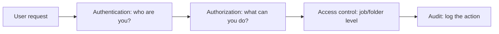
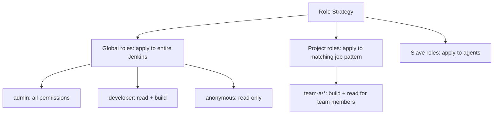

# Security: RBAC and Authorization

> [!summary] Goal
> Secure Jenkins with authentication, authorization, and audit trails — using Matrix-based security, Role Strategy, and folder-level permissions.

## Table of Contents

1. [Why Jenkins Security Matters](#why-jenkins-security-matters)
2. [Security Model Overview](#security-model-overview)
3. [Authentication (Security Realm)](#authentication)
4. [Authorization Strategies](#authorization-strategies)
5. [Matrix-Based Security](#matrix-based-security)
6. [Role-Based Strategy Plugin](#role-based-strategy-plugin)
7. [Folder-Based Security](#folder-based-security)
8. [Pipeline Security and Sandbox](#pipeline-security-and-sandbox)
9. [Pitfalls](#pitfalls)

---

## Why Jenkins Security Matters

Without proper security, any Jenkins user can run arbitrary code on agents, access credentials, modify jobs — or delete everything.



---

## Security Model Overview

| Layer | What it controls | Implementation |
|-------|-----------------|---------------|
| **Authentication** | Who can log in | Jenkins User DB, LDAP, SAML, OIDC, GitHub OAuth |
| **Authorization** | What they can do | Matrix, Role Strategy, Project-based Matrix |
| **Access Control** | Which jobs/folders | Folder-based security, per-job ACL |
| **Audit** | Track changes | Audit Trail Plugin, JobConfigHistory Plugin |

---

## Authentication (Security Realm)

### Jenkins User Database (built-in)

```yaml
# JCasC
security:
  realm:
    local:
      allowsSignup: false
      enableCaptcha: false
      users:
        - id: "admin"
          password: "${ADMIN_PASSWORD}"
        - id: "developer"
          password: "${DEV_PASSWORD}"
```

### LDAP / Active Directory

```
Manage Jenkins → Configure Global Security → Security Realm → LDAP
Server: ldap://ldap.example.com:389
Root DN: dc=example,dc=com
User search base: ou=users
Group search base: ou=groups
```

### GitHub OAuth

```
Manage Jenkins → Configure Global Security → Security Realm → GitHub Authentication
GitHub Server: https://github.com
Client ID: <GitHub App client ID>
Client Secret: <GitHub App client secret>
```

---

## Authorization Strategies

| Strategy | Granularity | Complexity | Best for |
|----------|-------------|------------|----------|
| **Anyone can do anything** | None | Zero | Development only |
| **Logged-in users can do anything** | None | Zero | Trusted team, small org |
| **Matrix-based security** | Per-permission | Medium | Teams with 10-100 users |
| **Project-based Matrix** | Per-permission + per-job | High | Large teams, compliance |
| **Role Strategy** | Role-based (global + project) | High | Multi-team, enterprise |

---

## Matrix-Based Security

```yaml
# JCasC
security:
  authorizationStrategy:
    projectMatrix:
      permissions:
        - "Overall/Administer:admin"
        - "Overall/Read:authenticated"
        - "Job/Read:authenticated"
        - "Job/Build:developer"
        - "Job/Configure:developer"
        - "Run/Update:developer"
        - "View/Read:authenticated"
        - "View/Configure:developer"
        - "Credentials/View:developer"
        - "Credentials/Update:developer"
        - "Agent/Configure:admin"
        - "Agent/Build:developer"
```

| Permission | What it grants |
|------------|---------------|
| `Overall/Administer` | Full admin access |
| `Overall/Read` | See Jenkins system info |
| `Job/Create` | Create new jobs |
| `Job/Delete` | Delete jobs |
| `Job/Configure` | Edit job configuration |
| `Job/Build` | Trigger builds |
| `Job/Read` | View jobs |
| `Run/Delete` | Delete build runs |
| `Run/Update` | Update build description |
| `Credentials/View` | See credential IDs |
| `Credentials/Update` | Add/edit credentials |
| `Agent/Configure` | Add/edit agents |
| `Agent/Connect` | Connect agents |
| `View/Create` | Create views |
| `View/Configure` | Configure views |

---

## Role-Based Strategy Plugin

```yaml
# JCasC (requires Role Strategy Plugin)
unclassified:
  roleBasedAuthorizationStrategy:
    roleMaps:
      globalRoles:
        - name: "admin"
          permissions:
            - "hudson.model.Hudson.Administer"
            - "hudson.model.Hudson.Read"
          users:
            - "admin"
            - "alice"
        - name: "developer"
          permissions:
            - "hudson.model.Hudson.Read"
            - "hudson.model.Item.Build"
            - "hudson.model.Item.Read"
          users:
            - "bob"
            - "charlie"
        - name: "anonymous"
          permissions:
            - "hudson.model.Hudson.Read"
          users:
            - "anonymous"
      projectRoles:
        - name: "team-a-developer"
          permissions:
            - "hudson.model.Item.Build"
            - "hudson.model.Item.Read"
          pattern: "team-a/.*"
          users:
            - "dave"
```



---

## Folder-Based Security

Folders organize jobs and apply permissions to all jobs within:

```
my-org/
├── team-a/           (folder)
│   ├── service-a     (job)
│   └── service-b     (job)
├── team-b/           (folder)
│   ├── service-c     (job)
│   └── service-d     (job)
```

```yaml
# JCasC
jenkins:
  folders:
    - name: "team-a"
      properties:
        - folderCredentialsProperty:
            domainCredentials:
              - credentials:
                  - usernamePassword:
                      id: "team-a-token"
        - authorizationMatrixProperty:
            permissions:
              - "hudson.model.Item.Build:team-a-developer"
              - "hudson.model.Item.Read:team-a-developer"
```

---

## Pipeline Security and Sandbox

Pipelines loaded from SCM run in a **Groovy Sandbox** — restricted permissions:

```groovy
// INSIDE SANDBOX — restricted
@Library('my-lib') _
pipeline {
    agent any
    stages {
        stage('Build') {
            steps {
                sh 'npm ci'               // Allowed
                echo "Hello"              // Allowed
                // new File('/etc/passwd') // DENIED — file system access
                // System.exit(0)          // DENIED — dangerous calls
            }
        }
    }
}
```

| Execution mode | What's allowed | Who approves |
|---------------|----------------|-------------|
| **Sandbox** (SCM-triggered) | Groovy methods in approved whitelist | Jenkins admin (Script Security Plugin) |
| **Trusted** (manual trigger, admin-configured) | Full Groovy access | Initial setup |
| **Shared library** (loaded library) | Full access (if library is trusted) | Admin configures library trust |

---

## Pitfalls

### Overly permissive anonymous access

Anyone on the network can see jobs, build history, and artifacts.

**Fix**: Set `allowAnonymousRead: false`. Enable authentication for all access.

### Administer permission granted too broadly

Users with `Overall/Administer` can delete jobs, change security settings, and access all credentials.

**Fix**: Restrict `Overall/Administer` to a small group. Use `Job/Configure` for most developers.

### Pipeline sandbox blocking legitimate code

Common patterns like `new groovy.json.JsonSlurper()` are blocked in sandbox mode.

**Fix**: Move complex logic to a trusted shared library. Use `@NonCPS` annotation for non-serializable code. Approve methods via Script Security Plugin.

---

> [!question]- Interview Questions
>
> **Q: What are the three main authorization strategies in Jenkins?**
> A: Matrix-based (permission grid per user/group), Role Strategy (global + project roles), and Folder-based (permissions scoped to job folders).
>
> **Q: How does the Pipeline sandbox work?**
> A: SCM-triggered pipelines run in a sandbox that restricts dangerous Groovy calls (filesystem, network, process execution). Admin-approved methods via the Script Security Plugin bypass the sandbox.
>
> **Q: What is the difference between Matrix and Role Strategy?**
> A: Matrix assigns static permissions (Overall/Admin, Job/Build) to individual users or groups. Role Strategy defines named roles (admin, developer, viewer) that can be assigned globally or to job patterns.

---

## Cross-Links

- [[CICD/Jenkins/01_Foundations/03_Credentials_and_Secrets]] for credential security
- [[CICD/Jenkins/03_Advanced/02_Configuration_as_Code_JCasC]] for JCasC security configuration
- [[CICD/Jenkins/04_Playbooks/02_Plugin_Management_and_Upgrade_Recovery]] for security plugin updates

---

## References

- [Jenkins Security](https://www.jenkins.io/doc/book/security/)
- [Matrix Authorization](https://plugins.jenkins.io/matrix-auth/)
- [Role Strategy Plugin](https://plugins.jenkins.io/role-strategy/)
- [Script Security Plugin](https://plugins.jenkins.io/script-security/)
- [Pipeline Security](https://www.jenkins.io/doc/book/pipeline/security/)
