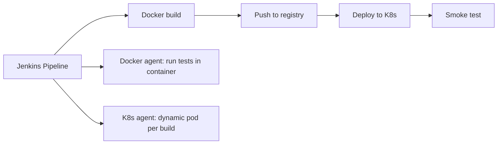
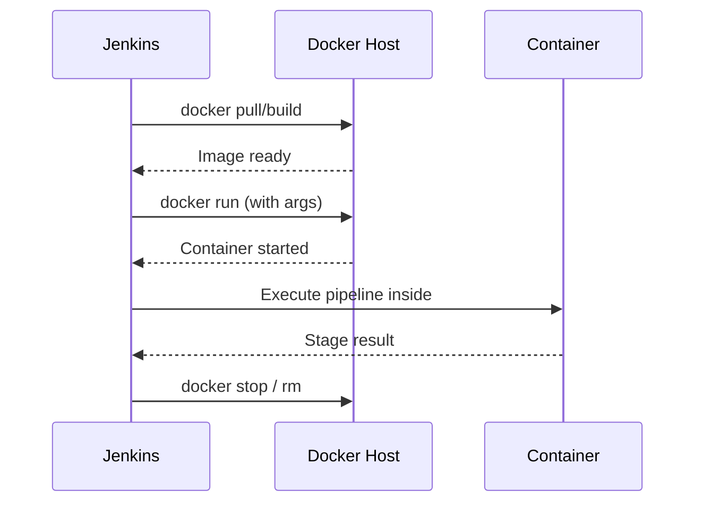
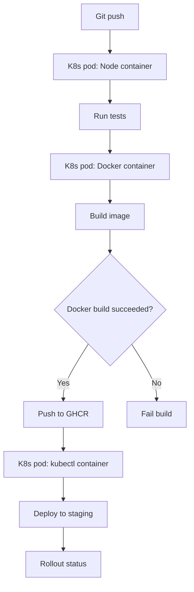

# Docker and Kubernetes Integration with Pipeline

> [!summary] Goal
> Build Docker images in pipelines, run stages inside containers, deploy to Kubernetes — all from a single Jenkinsfile.

## Table of Contents

1. [Why Docker/K8s Integration Matters](#why-docker-k8s-integration-matters)
2. [Docker Pipeline Plugin](#docker-pipeline-plugin)
3. [Docker Agent](#docker-agent)
4. [Kubernetes Plugin (PodTemplate)](#kubernetes-plugin)
5. [Deploying to Kubernetes](#deploying-to-kubernetes)
6. [Full CI/CD Pipeline Example](#full-ci-cd-pipeline-example)
7. [Pitfalls](#pitfalls)

---

## Why Docker/K8s Integration Matters

Docker provides consistent build environments. Kubernetes provides dynamic agents and a deployment target. Together, they enable fully containerized CI/CD.



---

## Docker Pipeline Plugin

### `docker.build()`

```groovy
// Build a Docker image
def myImage = docker.build("my-registry.com/my-app:${BUILD_NUMBER}")

// Build with custom Dockerfile and args
def myImage = docker.build("my-app:latest", "-f Dockerfile.ci --build-arg VERSION=1.0 .")
```

### `docker.image().inside()`

Run pipeline steps inside a container:

```groovy
pipeline {
    agent any
    stages {
        stage('Test in Container') {
            steps {
                script {
                    docker.image('node:20-alpine').inside('-v $HOME/.npm:/root/.npm') {
                        sh 'npm ci && npm test'
                    }
                }
            }
        }
    }
}
```

### `docker.withRegistry()`

```groovy
withDockerRegistry([credentialsId: 'docker-credentials', url: 'https://ghcr.io']) {
    // docker build and push will use these credentials
    def img = docker.build("ghcr.io/org/my-app:${BUILD_NUMBER}")
    img.push()
}
```

---

## Docker Agent

Run the entire pipeline inside a Docker container:

```groovy
pipeline {
    agent {
        docker {
            image 'node:20-alpine'
            args '--memory=2g --cpus=2'
            label 'docker'
            registryUrl 'https://ghcr.io'
            registryCredentialsId 'ghcr-token'
        }
    }
    stages {
        stage('Build') {
            steps {
                sh 'node --version'
                sh 'npm ci && npm run build'
            }
        }
    }
}
```

### `dockerfile` Agent

```groovy
pipeline {
    agent {
        dockerfile {
            filename 'Dockerfile.ci'
            dir 'ci'
            label 'docker'
            additionalBuildArgs '--build-arg NODE_ENV=production'
            args '-v /cache:/cache'
        }
    }
    // ...
}
```



---

## Kubernetes Plugin (PodTemplate)

### Declarative Kubernetes agent

```groovy
pipeline {
    agent {
        kubernetes {
            label 'k8s-pod'
            yaml """
apiVersion: v1
kind: Pod
spec:
  containers:
  - name: node
    image: node:20-alpine
    command: ['cat']
    tty: true
  - name: docker
    image: docker:20.10
    command: ['cat']
    tty: true
    volumeMounts:
    - name: docker-socket
      mountPath: /var/run/docker.sock
  volumes:
  - name: docker-socket
    hostPath:
      path: /var/run/docker.sock
"""
        }
    }
    stages {
        stage('Test') {
            steps {
                container('node') {
                    sh 'npm ci && npm test'
                }
            }
        }
        stage('Docker Build') {
            steps {
                container('docker') {
                    sh 'docker build -t my-app:latest .'
                }
            }
        }
    }
}
```

### Scripted PodTemplate

```groovy
podTemplate(
    label: 'my-pod',
    cloud: 'kubernetes',
    containers: [
        containerTemplate(name: 'node', image: 'node:20-alpine', ttyEnabled: true, command: 'cat'),
        containerTemplate(name: 'docker', image: 'docker:20.10', ttyEnabled: true, command: 'cat'),
        containerTemplate(name: 'kubectl', image: 'bitnami/kubectl:1.30', ttyEnabled: true, command: 'cat'),
    ],
    volumes: [
        hostPathVolume(hostPath: '/var/run/docker.sock', mountPath: '/var/run/docker.sock')
    ]
) {
    node('my-pod') {
        stage('Test') {
            container('node') {
                sh 'npm ci && npm test'
            }
        }
        stage('Docker Build') {
            container('docker') {
                sh 'docker build -t my-app:latest .'
            }
        }
    }
}
```

---

## Deploying to Kubernetes

```groovy
stage('Deploy to K8s') {
    steps {
        withKubeConfig(
            credentialsId: 'k8s-kubeconfig',
            serverUrl: 'https://k8s-api.example.com'
        ) {
            sh 'kubectl set image deployment/my-app app=my-registry.com/my-app:${BUILD_NUMBER} -n production'
            sh 'kubectl rollout status deployment/my-app -n production'
        }
    }
}

// Helm deploy
stage('Helm Deploy') {
    steps {
        withKubeConfig(credentialsId: 'k8s-kubeconfig', serverUrl: 'https://k8s-api.example.com') {
            sh """
                helm upgrade --install my-app ./chart \
                  --set image.tag=${BUILD_NUMBER} \
                  --namespace production
            """
        }
    }
}
```

---

## Full CI/CD Pipeline Example

```groovy
pipeline {
    agent {
        kubernetes {
            label 'ci-pod'
            yaml """
apiVersion: v1
kind: Pod
spec:
  containers:
  - name: node
    image: node:20-alpine
    command: ['cat']
    tty: true
  - name: docker
    image: docker:20.10
    command: ['cat']
    tty: true
    env:
    - name: DOCKER_HOST
      value: tcp://localhost:2375
  - name: kubectl
    image: bitnami/kubectl:1.30
    command: ['cat']
    tty: true
  - name: dind
    image: docker:20.10-dind
    securityContext:
      privileged: true
"""
        }
    }
    environment {
        REGISTRY = 'ghcr.io/org'
        IMAGE_TAG = "${BUILD_NUMBER}-${GIT_COMMIT[0..7]}"
    }
    stages {
        stage('Test') {
            steps {
                container('node') {
                    sh 'npm ci && npm run lint && npm test'
                }
            }
        }
        stage('Build Image') {
            steps {
                container('docker') {
                    sh "docker build -t ${REGISTRY}/my-app:${IMAGE_TAG} ."
                }
            }
        }
        stage('Push Image') {
            when { branch 'main' }
            steps {
                container('docker') {
                    withDockerRegistry([credentialsId: 'ghcr-cred', url: 'https://ghcr.io']) {
                        sh "docker push ${REGISTRY}/my-app:${IMAGE_TAG}"
                    }
                }
            }
        }
        stage('Deploy to Staging') {
            when { branch 'main' }
            steps {
                container('kubectl') {
                    withKubeConfig([credentialsId: 'k8s-config']) {
                        sh """
                            kubectl set image deployment/my-app-staging \
                              app=${REGISTRY}/my-app:${IMAGE_TAG} -n staging
                        """
                    }
                }
            }
        }
    }
}
```



---

## Pitfalls

### Docker-in-Docker (DinD) security

Running Docker inside a K8s pod requires `privileged: true`, which is a security risk.

**Fix**: Use DinD with security restrictions, or use `kaniko` (rootless, no privileged mode needed) for building containers inside Kubernetes:

```groovy
container('kaniko') {
    sh """
        /kaniko/executor \
          --context=dir:///workspace \
          --destination=ghcr.io/org/my-app:${IMAGE_TAG} \
          --cache=true
    """
}
```

### K8s pod resource exhaustion

Without resource limits, K8s agent pods can consume all node resources.

**Fix**: Set resource requests and limits in the PodTemplate YAML:

```yaml
containers:
  - name: node
    resources:
      requests:
        cpu: 500m
        memory: 1Gi
      limits:
        cpu: 1
        memory: 2Gi
```

### `withKubeConfig` credential not found

The kubeconfig credential must be of type `secret file` or `string` containing the full kubeconfig content.

**Fix**: Add the kubeconfig as a Secret File credential in Jenkins. Use the credential ID in `withKubeConfig`.

---

> [!question]- Interview Questions
>
> **Q: How do you run a Jenkins pipeline stage inside a Docker container?**
> A: Use `docker.image('node:20').inside('-v $HOME/.npm:/root/.npm') { sh 'npm ci' }` for a single stage, or `agent { docker { image 'node:20' } }` for the entire pipeline.
>
> **Q: How does the Kubernetes Plugin work in Jenkins?**
> A: It defines a PodTemplate with one or more containers. Jenkins connects to a container via JNLP and executes pipeline steps inside it. Pods are created per build and destroyed after.
>
> **Q: How do you deploy to Kubernetes from a Jenkins pipeline?**
> A: Use `withKubeConfig` to authenticate, then `kubectl` or `helm` commands inside a container with the appropriate tools installed.

---

## Cross-Links

- [[CICD/Jenkins/01_Foundations/02_Agents_Nodes_and_Executors]] for agent types
- [[CICD/Jenkins/03_Advanced/01_Scaling_Jenkins_Masters_and_Agents]] for K8s agent scaling
- [[CICD/Docker/02_Core/04_Container_Registries_and_Publishing]] for registry auth
- [[CICD/Kubernetes/04_Playbooks/03_GitOps_with_ArgoCD_and_Flux]] for GitOps deployment

---

## References

- [Docker Pipeline Plugin](https://www.jenkins.io/doc/book/pipeline/docker/)
- [Kubernetes Plugin](https://plugins.jenkins.io/kubernetes/)
- [Docker Pipeline Steps](https://www.jenkins.io/doc/pipeline/steps/docker-workflow/)
- [Kaniko](https://github.com/GoogleContainerTools/kaniko)
