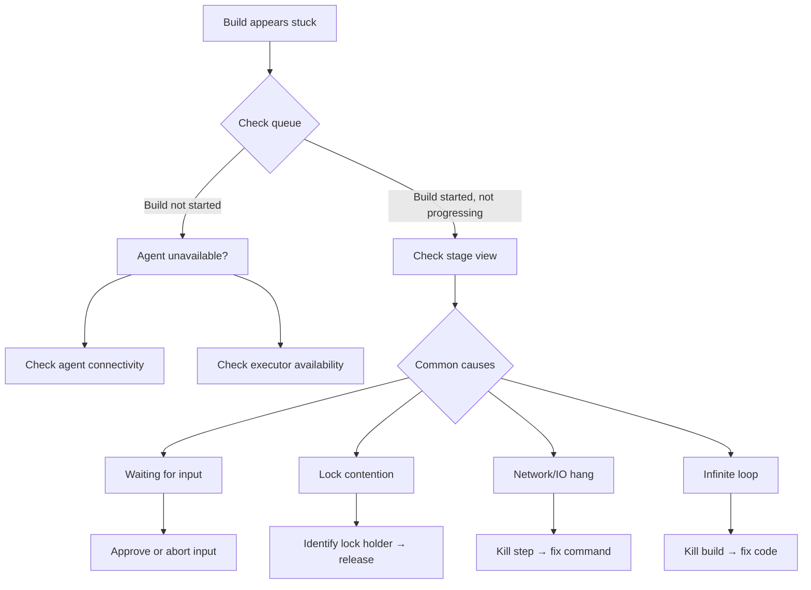

# Playbook: Troubleshoot Stuck Builds

> [!summary] Goal
> Determine whether a build is waiting on an agent, deadlocked on a lock, stuck in I/O, or hanging on a step — and fix it.

## Table of Contents

1. [Systematic Diagnosis](#systematic-diagnosis)
2. [Common Stuck Build Scenarios](#common-stuck-build-scenarios)
3. [Jenkins CLI and Groovy Console](#jenkins-cli-and-groovy-console)
4. [Thread Dump Analysis](#thread-dump-analysis)
5. [Pitfalls](#pitfalls)

---

## Systematic Diagnosis



---

## Common Stuck Build Scenarios

| Symptom | Likely cause | Check | Fix |
|---------|-------------|-------|-----|
| **Build not starting** (queued) | No available agent / executor | Queue in Jenkins UI, `list-queue` CLI | Add agents, reduce concurrency |
| **Waiting for agent** (Pipeline: `agent` not allocated) | Agent labels don't match, agent offline | Agent list, label expressions | Fix label, start agent |
| **Stuck on `input` step** | Awaiting user approval | Pipeline stage view, check email | Approve or abort input |
| **Stuck on `lock` step** | Another build holds the lock | `Lockable Resources Manager` | Release lock or kill lock holder |
| **Hanging on `sh` step** | Command waiting for input or network | `ps` on agent, check stdout | Kill process, add timeout |
| **Infinite loop in Groovy** | `while(true)` or recursion without timeout | Thread dump on controller | Kill build, fix code |
| **Parallel stage deadlock** | Stages waiting for each other's resources | Stage timings, resource locks | Review lock ordering |
| **Declarative: Disabled agent** | Agent not responding to ping | Agent log, connectivity test | Restart agent or JNLP tunnel |

---

## Jenkins CLI and Groovy Console

```bash
# CLI — check queue
java -jar jenkins-cli.jar -s https://jenkins.example.com/ list-queue

# CLI — check executor status
java -jar jenkins-cli.jar -s https://jenkins.example.com/ \
  groovy = << 'EOF'
Jenkins.instance.nodes.each { node ->
    println "${node.displayName} (${node.numExecutors} executors):"
    node.computer.executors.each { ex ->
        println "  ${ex.idle ? 'IDLE' : 'BUSY'} - ${ex.currentExecutable?.toString() ?: ''}"
    }
    node.computer.oneOffExecutors.each { ex ->
        println "  ONEOFF ${ex.idle ? 'IDLE' : 'BUSY'} - ${ex.currentExecutable?.toString() ?: ''}"
    }
}
EOF

# CLI — stop stuck build
java -jar jenkins-cli.jar -s https://jenkins.example.com/ \
  groovy = 'Jenkins.instance.getItemByFullName("my-app/job/main").getBuildByNumber(42).finish(hudson.model.Result.ABORTED, new java.io.IOException("Aborted by admin"))'

# Script Console (Manage Jenkins → Script Console)
// Find all running builds
Jenkins.instance.allItems(hudson.model.Job).each { job ->
    job.builds.each { build ->
        if (build.isBuilding()) {
            println "${build.fullDisplayName} running for ${build.durationString}"
        }
    }
}

// Find lock holders
import org.jenkins.plugins.lockableresources.LockableResourcesManager
LockableResourcesManager.get().resources.each { r ->
    println "${r.name}: ${r.held ? 'HELD by ' + r.by + ' since ' + r.heldTime : 'FREE'}"
}
```

---

## Thread Dump Analysis

```bash
# Get thread dump from Jenkins controller
java -jar jenkins-cli.jar -s https://jenkins.example.com/ \
  groovy = 'Thread.getAllStackTraces().each { t, stack -> println "--- ${t.name} (${t.state}) ---"; stack.each { println "  $it" } }'

# Save to file for analysis
java -jar jenkins-cli.jar -s https://jenkins.example.com/ \
  groovy = 'Thread.getAllStackTraces().each { t, stack -> println "--- ${t.name} (${t.state}) ---"; stack.each { println "  $it" } }' > threaddump.txt

# Look for:
# - "http-nio-8080-exec-N" — HTTP handler threads
# - "kubernetes-plugin-watch-N" — K8s plugin threads
# - "jenkins-executor-N" — build executor threads
# - "Abandoned build" — builds that lost agent connection
```

### What to look for in thread dumps

| Thread pattern | Indicates |
|---------------|-----------|
| `http-nio-8080-exec-N` stuck on I/O | Slow web request, plugin |
| `jenkins-executor-N` blocked on `LockableResourcesManager` | Lock contention |
| `jenkins-executor-N` in `java.net.SocketInputStream` | Network hang |
| `Durable Task` watching agent | Build running fine, just slow |
| Multiple `Kubernetes Slave` threads | Pod creation/termination activity |

---

## Pitfalls

### Killing the wrong build

Using `Jenkins.instance.getItemByFullName(...).getBuildByNumber(...).finish(...)` kills the Java process but doesn't stop the agent command.

**Fix**: Use `hudson.model.Executor.kill()` instead of `finish()` for builds that are actually executing:

```groovy
Jenkins.instance.allItems(hudson.model.Job).each { job ->
    job.builds.each { build ->
        if (build.isBuilding()) {
            build.executor.interrupt(hudson.model.Result.ABORTED, new java.io.IOException("Admin override"))
        }
    }
}
```

### Building stuck in queue but no visible cause

The queue shows a build pending but the Pipeline stage view is empty (never started).

**Fix**: Check `manage Jenkins → Load Statistics` for queue depth. Check `list-queue` CLI for pipeline initialization steps (like SCM checkout of Jenkinsfile).

### `lock` step never releases

If a build crashes while holding a `lock` resource, the lock stays acquired and no other builds can proceed.

**Fix**: Manually release via `Manage Jenkins → Lockable Resources`. Or use a Groovy script:

```groovy
LockableResourcesManager.get().resources.each { r ->
    if (r.held) {
        println "Resetting lock: ${r.name}"
        r.reset()
    }
}
```

---

> [!question]- Interview Questions
>
> **Q: How do you find pending builds in Jenkins CLI?**
> A: `java -jar jenkins-cli.jar -s https://jenkins.example.com/ list-queue` shows queued builds. `groovy 'Jenkins.instance.queue.items.each { println it.name }'` provides more detail.
>
> **Q: How do you kill a stuck build from the Script Console?**
> A: Find the running build and call `build.executor.interrupt(Result.ABORTED, new IOException("Admin override"))`.
>
> **Q: How do you diagnose a parallel stage deadlock?**
> A: Check stage timing in the Pipeline Stage View. Use thread dumps to find threads blocked on `LockableResourcesManager` or agent connections.

---

## Cross-Links

- [[CICD/Jenkins/01_Foundations/02_Agents_Nodes_and_Executors]] for executor management
- [[CICD/Jenkins/02_Core/02_Parameters_Matrix_and_Parallelism]] for parallel patterns
- [[CICD/Jenkins/03_Advanced/01_Scaling_Jenkins_Masters_and_Agents]] for performance optimization

---

## References

- [Jenkins CLI](https://www.jenkins.io/doc/book/managing/cli/)
- [Jenkins Script Console](https://www.jenkins.io/doc/book/managing/script-console/)
- [Lockable Resources Plugin](https://plugins.jenkins.io/lockable-resources/)
