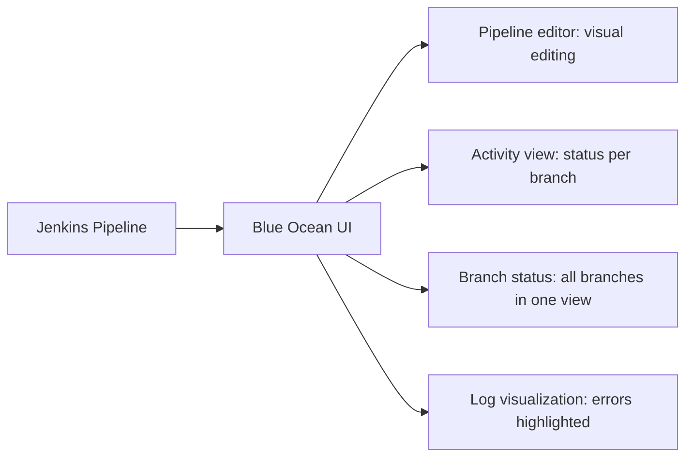

# Playbook: Plugin Management and Blue Ocean

> [!summary] Goal
> Manage Jenkins plugins — install, upgrade, rollback, and recover from failures. Use Blue Ocean for modern pipeline visualization.

## Plugin Management

### Installing and updating plugins

```bash
# CLI — list installed plugins
java -jar jenkins-cli.jar -s https://jenkins.example.com/ list-plugins

# CLI — install a plugin by name
java -jar jenkins-cli.jar -s https://jenkins.example.com/ install-plugin kubernetes workflow-aggregator

# CLI — update all plugins
java -jar jenkins-cli.jar -s https://jenkins.example.com/ groovy = < 'Jenkins.instance.pluginManager.installNecessaryPlugins()'

# Manage Jenkins → Plugin Manager → Updates
# Select all → Download → Install after restart
```

### Safe upgrade strategy

1. Backup `JENKINS_HOME` before upgrading
2. Upgrade plugins one at a time (or in small groups)
3. Check plugin compatibility with your Jenkins version
4. Test on a staging instance first
5. After restart, verify all jobs load correctly

### Recovery from plugin failure

```bash
# If Jenkins fails to start after a plugin upgrade:
# 1. Stop Jenkins
sudo systemctl stop jenkins

# 2. Find and remove the failing plugin
sudo rm -rf /var/lib/jenkins/plugins/<plugin-name>

# Or disable all plugins: rename plugins directory
sudo mv /var/lib/jenkins/plugins /var/lib/jenkins/plugins-disabled
sudo mkdir /var/lib/jenkins/plugins

# 3. Start Jenkins (will load with no plugins)
sudo systemctl start jenkins

# 4. Reinstall plugins in safe batches
```

---

## Blue Ocean

Blue Ocean provides a modern visualization for Jenkins Pipelines:



### Installing Blue Ocean

```
Manage Jenkins → Plugin Manager → Available → Search "Blue Ocean" → Install
# Includes: blueocean, blueocean-autofavorite, blueocean-bitbucket-pipeline, etc.
# Restart Jenkins
```

### Blue Ocean features

| Feature | Description |
|---------|-------------|
| **Pipeline editor** | Visual pipeline creation (drag-and-drop stages) |
| **Activity view** | Branch/PR pipeline status at a glance |
| **Run details** | Real-time stage progress, pause on `input`, error highlighting |
| **Log viewer** | Syntax-highlighted logs, search, collapse |
| **Branch explorer** | All branches in a multi-branch project |
| **Git integration** | Display commit messages, authors, and PR links |

### Key Blue Ocean URL patterns

```
https://jenkins.example.com/blue/pipelines           # All pipelines
https://jenkins.example.com/blue/organizations/jenkins/my-app/activity  # Activity for specific job
https://jenkins.example.com/blue/organizations/jenkins/my-app/detail/main/42/pipeline  # Build #42 details
```
