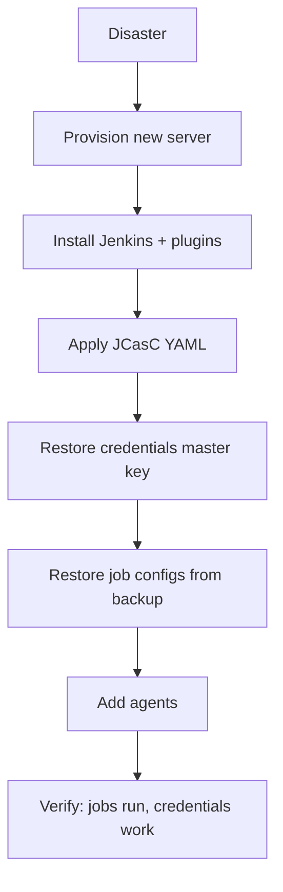

# Playbook: Backup, Restore, and Outage Recovery

> [!summary] Goal
> Back up Jenkins regularly, recover from corrupt configuration, and rebuild a Jenkins instance from scratch after a disaster.

## Backup Strategy

### What to back up

| Path | Contents | Why |
|------|----------|-----|
| `$JENKINS_HOME/` | All configuration, jobs, builds, plugins | **Full recovery** |
| `$JENKINS_HOME/jobs/` | Job configurations as XML | Job-level restore |
| `$JENKINS_HOME/plugins/` | Installed plugins (.jpi files) | Plugin versions |
| `$JENKINS_HOME/secrets/` | Credentials (encrypted) | Credential master key |
| `$JENKINS_HOME/credentials.xml` | Credential configuration | Credential IDs |
| `$JENKINS_HOME/config.xml` | Global configuration | Jenkins system config |
| `$JENKINS_HOME/*.yaml` | JCasC configuration | Infrastructure as code |

### Backup script

```bash
#!/bin/bash
# backup-jenkins.sh
BACKUP_DIR="/backup/jenkins"
DATE=$(date +%Y%m%d_%H%M%S)

# Create backup
mkdir -p $BACKUP_DIR

# Stop Jenkins for consistent backup (or use Throttle Plugin)
sudo systemctl stop jenkins

# Backup
tar czf $BACKUP_DIR/jenkins-$DATE.tar.gz \
  --exclude='workspace' \
  --exclude='builds' \
  --exclude='logs' \
  --exclude='*.log' \
  /var/lib/jenkins

# Start Jenkins
sudo systemctl start jenkins

# Upload to remote storage
aws s3 cp $BACKUP_DIR/jenkins-$DATE.tar.gz s3://my-backups/jenkins/

# Keep last 30 days locally
find $BACKUP_DIR -name "*.tar.gz" -mtime +30 -delete
```

### Backup schedule

```bash
# /etc/cron.d/jenkins-backup
0 2 * * * root /usr/local/bin/backup-jenkins.sh
```

---

## Restore Process

```bash
# Full restore from backup
# 1. Install Jenkins (same version)
# 2. Stop Jenkins
sudo systemctl stop jenkins

# 3. Backup existing JENKINS_HOME (if any)
sudo mv /var/lib/jenkins /var/lib/jenkins.old

# 4. Restore from backup
sudo tar xzf /backup/jenkins-20260101.tar.gz -C /
# (assumes tar was created from /, preserves /var/lib/jenkins structure)

# 5. Start Jenkins
sudo systemctl start jenkins
```

### Partial restore (single job)

```bash
# Restore a single job from backup
tar xzf /backup/jenkins-20260101.tar.gz \
  -C /tmp/restore \
  --wildcards 'var/lib/jenkins/jobs/my-app/*.xml'

sudo cp /tmp/restore/var/lib/jenkins/jobs/my-app/config.xml \
  /var/lib/jenkins/jobs/my-app/

# Reload job configuration
# Manage Jenkins → Reload Configuration from Disk
# Or via CLI:
java -jar jenkins-cli.jar -s https://jenkins.example.com/ reload-configuration
```

---

## Outage Recovery Scenarios

### Jenkins won't start — corrupt config

```bash
# 1. Check logs
sudo journalctl -u jenkins -n 100 --no-pager

# 2. Find the broken XML
grep -r "Invalid" /var/lib/jenkins/config.xml /var/lib/jenkins/jobs/*/config.xml

# 3. Fix or remove the broken file
sudo cp /var/lib/jenkins/config.xml /var/lib/jenkins/config.xml.bak
# Edit config.xml to fix the issue, or restore from backup

# 4. Start Jenkins
sudo systemctl start jenkins
```

### Corrupt credentials

```bash
# If credentials.xml is corrupt, Jenkins may fail to start
sudo cp /var/lib/jenkins/credentials.xml /var/lib/jenkins/credentials.xml.bak

# Start Jenkins — it will create a new credentials.xml
# Re-add credentials manually or restore from backup
```

### Out of disk space

```bash
# Check disk usage
du -sh /var/lib/jenkins/*
# Logs: /var/lib/jenkins/logs/
# Builds: /var/lib/jenkins/jobs/*/builds/
# Workspaces: /var/lib/jenkins/workspace/
# Old artifacts: /var/lib/jenkins/jobs/*/builds/*/*.zip

# Clean old builds
java -jar jenkins-cli.jar -s https://jenkins.example.com/ \
  groovy = 'Jenkins.instance.allItems(hudson.model.Job).each { job -> job.builds.each { build -> if (build.ageInDays > 30) build.delete() } }'

# Clean workspaces
java -jar jenkins-cli.jar -s https://jenkins.example.com/ \
  groovy = 'Jenkins.instance.allItems(hudson.model.Job).each { job -> job.getWorkspace().deleteRecursive() }'
```

---

## JBOD / Rebuild from Scratch

### Rebuild using JCasC

```yaml
# casc-recovery.yaml
jenkins:
  systemMessage: "Recovered Jenkins"
  numExecutors: 0
  labelString: "controller"

security:
  authorizationStrategy:
    loggedInUsersCanDoAnything: false

credentials:
  system:
    domainCredentials:
      - credentials:
          - string:
              id: "github-token"
              scope: GLOBAL
              secret: "${GITHUB_TOKEN}"

jobs:
  - script: >
      multibranchPipelineJob('my-app') {
        branchSources {
          branchSource {
            source {
              github {
                id = 'my-app'
                credentialsId = 'github-token'
                repoOwner = 'my-org'
                repository = 'my-app'
              }
            }
          }
        }
      }
```

### Recovery order



---

## Pitfalls

### Not backing up the secret key

The `secrets/master.key` and `secrets/hudson.util.Secret` files are needed to decrypt credentials. Without them, all credentials are irrecoverable.

**Fix**: Include `$JENKINS_HOME/secrets/` in backups. Store a separate copy of the master key securely.

### Restoring to a different Jenkins version

Config files from a newer Jenkins version may not be compatible with an older version.

**Fix**: Match Jenkins versions during restore. Upgrade the new instance to match the old version before restoring.

### Plugin version mismatch after restore

Restoring an old `plugins/` directory may include plugins incompatible with the new Jenkins version.

**Fix**: Use JCasC or `plugins.txt` to install specific plugin versions after a fresh Jenkins install, rather than restoring the binary `.jpi` files.

---

## Cross-Links

- [[CICD/Jenkins/03_Advanced/02_Configuration_as_Code_JCasC]] for JCasC recovery
- [[CICD/Jenkins/03_Advanced/01_Scaling_Jenkins_Masters_and_Agents]] for HA architecture
- [[CICD/Jenkins/04_Playbooks/02_Plugin_Management_and_Blue_Ocean]] for plugin recovery
