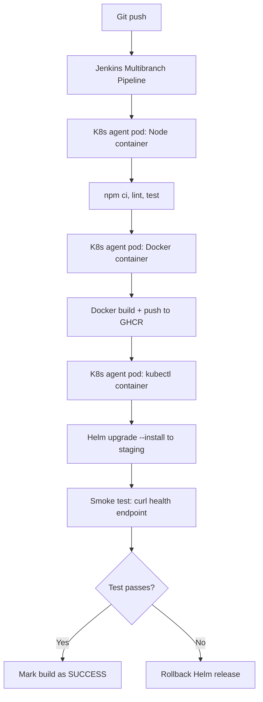

# Project: Deploy a Microservice to Kubernetes

> [!summary] Goal
> Build a full CI/CD pipeline: checkout → lint → test → Docker build → push → Helm deploy to K8s → smoke test.

## Architecture



## Jenkinsfile

```groovy
@Library(['pipeline-library@v1', 'k8s-deploy']) _

pipeline {
    agent {
        kubernetes {
            label 'microservice-pod'
            yaml """
apiVersion: v1
kind: Pod
spec:
  containers:
  - name: node
    image: node:20-alpine
    command: ['cat']
    tty: true
  - name: docker
    image: docker:20.10
    command: ['cat']
    tty: true
    volumeMounts:
    - name: docker-socket
      mountPath: /var/run/docker.sock
  - name: helm
    image: alpine/helm:3.15
    command: ['cat']
    tty: true
  volumes:
  - name: docker-socket
    hostPath:
      path: /var/run/docker.sock
"""
        }
    }
    environment {
        REGISTRY = 'ghcr.io/my-org'
        APP_NAME = 'my-microservice'
        IMAGE_TAG = "${BUILD_NUMBER}-${GIT_COMMIT[0..7]}"
    }
    stages {
        stage('Checkout') {
            steps { checkout scm }
        }
        stage('Lint & Test') {
            steps {
                container('node') {
                    sh 'npm ci'
                    sh 'npm run lint'
                    sh 'npm test -- --coverage'
                }
            }
        }
        stage('Build & Push') {
            when { branch 'main' }
            steps {
                container('docker') {
                    withDockerRegistry([credentialsId: 'ghcr-cred', url: 'https://ghcr.io']) {
                        sh "docker build -t ${REGISTRY}/${APP_NAME}:${IMAGE_TAG} ."
                        sh "docker push ${REGISTRY}/${APP_NAME}:${IMAGE_TAG}"
                    }
                }
            }
        }
        stage('Deploy to Staging') {
            when { branch 'main' }
            steps {
                container('helm') {
                    withKubeConfig([credentialsId: 'k8s-config']) {
                        sh """
                            helm upgrade --install ${APP_NAME} ./chart \
                              --set image.repository=${REGISTRY}/${APP_NAME} \
                              --set image.tag=${IMAGE_TAG} \
                              --namespace staging \
                              --wait
                        """
                    }
                }
            }
        }
        stage('Smoke Test') {
            when { branch 'main' }
            steps {
                container('helm') {
                    withKubeConfig([credentialsId: 'k8s-config']) {
                        sh """
                            # Wait for rollout
                            kubectl rollout status deployment/${APP_NAME} -n staging --timeout=120s
                            # Test health endpoint
                            kubectl port-forward svc/${APP_NAME} 8080:80 -n staging &
                            sleep 3
                            curl -f http://localhost:8080/health
                        """
                    }
                }
            }
        }
    }
    post {
        failure {
            withKubeConfig([credentialsId: 'k8s-config']) {
                sh "helm rollback ${APP_NAME} 0 -n staging"
            }
        }
    }
}
```

## Requirements

- Kubernetes cluster with `kubectl` configured
- Docker registry (GHCR, Docker Hub, ECR)
- Helm chart for the microservice
- Jenkins plugins: Kubernetes, Docker Pipeline, Helm

---

## Cross-Links

- [[CICD/Jenkins/03_Advanced/04_Docker_Kubernetes_Integration_with_Pipeline]] for agent details
- [[CICD/Jenkins/01_Foundations/04_Multibranch_and_Webhooks]] for Multibranch setup
- [[CICD/Kubernetes/04_Playbooks/03_GitOps_with_ArgoCD_and_Flux]] for GitOps alternative
