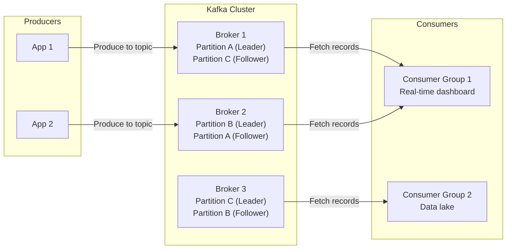
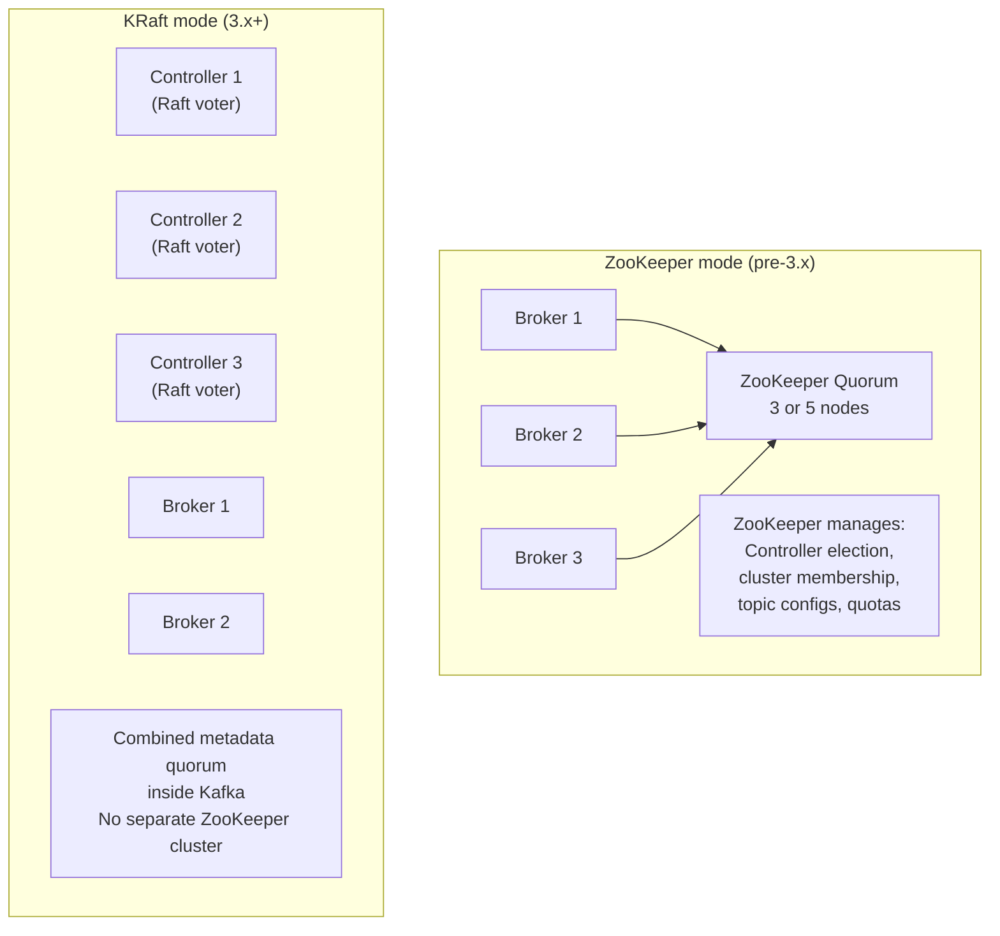

# Kafka Architecture and Core Concepts

> [!summary] Goal
> Understand Kafka's architecture — brokers, topics, partitions, producers, consumers, and how they work together. Learn the core vocabulary, how Kafka achieves high throughput, and how it compares to traditional messaging systems.

## Table of Contents

1. [What Is Kafka?](#what-is-kafka)
2. [Architecture Overview](#architecture-overview)
3. [Core Vocabulary](#core-vocabulary)
4. [ZooKeeper vs KRaft](#zookeeper-vs-kraft)
5. [Kafka vs Traditional Messaging](#kafka-vs-traditional-messaging)
6. [Quickstart: Docker Compose](#quickstart-docker-compose)
7. [Pitfalls](#pitfalls)

---

## What Is Kafka?

> [!info] Kafka
> Apache Kafka is a distributed **event streaming platform**. It acts as a high-throughput, durable, fault-tolerant commit log. Unlike traditional message queues (where messages are deleted after consumption), Kafka **retains** messages for a configurable period — consumers read by **offset**, not by deletion. This enables multiple independent consumers, replay, and stream processing.

Kafka was built at LinkedIn (2011) to handle their data pipeline problem: hundreds of data sources (metrics, logs, user activity) all needing to flow into multiple consumers (real-time dashboards, batch analytics, search indexes) without each source managing connections to each consumer.

---

## Architecture Overview



> [!info] How Kafka achieves high throughput
> Kafka writes are **sequential I/O** (append-only to the end of a log file), not random I/O. Sequential writes on modern disks are orders of magnitude faster than random writes (600 MB/s vs 1 MB/s). Combined with **zero-copy reads** (data moves from disk cache to network without touching application memory), a single broker can handle hundreds of thousands of writes per second.

---

## Core Vocabulary

> [!info] Topic
> A topic is a logical category/feed name to which records are published. Topics are multi-subscriber — any number of consumers can read from the same topic, independently.

> [!info] Partition
> A partition is an ordered, immutable sequence of records. Each partition is a **directory** on disk containing segment files. Partitions allow parallelism: different consumers in a group read different partitions.

> [!info] Offset
> An offset is a sequential ID assigned to every record within a partition. Offsets uniquely identify each record. Consumers track their position as an offset — this is why consumers can "rewind" and replay.

> [!info] Broker
> A broker is a single Kafka server. A cluster has 1+ brokers. Brokers store partitions (some as leader, some as follower) and serve produce/consume requests. Each broker is identified by an integer ID.

> [!info] Consumer group
> A consumer group is a set of consumers that cooperate to consume from a topic. Each partition is assigned to exactly one consumer in the group. If a consumer fails, its partitions are reassigned (rebalance).

| Term | Definition | In a nutshell |
|------|-----------|:-------------:|
| **Topic** | Category of messages | A database table |
| **Partition** | Ordered log within a topic | A table shard |
| **Offset** | Position of a record within a partition | Row number |
| **Broker** | Server in the Kafka cluster | Database node |
| **Producer** | Writes records to topics | INSERT client |
| **Consumer** | Reads records from topics | SELECT client |
| **Consumer group** | Set of consumers sharing work | Read replicas |
| **Record** | A single message (key, value, headers, timestamp) | A row |
| **Replication factor** | Number of copies of each partition | Backup copies |

---

## ZooKeeper vs KRaft

> [!info] KRaft (Kafka Raft)
> Pre-Kafka 3.x, Kafka used ZooKeeper for cluster metadata: broker membership, topic configuration, partition leadership, controller election. Since Kafka 3.x, KRaft replaces ZooKeeper with an internal Raft-based metadata quorum, simplifying operations (one system instead of two).



| Aspect | ZooKeeper mode | KRaft mode |
|--------|:--------------:|:----------:|
| **Systems to manage** | Kafka + ZooKeeper | Kafka only |
| **Consensus** | ZAB (ZooKeeper) | Raft (in Kafka) |
| **Metadata storage** | ZK tree | Internal metadata topic |
| **Controller election** | ZK leader election | Raft vote among controllers |
| **Partition leadership** | Controller tells ZK, ZK notifies brokers | Controller tells brokers directly |
| **Configuration** | `zookeeper.connect` | `controller.quorum.voters` |

---

## Kafka vs Traditional Messaging

| Aspect | Kafka | RabbitMQ | Traditional JMS (ActiveMQ) |
|--------|:-----:|:--------:|:-------------------------:|
| **Model** | Pull-based (consumer fetches) | Push-based (broker delivers) | Push or pull |
| **Message retention** | Configured time/size (days) | After ack, deleted | After ack, deleted |
| **Ordering** | Per-partition | Per-queue (single consumer) | Per-queue |
| **Throughput** | Millions/sec | Thousands/sec | Thousands/sec |
| **Replay** | ✅ Reset consumer offset | ❌ | ❌ |
| **Exactly-once** | ✅ Idempotent + transactions | ❌ | ❌ |
| **Consumer groups** | ✅ Native | Manual routing | ❌ |
| **Message routing** | Topic-based | Exchange routing | Topic/queue |
| **Protocol** | Custom binary (TCP) | AMQP | OpenWire, STOMP |

---

## Quickstart: Docker Compose

```yaml
version: '3.8'
services:
  broker:
    image: confluentinc/cp-kafka:7.6.0
    hostname: broker
    container_name: broker
    ports:
      - "9092:9092"
    environment:
      KAFKA_NODE_ID: 1
      KAFKA_PROCESS_ROLES: broker,controller
      KAFKA_CONTROLLER_QUORUM_VOTERS: 1@broker:29093
      KAFKA_LISTENERS: PLAINTEXT://0.0.0.0:9092,CONTROLLER://0.0.0.0:29093
      KAFKA_ADVERTISED_LISTENERS: PLAINTEXT://localhost:9092
      KAFKA_CONTROLLER_LISTENER_NAMES: CONTROLLER
      KAFKA_LISTENER_SECURITY_PROTOCOL_MAP: PLAINTEXT:PLAINTEXT,CONTROLLER:PLAINTEXT
      KAFKA_INTER_BROKER_LISTENER_NAME: PLAINTEXT
      KAFKA_OFFSETS_TOPIC_REPLICATION_FACTOR: 1
      KAFKA_TRANSACTION_STATE_LOG_MIN_ISR: 1
      KAFKA_TRANSACTION_STATE_LOG_REPLICATION_FACTOR: 1
      CLUSTER_ID: "MkU3OEVBNTcwNTJENDM2Qk"
```

```bash
# Start Kafka
docker compose up -d

# Create a topic
docker exec broker kafka-topics --create \
  --topic quickstart \
  --bootstrap-server localhost:9092 \
  --partitions 3 \
  --replication-factor 1

# List topics
docker exec broker kafka-topics --list \
  --bootstrap-server localhost:9092

# Describe a topic
docker exec broker kafka-topics --describe \
  --topic quickstart \
  --bootstrap-server localhost:9092
# Output:
# Topic: quickstart    PartitionCount: 3    ReplicationFactor: 1
#   Topic: quickstart  Partition: 0  Leader: 1  Replicas: 1  Isr: 1
#   Topic: quickstart  Partition: 1  Leader: 1  Replicas: 1  Isr: 1
#   Topic: quickstart  Partition: 2  Leader: 1  Replicas: 1  Isr: 1

# Produce messages (type text, Ctrl+D to exit)
docker exec -it broker kafka-console-producer \
  --topic quickstart \
  --bootstrap-server localhost:9092

# Consume messages
docker exec -it broker kafka-console-consumer \
  --topic quickstart \
  --bootstrap-server localhost:9092 \
  --from-beginning
```

---

## Pitfalls

### Default partition count too low

The default `num.partitions=1` in `server.properties` means topics created automatically (`auto.create.topics.enable=true`) have 1 partition — only one consumer can process them. Set `num.partitions=3` or higher, or always specify `--partitions` when creating topics.

### Forgetting the replication factor

On a single-node cluster, `--replication-factor 3` fails because there's only one broker. On production clusters, RF=3 requires at least 3 brokers. Always verify your cluster size against the replication factor.

### Wrong cleanup policy

The default `cleanup.policy=delete` means old messages are deleted after `retention.ms`. For keyed event stores (like Schema Registry topics, compacted topics), you need `cleanup.policy=compact`. For both: `cleanup.policy=compact,delete`.

### Associating Kafka with "message queue"

Kafka's retention-based model is fundamentally different from RabbitMQ/SQS. In Kafka, consumers read at their own pace by offset. If a consumer is down for a day, it can catch up by reading from where it left off. In a message queue, the message would have been deleted after the delivery timeout, and the consumer would miss it.

---

> [!question]- Interview Questions
>
> **Q: How is Kafka different from a traditional message queue?**
> A: Kafka retains messages for a configurable period (days/weeks), consumers read by offset, and messages are not deleted after consumption. This allows multiple consumer groups to read independently at their own pace, replay from any point in time, and supports stream processing. Traditional queues delete messages after acknowledgment — replay is not possible.
>
> **Q: What is KRaft and why was it introduced?**
> A: KRaft replaces ZooKeeper as Kafka's metadata service. It implements Raft consensus internally, eliminating the operational complexity of managing a separate ZooKeeper cluster. KRaft is fully self-contained — one binary, one configuration, no external dependencies.
>
> **Q: What is a consumer group and how does it work?**
> A: A consumer group consists of consumers that cooperate to consume a topic. Each partition is assigned to exactly one consumer in the group. This enables horizontal scaling — adding more consumers increases throughput until each partition has one consumer (beyond that, consumers are idle). If a consumer fails, its partitions are reassigned to other group members (rebalance).
>
> **Q: Why is Kafka so fast?**
> A: Three reasons: (1) sequential I/O — writes are append-only, not random. (2) Zero-copy — consumers read from the OS page cache via `sendfile()` without copying data through application memory. (3) Partition parallelism — multiple partitions can be read/written concurrently across multiple brokers.

---

## Cross-Links

- [[CICD/Kafka/01_Foundations/02_Topics_Partitions_Offsets]] for partition internals
- [[CICD/Kafka/01_Foundations/03_Producers_Deep_Dive]] for producer configuration
- [[CICD/Kafka/01_Foundations/04_Consumers_Deep_Dive]] for consumer groups
- [[CICD/Kafka/03_Advanced/A00_Storage_and_Replication_Internals]] for page cache and zero-copy deep dive
- [[SystemDesign/02_Core/03_Queues_and_Event_Driven_Architecture]] for event-driven architecture
