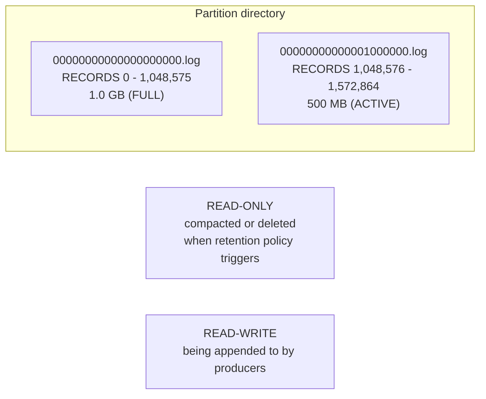
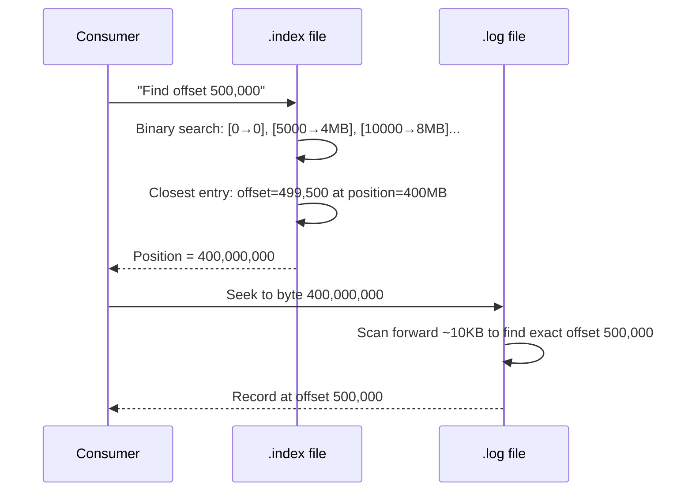
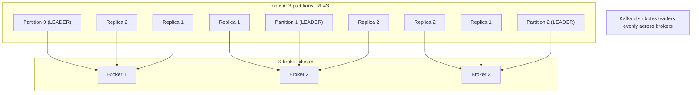

# Topics, Partitions, Offsets, and the Physical Log

> [!summary] Goal
> Understand how Kafka organizes data on disk — topics as logical categories, partitions as physical directories, log segments as file groups, and indexes for efficient lookups. Master partition distribution across brokers and topic configuration.

## Table of Contents

1. [Partitions as Physical Buckets](#partitions-as-physical-buckets)
2. [Log Segments](#log-segments)
3. [Index Files (.index and .timeindex)](#index-files)
4. [Offset Management](#offset-management)
5. [Partition Distribution Across Brokers](#partition-distribution-across-brokers)
6. [Topic Configuration Reference](#topic-configuration-reference)
7. [Pitfalls](#pitfalls)

---

## Partitions as Physical Buckets

> [!info] Partition is a directory on disk
> Each partition is a **directory** on disk at `<log.dirs>/<topic>-<partition>/`. Inside this directory, the partition's data is stored as a series of **segment files**. The number of partitions determines the maximum parallelism for consumers and the maximum write throughput — more partitions = more concurrent readers and writers.

```text
$ tree /var/lib/kafka/data/
  my-topic-0/
  ├── 00000000000000000000.log       # Data segment (starting at offset 0)
  ├── 00000000000000000000.index     # Offset → position index
  ├── 00000000000000000000.timeindex  # Timestamp → offset index
  ├── 00000000000001000000.log       # Next segment (starting at offset 1000000)
  ├── 00000000000001000000.index
  ├── 00000000000001000000.timeindex
  ├── leader-epoch-checkpoint       # Leader epoch tracking (recovery safety)
  └── partition.metadata            # Partition version + topic ID

# Inspect partition directory with Linux tools:
ls -la /var/lib/kafka/data/my-topic-0/
# Total: 2.1G
# -rw-r--r-- 1 appuser appuser 1073741824 May  9 10:00 00000000000000000000.log
# -rw-r--r-- 1 appuser appuser   10485760 May  9 10:00 00000000000000000000.index
# -rw-r--r-- 1 appuser appuser   10485760 May  9 10:00 00000000000000000000.timeindex
# -rw-r--r-- 1 appuser appuser  524288000 May  9 11:30 00000000000001000000.log
```

> [!info] Log.flush (fsync) tradeoff
> Data written by a producer goes to the OS **page cache** first. By default, Kafka does NOT call `fsync` on every write — it relies on replication (ISR) for durability. Calling `fsync` on every write would degrade performance 100×. You can configure `flush.messages` and `flush.ms` to force fsync, but the recommended approach is to trust replication.

---

## Log Segments

> [!info] Log segment
> Each partition's log is split into **segments**. A segment is a contiguous chunk of records stored in a single `.log` file. Segments allow Kafka to: (1) bound recovery time (only one active segment to scan), (2) efficiently delete old data (delete whole files, not individual records), (3) compact logs (merge segments by key). The active segment is the one currently being written to.



> [!info] Segment rolling
> A segment "rolls" (a new segment is created) when it reaches `segment.bytes` (default 1 GB) or after `segment.ms` (default 7 days, but only if the active segment has data). Rolling creates a new `.log`, `.index`, and `.timeindex` trio. Old segments become read-only and are candidates for compaction or deletion.

```bash
# Check segment sizes with kafka-run-class
kafka-run-class kafka.tools.DumpLogSegments \
  --deep-iteration \
  --print-data-log \
  --files /var/lib/kafka/data/my-topic-0/00000000000000000000.log | head -20

# BaseOffset: 0  LastOffset: 999  Count: 1000
# BaseOffset: 1000 LastOffset: 1999 Count: 1000
# ...
```

```bash
# Configure segment rolling
docker exec broker kafka-configs --bootstrap-server localhost:9092 \
  --entity-type topics --entity-name my-topic --alter \
  --add-config segment.bytes=268435456,segment.ms=3600000
```

---

## Index Files (.index and .timeindex)

> [!info] Index files (.index)
> The `.index` file stores a sparse mapping from **offset → file position**. It is NOT a complete list — it stores one entry per ~4096 bytes of log data (configurable via `log.index.interval.bytes`). When a consumer requests `fetch(offset=500000)`, Kafka binary-searches the `.index` to find the nearest offset ≤ 500000, gets the file position, and scans forward through the log from there.



```bash
# Dump index file contents
kafka-run-class kafka.tools.DumpLogSegments \
  --files /var/lib/kafka/data/my-topic-0/00000000000000000000.index

# offset: 0 position: 0
# offset: 5000 position: 4194304
# offset: 10000 position: 8388608
# offset: 15000 position: 12582912
# ... (every ~4MB of log data)

# Dump timeindex
kafka-run-class kafka.tools.DumpLogSegments \
  --files /var/lib/kafka/data/my-topic-0/00000000000000000000.timeindex

# timestamp: 1715000000000 offset: 0
# timestamp: 1715000012345 offset: 5000
```

> [!info] Index is rebuilt on failure
> If an index file becomes corrupted or is deleted, Kafka automatically rebuilds it from the `.log` file on the next access. This is safe but can take time for large segments.

---

## Offset Management

> [!info] Offset = record position within a partition
> Every record gets a monotonically increasing, immutable offset within its partition. Offsets are NOT unique across partitions — only within a single partition. Consumers track their position via offsets (committed to an internal topic `__consumer_offsets` or their own store).

| Offset type | Description | Managed by |
|-------------|-------------|:----------:|
| **Log end offset (LEO)** | The offset of the last record written to the partition | Broker |
| **High watermark (HW)** | The offset up to which all ISR replicas have replicated | Broker |
| **Current offset** | The consumer's current position (already read) | Consumer |
| **Committed offset** | The offset the consumer has confirmed processing | Consumer → `__consumer_offsets` |
| **Log start offset** | The earliest available offset (after retention/compaction) | Broker |

```bash
# Inspect offset state for a consumer group
docker exec broker kafka-consumer-groups --bootstrap-server localhost:9092 \
  --group my-group --describe

# GROUP           TOPIC           PARTITION  CURRENT-OFFSET  LOG-END-OFFSET  LAG
# my-group        my-topic        0          1500            2000            500
# my-group        my-topic        1          2500            3000            500
# my-group        my-topic        2          3500            4000            500

# What this means: consumer is at offset 1500, the log ends at 2000,
# consumer is 500 records behind (LAG = LOG-END - CURRENT)
```

---

## Partition Distribution Across Brokers



```bash
# Describe topic showing leader/replica distribution
docker exec broker kafka-topics --bootstrap-server localhost:9092 \
  --describe --topic my-topic

# Topic: my-topic Partition: 0  Leader: 1  Replicas: 1,2,3  Isr: 1,2,3
# Topic: my-topic Partition: 1  Leader: 2  Replicas: 2,3,1  Isr: 2,3,1
# Topic: my-topic Partition: 2  Leader: 3  Replicas: 3,1,2  Isr: 3,1,2
# Leaders are distributed: Broker 1 leads partition 0, Broker 2 leads partition 1, etc.
```

---

## Topic Configuration Reference

| Config | Default | Description | When to tune |
|--------|:-------:|-------------|--------------|
| `retention.ms` | 604800000 (7 days) | Maximum age of a message | Short-lived data → reduce. Audit data → increase |
| `retention.bytes` | -1 (unlimited) | Maximum size of the partition log | Disk space constraints |
| `segment.bytes` | 1073741824 (1 GB) | Max size of a log segment | Many partitions → smaller segments for faster recovery |
| `segment.ms` | 604800000 (7 days) | Max age before rolling a segment | Force frequent rolling for fast clean-up |
| `cleanup.policy` | `delete` | `delete`, `compact`, or `compact,delete` | Keyed data → compact. Event log → delete |
| `min.insync.replicas` | 1 | Min ISR count for `acks=all` | Set to 2 for production (tolerates 1 broker failure) |
| `compression.type` | `producer` | `producer`, `gzip`, `snappy`, `lz4`, `zstd` | Override producer compression per topic |
| `max.message.bytes` | 1048588 (1 MB) | Max size of a single record | Larger messages (images) → increase |

---

## Pitfalls

### Too many partitions

Each partition adds: (a) memory overhead for leader/follower state, (b) file handles (each segment = 3 files), (c) controller recovery time on failure. A broker with 10,000 partitions needs significant memory. Rule: partitions should be multiples of the consumer count needed for throughput, not "as many as possible." Start with (consumers_needed × 3) and monitor.

### Uneven partition distribution

When adding new brokers, existing partitions don't automatically move to the new broker. Use `kafka-reassign-partitions.sh` to redistribute partitions across all brokers. Cruise Control automates this.

### Changing partition count

Increasing partitions after topic creation changes how keys hash to partitions (same key → different partition). This breaks ordering guarantees for keyed data. Plan partition count upfront — you CAN increase partition count but CANNOT decrease it.

### Rack-unaware replica placement

Without rack awareness, Kafka may place all replicas of a partition on the same rack — a rack failure loses all replicas. Configure `broker.rack` and `replica.selector.class` to spread replicas across racks/availability zones.

---

> [!question]- Interview Questions
>
> **Q: How does Kafka find a record by offset without scanning the entire partition?**
> A: Kafka maintains a sparse `.index` file (one entry per ~4KB of log data) that maps offsets to byte positions in the `.log` file. To serve a fetch request, Kafka binary-searches the `.index` for the nearest offset entry, seeks to that byte position in the `.log` file, and scans forward a few bytes to the exact offset. This gives O(log N) lookup time for offset access.
>
> **Q: What happens to a partition directory when a segment is rolled?**
> A: When a segment reaches `segment.bytes` or `segment.ms`, Kafka closes the current `.log`/`.index`/`.timeindex` files (making them read-only) and creates new ones starting at the next offset. The old segment is now eligible for retention deletion or log compaction. The active segment is the only one that's written to.
>
> **Q: What is the difference between LEO and HW?**
> A: LEO (Log End Offset) is the offset of the latest record written to the partition leader. HW (High Watermark) is the offset up to which all in-sync replicas (ISR) have replicated. Consumers can only read up to the HW — records above the HW are not yet committed (they could be lost if the leader fails before replicating). The HW is always ≤ LEO.
>
> **Q: How do you decide the number of partitions for a topic?**
> A: Partitions determine maximum throughput and parallelism. Throughput per partition is the bottleneck (often CPU on the consumer side). Calculate: required_throughput / throughput_per_partition = minimum partitions. Multiply by 2-3 for headroom. Also consider: max_concurrent_consumers = partition_count. Too many partitions (>1000/broker) causes metadata overhead.

---

## Cross-Links

- [[CICD/Kafka/01_Foundations/01_Kafka_Architecture_and_Core_Concepts]] for basic vocabulary
- [[CICD/Kafka/03_Advanced/A00_Storage_and_Replication_Internals]] for segment format deep dive
- [[CICD/Kafka/03_Advanced/A01_Configuration_and_Tuning]] for topic config tuning
- [[CICD/Kafka/03_Advanced/A05_Kafka_on_Kubernetes_Strimzi]] for topic management on K8s
- [[CICD/Kafka/03_Advanced/A02_Log_Compaction_Retention_and_Tiered_Storage]] for compaction policies
