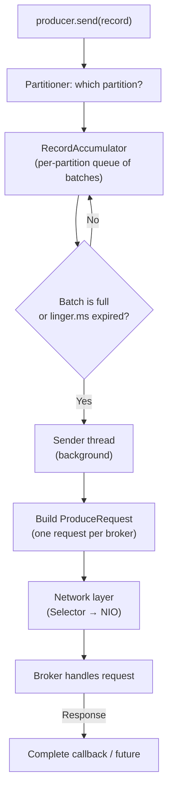
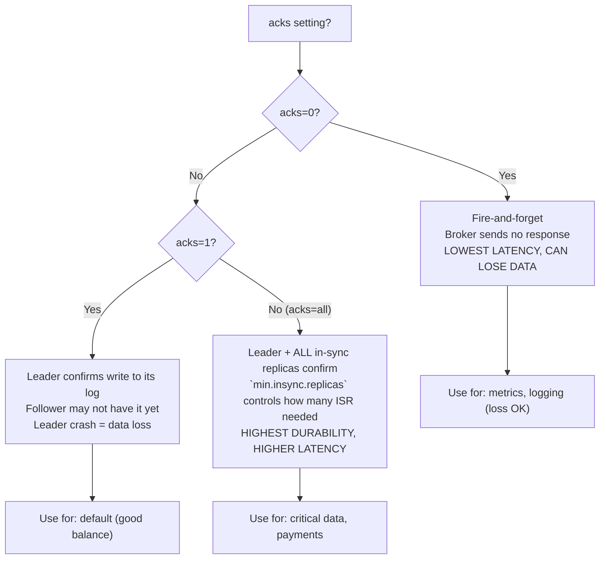
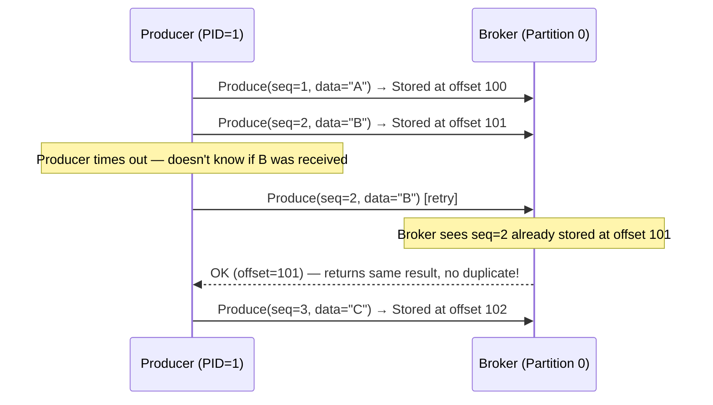
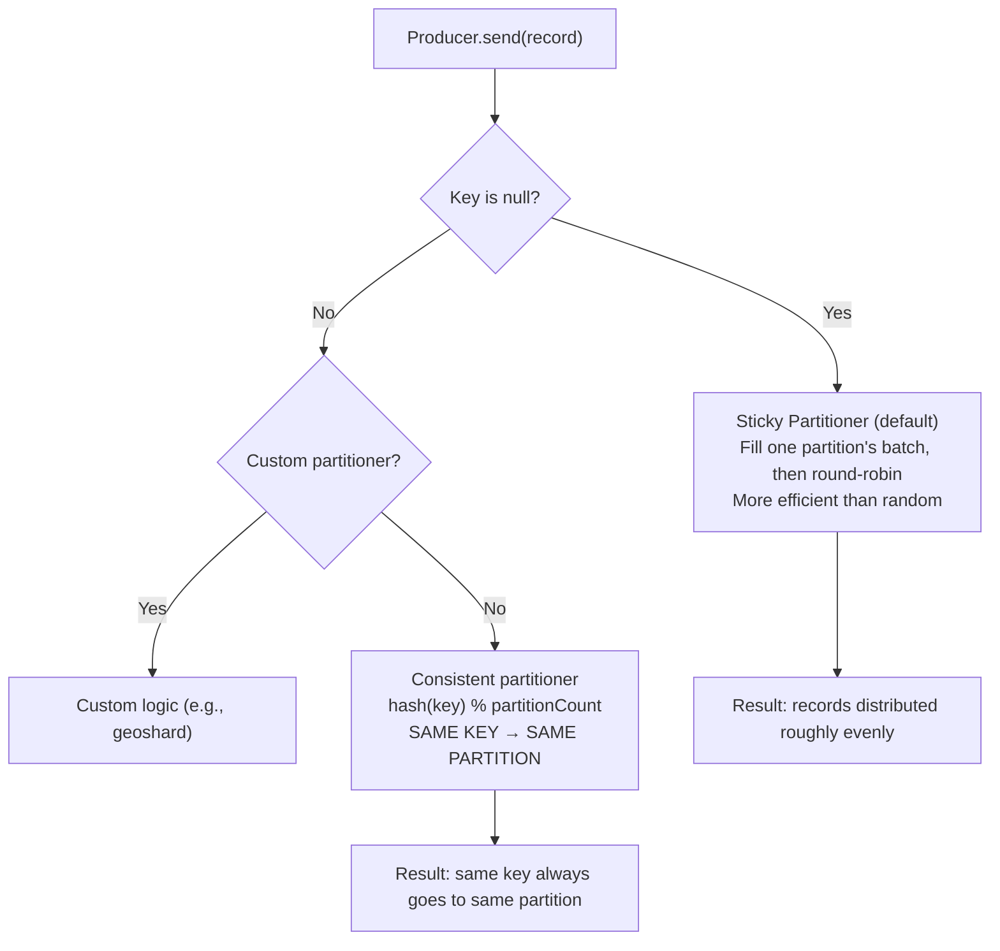

# Producers Deep Dive

> [!summary] Goal
> Master Kafka producers: Java `KafkaProducer` API, acks tradeoffs, idempotence, batching, compression, partitioning strategies, and internal architecture (RecordAccumulator → Sender → network).

## Table of Contents

1. [Java Producer API](#java-producer-api)
2. [Producer Internal Architecture](#producer-internal-architecture)
3. [acks and Durability](#acks-and-durability)
4. [Idempotent Producer](#idempotent-producer)
5. [Batching and Compression](#batching-and-compression)
6. [Partitioning Strategies](#partitioning-strategies)
7. [Pitfalls](#pitfalls)

---

## Java Producer API

> [!info] KafkaProducer
> `KafkaProducer<K, V>` is the main client class for publishing records to Kafka. Creating a producer: set `bootstrap.servers`, serializers, and optional config. Sending: `send()` is asynchronous — it returns a `Future<RecordMetadata>`. Callbacks provide non-blocking error handling.

```java
import org.apache.kafka.clients.producer.*;
import org.apache.kafka.common.serialization.StringSerializer;
import java.util.Properties;

Properties props = new Properties();
props.put(ProducerConfig.BOOTSTRAP_SERVERS_CONFIG, "localhost:9092");
props.put(ProducerConfig.KEY_SERIALIZER_CLASS_CONFIG, StringSerializer.class.getName());
props.put(ProducerConfig.VALUE_SERIALIZER_CLASS_CONFIG, StringSerializer.class.getName());
props.put(ProducerConfig.ACKS_CONFIG, "all");
props.put(ProducerConfig.ENABLE_IDEMPOTENCE_CONFIG, true);
props.put(ProducerConfig.LINGER_MS_CONFIG, 5);
props.put(ProducerConfig.COMPRESSION_TYPE_CONFIG, "snappy");

try (KafkaProducer<String, String> producer = new KafkaProducer<>(props)) {
    // Fire-and-forget
    producer.send(new ProducerRecord<>("my-topic", "key", "value"));

    // Synchronous (blocking)
    RecordMetadata metadata = producer.send(
        new ProducerRecord<>("my-topic", "key", "value")).get();
    System.out.println("Wrote to partition " + metadata.partition() +
        " at offset " + metadata.offset());

    // Asynchronous with callback
    producer.send(new ProducerRecord<>("my-topic", "key", "value"),
        (metadata, exception) -> {
            if (exception != null) {
                log.error("Send failed", exception);
            } else {
                log.info("Sent to partition {} offset {}", metadata.partition(), metadata.offset());
            }
        });
}
```

### Key producer configs

| Config | Default | Description | When to change |
|--------|:-------:|-------------|----------------|
| `acks` | `all` in 3.0+ (was `1`) | `0`=fire-and-forget, `1`=leader confirms, `all`=ISR confirms | `0` for metrics (can lose data), `all` for production |
| `linger.ms` | 0 | Max time to wait for more records before sending a batch | Increase to 5-20ms for higher throughput |
| `batch.size` | 16384 (16 KB) | Max size of a batch (per partition) | Increase to 32-64 KB for high throughput |
| `compression.type` | `none` | `gzip`, `snappy`, `lz4`, `zstd` | Always enable. Snappy/lz4 are good for CPU-bound |
| `buffer.memory` | 33554432 (32 MB) | Total memory for buffering records | Increase if producer blocks on full buffer |
| `max.in.flight.requests.per.connection` | 5 | Number of unacknowledged requests | Set to 1 if you need strict ordering without idempotence |
| `request.timeout.ms` | 30000 | Time to wait for a response | Increase for slow brokers, decrease for fast failover |
| `retries` | 2147483647 (MAX_INT) | How many times to retry | Default is effectively infinite — set a reasonable max |

---

## Producer Internal Architecture

> [!info] Producer internals — how records flow from `send()` to the wire
> When you call `send()`, the record doesn't immediately go to the broker. It enters a multi-stage pipeline: (1) `RecordAccumulator` batches records per partition, (2) `Sender` thread collects ready batches, (3) network layer sends them. Understanding this pipeline is key to tuning throughput and latency.



```text
Timeline of a produce request:
  0ms:    send() called → RecordAccumulator stores in per-partition batch buffer
  0-5ms:  Linger.ms waiting — more records may join the batch
  5ms:    Sender thread collects the batch (it's ready — linger expired)
  5ms:    Sender groups batches by broker (multiple partitions → one request)
  5-6ms:  Network send → broker receives → appends to partition log
  6-10ms: Broker replication (acks=all: wait for ISR)
  10ms:   Response received → callback invoked

Total: ~10ms end-to-end latency for a batched request
```

### Memory model — RecordAccumulator

```text
RecordAccumulator is a per-partition queue of ProducerBatch objects.
Each ProducerBatch is a fixed-size buffer (batch.size).

Memory flow:
  1. send() → find or create batch for (topic, partition)
  2. Append record to the batch buffer
  3. If batch is full → close it → ready to send
  4. If batch is not full → wait for linger.ms or more records
  5. Sender thread picks up ready batches → sends

buffer.memory controls the TOTAL memory for ALL batches.
When buffer.memory is exhausted, send() blocks (block timeout configurable).

batch.size per partition × partition_count ≤ buffer.memory
Example: 16 KB × 100 partitions = 1.6 MB (well within 32 MB default)
```

---

## acks and Durability

> [!info] acks
> The `acks` setting controls how many replicas must acknowledge a write before the producer considers it successful. Tradeoff: more acks = higher durability, higher latency.



| acks | Write acknowledged when | Latency | Data loss risk | Throughput |
|:----:|------------------------|:-------:|:--------------:|:----------:|
| `0` | Sent to network | Lowest | High (leader crash = lost records) | Highest |
| `1` | Leader writes to its log | Low | Medium (leader crash before replication) | High |
| `all` | Leader + min.insync.replicas confirm | Higher | Low (tolerates broker failure) | Medium |

---

## Idempotent Producer

> [!info] Idempotent producer
> `enable.idempotence=true` ensures that retries do **not** cause duplicate records. The producer assigns a **sequence number** to each record (per partition). The broker tracks the last 5 sequence numbers per producer. If it receives a duplicate sequence number, it rejects the record (silently, not an error). This prevents duplicates from client-side retries.

```java
props.put(ProducerConfig.ENABLE_IDEMPOTENCE_CONFIG, true);
// Implicitly sets: acks=all, max.in.flight.requests.per.connection=5
// (5 in-flight requests are safe — always a strict sequence)
```



---

## Batching and Compression

```bash
# Benchmark different compression types
kafka-producer-perf-test \
  --topic perf-test \
  --num-records 1000000 \
  --record-size 1000 \
  --throughput -1 \
  --producer-props acks=1 bootstrap.servers=localhost:9092 \
    compression.type=none batch.size=16384 linger.ms=0

# Then compare with --producer-props compression.type=snappy
# Results (typical):
# none:   500 MB/s,  75% CPU
# snappy: 850 MB/s,  45% CPU (FASTER because less data to send!)
# lz4:    820 MB/s,  40% CPU
# zstd:   700 MB/s,  20% CPU (best compression ratio)
```

| Compression | Speed | Ratio | CPU | When to use |
|:-----------:|:-----:|:----:|:---:|-------------|
| **snappy** | Fast | Medium | Low | Default — good balance |
| **lz4** | Fastest | Low-medium | Very low | High throughput, latency-sensitive |
| **zstd** | Slow | Highest | Medium | Disk-constrained, long retention |
| **gzip** | Slow | High | High | Infrequent, heavy compression needed |

### How linger.ms and batch.size interact

```text
batch.size = 16384 (16 KB) — max size of one batch per partition
linger.ms = 5 — wait up to 5ms to fill the batch before sending

Scenario A: High throughput (1000 records/sec)
  - Batches fill in ~2ms → every batch is 16 KB → sent every 2ms

Scenario B: Low throughput (10 records/sec, 1 KB each)
  - Batches fill slowly → linger.ms times out at 5ms
  - Each batch is 10 KB (not full) → sent at 5ms intervals
  - Result: LOW LATENCY (max 5ms wait), lower throughput due to overhead

Scenario C: linger.ms = 0 (default)
  - Zero delay — batch sent immediately, regardless of size
  - Result: LOWEST LATENCY but HIGHEST OVERHEAD (many small requests)
```

---

## Partitioning Strategies



| Strategy | Behavior | Best for |
|----------|----------|----------|
| **Sticky (default, null key)** | Fills one partition's batch before moving to next | Maximum batching efficiency |
| **Round-robin (null key, `batch.size=1`)** | Each record to a different partition | Even distribution, NO batching |
| **Consistent (with key)** | `hash(key) % partitions` | Ordered processing per key |
| **Custom partitioner** | User-defined `Partitioner` class | Geo-sharding, tenant isolation |

```java
// Verifying partition assignment
producer.send(new ProducerRecord<>("orders", "user-42", "data"), (metadata, ex) -> {
    System.out.println("Partition: " + metadata.partition() + " Offset: " + metadata.offset());
});
```

---

## Pitfalls

### Fire-and-forget without callbacks

```java
producer.send(new ProducerRecord<>("t", "value"));  // ❌ Silent failure
// If this fails, you never know. The callback or future will report the error,
// but if you ignore the return value, the error is silently swallowed.

// ✅ Always attach a callback or .get() in critical paths
producer.send(new ProducerRecord<>("t", "value"),
    (metadata, ex) -> { if (ex != null) log.error("Failed", ex); });
```

### Retries can cause duplicates without idempotence

Without `enable.idempotence=true`, a retried produce request that was already written by the broker creates a **duplicate**. The broker can't tell if the retry is new data or a resend. Always enable idempotence (`enable.idempotence=true`) for production topics.

### Batch too small for high throughput

Default `batch.size=16 KB` is good for low-latency but suboptimal for throughput. For throughput-sensitive pipelines (logs, metrics), set `batch.size=65536` (64 KB) and `linger.ms=10-20`. Monitor `kafka.producer:type=producer-metrics` for `batch-size-avg` to verify.

### Buffer exhaustion blocks send()

When `buffer.memory` is exhausted (all 32 MB used by in-flight batches), `send()` **blocks** the calling thread (up to `max.block.ms`, default 60 seconds). This can stall the application. Monitor `buffer-available-bytes` metric. Set a reasonable `max.block.ms` and handle the `TimeoutException`.

---

> [!question]- Interview Questions
>
> **Q: How does the idempotent producer prevent duplicates?**
> A: The producer assigns a monotonically increasing sequence number to each record per partition. The broker tracks the last 5 sequence numbers per producer. If a retry arrives with a sequence number already stored, the broker acknowledges it without writing a duplicate. This is the `enable.idempotence=true` mechanism.
>
> **Q: What's the difference between acks=1 and acks=all?**
> A: acks=1 means the leader confirms the write — the record is in the leader's log but may not be replicated. If the leader crashes, the record is lost. acks=all means ALL in-sync replicas (ISR) must confirm — the record is fully replicated. With `min.insync.replicas=2` and RF=3, acks=all tolerates one broker failure without data loss.
>
> **Q: How does the RecordAccumulator work?**
> A: The RecordAccumulator maintains per-partition queues of `ProducerBatch` objects. When `send()` is called, the record is appended to the batch for its partition. When a batch is full (`batch.size`) or `linger.ms` expires, the batch is marked ready. The Sender thread collects all ready batches, groups them by broker, and sends them as `ProduceRequest`s. The `buffer.memory` config limits total memory for all batches.
>
> **Q: When would you use a custom partitioner?**
> A: When you need control over partition assignment beyond hashing. Examples: geo-shard (users in EU go to EU-partitions), tenant isolation (tenant A to partitions 0-9, tenant B to 10-19), or load-aware partitioning (route to least-loaded partition based on broker metrics).

---

## Cross-Links

- [[CICD/Kafka/01_Foundations/01_Kafka_Architecture_and_Core_Concepts]] for basic vocabulary
- [[CICD/Kafka/01_Foundations/02_Topics_Partitions_Offsets]] for partition distribution
- [[CICD/Kafka/02_Core/01_Delivery_Semantics_and_Exactly_Once]] for EOS and transactions
- [[CICD/Kafka/03_Advanced/A01_Configuration_and_Tuning]] for producer tuning deep dive
- [[CICD/Kafka/04_Playbooks/04_Troubleshoot_Kafka_Performance]] for performance debugging
