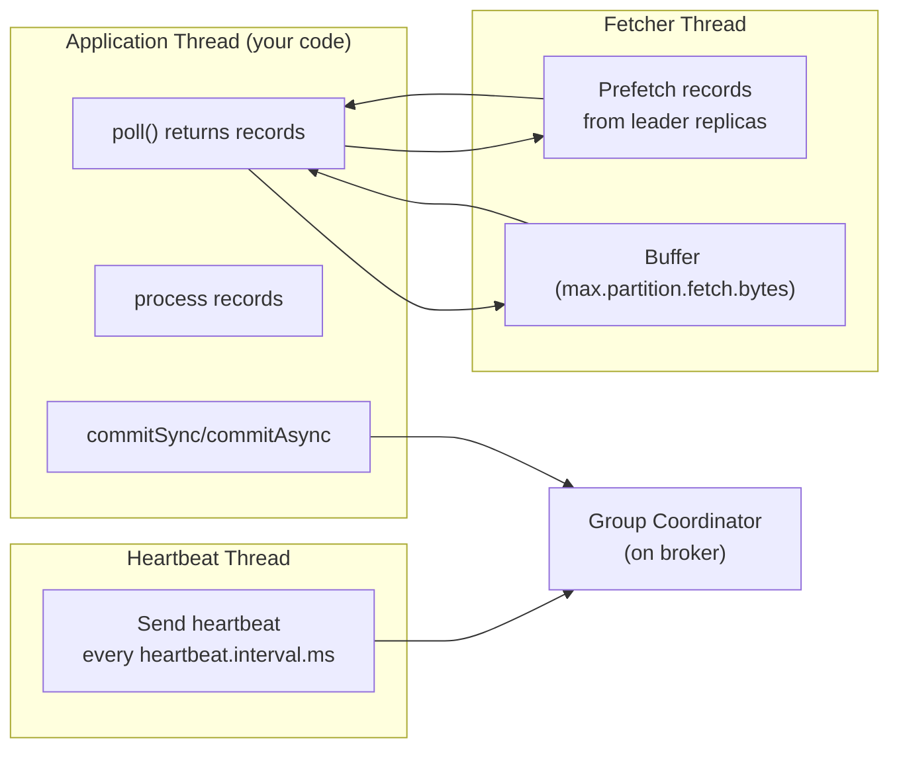
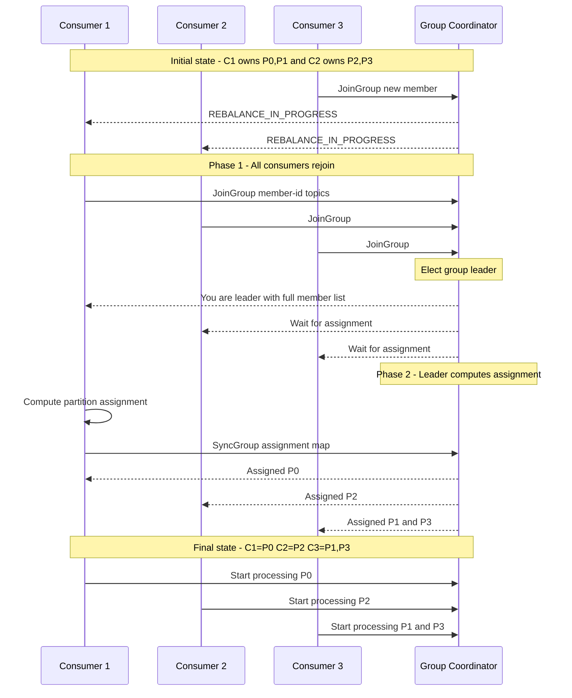
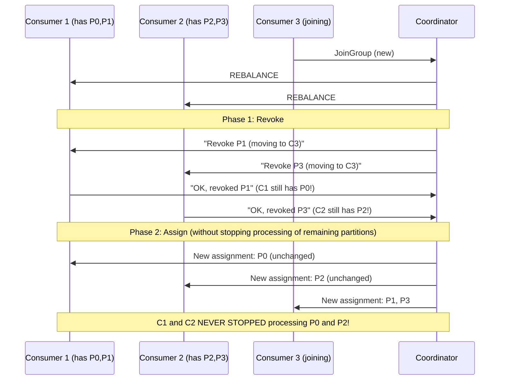

# Consumers Deep Dive

> [!summary] Goal
> Master Kafka consumers: Java `KafkaConsumer` API, consumer groups and rebalancing, 4 assignment strategies, offset management, consumer internal architecture (fetcher, coordinator, heartbeat), and static group membership.

## Table of Contents

1. [Java Consumer API](#java-consumer-api)
2. [Consumer Internal Architecture](#consumer-internal-architecture)
3. [Consumer Groups and Rebalancing](#consumer-groups-and-rebalancing)
4. [Assignment Strategies](#assignment-strategies)
5. [Offset Management](#offset-management)
6. [Static Group Membership](#static-group-membership)
7. [Pitfalls](#pitfalls)

---

## Java Consumer API

> [!info] KafkaConsumer
> `KafkaConsumer<K, V>` reads records from Kafka topics. Unlike the producer (which pushes), the consumer **polls** — it calls `poll()` to fetch batches of records. The consumer tracks its position via offsets and commits them to Kafka. A consumer belongs to a **consumer group** — partitions are distributed among group members.

```java
import org.apache.kafka.clients.consumer.*;
import org.apache.kafka.common.serialization.StringDeserializer;
import java.time.Duration;
import java.util.*;

Properties props = new Properties();
props.put(ConsumerConfig.BOOTSTRAP_SERVERS_CONFIG, "localhost:9092");
props.put(ConsumerConfig.GROUP_ID_CONFIG, "my-group");
props.put(ConsumerConfig.KEY_DESERIALIZER_CLASS_CONFIG, StringDeserializer.class.getName());
props.put(ConsumerConfig.VALUE_DESERIALIZER_CLASS_CONFIG, StringDeserializer.class.getName());
props.put(ConsumerConfig.AUTO_OFFSET_RESET_CONFIG, "earliest");

try (KafkaConsumer<String, String> consumer = new KafkaConsumer<>(props)) {
    consumer.subscribe(List.of("my-topic"));

    while (true) {
        ConsumerRecords<String, String> records = consumer.poll(Duration.ofMillis(100));
        for (ConsumerRecord<String, String> record : records) {
            System.out.printf("offset=%d, key=%s, value=%s%n",
                record.offset(), record.key(), record.value());
            // Process record...
        }
        // Commit offsets (if auto-commit is disabled)
        consumer.commitSync();
    }
}
```

### Consumer group — subscribe vs assign

```java
// Subscribe to a topic (group-based — rebalancing enabled)
consumer.subscribe(List.of("my-topic"));

// Subscribe with rebalance listener
consumer.subscribe(List.of("my-topic"), new ConsumerRebalanceListener() {
    @Override
    public void onPartitionsRevoked(Collection<TopicPartition> partitions) {
        // Commit offsets before losing partitions
        consumer.commitSync();
    }
    @Override
    public void onPartitionsAssigned(Collection<TopicPartition> partitions) {
        System.out.println("Assigned: " + partitions);
    }
});

// Assign specific partitions (no rebalancing, no consumer group)
consumer.assign(List.of(new TopicPartition("my-topic", 0)));
consumer.seek(new TopicPartition("my-topic", 0), 100);  // Start at specific offset
```

---

## Consumer Internal Architecture

> [!info] Consumer internals — three threads
> A consumer runs three threads internally: (1) **heartbeat thread** — sends periodic heartbeats to the group coordinator, (2) **fetcher thread** — prefetches records into a buffer, (3) **application thread** — your code calling `poll()`. Understanding these threads is critical for tuning `session.timeout.ms`, `heartbeat.interval.ms`, and `max.poll.interval.ms`.



```text
Thread lifecycle:
1. Heartbeat thread: sends heartbeat every `heartbeat.interval.ms` (default 3s)
   → If coordinator doesn't receive heartbeat for `session.timeout.ms` (default 45s)
   → Coordinator marks consumer as dead → triggers rebalance

2. Fetcher thread: continuously fetches records ahead of time
   → Stores in a buffer (up to `max.partition.fetch.bytes` per partition)
   → `poll()` reads from this buffer (instant return if data is prefetched)

3. Application thread: calls `poll()`, processes, commits
   → Between poll() calls: monitoring your processing time
   → If poll() is not called for longer than `max.poll.interval.ms` (default 300s)
   → Coordinator removes the consumer → rebalance
```

### Key configs that must be tuned together

```text
session.timeout.ms (default 45000 = 45s)
  └── Time without heartbeat before coordinator declares consumer dead
  └── SHORTEN for faster failure detection (stability: false positives)
  └── LENGTHEN for unstable network / long GC pauses

heartbeat.interval.ms (default 3000 = 3s)
  └── Frequency of heartbeats
  └── Should be 1/3 of session.timeout.ms (rule of thumb)

max.poll.interval.ms (default 300000 = 5min)
  └── Max time between poll() calls before consumer is considered failed
  └── Must be LONGER than expected processing time for a batch
  └── Increase if processing takes >5 minutes

max.poll.records (default 500)
  └── Max records returned by one poll() call
  └── DECREASE if processing takes too long (stay within max.poll.interval.ms)
  └── INCREASE if throughput is the priority (more records per batch)
```

---

## Consumer Groups and Rebalancing

> [!info] Consumer group rebalancing
> A rebalance occurs when a consumer joins/leaves a group, a topic's partition count changes, or a consumer is considered dead. During rebalance, partition assignments are recomputed. The group halts processing during the rebalance — this is called the "stop-the-world" phase. Minimize rebalances and their duration.



### Rebalance triggers

| Trigger | Cause | Frequency | Duration impact |
|---------|-------|:---------:|:---------------:|
| Consumer joins group | New instance started, scaling out | During deployment | Partition moves to new consumer |
| Consumer leaves group | Graceful shutdown | During deployment | Partition reassigned to remaining consumers |
| Consumer times out | No heartbeat for `session.timeout.ms` | Rare (failure) | Full rebalance |
| Partition count changes | Topic expanded | Rare | Groups subscribed to that topic rebalance |
| Group coordinator changes | Leader election | Very rare | Full group re-registration |

---

## Assignment Strategies

> [!info] Assignment strategy
> The assignor determines how to distribute partitions among consumers in a group. It ranges from simple round-robin to cooperative rebalancing (which reduces partition movement).

| Strategy                      |                                               Behavior                                                |   Rebalance cost    | Best for                        |
| ----------------------------- | :---------------------------------------------------------------------------------------------------: | :-----------------: | ------------------------------- |
| **RangeAssignor** (default)   |                Per-topic contiguous ranges: partitions sorted, split by consumer count                | All partitions move | Simple, legacy compatibility    |
| **RoundRobinAssignor**        |               Partitions assigned round-robin across consumers (all topics interleaved)               | All partitions move | Even distribution, multi-topic  |
| **StickyAssignor**            |       Minimize partition movement. On rebalance, keeps as many existing assignments as possible       |    Less movement    | Large groups, frequent scaling  |
| **CooperativeStickyAssignor** | Rebalance in phases: revoke only partitions that must move, then assign new ones. No "stop-the-world" |  Minimal movement   | Production — preferred strategy |

```java
// Set the assignment strategy
props.put(ConsumerConfig.PARTITION_ASSIGNMENT_STRATEGY_CONFIG,
    CooperativeStickyAssignor.class.getName());

// Monitor assignment changes
consumer.subscribe(List.of("my-topic"), new ConsumerRebalanceListener() {
    @Override
    public void onPartitionsRevoked(Collection<TopicPartition> partitions) {
        // Commit offsets before losing partitions
        consumer.commitSync();
    }
    @Override
    public void onPartitionsAssigned(Collection<TopicPartition> partitions) {
        log.info("Assigned: {} partitions", partitions.size());
    }
});
```

### CooperativeSticky rebalance flow



---

## Offset Management

> [!info] Offset commitment
> The offset is the consumer's position in a partition. Committing the offset tells the broker "I've processed up to this point." On restart, the consumer resumes from the committed offset. The offset is stored in an internal Kafka topic `__consumer_offsets` (or a custom store).

### Auto vs manual commit

```java
// AUTO COMMIT (default — periodic commit)
props.put(ConsumerConfig.ENABLE_AUTO_COMMIT_CONFIG, true);
props.put(ConsumerConfig.AUTO_COMMIT_INTERVAL_MS_CONFIG, 5000);

// Risk: auto-commit may commit offsets for records NOT YET PROCESSED
// because commit happens on a timer, not after processing.

// MANUAL COMMIT (recommended — explicit control)
props.put(ConsumerConfig.ENABLE_AUTO_COMMIT_CONFIG, false);

while (true) {
    ConsumerRecords<String, String> records = consumer.poll(Duration.ofMillis(100));
    for (ConsumerRecord<String, String> record : records) {
        process(record);
    }
    consumer.commitSync();   // Block until committed
    // consumer.commitAsync();  // Non-blocking, no retry on failure
}
```

### At-least-once processing pattern

```text
1. poll() → get records
2. process() → save to database / write to file
3. commitSync() → tell Kafka we've processed these records

If the consumer crashes between step 2 and step 3:
  → Next restart: commit returns to the LAST committed offset
  → Some records are reprocessed (at-least-once)
  → Process must be IDEMPOTENT (same record processed twice = no side effects)

Solution: Store the offset in the SAME database as the processing result (co-located):
  begin transaction
    process(record)              // INSERT INTO orders ...
    commit_offset(record.offset) // UPDATE consumer_offsets SET offset = X
  commit
```

---

## Static Group Membership

> [!info] Static group membership
> Normally, when a consumer restarts, it gets a new `member.id` and triggers a rebalance. With `group.instance.id`, the consumer keeps its identity across restarts — no rebalance on startup. This is critical for stateful consumers (like Kafka Streams) where partition reassignment requires state restoration.

```java
props.put(ConsumerConfig.GROUP_INSTANCE_ID_CONFIG, "consumer-1");
// When consumer-1 restarts:
// 1. No JoinGroup — coordinator remembers the assignment
// 2. Sessions expires during downtime → partitions NOT reassigned
// 3. On reconnect → consumer gets same partitions, no rebalance

// Timeout before partitions are reassigned:
//   `session.timeout.ms` + `group.initial.rebalance.delay.ms`
```

| Aspect | Dynamic membership | Static membership |
|--------|:------------------:|:-----------------:|
| **member.id** | Generated per session | Fixed (`group.instance.id`) |
| **Restart behavior** | Triggers rebalance | No rebalance (if within session timeout) |
| **Rebalance on restart** | ✅ Yes | ❌ No |
| **Failure detection** | Session timeout → partition reassigned | Session timeout + static membership timeout |

---

## Pitfalls

### Poll loop too slow → rebalance

If `max.poll.interval.ms` (default 5 minutes) elapses between `poll()` calls, the coordinator removes the consumer. This happens when `poll()` returns 500 records and processing each record takes more than 600ms on average. Fix: reduce `max.poll.records`, increase `max.poll.interval.ms`, or parallelize processing.

### Not committing when partitions are revoked

During a rebalance, partitions are revoked from the current consumer. If the consumer doesn't commit before the revocation completes, the new consumer starts from the last committed offset — which may be before the current consumer's processing position. This causes duplicate processing. Always commit in the `onPartitionsRevoked` callback.

### Auto-commit commit async commit race

With `enable.auto.commit=true`, the consumer commits automatically every 5 seconds. If your processing takes 5+ seconds, the auto-commit may commit offsets for records that are still being processed. If the consumer crashes, those offsets are lost. Use manual commit.

### Consumer group vs assign (when not to use groups)

When using `consumer.assign()` (direct partition assignment), there is NO consumer group, NO rebalancing, NO ownership tracking. If another consumer assigns the same partition, both read it concurrently (duplicate processing). Use `assign()` only for testing or when you explicitly manage partition distribution yourself.

---

> [!question]- Interview Questions
>
> **Q: How does a consumer group coordinate partition assignment?**
> A: One broker acts as the group coordinator. When a consumer joins, it sends a `JoinGroup` request. The coordinator elects one consumer as the group leader. The leader computes the partition assignment (using the configured assignor) and sends it back to the coordinator, who distributes it to all consumers via `SyncGroup`. On rebalance, all consumers must rejoin and a new assignment is computed.
>
> **Q: What's the difference between RangeAssignor and CooperativeStickyAssignor?**
> A: RangeAssignor assigns partitions per-topic in contiguous ranges — on rebalance, ALL partitions move (stop-the-world). CooperativeStickyAssignor rebalances in phases: first revokes only the partitions that must move, then assigns them. Consumers continue processing non-revoked partitions throughout. This reduces (but doesn't eliminate) the rebalance impact.
>
> **Q: What is the `max.poll.interval.ms` and what happens if it's exceeded?**
> A: It's maximum time between `poll()` calls. If the consumer doesn't call `poll()` within this interval (default 5 min), the coordinator marks the consumer as failed and triggers a rebalance. The consumer's partitions are reassigned to other group members. Fix: reduce `max.poll.records` so each batch processes faster, or increase `max.poll.interval.ms`.
>
> **Q: How do you achieve at-least-once processing with Kafka?**
> A: Process records and THEN commit the offsets. If the consumer crashes between processing and committing, the records are reprocessed. The processing must be idempotent (repeated processing produces the same result). For exactly-once, use a transactional producer + consumer with offset committed in the same transaction as the processing output (requires a compatible output system).

---

## Cross-Links

- [[CICD/Kafka/01_Foundations/01_Kafka_Architecture_and_Core_Concepts]] for consumer group concept
- [[CICD/Kafka/01_Foundations/02_Topics_Partitions_Offsets]] for offset management
- [[CICD/Kafka/02_Core/01_Delivery_Semantics_and_Exactly_Once]] for EOS consumer patterns
- [[CICD/Kafka/04_Playbooks/01_Troubleshoot_Consumer_Lag]] for lag troubleshooting
- [[CICD/Kafka/04_Playbooks/01_Troubleshoot_Consumer_Lag]] for rebalance debugging
