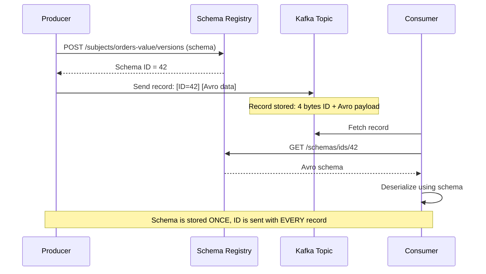

# Messages, Serialization, and Schema Registry

> [!summary] Goal
> Understand Kafka's message structure, serialization formats (Avro, Protobuf, JSON), and Schema Registry for managing schema evolution with compatibility checks.

## Table of Contents

1. [Message Structure](#message-structure)
2. [Serialization Formats](#serialization-formats)
3. [Schema Registry](#schema-registry)
4. [Pitfalls](#pitfalls)

---

## Message Structure

> [!info] Kafka record
> A Kafka record contains: **key** (optional, used for partitioning), **value** (the payload), **headers** (key-value metadata), **timestamp** (event time), and internal **offset** + **partition** metadata. The key and value are opaque byte arrays — serialization/deserialization is handled by configurable serializers.

```text
Kafka record wire format (simplified):

  [offset] [message_size] [crc] [magic_byte] [attributes] [timestamp]
  [key_length] [key_bytes] [value_length] [value_bytes] [headers...]

  offset:      8 bytes  — position in the partition
  message_size: 4 bytes — size of the rest of the record
  crc:         4 bytes  — CRC32 checksum
  magic_byte:  1 byte   — message format version (0, 1, 2)
  attributes:  1 byte   — compression codec, timestamp type
  timestamp:   8 bytes  — event time
  key_length:  4 bytes  — size of key (or -1 if null)
  key:         variable — the key bytes
  value_length: 4 bytes — size of value (or -1 if null / tombstone)
  value:       variable — the value bytes
```

---

## Serialization Formats

> [!info] Serialization
> Kafka stores keys and values as byte arrays. Serializers convert Java objects to bytes; deserializers do the reverse. Built-in serializers handle common types (String, Long, Integer, ByteArray). For complex data, use Avro, Protobuf, or JSON with Schema Registry.

| Format | Schema evolution | Performance | Payload size | Schema Registry | Best for |
|--------|:----------------:|:-----------:|:-------------:|:---------------:|----------|
| **String/JSON** | Manual (no native support) | Fast (text parsing) | Large (verbose JSON) | Not needed | Simple use, debugging, logging |
| **Avro** | ✅ Backward/forward/full | Fast (binary, compact) | Small (binary) | ✅ Required | Most production use cases |
| **Protobuf** | ✅ Backward/forward | Fastest (compiled code) | Smallest (binary) | ✅ Supported | High-performance systems, gRPC integration |
| **StringSerializer** | — | Fast | Medium (text) | Not needed | Simple logs, metrics |

### Avro example

```java
// Avro schema (example.avsc)
{
  "type": "record",
  "name": "OrderPlaced",
  "namespace": "com.example",
  "fields": [
    {"name": "orderId", "type": "string"},
    {"name": "userId", "type": "string"},
    {"name": "amount", "type": "double"},
    {"name": "items", "type": {"type": "array", "items": "string"}}
  ]
}

// Producer with Avro + Schema Registry
Properties props = new Properties();
props.put(ProducerConfig.BOOTSTRAP_SERVERS_CONFIG, "localhost:9092");
props.put(ProducerConfig.KEY_SERIALIZER_CLASS_CONFIG, StringSerializer.class.getName());
props.put(ProducerConfig.VALUE_SERIALIZER_CLASS_CONFIG,
    KafkaAvroSerializer.class.getName());
props.put("schema.registry.url", "http://localhost:8081");

SpecificRecord order = OrderPlaced.newBuilder()
    .setOrderId("ORD-123")
    .setUserId("USR-456")
    .setAmount(99.95)
    .setItems(List.of("item-1", "item-2"))
    .build();

try (KafkaProducer<String, SpecificRecord> producer = new KafkaProducer<>(props)) {
    producer.send(new ProducerRecord<>("orders", order.getOrderId(), order));
}
```

---

## Schema Registry

> [!info] Schema Registry
> Schema Registry stores and validates Avro/Protobuf/JSON schemas. When a producer sends a record, it registers the schema, gets a unique schema ID, and writes the ID (not the full schema) into each record. The consumer reads the ID, fetches the schema from the registry, and deserializes. This keeps records small while enabling schema evolution.



### Schema Registry REST API

```bash
# List all subjects
curl -s http://localhost:8081/subjects | jq
# ["orders-value", "orders-key", "users-value", "..."]

# Get all versions of a subject
curl -s http://localhost:8081/subjects/orders-value/versions | jq
# [1, 2, 3]

# Get a specific schema version
curl -s http://localhost:8081/subjects/orders-value/versions/latest | jq
# {
#   "subject": "orders-value",
#   "version": 3,
#   "id": 42,
#   "schema": "{...}"
# }

# Test compatibility
curl -s -X POST http://localhost:8081/compatibility/subjects/orders-value/versions \
  -H "Content-Type: application/vnd.schemaregistry.v1+json" \
  -d '{"schema": "{\"type\":\"record\",\"name\":\"OrderPlaced\",\"fields\":[...]}"}' | jq
# {"is_compatible": true}
```

### Compatibility modes

> [!info] Compatibility modes
> Compatibility modes define which schema changes are allowed. The "wrong" mode can break consumers during upgrades. Always set the mode before deploying new schema versions.

| Mode | Producer can add field? | Producer can remove field? | Consumer can read new schema? | Old consumer can read new data? |
|:----:|:----------------------:|:--------------------------:|:----------------------------:|:-------------------------------:|
| **BACKWARD** (default) | ✅ (with default) | ❌ | ❌ (needs old schema) | ✅ (old consumer reads new data) |
| **FORWARD** | ❌ | ✅ | ✅ (new consumer reads old data) | ❌ |
| **FULL** | ✅ (with default) | ✅ | ✅ (both ways) | ✅ (both ways) |
| **NONE** | ✅ | ✅ | ❌ (may break) | ❌ (may break) |

```bash
# Set compatibility mode
curl -X PUT http://localhost:8081/config/orders-value \
  -H "Content-Type: application/json" \
  -d '{"compatibility": "BACKWARD"}'

# Set global default
curl -X PUT http://localhost:8081/config \
  -H "Content-Type: application/json" \
  -d '{"compatibility": "BACKWARD"}'
```

---

## Pitfalls

### Schema Registry as SPOF

If Schema Registry is down, producers and consumers can't register or fetch schemas. **Caching helps**: producers cache schema IDs locally, consumers cache schemas once fetched. With caching, existing topics continue to work during a registry outage. New topics or new schema versions require registry access.

### Wrong compatibility mode breaks deployments

Using the default `BACKWARD` mode and adding a required field (without a default value) causes compatibility check failure. Always add new fields with a default value (`"type": ["null", "string"], "default": null`). Use `BACKWARD` for evolution where old consumers should read new data.

### Client-side schema cache missing

If a consumer restarts and Schema Registry is unavailable, the consumer can't fetch schemas — it won't be able to deserialize any records. Pre-fetch schemas or configure client-side caching with `specific.avro.reader=true`.

---

> [!question]- Interview Questions
>
> **Q: How does Schema Registry reduce record size?**
> A: Instead of storing the full schema with every record, Schema Registry assigns a unique integer ID to each schema version. The producer writes the 4-byte schema ID with the record (4 bytes for the ID plus the compact binary Avro data). The consumer fetches the schema by ID once and caches it. Without Schema Registry, the producer would either need to send the full schema with each record (large) or use a side-channel (complex).
>
> **Q: What's the difference between BACKWARD and FORWARD compatibility?**
> A: BACKWARD: new schema can read data written with the old schema. FORWARD: old schema can read data written with the new schema. BACKWARD means you can deploy consumers first, then producers. FORWARD means you can deploy producers first, then consumers. FULL means both are supported.

---

## Cross-Links

- [[CICD/Kafka/01_Foundations/03_Producers_Deep_Dive]] for producer serializers
- [[CICD/Kafka/01_Foundations/04_Consumers_Deep_Dive]] for consumer deserializers
- [[CICD/Kafka/02_Core/01_Delivery_Semantics_and_Exactly_Once]] for EOS with avro
- [[CICD/Kafka/03_Advanced/A00_Storage_and_Replication_Internals]] for wire format deep dive
